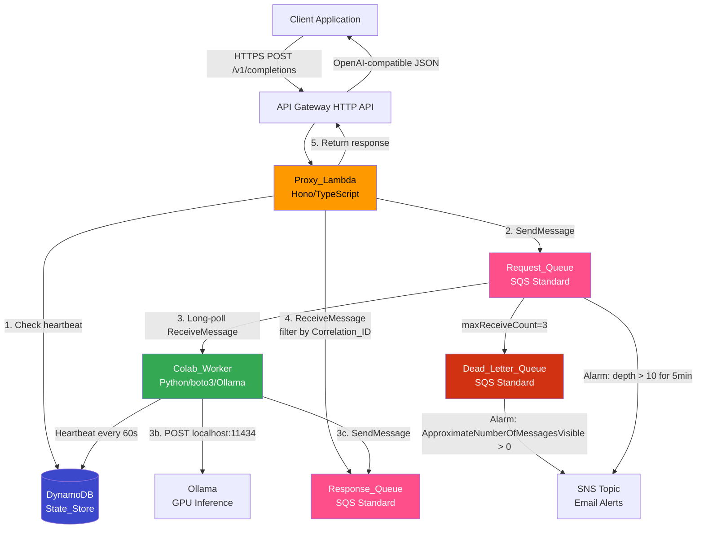
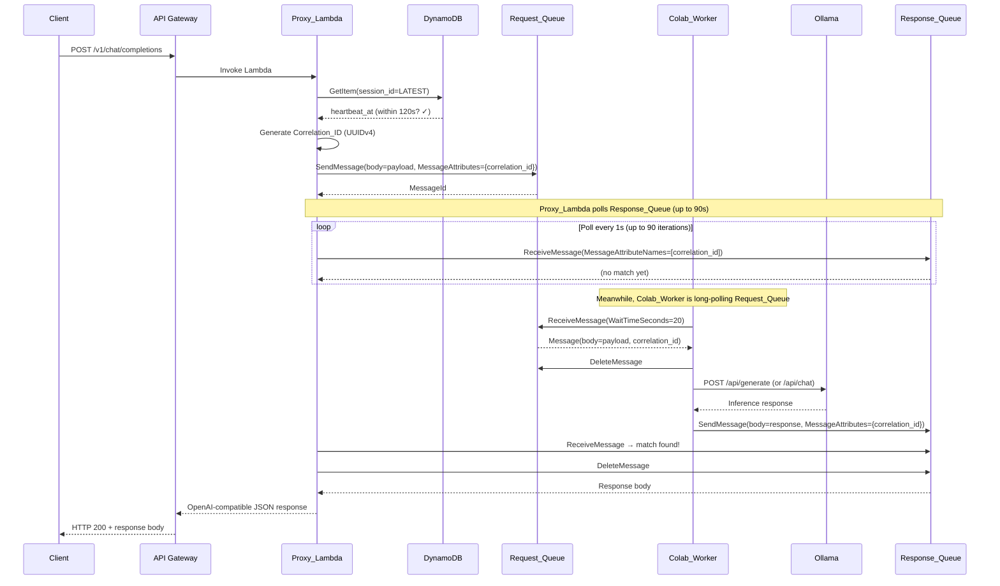
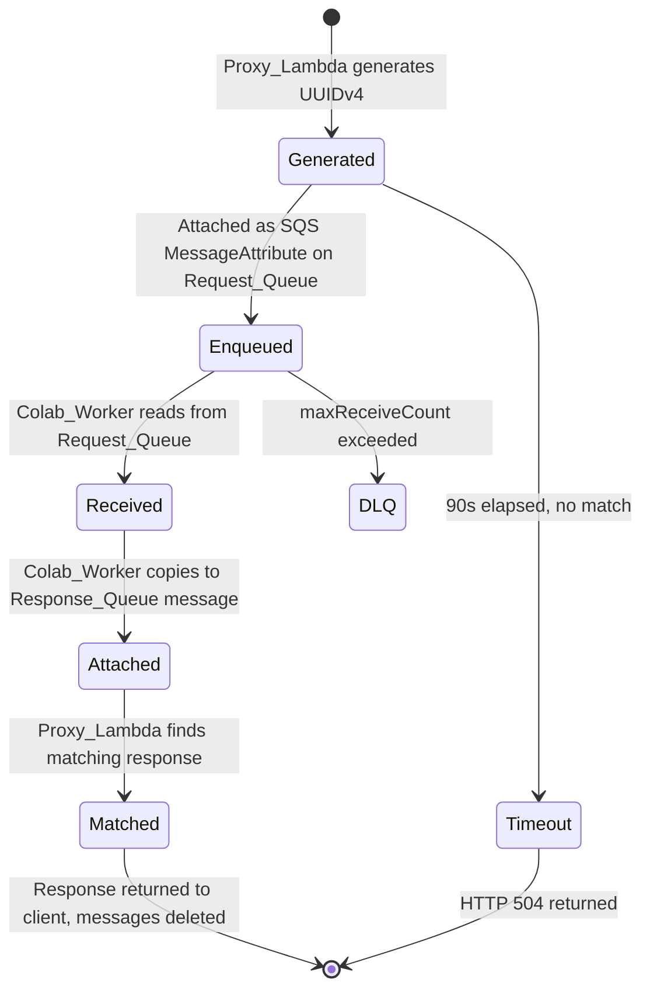

# Design Document: AWS-Native LLM Proxy

## Overview

This design replaces the Cloudflare Tunnel (`cloudflared`) connectivity layer with an AWS-native SQS-based request/response pattern for proxying OpenAI-compatible API requests to a Google Colab instance running Ollama. The core constraint is that Google Colab can make outbound HTTPS connections but cannot receive inbound connections — so the Colab_Worker must pull work from AWS rather than being pushed to.

The solution uses dual SQS queues (Request_Queue + Response_Queue) with Correlation_ID matching. The Proxy_Lambda enqueues inference requests, the Colab_Worker polls and processes them, and the Proxy_Lambda polls for correlated responses. DynamoDB serves as the State_Store for worker lifecycle management (heartbeats, session tracking).

### Key Design Decisions

1. **SQS Standard Queues over FIFO**: Standard queues provide higher throughput and stay well within free tier. FIFO ordering is unnecessary since each request/response pair is matched by Correlation_ID, not by order.
2. **DynamoDB over Aurora Serverless**: DynamoDB wins on cost (always-free 25 RCU/WCU), zero cold-start, native TTL, and operational simplicity. See comparison matrix below.
3. **Polling-based response retrieval**: The Proxy_Lambda polls the Response_Queue with `MessageAttributeNames` filtering by Correlation_ID. This avoids WebSocket complexity while staying within Lambda's 15-minute execution limit.
4. **Fully standalone package — zero coupling to CIG API**: A new `packages/llm-proxy/` package is a completely independent application with its own Hono server, its own Lambda function, its own API Gateway, its own DynamoDB table, its own SST infrastructure config, and its own dependencies. It shares NOTHING with the existing CIG API (`packages/api/`, `packages/infra/`, `packages/auth/`, etc.). Both systems run in parallel on separate AWS resources. The only shared element is the pnpm monorepo workspace root.

### Decoupling Guarantees

| Aspect | CIG API (existing) | LLM Proxy (new) |
|--------|-------------------|-----------------|
| **Package** | `packages/api/` | `packages/llm-proxy/` |
| **Framework** | Fastify | Hono |
| **Lambda** | CIG API Lambda | `llm-proxy-lambda` (separate function) |
| **API Gateway** | CIG API Gateway | `llm-proxy-api` (separate HTTP API) |
| **Database** | CIG DynamoDB/other tables | `llm-proxy-state` (separate table) |
| **Infrastructure** | `packages/infra/` (SST + Pulumi) | `packages/llm-proxy/infra/` (own SST config) |
| **IAM Roles** | CIG execution roles | `llm-proxy-*` roles (separate) |
| **SQS Queues** | None | `llm-proxy-request-queue`, `llm-proxy-response-queue`, `llm-proxy-dlq` |
| **SNS Topic** | CIG alerts topic | `llm-proxy-alerts` (separate topic) |
| **Deployment** | `pnpm --filter @cig/infra deploy` | `pnpm --filter @llm-proxy/app deploy` (independent) |
| **Dependencies** | `@cig/*` packages | Zero `@cig/*` imports — fully self-contained |
| **Runtime** | Node.js 22 | Node.js 20+ (Hono on Lambda) |

The LLM Proxy does NOT import from, depend on, or reference any `@cig/*` package. It can be deployed, tested, and destroyed independently without affecting the CIG API in any way.

## Architecture

### High-Level System Diagram



### Request/Response Sequence Diagram



### Correlation_ID Lifecycle



## Components and Interfaces

### 1. Proxy_Lambda (packages/llm-proxy/)

A new Hono/TypeScript application deployed on AWS Lambda behind API Gateway.

```typescript
// packages/llm-proxy/src/types.ts

interface InferenceRequest {
  correlationId: string;       // UUIDv4
  model: string;               // e.g. "llama3.2"
  messages?: ChatMessage[];    // for /v1/chat/completions
  prompt?: string;             // for /v1/completions
  temperature?: number;
  max_tokens?: number;
  stream?: boolean;            // Phase 1: false only
  timestamp: string;           // ISO 8601
}

interface InferenceResponse {
  correlationId: string;
  status: 'success' | 'error';
  body?: OpenAICompletionResponse;
  error?: { code: string; message: string };
  processingTimeMs: number;
  timestamp: string;
}

interface WorkerSession {
  sessionId: string;           // PK
  recordType: string;          // SK: "SESSION" | "HEARTBEAT"
  startedAt: string;
  lastHeartbeatAt: string;
  status: 'active' | 'terminated';
  ollamaModels: string[];
  ttl: number;                 // DynamoDB TTL epoch seconds
}
```

**Key modules:**

| Module | Responsibility |
|--------|---------------|
| `src/routes/inference.ts` | POST /v1/completions, POST /v1/chat/completions — validates with Zod, checks heartbeat, enqueues, polls response |
| `src/routes/models.ts` | GET /v1/models — reads available models from State_Store |
| `src/routes/health.ts` | GET /health — returns worker status from State_Store |
| `src/routes/admin.ts` | Admin endpoints for session management |
| `src/routes/mcp.ts` | MCP tool endpoints |
| `src/lib/sqs-client.ts` | SQS send/receive wrappers with retry logic |
| `src/lib/state-store.ts` | DynamoDB read/write for sessions and heartbeats |
| `src/lib/correlation.ts` | Correlation_ID generation and response matching |
| `src/lib/auth.ts` | API key authentication middleware |
| `src/lib/rate-limit.ts` | Rate limiting middleware |
| `src/schemas/inference.ts` | Zod schemas for OpenAI-compatible request/response |
| `src/schemas/error.ts` | Zod schema for consistent error responses |

### 2. Colab_Worker (packages/llm-proxy/colab/)

Python-based worker running in Google Colab, using boto3 for AWS communication. The Colab notebook code lives inside the `packages/llm-proxy/` package (not in a separate `packages/colab/`), keeping all LLM Proxy artifacts together and decoupled from the CIG codebase.

```python
# packages/llm-proxy/colab/worker.py — key interfaces

class ColabWorker:
    def __init__(self, aws_config: AWSConfig):
        """Initialize SQS clients and DynamoDB resource."""
    
    def register_session(self) -> str:
        """Register new session in State_Store, return session_id."""
    
    def heartbeat_loop(self) -> None:
        """Background thread: update heartbeat every 60s."""
    
    def poll_and_process(self) -> None:
        """Main loop: long-poll Request_Queue, forward to Ollama, enqueue response."""
    
    def forward_to_ollama(self, request: dict) -> dict:
        """POST to localhost:11434/api/generate or /api/chat."""
    
    def enqueue_response(self, correlation_id: str, response: dict) -> None:
        """Place response on Response_Queue with matching Correlation_ID."""
    
    def shutdown(self) -> None:
        """Mark session as terminated in State_Store."""
```

### 3. Infrastructure (packages/llm-proxy/infra/) — Standalone SST Config

The LLM Proxy has its own SST configuration file (`packages/llm-proxy/sst.config.ts`) completely separate from the CIG API's `packages/infra/sst.config.ts`. It deploys to the same AWS account but creates entirely separate resources with `llm-proxy-` prefixed names. It can be deployed and destroyed independently.

**SST app name**: `llm-proxy` (vs CIG's `cig-api`)

| Resource | Type | Configuration |
|----------|------|--------------|
| `llm-proxy-request-queue` | SQS Standard | VisibilityTimeout=120s, MessageRetention=300s |
| `llm-proxy-response-queue` | SQS Standard | VisibilityTimeout=30s, MessageRetention=300s |
| `llm-proxy-dlq` | SQS Standard | MessageRetention=1209600s (14 days) |
| `llm-proxy-state` | DynamoDB | PK=sessionId, SK=recordType, TTL enabled, on-demand billing |
| `llm-proxy-lambda` | Lambda | 256MB, 90s timeout, Hono handler |
| `llm-proxy-api` | API Gateway HTTP API | Routes: /v1/*, /health, /admin/*, /mcp/* |
| `llm-proxy-worker-user` | IAM User | Scoped to SQS + DynamoDB permissions only |
| `llm-proxy-alerts` | SNS Topic | Email notifications (separate from CIG alerts) |
| `cw-alarm-queue-depth` | CloudWatch Alarm | Request_Queue depth > 10 for 5min |
| `cw-alarm-dlq` | CloudWatch Alarm | DLQ messages > 0 |
| `cw-alarm-heartbeat` | CloudWatch Alarm | Custom metric: heartbeat age > 120s |

**Package structure:**

```
packages/llm-proxy/
├── package.json              # @llm-proxy/app — zero @cig/* dependencies
├── sst.config.ts             # Own SST config (app name: "llm-proxy")
├── sst-env.d.ts
├── tsconfig.json
├── vitest.config.ts
├── src/                      # Hono application code
│   ├── index.ts              # Lambda handler entry point
│   ├── types.ts
│   ├── routes/
│   ├── lib/
│   └── schemas/
├── infra/                    # SST infrastructure definitions
│   └── index.ts              # SQS, DynamoDB, Lambda, API Gateway, IAM, CloudWatch
└── src/__tests__/            # All tests (property, unit, integration)
```

### DynamoDB vs Aurora Serverless Comparison Matrix

| Criterion | DynamoDB | Aurora Serverless v2 |
|-----------|----------|---------------------|
| **Free Tier** | Always-free: 25 RCU, 25 WCU, 25 GB storage | 12-month: limited ACU-hours |
| **Cost at 1K req/day** | $0/month (well within free tier) | ~$0/month if auto-paused, but ACU cold-start costs accumulate |
| **Cold Start** | None (always warm) | 5–25 seconds on resume from pause |
| **TTL Support** | Native, automatic, free | Requires scheduled job or application logic |
| **Conditional Writes** | Native (ConditionExpression) | SQL transactions (heavier) |
| **Query Patterns** | Key-value by sessionId — perfect fit | Overkill for simple key-value |
| **Operational Complexity** | Zero management, serverless | Cluster management, VPC required |
| **SDK Support** | @aws-sdk/client-dynamodb (TS), boto3 (Python) | pg/mysql2 (TS), psycopg2 (Python) |
| **Auto-scaling** | On-demand mode, instant | ACU scaling, 5-min pause delay |

**Recommendation: DynamoDB**

DynamoDB is the clear winner for this use case. The access pattern is pure key-value lookup by session ID, the workload is low-volume (heartbeats every 60s, session registration on startup), and DynamoDB's always-free tier, zero cold-start, and native TTL eliminate operational overhead. Aurora Serverless adds VPC complexity, cold-start latency (unacceptable for heartbeat checks on the inference hot path), and no meaningful benefit for simple key-value access.

## Data Models

### DynamoDB Single-Table Design

**Table: `llm-proxy-state`**

| Attribute | Type | Description |
|-----------|------|-------------|
| `PK` (Partition Key) | String | `SESSION#{sessionId}` |
| `SK` (Sort Key) | String | `META` or `HEARTBEAT` |
| `sessionId` | String | UUIDv4 session identifier |
| `status` | String | `active` \| `terminated` |
| `startedAt` | String | ISO 8601 timestamp |
| `lastHeartbeatAt` | String | ISO 8601 timestamp |
| `ollamaModels` | List\<String\> | Available model names |
| `ttl` | Number | Unix epoch seconds (24h from last update) |

**Access Patterns:**

| Operation | Key Condition | Used By |
|-----------|--------------|---------|
| Get latest session | PK=`SESSION#LATEST`, SK=`META` | Proxy_Lambda (heartbeat check) |
| Update heartbeat | PK=`SESSION#{id}`, SK=`HEARTBEAT` | Colab_Worker |
| Register session | PK=`SESSION#{id}`, SK=`META` + update `SESSION#LATEST` | Colab_Worker |
| Terminate session | PK=`SESSION#{id}`, SK=`META` (update status) | Colab_Worker |

### SQS Message Schemas

**Request_Queue Message:**

```json
{
  "body": {
    "model": "llama3.2",
    "messages": [{"role": "user", "content": "Hello"}],
    "temperature": 0.7,
    "max_tokens": 512,
    "stream": false
  },
  "messageAttributes": {
    "correlation_id": { "DataType": "String", "StringValue": "uuid-v4" },
    "request_timestamp": { "DataType": "String", "StringValue": "2024-01-01T00:00:00Z" },
    "client_ip": { "DataType": "String", "StringValue": "x.x.x.x" }
  }
}
```

**Response_Queue Message:**

```json
{
  "body": {
    "id": "cmpl-xxx",
    "object": "chat.completion",
    "created": 1700000000,
    "model": "llama3.2",
    "choices": [{"index": 0, "message": {"role": "assistant", "content": "Hi!"}, "finish_reason": "stop"}],
    "usage": {"prompt_tokens": 5, "completion_tokens": 3, "total_tokens": 8}
  },
  "messageAttributes": {
    "correlation_id": { "DataType": "String", "StringValue": "uuid-v4" },
    "status": { "DataType": "String", "StringValue": "success" },
    "processing_time_ms": { "DataType": "Number", "StringValue": "1234" }
  }
}
```

### Zod Validation Schemas

```typescript
// packages/llm-proxy/src/schemas/inference.ts
import { z } from 'zod';

export const ChatMessageSchema = z.object({
  role: z.enum(['system', 'user', 'assistant']),
  content: z.string().min(1),
});

export const ChatCompletionRequestSchema = z.object({
  model: z.string().min(1),
  messages: z.array(ChatMessageSchema).min(1),
  temperature: z.number().min(0).max(2).optional().default(0.7),
  max_tokens: z.number().int().positive().optional().default(512),
  stream: z.literal(false).optional().default(false),
});

export const CompletionRequestSchema = z.object({
  model: z.string().min(1),
  prompt: z.string().min(1),
  temperature: z.number().min(0).max(2).optional().default(0.7),
  max_tokens: z.number().int().positive().optional().default(512),
  stream: z.literal(false).optional().default(false),
});

export const ErrorResponseSchema = z.object({
  error: z.string(),
  message: z.string(),
  code: z.string(),
  requestId: z.string(),
});
```

### Cost Estimation Table

| AWS Service | Free Tier Limit | Expected Monthly Usage (1K req/day) | % of Free Tier |
|-------------|----------------|--------------------------------------|----------------|
| SQS | 1M requests/month | ~120K (2 sends + 2 receives + polls per req × 30K) | 12% |
| Lambda | 1M invocations, 400K GB-s | ~30K invocations, ~2.7K GB-s (256MB × 90s avg) | 3% invocations, <1% compute |
| API Gateway | 1M HTTP API calls | ~30K calls | 3% |
| DynamoDB | 25 RCU, 25 WCU (on-demand: 25K reads, 25K writes/month free) | ~60K reads, ~1.5K writes | Well within on-demand free tier |
| CloudWatch | 10 alarms free | 3 alarms | 30% |
| SNS | 1K email notifications | <100 notifications | 10% |
| **Total** | — | — | **$0/month** |


## Correctness Properties

*A property is a characteristic or behavior that should hold true across all valid executions of a system — essentially, a formal statement about what the system should do. Properties serve as the bridge between human-readable specifications and machine-verifiable correctness guarantees.*

### Property 1: Correlation_ID Round-Trip Preservation

*For any* valid inference request payload, building a Request_Queue message (which assigns a Correlation_ID) and then building a Response_Queue message from the corresponding inference result SHALL produce a response whose Correlation_ID is identical to the one assigned at request time.

**Validates: Requirements 1.1, 2.1, 2.6**

### Property 2: Response Schema Conformance

*For any* valid inference result (with arbitrary model name, token counts, and completion text), the response formatting function SHALL produce a JSON object containing all required OpenAI completion fields: `id`, `object`, `created`, `model`, `choices` (non-empty array), and `usage` (with `prompt_tokens`, `completion_tokens`, `total_tokens`).

**Validates: Requirements 2.4, 5.5**

### Property 3: Request Schema Validation

*For any* JSON object, the Zod inference request schemas (CompletionRequestSchema and ChatCompletionRequestSchema) SHALL accept the object if and only if it contains all required fields with valid types and ranges — specifically, a non-empty `model` string, a non-empty `prompt` or `messages` array, `temperature` in [0, 2], and positive integer `max_tokens`.

**Validates: Requirements 5.1, 5.2**

### Property 4: Session Registration Invariant

*For any* session registration input (arbitrary session ID, model list, and start timestamp), the resulting DynamoDB item SHALL contain a non-empty `sessionId`, a valid ISO 8601 `startedAt` timestamp, a `lastHeartbeatAt` timestamp equal to `startedAt`, status `active`, and a `ttl` value exactly 86400 seconds after the start time.

**Validates: Requirements 3.1**

### Property 5: Error Response Schema Consistency

*For any* error condition (queue unreachable, worker offline, timeout, validation failure), the error formatting function SHALL produce a JSON object containing all four required fields: `error` (non-empty string), `message` (non-empty string), `code` (non-empty string), and `requestId` (valid UUID).

**Validates: Requirements 9.1, 9.4**

### Property 6: Error Path Correlation_ID Preservation

*For any* Correlation_ID and any Ollama error condition (timeout, HTTP error, malformed response), the error response message builder SHALL produce a Response_Queue message whose `correlation_id` MessageAttribute matches the input Correlation_ID and whose `status` MessageAttribute is `error`.

**Validates: Requirements 7.5**

### Property 7: Heartbeat Freshness Classification

*For any* pair of timestamps (heartbeat timestamp, current timestamp), the heartbeat check function SHALL return `true` if and only if the difference between current time and heartbeat time is less than or equal to 120 seconds, and `false` otherwise.

**Validates: Requirements 3.3**

### Property 8: Retry Exhaustion Behavior

*For any* sequence of SQS SendMessage failures of length N (where 0 ≤ N ≤ 3), the retry-enabled send function SHALL attempt exactly min(N, 3) calls total (1 initial + up to 2 retries), and SHALL return success if any attempt succeeds, or return an error only after all 3 attempts fail.

**Validates: Requirements 9.3**

## Error Handling

### Proxy_Lambda Error Handling Strategy

| Error Condition | HTTP Status | Error Code | Behavior |
|----------------|-------------|------------|----------|
| Invalid request payload (Zod validation) | 400 | `invalid_request` | Return immediately with validation details |
| Authentication failure | 401 | `unauthorized` | Return immediately |
| Rate limit exceeded | 429 | `rate_limited` | Return with `retryAfter` header |
| Request_Queue unreachable | 502 | `queue_unavailable` | Retry 2× with exponential backoff, then return error |
| SQS SendMessage failure | 502 | `enqueue_failed` | Retry 2× with exponential backoff, then return error |
| No active worker (stale heartbeat) | 503 | `worker_offline` | Return with `retryAfter` field (suggested: 30s) |
| Response timeout (90s) | 504 | `inference_timeout` | Return after polling exhaustion |
| Unexpected internal error | 500 | `internal_error` | Log full error, return sanitized message |

### Retry Strategy

```
Attempt 1: immediate
Attempt 2: wait 500ms
Attempt 3: wait 1500ms (500ms × 3)
After attempt 3: return error to client
```

Exponential backoff with base=500ms, multiplier=3, max_retries=2.

### Colab_Worker Error Handling

| Error Condition | Behavior |
|----------------|----------|
| Ollama timeout (>60s) | Enqueue error response with `inference_timeout` code, continue polling |
| Ollama HTTP error | Enqueue error response with `ollama_error` code, continue polling |
| Ollama connection refused | Enqueue error response with `ollama_unavailable` code, log warning, continue polling |
| SQS ReceiveMessage failure | Log error, sleep 5s, retry polling |
| SQS SendMessage failure (response) | Log error, retry 2×, then drop (message returns to Request_Queue via visibility timeout) |
| DynamoDB heartbeat failure | Log error, continue (stale heartbeat will trigger alerts) |
| Unhandled exception | Log full traceback, continue polling loop |

### Dead Letter Queue Handling

Messages that fail processing 3 times move to the DLQ. The DLQ CloudWatch alarm triggers an SNS email notification. Manual investigation is required — DLQ messages indicate either:
1. Malformed request payloads that consistently fail validation
2. Persistent Ollama failures for specific request types
3. SQS message corruption (rare)

DLQ messages retain the original Correlation_ID for traceability.

## Testing Strategy

### Testing Approach

This feature uses a dual testing approach:

1. **Property-based tests** (fast-check): Verify universal correctness properties across randomized inputs. Each property test runs a minimum of 100 iterations and references its design document property.
2. **Unit tests** (vitest): Verify specific examples, edge cases, and integration points with mocked AWS services.
3. **Integration tests**: Verify end-to-end SQS and DynamoDB behavior with LocalStack or mocked AWS SDK clients.

### Property-Based Testing Configuration

- **Library**: `fast-check` (added as devDependency in `packages/llm-proxy/package.json` — independent from CIG's `packages/api`)
- **Framework**: `vitest` (configured in `packages/llm-proxy/vitest.config.ts`)
- **Minimum iterations**: 100 per property (configurable via `fc.configureGlobal({ numRuns: 100 })`)
- **Tag format**: `Feature: aws-native-llm-proxy, Property {N}: {description}`

### Test Plan

| Test Type | What It Covers | Properties/Criteria |
|-----------|---------------|-------------------|
| Property test | Correlation_ID round-trip | Property 1 (Req 1.1, 2.1, 2.6) |
| Property test | Response schema conformance | Property 2 (Req 2.4, 5.5) |
| Property test | Request schema validation | Property 3 (Req 5.1, 5.2) |
| Property test | Session registration invariant | Property 4 (Req 3.1) |
| Property test | Error response schema consistency | Property 5 (Req 9.1, 9.4) |
| Property test | Error path Correlation_ID preservation | Property 6 (Req 7.5) |
| Property test | Heartbeat freshness classification | Property 7 (Req 3.3) |
| Property test | Retry exhaustion behavior | Property 8 (Req 9.3) |
| Unit test | HTTP 504 on response timeout | Req 2.3 |
| Unit test | HTTP 503 on stale heartbeat | Req 3.4 |
| Unit test | GET /v1/models response format | Req 5.3 |
| Unit test | Route registration (health, admin, MCP) | Req 5.4 |
| Unit test | Standard queue (no MessageGroupId) | Req 1.6 |
| Unit test | HTTP 503 with retryAfter field | Req 9.2 |
| Integration test | SQS long-polling configuration | Req 1.2 |
| Integration test | SQS DeleteMessage after receipt | Req 1.3 |
| Integration test | Heartbeat interval timing | Req 3.2 |
| Integration test | Session termination on shutdown | Req 3.5 |
| Integration test | Rate limiting + auth middleware | Req 5.6 |
| Integration test | Ollama request forwarding | Req 7.3 |
| Integration test | Worker polling loop resilience | Req 9.5 |
| Integration test | CloudWatch log entries | Req 8.3 |
| Smoke test | Queue VisibilityTimeout config | Req 1.4 |
| Smoke test | DLQ RedrivePolicy config | Req 1.5 |
| Smoke test | Response_Queue retention period | Req 2.5 |
| Smoke test | DynamoDB TTL enabled | Req 3.6, 4.4 |
| Smoke test | DynamoDB on-demand billing | Req 4.1 |
| Smoke test | DynamoDB table schema (PK/SK) | Req 4.5 |
| Smoke test | SQS encryption at rest | Req 6.6 |
| Smoke test | IAM least-privilege policy | Req 7.1, 7.6 |
| Smoke test | CloudWatch alarm count ≤ 10 | Req 10.5 |

### Test File Structure

```
packages/llm-proxy/
  src/
    __tests__/
      correlation.property.test.ts    # Properties 1, 6
      schemas.property.test.ts        # Properties 2, 3
      state-store.property.test.ts    # Properties 4, 7
      error-handling.property.test.ts # Properties 5, 8
      inference.test.ts               # Unit tests for inference routes
      health.test.ts                  # Unit tests for health/models routes
      sqs-client.test.ts              # Integration tests with mocked SQS
      state-store.test.ts             # Integration tests with mocked DynamoDB
```
