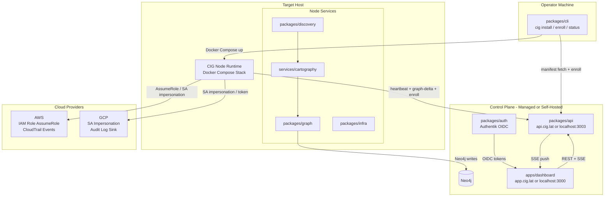
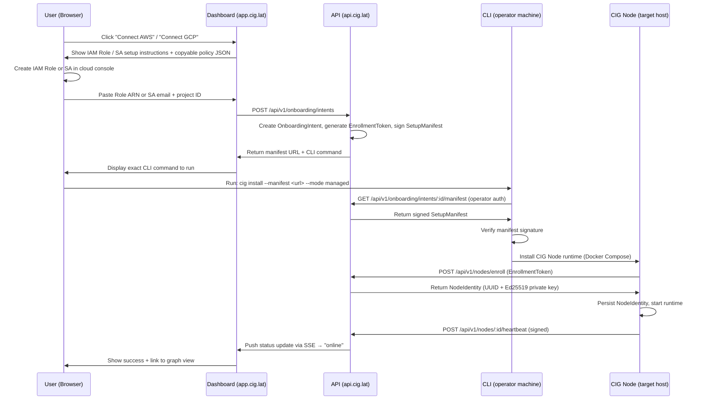
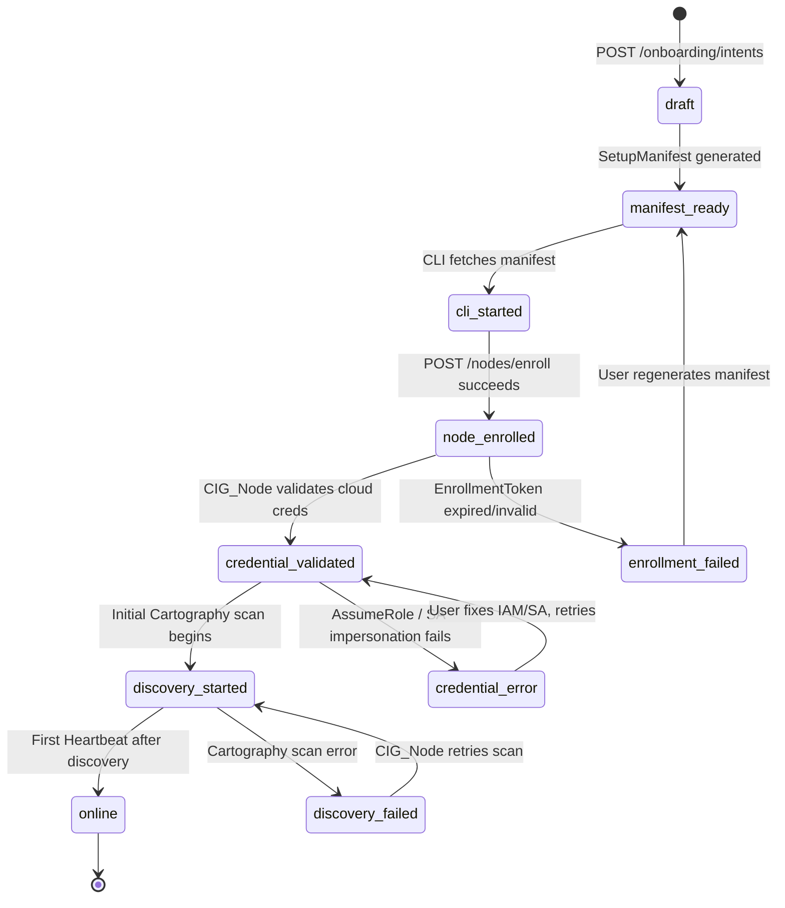
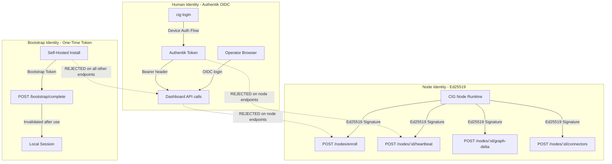
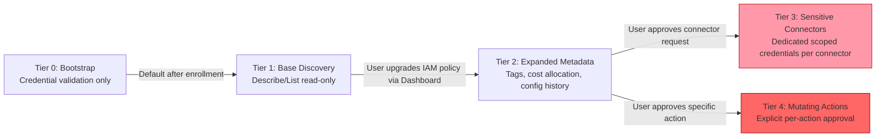
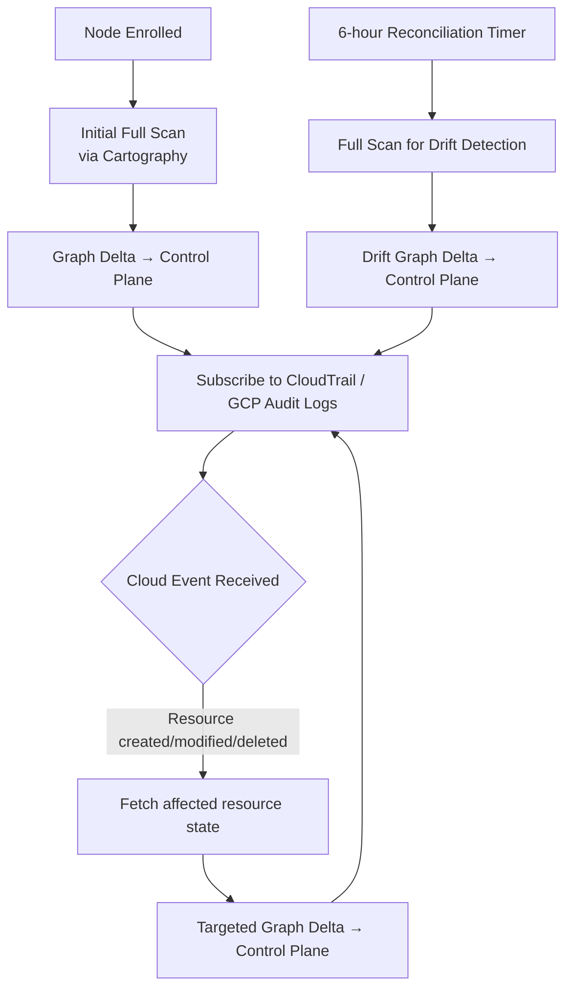
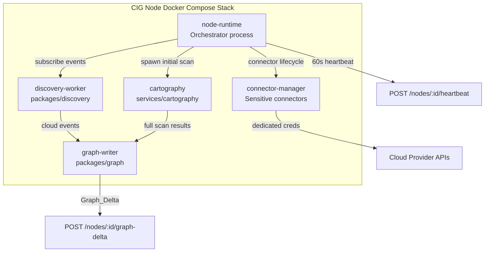
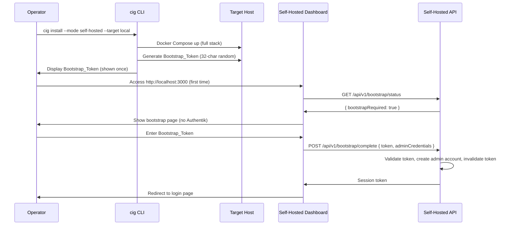

# Design Document: CIG Node Onboarding & Installation Architecture

## Overview

CIG Node Onboarding is the end-to-end system that connects cloud environments (AWS, GCP) to the
Compute Intelligence Graph platform. The flow begins in the Dashboard where a user initiates a cloud
connection, receives a signed Setup_Manifest and Enrollment_Token, then runs a single CLI command
that installs a persistent CIG Node runtime in their environment. That runtime performs infrastructure
discovery, event-driven graph updates, periodic reconciliation, and optional sensitive connector
management — all without the CLI remaining present.

The system supports two operational modes:
- **Managed**: CIG_Node connects outbound to `api.cig.lat`; human identity via Authentik OIDC
- **Self-Hosted**: Full control plane stack on-premises; no dependency on `app.cig.lat` or Authentik

Three identity planes are strictly separated:
- **Human_Identity**: Authentik OIDC — operator login to Dashboard and CLI
- **Node_Identity**: CIG-issued Ed25519 key pair — all CIG_Node-to-control-plane communication
- **Bootstrap_Identity**: One-time local token — self-hosted first-admin creation only

The `apps/wizard-ui` standalone app is deprecated; its functionality merges into `apps/dashboard`.

---

## Architecture

### System Context



### Dashboard-Led Onboarding Flow



### Onboarding State Machine



### Identity Separation



### Permission Escalation



### Discovery Model



### CIG Node Internal Architecture



### Self-Hosted Bootstrap Flow



---

## Components and Interfaces

### packages/cli

The CLI is an **installer only** — it exits after confirming the node is healthy. It is not the
discovery engine.

```typescript
// packages/cli/src/commands/install.ts
interface InstallOptions {
  manifest: string;        // URL or base64-encoded SetupManifest
  mode: 'managed' | 'self-hosted';
  cloud: 'aws' | 'gcp';
  profile: 'core' | 'full';
  target: 'local' | 'ssh' | 'host';
  sshHost?: string;
  sshUser?: string;
  sshKeyPath?: string;
}

// packages/cli/src/commands/enroll.ts
interface EnrollOptions {
  token: string;           // Enrollment_Token for re-enrollment
  nodeId: string;
  manifest?: string;
}

// packages/cli/src/ssh.ts
interface SSHTarget {
  host: string;
  user: string;
  keyPath?: string;
  password?: string;
  port: number;            // default 22
}

// packages/cli/src/compose.ts — generates docker-compose.yml from manifest
interface ComposeGeneratorInput {
  manifest: SetupManifest;
  profile: 'core' | 'full';
  installDir: string;      // e.g. /opt/cig-node
}
```

**CLI command surface:**

| Command | Description |
|---|---|
| `cig login` | Authentik OIDC device auth flow (managed mode) |
| `cig logout` | Clear stored operator credentials |
| `cig install` | Install CIG_Node runtime via Docker Compose |
| `cig enroll` | Re-enroll existing node without reinstalling |
| `cig status` | Report node runtime health and enrollment state |
| `cig doctor` | Validate prerequisites without installing |
| `cig open` | Open Dashboard URL in default browser |
| `cig permissions` | Display current tier and next-tier policy JSON |
| `cig upgrade` | Upgrade CIG_Node runtime to newer version |
| `cig uninstall` | Remove CIG_Node runtime, optionally purge volumes |
| `cig bootstrap-reset` | Generate new Bootstrap_Token (self-hosted only) |

### packages/sdk

Shared types and utilities used by CLI, API, and Dashboard.

```typescript
// packages/sdk/src/types.ts

export interface SetupManifest {
  version: string;                    // e.g. "1.0"
  cloudProvider: 'aws' | 'gcp';
  credentialsRef: string;             // IAM Role ARN or SA email
  enrollmentToken: string;            // single-use UUID
  nodeIdentitySeed: string;           // public key fingerprint
  installProfile: 'core' | 'full';
  targetMode: 'local' | 'ssh' | 'host';
  controlPlaneEndpoint: string;       // https://api.cig.lat or http://localhost:3003
  awsConfig?: AWSManifestConfig;
  gcpConfig?: GCPManifestConfig;
  signature: string;                  // HMAC-SHA256 over manifest body
  issuedAt: string;                   // ISO 8601
  expiresAt: string;                  // ISO 8601, 15 min from issuedAt
}

export interface AWSManifestConfig {
  roleArn: string;
  externalId: string;
  region: string;
}

export interface GCPManifestConfig {
  projectId: string;
  serviceAccountEmail: string;
  impersonationEnabled: boolean;
}

export interface NodeIdentity {
  nodeId: string;                     // UUID
  privateKey: string;                 // Ed25519 private key, base64
  publicKey: string;                  // Ed25519 public key, base64
  issuedAt: string;
}

export interface EnrollmentToken {
  token: string;                      // UUID
  expiresAt: string;
  manifestId: string;
}

export interface GraphDelta {
  nodeId: string;
  deltaType: 'full' | 'targeted' | 'drift';
  additions: GraphNode[];
  modifications: GraphNodeUpdate[];
  deletions: string[];                // resource IDs
  timestamp: string;
  scanId: string;
}

export interface HeartbeatPayload {
  nodeId: string;
  timestamp: string;
  serviceHealth: Record<string, 'healthy' | 'degraded' | 'down'>;
  systemMetrics: {
    cpuPercent: number;
    memoryPercent: number;
    diskPercent: number;
  };
  permissionTier: 0 | 1 | 2 | 3 | 4;
  activeConnectors: string[];
}

// packages/sdk/src/manifest.ts

export function serializeManifest(manifest: SetupManifest): string;
export function deserializeManifest(encoded: string): SetupManifest;
export function verifyManifestSignature(manifest: SetupManifest, key: string): boolean;
export function signManifest(manifest: Omit<SetupManifest, 'signature'>, key: string): SetupManifest;

// packages/sdk/src/identity.ts

export function signRequest(payload: string, privateKey: string): string;
export function verifySignature(payload: string, signature: string, publicKey: string): boolean;
export function generateNodeIdentity(): { privateKey: string; publicKey: string };
```

### packages/api

All onboarding, enrollment, heartbeat, graph-delta, bootstrap, and connector endpoints.

```typescript
// packages/api/src/middleware/auth.ts

// Human-facing endpoints: validates Authentik JWT
export function requireHumanAuth(req, res, next): void;

// Node-facing endpoints: validates Ed25519 signature in X-Node-Signature header
export function requireNodeAuth(req, res, next): void;

// Bootstrap endpoint: validates Bootstrap_Token in body
export function requireBootstrapToken(req, res, next): void;
```

**Endpoint routing:**

```
POST   /api/v1/onboarding/intents                    → requireHumanAuth
GET    /api/v1/onboarding/intents/:id/manifest        → requireHumanAuth
GET    /api/v1/onboarding/intents/:id/status          → requireHumanAuth
POST   /api/v1/nodes/enroll                           → (token in body)
POST   /api/v1/nodes/:id/heartbeat                    → requireNodeAuth
POST   /api/v1/nodes/:id/graph-delta                  → requireNodeAuth
GET    /api/v1/nodes                                  → requireHumanAuth
DELETE /api/v1/nodes/:id                              → requireHumanAuth
POST   /api/v1/nodes/:id/connectors                   → requireHumanAuth
GET    /api/v1/bootstrap/status                       → (no auth)
POST   /api/v1/bootstrap/init                         → (localhost-only)
POST   /api/v1/bootstrap/complete                     → requireBootstrapToken
```

### packages/auth

Authentik OIDC integration for human login only. Not used by CIG_Node.

```typescript
// packages/auth/src/oidc.ts
export interface AuthConfig {
  issuerUrl: string;           // Authentik OIDC issuer
  clientId: string;
  redirectUri: string;
}

export async function startDeviceAuthFlow(config: AuthConfig): Promise<DeviceAuthSession>;
export async function pollDeviceAuthToken(session: DeviceAuthSession): Promise<TokenSet>;
export function storeTokens(tokens: TokenSet): void;
export function loadTokens(): TokenSet | null;
export function clearTokens(): void;
```

### packages/discovery

Cloud provider adapters and event stream subscriptions.

```typescript
// packages/discovery/src/aws/adapter.ts
export interface AWSDiscoveryAdapter {
  assumeRole(roleArn: string, externalId: string): Promise<AWSCredentials>;
  subscribeCloudTrail(credentials: AWSCredentials, handler: EventHandler): Promise<Subscription>;
  fetchResource(resourceId: string, credentials: AWSCredentials): Promise<CloudResource>;
}

// packages/discovery/src/gcp/adapter.ts
export interface GCPDiscoveryAdapter {
  impersonateServiceAccount(saEmail: string): Promise<GCPCredentials>;
  subscribeAuditLog(projectId: string, credentials: GCPCredentials, handler: EventHandler): Promise<Subscription>;
  fetchResource(resourceId: string, credentials: GCPCredentials): Promise<CloudResource>;
}

export type EventHandler = (event: CloudEvent) => Promise<void>;

export interface CloudEvent {
  provider: 'aws' | 'gcp';
  eventType: 'create' | 'modify' | 'delete';
  resourceId: string;
  resourceType: string;
  timestamp: string;
  rawEvent: unknown;
}
```

### packages/graph

Graph delta application and Neo4j writes.

```typescript
// packages/graph/src/delta.ts
export async function applyDelta(delta: GraphDelta, neo4j: Neo4jDriver): Promise<void>;
export async function queryResources(filter: ResourceFilter, neo4j: Neo4jDriver): Promise<GraphNode[]>;

// packages/graph/src/neo4j.ts
export function createNeo4jDriver(uri: string, auth: Neo4jAuth): Neo4jDriver;
```

### packages/infra

Docker Compose templates and install directory management.

```typescript
// packages/infra/src/compose.ts
export function generateComposeFile(manifest: SetupManifest, profile: 'core' | 'full'): string;
export function generateEnvFile(manifest: SetupManifest, nodeIdentity: NodeIdentity): string;

// packages/infra/src/install.ts
export const INSTALL_DIR = '/opt/cig-node';
export const IDENTITY_FILE = `${INSTALL_DIR}/.node-identity`;  // 0600
export const BOOTSTRAP_TOKEN_FILE = `${INSTALL_DIR}/.bootstrap-token`;  // 0600

export async function writeIdentityFile(identity: NodeIdentity, passphrase: string): Promise<void>;
export async function readIdentityFile(passphrase: string): Promise<NodeIdentity>;
export async function writeBootstrapToken(token: string): Promise<void>;
```

### apps/dashboard

Next.js app owning the onboarding wizard UI, node status, connector approval, and bootstrap page.
`apps/wizard-ui` is deprecated and merged here.

**New routes added:**

```
/onboarding/aws          → AWS connect wizard (multi-step)
/onboarding/gcp          → GCP connect wizard (multi-step)
/onboarding/:intentId    → Onboarding progress tracker (SSE-driven)
/nodes                   → Node list with status indicators
/nodes/:id               → Node detail: health, connectors, permission tier
/bootstrap               → Self-hosted first-admin creation (no Authentik)
```

---

## Data Models

### Database Schema (packages/api)

```typescript
// OnboardingIntent
interface OnboardingIntent {
  id: string;                          // UUID
  userId: string;
  cloudProvider: 'aws' | 'gcp';
  credentialsRef: string;              // Role ARN or SA email
  installProfile: 'core' | 'full';
  targetMode: 'local' | 'ssh' | 'host';
  status: OnboardingStatus;
  createdAt: Date;
  updatedAt: Date;
}

type OnboardingStatus =
  | 'draft'
  | 'manifest_ready'
  | 'cli_started'
  | 'node_enrolled'
  | 'credential_validated'
  | 'discovery_started'
  | 'online'
  | 'enrollment_failed'
  | 'credential_error'
  | 'discovery_failed';

// SetupManifest (stored record)
interface SetupManifestRecord {
  id: string;
  intentId: string;
  manifestPayload: string;             // signed JSON blob
  enrollmentTokenId: string;
  expiresAt: Date;
  createdAt: Date;
}

// EnrollmentToken
interface EnrollmentTokenRecord {
  id: string;
  manifestId: string;
  tokenHash: string;                   // bcrypt hash of the UUID token
  usedAt: Date | null;
  expiresAt: Date;                     // issuedAt + 15 minutes
  createdAt: Date;
}

// ManagedNode
interface ManagedNode {
  id: string;                          // UUID, the node's identity
  userId: string;
  intentId: string;
  hostname: string;
  os: string;
  architecture: string;
  ipAddress: string;
  installProfile: 'core' | 'full';
  mode: 'managed' | 'self-hosted';
  status: NodeStatus;
  lastSeenAt: Date | null;
  permissionTier: 0 | 1 | 2 | 3 | 4;
  createdAt: Date;
}

type NodeStatus = 'enrolling' | 'online' | 'degraded' | 'offline' | 'credential-error' | 'revoked';

// NodeIdentity
interface NodeIdentityRecord {
  id: string;
  nodeId: string;
  publicKey: string;                   // Ed25519 public key, base64
  revokedAt: Date | null;
  createdAt: Date;
}

// BootstrapToken
interface BootstrapTokenRecord {
  id: string;
  tokenHash: string;
  firstAccessedAt: Date | null;
  usedAt: Date | null;
  expiresAt: Date;                     // firstAccessedAt + 30 minutes
  createdAt: Date;
}

// HeartbeatRecord
interface HeartbeatRecord {
  id: string;
  nodeId: string;
  receivedAt: Date;
  serviceHealth: Record<string, string>;
  systemMetrics: {
    cpuPercent: number;
    memoryPercent: number;
    diskPercent: number;
  };
  permissionTier: number;
  activeConnectors: string[];
}

// ConnectorRequest
interface ConnectorRequest {
  id: string;
  nodeId: string;
  connectorType: string;               // e.g. 'aws-cost-explorer', 'aws-secrets-manager'
  requiredPermissions: string[];
  status: 'pending' | 'approved' | 'rejected' | 'revoked';
  approvedAt: Date | null;
  createdAt: Date;
}

// InstallationEvent (audit trail for state transitions)
interface InstallationEvent {
  id: string;
  nodeId: string;
  eventType: string;                   // e.g. 'state_transition', 'heartbeat_received'
  payload: Record<string, unknown>;
  createdAt: Date;
}

// AuditEvent (security audit log)
interface AuditEvent {
  id: string;
  actorType: 'human' | 'node' | 'system';
  actorId: string;
  action: string;
  resourceType: string;
  resourceId: string;
  metadata: Record<string, unknown>;
  createdAt: Date;
}
```

### Docker Compose Structure (packages/infra)

**Core profile** (`--profile core`):

```yaml
# Generated by packages/infra/src/compose.ts
version: '3.8'
services:
  node-runtime:
    image: ghcr.io/cig/node-runtime:${CIG_VERSION}
    restart: unless-stopped
    volumes:
      - ./identity:/opt/cig-node/identity:ro
      - ./config:/opt/cig-node/config:ro
    environment:
      - CIG_NODE_ID=${CIG_NODE_ID}
      - CIG_CONTROL_PLANE=${CIG_CONTROL_PLANE_ENDPOINT}
      - CIG_CLOUD_PROVIDER=${CIG_CLOUD_PROVIDER}
    depends_on:
      - discovery-worker
      - graph-writer

  discovery-worker:
    image: ghcr.io/cig/discovery-worker:${CIG_VERSION}
    restart: unless-stopped
    environment:
      - CIG_CLOUD_PROVIDER=${CIG_CLOUD_PROVIDER}
      - AWS_ROLE_ARN=${AWS_ROLE_ARN}
      - AWS_EXTERNAL_ID=${AWS_EXTERNAL_ID}
      - GCP_PROJECT_ID=${GCP_PROJECT_ID}
      - GCP_SA_EMAIL=${GCP_SA_EMAIL}

  cartography:
    image: ghcr.io/cig/cartography:${CIG_VERSION}
    restart: unless-stopped
    environment:
      - NEO4J_URI=bolt://neo4j:7687
      - NEO4J_PASSWORD=${NEO4J_PASSWORD}

  graph-writer:
    image: ghcr.io/cig/graph-writer:${CIG_VERSION}
    restart: unless-stopped
    environment:
      - NEO4J_URI=bolt://neo4j:7687
      - NEO4J_PASSWORD=${NEO4J_PASSWORD}
      - CIG_CONTROL_PLANE=${CIG_CONTROL_PLANE_ENDPOINT}

  neo4j:
    image: neo4j:5
    restart: unless-stopped
    volumes:
      - neo4j-data:/data
    environment:
      - NEO4J_AUTH=neo4j/${NEO4J_PASSWORD}

volumes:
  neo4j-data:
```

**Full profile** adds: `chatbot`, `chroma`, `agents` services.

**Self-hosted** adds: `api`, `dashboard`, `authentik` (optional) services.

---

## Correctness Properties

*A property is a characteristic or behavior that should hold true across all valid executions of a
system — essentially, a formal statement about what the system should do. Properties serve as the
bridge between human-readable specifications and machine-verifiable correctness guarantees.*


### Property 1: ARN Format Validation

*For any* string input to the Role ARN field, the validator should accept it if and only if it
matches the pattern `arn:aws:iam::<12-digit-account-id>:role/<role-name>` — all other strings
should be rejected with a descriptive error.

**Validates: Requirements 1.5, 1.6**

---

### Property 2: GCP Project ID and SA Email Format Validation

*For any* pair of strings submitted as GCP project ID and service account email, the validator
should accept them if and only if the project ID matches GCP's project ID pattern and the SA email
matches `<name>@<project>.iam.gserviceaccount.com` — all other combinations should be rejected.

**Validates: Requirements 2.6**

---

### Property 3: Setup_Manifest Field Completeness Invariant

*For any* valid `OnboardingIntent`, the generated `SetupManifest` should contain all required
fields: `version`, `cloudProvider`, `credentialsRef`, `enrollmentToken`, `nodeIdentitySeed`,
`installProfile`, `targetMode`, `controlPlaneEndpoint`, `signature`, `issuedAt`, `expiresAt`.
No required field should be absent or null.

**Validates: Requirements 1.8, 3.1, 3.2**

---

### Property 4: Manifest Signature Round-Trip (Sign → Verify = True)

*For any* valid `SetupManifest` body and HMAC key, signing the manifest and then verifying the
resulting signature with the same key should always return `true`. This is the signing round-trip
invariant.

**Validates: Requirements 3.3, 21.6**

---

### Property 5: Enrollment Token Single-Use Invariant

*For any* valid `EnrollmentToken`, after it has been consumed by one enrollment request, all
subsequent enrollment requests presenting the same token should be rejected with a 401 error.
The token is invalidated immediately upon first use.

**Validates: Requirements 3.4, 3.5**

---

### Property 6: Enrollment Token Expiry Invariant

*For any* `EnrollmentToken`, if the current time is greater than `issuedAt + 15 minutes`, the
API should reject the token with a 401 error regardless of whether it has been used before.

**Validates: Requirements 3.4, 3.6**

---

### Property 7: Setup_Manifest Serialization Round-Trip

*For any* valid `SetupManifest` object, `deserializeManifest(serializeManifest(manifest))` should
produce an object that is deeply equal to the original. No field should be lost, mutated, or
reordered during the encode/decode cycle.

**Validates: Requirements 3.10, 21.3, 21.9**

---

### Property 8: Manifest Signature Tamper Detection

*For any* valid `SetupManifest`, modifying any field in the manifest body (including a single
character change) and then calling `verifyManifestSignature` should return `false`. The signature
must detect all mutations.

**Validates: Requirements 21.6**

---

### Property 9: Invalid Manifest Deserialization Throws Descriptive Error

*For any* string that is not a valid base64-encoded `SetupManifest` (including empty strings,
truncated payloads, and tampered JSON), `deserializeManifest` should throw an error with a
message that identifies the failure reason — it should never silently return a partial object.

**Validates: Requirements 21.4**

---

### Property 10: CLI Rejects Manifests with Invalid Signatures

*For any* manifest presented to the CLI `install` command, if `verifyManifestSignature` returns
`false`, the CLI should abort immediately with a clear error and perform no installation steps.
No partial state should be written to the target host.

**Validates: Requirements 5.1, 5.2**

---

### Property 11: Node_Identity Persistence Round-Trip

*For any* `NodeIdentity` written to the encrypted identity file at `0600` permissions, reading
the file back with the same passphrase should produce a `NodeIdentity` object with identical
`nodeId`, `privateKey`, and `publicKey` fields. The identity must survive write/read cycles.

**Validates: Requirements 6.2, 7.4, 7.7**

---

### Property 12: Heartbeat Signed with Node Private Key

*For any* heartbeat payload emitted by a CIG_Node, the `X-Node-Signature` header should be
verifiable using the node's registered public key. The API should accept the heartbeat if and
only if the signature is valid.

**Validates: Requirements 6.4, 16.1**

---

### Property 13: Node Enrollment Produces Complete NodeIdentity

*For any* valid `EnrollmentToken`, the enrollment endpoint should return a `NodeIdentity` containing
a non-empty `nodeId` (UUID), a non-empty `privateKey` (Ed25519, base64), and a non-empty `publicKey`
(Ed25519, base64). The public key stored server-side should match the returned public key.

**Validates: Requirements 7.1, 7.2**

---

### Property 14: Node Revocation Rejects All Subsequent Requests

*For any* enrolled node that has been revoked via `DELETE /api/v1/nodes/:id`, all subsequent
authenticated requests from that node (heartbeat, graph-delta, connector requests) should be
rejected with a 401 error. Revocation is permanent and immediate.

**Validates: Requirements 7.8**

---

### Property 15: Identity Plane Separation

*For any* valid `Node_Identity` signature, it should be rejected on all human-facing endpoints
(those requiring Authentik JWT). *For any* valid Authentik JWT, it should be rejected on all
node-facing endpoints (those requiring Ed25519 signature). The two identity planes must never
be interchangeable.

**Validates: Requirements 14.5, 14.6, 14.7, 7.9**

---

### Property 16: Bootstrap Token Rejected on Non-Bootstrap Endpoints

*For any* valid `Bootstrap_Token`, presenting it on any endpoint other than
`POST /api/v1/bootstrap/complete` should result in a 401 or 403 rejection. The bootstrap token
is scoped exclusively to the bootstrap completion endpoint.

**Validates: Requirements 14.8**

---

### Property 17: Heartbeat Permission Tier in Valid Range

*For any* heartbeat payload received by the API, the `permissionTier` field should be an integer
in the range `[0, 4]` inclusive. Heartbeats with out-of-range tier values should be rejected.

**Validates: Requirements 11.8, 16.2**

---

### Property 18: Retry Exponential Backoff Sequence

*For any* sequence of failed control plane connection attempts by a CIG_Node, the delay between
attempts should follow the sequence `[5, 10, 20, 40, 60, 60, ...]` seconds — doubling each time
up to the 60-second cap. No retry should occur faster than the prescribed delay.

**Validates: Requirements 12.9**

---

### Property 19: Node Status Reflects Heartbeat Age

*For any* enrolled node, if the elapsed time since `lastSeenAt` exceeds 5 minutes, the node
status should be `"degraded"`. If it exceeds 15 minutes, the status should be `"offline"`. If
a heartbeat arrives after being offline, the status should return to `"online"`. These transitions
must be monotonic with respect to elapsed time.

**Validates: Requirements 16.4, 16.5, 16.6**

---

### Property 20: Heartbeat Rate Limiting

*For any* node, if two heartbeat requests arrive within a 30-second window, the second request
should be rejected with a 429 (Too Many Requests) response. The rate limit is per-node, not
global.

**Validates: Requirements 16.9**

---

### Property 21: Onboarding State Machine Valid Transitions

*For any* `OnboardingIntent`, the only valid forward transitions are:
`draft → manifest_ready → cli_started → node_enrolled → credential_validated → discovery_started → online`.
Any attempt to transition to a state that is not reachable from the current state (e.g., jumping
from `draft` to `online`) should be rejected. Error states (`credential_error`, `enrollment_failed`,
`discovery_failed`) are reachable from their respective preceding states only.

**Validates: Requirements 22.1, 22.2**

---

### Property 22: Error State Re-Entry Allowed

*For any* `OnboardingIntent` in an error state (`credential_error`, `enrollment_failed`,
`discovery_failed`), the state machine should accept a retry transition back to the preceding
non-error state. Re-entry from error states must not require creating a new intent.

**Validates: Requirements 22.3**

---

## Error Handling

### Manifest Errors

| Error | Trigger | Response |
|---|---|---|
| `MANIFEST_SIGNATURE_INVALID` | `verifyManifestSignature` returns false | CLI aborts, prints error with manifest URL to regenerate |
| `MANIFEST_EXPIRED` | `expiresAt` < now | CLI aborts, directs user to Dashboard to regenerate |
| `MANIFEST_VERSION_UNSUPPORTED` | `version` field not in supported list | CLI aborts with version mismatch message |
| `MANIFEST_DECODE_FAILED` | base64 decode or JSON parse fails | `deserializeManifest` throws with field-level error |

### Enrollment Errors

| Error | Trigger | Response |
|---|---|---|
| `ENROLLMENT_TOKEN_EXPIRED` | Token presented after 15-minute window | API returns 401, message directs to Dashboard |
| `ENROLLMENT_TOKEN_USED` | Token already consumed | API returns 401, message directs to Dashboard |
| `ENROLLMENT_TOKEN_INVALID` | Token not found in DB | API returns 401 |
| `NODE_IDENTITY_WRITE_FAILED` | File system error writing identity file | CLI aborts, cleans up partial install |

### Credential Errors

| Error | Trigger | Response |
|---|---|---|
| `AWS_ASSUME_ROLE_FAILED` | STS AssumeRole returns error | Node sets status `credential-error`, reports to API |
| `GCP_IMPERSONATION_FAILED` | IAM credentials API returns error | Node sets status `credential-error`, reports to API |
| `CREDENTIAL_VALIDATION_FAILED` | Test API call during enrollment fails | Node reports error, intent transitions to `credential_error` |

### Node Communication Errors

| Error | Trigger | Response |
|---|---|---|
| `HEARTBEAT_SIGNATURE_INVALID` | Ed25519 verification fails | API returns 401, marks node `unauthorized` |
| `HEARTBEAT_RATE_LIMITED` | >1 heartbeat per 30s per node | API returns 429 |
| `NODE_REVOKED` | Node's public key has `revokedAt` set | API returns 401 on all node requests |
| `CONTROL_PLANE_UNREACHABLE` | HTTPS connection fails | Node retries with exponential backoff (5s→60s cap) |

### Bootstrap Errors

| Error | Trigger | Response |
|---|---|---|
| `BOOTSTRAP_TOKEN_EXPIRED` | Token presented after 30-minute window | API returns 401, operator must run `cig bootstrap-reset` |
| `BOOTSTRAP_TOKEN_USED` | Token already consumed | API returns 401 |
| `BOOTSTRAP_TOKEN_WRONG_ENDPOINT` | Token presented on non-bootstrap endpoint | API returns 401 |

### State Machine Errors

| Error | Trigger | Response |
|---|---|---|
| `INVALID_STATE_TRANSITION` | Attempt to transition to unreachable state | API returns 409 Conflict with current state |
| `INTENT_NOT_FOUND` | Intent ID does not exist or belongs to different user | API returns 404 |

---

## Testing Strategy

### Dual Testing Approach

Both unit tests and property-based tests are required. They are complementary:
- **Unit tests** verify specific examples, integration points, and error conditions
- **Property tests** verify universal invariants across all valid inputs

### Property-Based Testing

**Library**: `fast-check` (TypeScript) for all packages.

Each property test must run a minimum of **100 iterations**. Each test must be tagged with a
comment referencing the design property it validates:

```
// Feature: cig-node-onboarding, Property N: <property_text>
```

Each correctness property above maps to exactly one property-based test:

| Property | Package | Test Description |
|---|---|---|
| P1: ARN format validation | packages/sdk or apps/dashboard | `fc.string()` → validate ARN regex |
| P2: GCP format validation | packages/sdk or apps/dashboard | `fc.string()` → validate GCP patterns |
| P3: Manifest field completeness | packages/api | `fc.record(intentArb)` → generate manifest, check all fields |
| P4: Manifest sign → verify | packages/sdk | `fc.record(manifestArb)` → sign → verify = true |
| P5: Token single-use | packages/api | `fc.uuid()` → enroll twice → second fails |
| P6: Token expiry | packages/api | `fc.date()` past expiry → enroll → 401 |
| P7: Manifest round-trip | packages/sdk | `fc.record(manifestArb)` → serialize → deserialize → deep equal |
| P8: Tamper detection | packages/sdk | `fc.record(manifestArb)` → mutate field → verify = false |
| P9: Invalid deserialization throws | packages/sdk | `fc.string()` (non-manifest) → deserialize → throws |
| P10: CLI rejects bad signatures | packages/cli | `fc.record(manifestArb)` → tamper → install → aborts |
| P11: Identity persistence round-trip | packages/infra | `fc.record(identityArb)` → write → read → deep equal |
| P12: Heartbeat signature valid | packages/api | `fc.record(heartbeatArb)` → sign → verify = true |
| P13: Enrollment produces complete identity | packages/api | `fc.uuid()` (token) → enroll → all fields present |
| P14: Revocation rejects requests | packages/api | enroll → revoke → heartbeat → 401 |
| P15: Identity plane separation | packages/api | node token on human endpoint → 401; human token on node endpoint → 401 |
| P16: Bootstrap token scoped | packages/api | bootstrap token on non-bootstrap endpoint → 401 |
| P17: Heartbeat tier range | packages/api | `fc.integer({min:0,max:4})` → valid; outside range → rejected |
| P18: Exponential backoff sequence | packages/discovery | mock failures → check delay sequence [5,10,20,40,60,60] |
| P19: Node status from heartbeat age | packages/api | `fc.integer()` (elapsed minutes) → check status transitions |
| P20: Heartbeat rate limiting | packages/api | two heartbeats < 30s apart → second returns 429 |
| P21: State machine valid transitions | packages/api | `fc.constantFrom(...states)` → invalid transitions rejected |
| P22: Error state re-entry | packages/api | intent in error state → retry transition → accepted |

### Unit Testing

Unit tests focus on:
- Specific happy-path examples for each API endpoint (Requirement 17)
- Integration points: CLI → Docker Compose generation, SSH target execution
- Edge cases: empty ARN, null fields, missing manifest flags
- Error condition examples: expired token, revoked node, bootstrap token on wrong endpoint

Avoid writing unit tests that duplicate property test coverage. Unit tests should cover:
- One concrete example per API endpoint (smoke test)
- One concrete example per CLI command
- Error message content and format
- File permission assertions (0600 on identity and bootstrap token files)

### End-to-End Tests (Phase 8)

Per Requirement 20.8, Phase 8 delivers:
- Full onboarding flow E2E: Dashboard → CLI → Node enrolled → Heartbeat → Online
- Permission tier validation: Tier 0 → Tier 1 transition after enrollment
- Node_Identity round-trip: enroll → persist → restart → re-authenticate
- Security audit: identity plane crossing attempts (all should fail)
- Self-hosted bootstrap flow: install → bootstrap page → admin creation → login

E2E tests use Docker Compose test environments with mock AWS/GCP credential endpoints.
