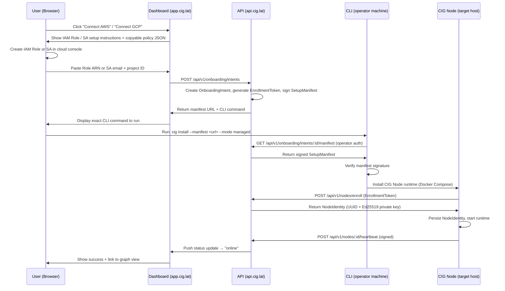
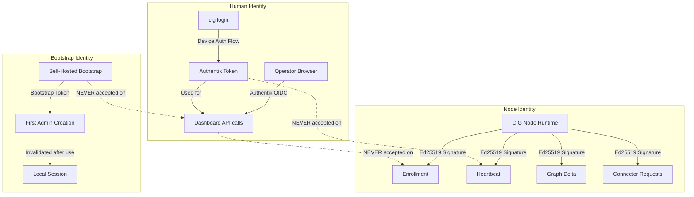
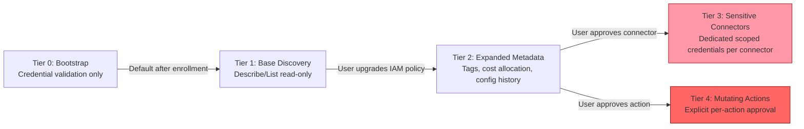
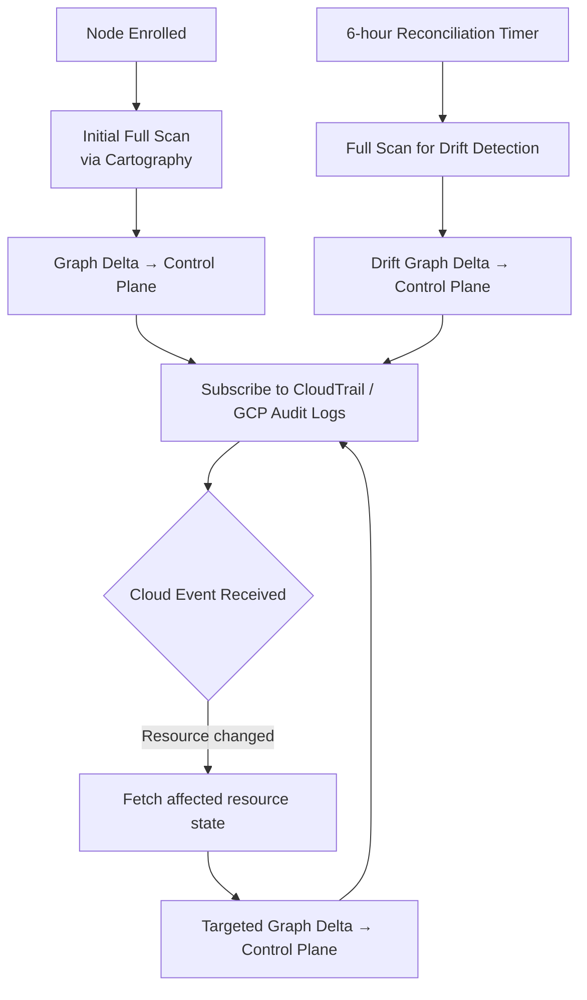

# Requirements Document: CIG Node Onboarding & Installation Architecture

## Introduction

CIG Node Onboarding defines the full architecture for connecting cloud environments (AWS, GCP) to the
Compute Intelligence Graph platform. The flow begins in the dashboard, where a user initiates a cloud
connection, receives a setup manifest and enrollment token, then runs a single CLI command that installs
a persistent CIG Node runtime in their environment. That runtime performs infrastructure discovery,
event-driven graph updates, periodic reconciliation, and optional sensitive connector installation.

The system supports two operational modes: managed cloud (app.cig.lat / api.cig.lat) and self-hosted
(local Docker Compose stack). Identity is split into three distinct planes: human users (Authentik OIDC),
CIG Node runtime (CIG-issued persistent node identity), and self-hosted bootstrap (local admin, no
Authentik dependency).

## Glossary

- **CIG_Node**: The persistent runtime agent installed in the user's environment that performs discovery,
  graph updates, reconciliation, and connector management
- **Dashboard**: The Next.js web application at app.cig.lat (managed) or localhost (self-hosted) where
  onboarding begins
- **Onboarding_Intent**: A draft record created in the API when a user initiates cloud connection from
  the Dashboard, capturing cloud provider, credentials reference, and desired profile
- **Setup_Manifest**: A signed JSON bundle generated by the API containing cloud config, node identity
  seed, enrollment token, install profile, and control plane endpoint
- **Enrollment_Token**: A short-lived (15-minute), single-use token embedded in the Setup_Manifest that
  authorizes the CIG_Node to register itself with the control plane
- **Node_Identity**: A persistent Ed25519 key pair issued to a CIG_Node upon successful enrollment,
  used for all subsequent authenticated communication with the control plane
- **Install_Profile**: Predefined service set — "core" (API, Neo4j, Dashboard, Discovery, Cartography)
  or "full" (core + Chatbot, Chroma, Agents)
- **Target_Mode**: Where the CIG_Node runtime runs — "local" (operator machine), "ssh" (remote host
  via SSH from operator machine), or "host" (directly on target host)
- **Managed_Mode**: CIG_Node connects outbound to api.cig.lat for control plane communication
- **Self_Hosted_Mode**: CIG_Node connects to a locally installed CIG API; no dependency on app.cig.lat
- **Bootstrap_Token**: One-time secret generated during self-hosted install that authorizes first admin
  account creation; no Authentik dependency
- **Human_Identity**: User identity managed by Authentik OIDC, used only for human login to Dashboard
  and CLI login flows
- **Permission_Tier**: Graduated IAM/SA permission level (Tier 0–4) controlling what the CIG_Node can
  access in the cloud environment
- **Sensitive_Connector**: An optional integration (e.g., secrets manager, billing, cost explorer) that
  requires explicit user approval and dedicated scoped credentials
- **Graph_Delta**: An incremental update payload describing resource additions, modifications, or
  deletions to be applied to the infrastructure graph
- **Heartbeat**: A periodic signed message sent by CIG_Node to the control plane confirming liveness
  and reporting service health metrics
- **Reconciliation**: A scheduled full-scan pass that detects drift between the graph state and actual
  cloud state, producing Graph_Delta records
- **IAM_Role**: AWS Identity and Access Management role assumed by CIG_Node via AssumeRole for
  temporary credentials — no long-lived access keys
- **Service_Account**: GCP service account used by CIG_Node, preferably via impersonation; narrowly
  scoped SA as v1 fallback
- **Cartography**: The open-source graph ingestion service (services/cartography) that translates cloud
  API responses into Neo4j graph writes

## Requirements

### Requirement 1: Dashboard-Led AWS Onboarding

**User Story:** As a CIG user, I want to connect my AWS account from the Dashboard, so that I can
start infrastructure discovery without leaving the browser or handling raw credentials.

#### Acceptance Criteria

1. WHEN a user clicks "Connect AWS" in the Dashboard, THE Dashboard SHALL display a step-by-step
   onboarding panel explaining the IAM Role trust policy setup
2. THE Dashboard SHALL display a copyable IAM trust policy JSON scoped to the CIG control plane
   AWS account ID
3. THE Dashboard SHALL display a copyable IAM permission policy JSON for Tier 1 (base discovery)
   permissions
4. THE Dashboard SHALL display the expected Role ARN format (arn:aws:iam::<account-id>:role/<name>)
   with inline validation
5. WHEN a user pastes a Role ARN, THE Dashboard SHALL validate the ARN format before submission
6. IF the Role ARN format is invalid, THEN THE Dashboard SHALL display an inline error describing
   the correct format
7. WHEN a valid Role ARN is submitted, THE Dashboard SHALL create an Onboarding_Intent record via
   the API and transition to the manifest generation step
8. WHEN the Onboarding_Intent is created, THE API SHALL generate a Setup_Manifest containing the
   Role ARN, Enrollment_Token, node identity seed, install profile, and control plane endpoint
9. WHEN the Setup_Manifest is ready, THE Dashboard SHALL display the exact CLI command to run,
   including the --manifest flag with the manifest URL or inline base64 value
10. THE Dashboard SHALL display onboarding state (intent created → manifest ready → node enrolled
    → node online) and update it in real time as the CIG_Node reports progress

### Requirement 2: Dashboard-Led GCP Onboarding

**User Story:** As a CIG user, I want to connect my GCP project from the Dashboard, so that I can
start GCP infrastructure discovery with minimal credential exposure.

#### Acceptance Criteria

1. WHEN a user clicks "Connect GCP" in the Dashboard, THE Dashboard SHALL display a step-by-step
   onboarding panel explaining the recommended service account impersonation setup
2. THE Dashboard SHALL display the GCP project ID format and an inline validation pattern
3. THE Dashboard SHALL display the recommended impersonation setup: granting the CIG service account
   the roles/iam.serviceAccountTokenCreator role on the user's target service account
4. THE Dashboard SHALL display a fallback narrowly scoped service account setup for v1 environments
   where impersonation is not feasible, with a clear warning that JSON key upload is not the
   preferred path
5. THE Dashboard SHALL display the minimum required IAM roles for Tier 1 discovery
   (roles/viewer or equivalent custom role)
6. WHEN a user submits a GCP project ID and service account email, THE Dashboard SHALL validate
   both formats before creating an Onboarding_Intent
7. WHEN a valid GCP configuration is submitted, THE Dashboard SHALL create an Onboarding_Intent
   and generate a Setup_Manifest with GCP project metadata, Enrollment_Token, and control plane
   endpoint
8. WHEN the Setup_Manifest is ready, THE Dashboard SHALL display the exact CLI command to run
9. THE Dashboard SHALL track and display GCP onboarding state in real time
10. THE Dashboard SHALL NOT prompt users to upload raw GCP JSON key files as the primary path

### Requirement 3: Setup Manifest and Enrollment Token Generation

**User Story:** As a CIG API developer, I want the API to generate signed Setup_Manifests and
Enrollment_Tokens, so that CLI installations can be cryptographically authorized.

#### Acceptance Criteria

1. WHEN an Onboarding_Intent is confirmed, THE API SHALL generate a Setup_Manifest as a signed
   JSON document
2. THE Setup_Manifest SHALL include: cloud provider, cloud credentials reference (ARN or SA email),
   Enrollment_Token, node identity seed (public key fingerprint), install profile, target mode,
   and control plane endpoint URL
3. THE API SHALL sign the Setup_Manifest using an HMAC-SHA256 key and include the signature in
   the manifest envelope
4. THE Enrollment_Token SHALL be a cryptographically random UUID, single-use, and expire after
   15 minutes
5. WHEN an Enrollment_Token is consumed by a CIG_Node enrollment request, THE API SHALL
   immediately invalidate it
6. IF an Enrollment_Token is presented after expiry, THEN THE API SHALL return a 401 error with
   a message directing the user to regenerate the manifest from the Dashboard
7. THE API SHALL provide a GET /api/v1/onboarding/manifest/:intentId endpoint that returns the
   Setup_Manifest for an authenticated user's Onboarding_Intent
8. THE API SHALL provide a POST /api/v1/onboarding/intents endpoint that creates Onboarding_Intent
   records for authenticated users
9. THE API SHALL provide a GET /api/v1/onboarding/intents/:id/status endpoint that returns the
   current onboarding state for Dashboard polling
10. THE Setup_Manifest SHALL be serializable to base64 for inline CLI flag embedding and parseable
    back to the original structure (round-trip property)

### Requirement 4: CLI Command Surface

**User Story:** As a CIG operator, I want a CLI with clear, composable commands, so that I can
install, enroll, and manage CIG Nodes from my operator machine or directly on a target host.

#### Acceptance Criteria

1. THE CLI SHALL provide a `cig login` command that authenticates the operator via Authentik OIDC
   device authorization flow for managed mode
2. THE CLI SHALL provide a `cig logout` command that clears stored operator credentials
3. THE CLI SHALL provide a `cig install` command that installs the CIG_Node runtime in the target
   environment
4. THE CLI SHALL provide a `cig enroll` command that re-enrolls an existing CIG_Node without
   reinstalling
5. THE CLI SHALL provide a `cig status` command that reports CIG_Node runtime health and enrollment
   state
6. THE CLI SHALL provide a `cig doctor` command that validates prerequisites without installing
7. THE CLI SHALL provide a `cig open` command that opens the Dashboard URL in the default browser
8. THE CLI SHALL provide a `cig permissions` command that displays the current permission tier and
   lists permissions required for each tier
9. THE CLI SHALL provide a `cig upgrade` command that upgrades the CIG_Node runtime to a newer
   version
10. THE CLI SHALL provide a `cig uninstall` command that removes the CIG_Node runtime and optionally
    purges data volumes
11. THE CLI SHALL support a `--mode` flag with values "managed" (default) and "self-hosted"
12. THE CLI SHALL support a `--cloud` flag with values "aws" and "gcp"
13. THE CLI SHALL support a `--profile` flag with values "core" (default) and "full"
14. THE CLI SHALL support a `--target` flag with values "local" (default), "ssh", and "host"
15. THE CLI SHALL support a `--manifest` flag accepting a URL or base64-encoded Setup_Manifest
16. THE CLI SHALL support a `--token` flag accepting an Enrollment_Token for re-enrollment

### Requirement 5: CLI Install Flow — Operator Machine Path

**User Story:** As a CIG operator, I want to run `cig install` from my local machine with cloud
CLI access, so that I can install a CIG_Node on a local or remote target without manually SSHing
into the host.

#### Acceptance Criteria

1. WHEN a user runs `cig install --manifest <value>` on their operator machine, THE CLI SHALL
   decode and verify the Setup_Manifest signature before proceeding
2. IF the Setup_Manifest signature is invalid, THEN THE CLI SHALL abort with a clear error
3. WHEN the manifest is valid and `--target local` is set, THE CLI SHALL install the CIG_Node
   runtime on the local machine using Docker Compose
4. WHEN the manifest is valid and `--target ssh` is set, THE CLI SHALL establish an SSH connection
   to the specified host and install the CIG_Node runtime remotely
5. WHEN `--target ssh` is used, THE CLI SHALL support SSH key-based authentication and prompt for
   password if no key is available
6. WHEN `--target host` is set, THE CLI SHALL assume it is running directly on the target host and
   install the CIG_Node runtime locally
7. THE CLI SHALL validate Docker and Docker Compose availability on the target before installation
8. WHEN prerequisites are missing, THE CLI SHALL display a clear error with remediation steps and
   exit without partial installation
9. WHEN all prerequisites pass, THE CLI SHALL generate a docker-compose.yml and .env file from
   the Setup_Manifest and install profile, then start the CIG_Node runtime with `docker compose up -d`
10. THE CLI SHALL NOT be the continuously running discovery engine — it installs the CIG_Node
    runtime and exits after confirming the node is healthy

### Requirement 6: CIG Node Runtime Architecture

**User Story:** As a CIG platform engineer, I want the CIG_Node to be a persistent, self-contained
runtime, so that discovery, graph updates, and reconciliation continue without the CLI being present.

#### Acceptance Criteria

1. THE CIG_Node SHALL run as a persistent Docker Compose stack (v1) or systemd service (bare metal)
   that starts automatically on host boot
2. THE CIG_Node SHALL maintain its Node_Identity across restarts by persisting the Ed25519 key pair
   to an encrypted file in the installation directory
3. WHEN the CIG_Node starts, THE CIG_Node SHALL load its Node_Identity and send an enrollment
   confirmation heartbeat to the control plane
4. THE CIG_Node SHALL send Heartbeat messages to the control plane every 60 seconds, signed with
   its Node_Identity private key
5. THE CIG_Node SHALL perform an initial full infrastructure scan immediately after successful
   enrollment
6. WHEN the initial scan completes, THE CIG_Node SHALL write the resulting Graph_Delta to the
   control plane via the graph delta endpoint
7. THE CIG_Node SHALL subscribe to cloud provider event streams (CloudTrail / GCP Audit Logs) for
   event-driven graph updates after the initial scan
8. WHEN a cloud event is received, THE CIG_Node SHALL process it and emit a targeted Graph_Delta
   within 60 seconds of the event timestamp
9. THE CIG_Node SHALL run a scheduled reconciliation pass every 6 hours to detect drift between
   graph state and actual cloud state
10. THE CIG_Node SHALL manage connector lifecycle: installing, upgrading, and removing Sensitive_Connectors
    based on approved connector requests from the control plane

### Requirement 7: Node Enrollment and Identity Issuance

**User Story:** As a CIG platform engineer, I want the control plane to issue persistent Node_Identity
credentials upon enrollment, so that CIG_Nodes can authenticate all subsequent communication without
relying on human identity.

#### Acceptance Criteria

1. WHEN a CIG_Node presents a valid Enrollment_Token to the enrollment endpoint, THE API SHALL
   generate a Node_Identity consisting of a node UUID and an Ed25519 key pair
2. THE API SHALL store the node's public key and associate it with the Onboarding_Intent and the
   authenticated user's account
3. THE API SHALL return the node UUID and private key to the CLI exactly once during enrollment;
   the private key SHALL NOT be stored server-side after issuance
4. THE CLI SHALL write the Node_Identity (node UUID + private key) to an encrypted file in the
   CIG_Node installation directory with permissions 0600
5. WHEN the CIG_Node sends any authenticated request, THE API SHALL verify the Ed25519 signature
   using the stored public key
6. IF the signature verification fails, THEN THE API SHALL return 401 and mark the node as
   "unauthorized" in the Dashboard
7. THE Node_Identity SHALL persist across CIG_Node restarts and Docker Compose recreations
8. WHEN a user revokes a node from the Dashboard, THE API SHALL invalidate the node's public key
   and reject all future requests from that node
9. THE Node_Identity SHALL be independent of Human_Identity — Authentik SHALL NOT be used as the
   identity provider for CIG_Node authentication
10. THE API SHALL provide a POST /api/v1/nodes/enroll endpoint that accepts Enrollment_Token and
    target metadata, and returns Node_Identity credentials

### Requirement 8: Discovery and Graph Update Strategy

**User Story:** As a CIG platform engineer, I want the CIG_Node to use a hybrid discovery model,
so that the infrastructure graph stays current without brute-force polling.

#### Acceptance Criteria

1. WHEN a CIG_Node is enrolled, THE CIG_Node SHALL perform a full infrastructure scan as the
   initial discovery pass using Cartography
2. THE initial scan SHALL enumerate all resources in the configured cloud account/project within
   the Tier 1 permission scope
3. WHEN the initial scan completes, THE CIG_Node SHALL emit a full Graph_Delta to the control
   plane graph delta endpoint
4. AFTER the initial scan, THE CIG_Node SHALL subscribe to AWS CloudTrail event stream or GCP
   Audit Log sink for event-driven updates
5. WHEN a relevant cloud event is received (resource created, modified, or deleted), THE CIG_Node
   SHALL fetch the affected resource's current state and emit a targeted Graph_Delta
6. THE CIG_Node SHALL NOT perform a full re-scan on every cloud event — only the affected
   resource(s) SHALL be re-fetched
7. THE CIG_Node SHALL run a full reconciliation scan every 6 hours to detect any drift not
   captured by event-driven updates
8. WHEN reconciliation detects drift, THE CIG_Node SHALL emit a Graph_Delta containing only the
   changed resources
9. THE API SHALL provide a POST /api/v1/nodes/:id/graph-delta endpoint that accepts Graph_Delta
   payloads from enrolled CIG_Nodes
10. THE graph delta endpoint SHALL validate the Node_Identity signature on every request before
    applying the delta to the graph

### Requirement 9: AWS Integration — IAM Role AssumeRole

**User Story:** As a CIG user, I want the CIG_Node to access AWS using IAM Role assumption, so
that no long-lived access keys are stored in my environment.

#### Acceptance Criteria

1. THE CIG_Node SHALL use AWS STS AssumeRole to obtain temporary credentials for all AWS API calls
2. THE CIG_Node SHALL assume the IAM_Role ARN provided in the Setup_Manifest
3. THE assumed role session SHALL have a maximum duration of 1 hour and be renewed automatically
   before expiry
4. THE CIG_Node SHALL NOT store or accept long-lived AWS access key / secret key pairs as the
   primary credential path
5. THE IAM_Role trust policy SHALL restrict the principal to the CIG control plane AWS account ID
   and require an external ID condition
6. THE IAM_Role permission policy for Tier 1 SHALL include only read-only Describe/List actions
   across EC2, RDS, S3, Lambda, VPC, and IAM
7. WHEN the CIG_Node attempts to AssumeRole and the role does not exist or trust policy is
   misconfigured, THE CIG_Node SHALL report the error to the control plane and set its status
   to "credential-error"
8. THE Dashboard SHALL display a "credential-error" status with a link to the IAM setup guide
9. THE CIG_Node SHALL support Tier 2 expanded metadata permissions when the user explicitly
   upgrades the IAM_Role policy via the Dashboard
10. THE CIG_Node SHALL use the AWS SDK default credential chain (instance profile, environment,
    config file) as a fallback for environments where AssumeRole is pre-configured externally

### Requirement 10: GCP Integration — Service Account Impersonation

**User Story:** As a CIG user, I want the CIG_Node to access GCP using service account
impersonation, so that no raw JSON key files are stored in my environment.

#### Acceptance Criteria

1. THE CIG_Node SHALL use GCP service account impersonation as the preferred credential path,
   where the CIG-managed service account impersonates the user's target service account
2. WHEN impersonation is configured, THE CIG_Node SHALL obtain short-lived access tokens via the
   IAM credentials API and refresh them before expiry
3. THE CIG_Node SHALL NOT require users to upload raw GCP JSON key files as the primary path
4. WHERE impersonation is not feasible in v1 environments, THE CIG_Node SHALL support a narrowly
   scoped service account with a JSON key file stored encrypted in the installation directory
5. THE service account (or impersonated account) SHALL have only the minimum IAM roles required
   for Tier 1 discovery (roles/viewer or a custom role with equivalent read-only permissions)
6. WHEN the CIG_Node fails to obtain GCP credentials, THE CIG_Node SHALL report the error to the
   control plane and set its status to "credential-error"
7. THE Dashboard SHALL display a "credential-error" status with a link to the GCP setup guide
8. THE CIG_Node SHALL support Tier 2 expanded metadata permissions when the user explicitly
   upgrades the service account IAM bindings via the Dashboard
9. THE GCP project ID and service account email SHALL be stored in the Setup_Manifest, not
   hardcoded in the CIG_Node runtime
10. THE CIG_Node SHALL validate GCP credentials by performing a lightweight test API call during
    enrollment before reporting successful enrollment to the control plane

### Requirement 11: Permission Tiers

**User Story:** As a CIG security engineer, I want cloud permissions to be tiered and least-privilege,
so that the CIG_Node only has the access it needs for each capability level.

#### Acceptance Criteria

1. THE CIG_Node SHALL operate at Tier 0 (bootstrap) during enrollment — only the permissions
   needed to validate credentials and confirm connectivity
2. THE CIG_Node SHALL operate at Tier 1 (base discovery) by default after enrollment — read-only
   Describe/List permissions for core resource types (EC2, RDS, S3, Lambda, VPC, IAM for AWS;
   Compute, CloudSQL, GCS, CloudFunctions, VPC, IAM for GCP)
3. THE CIG_Node SHALL support Tier 2 (expanded metadata) when explicitly enabled by the user —
   additional read permissions for resource tags, cost allocation, and configuration history
4. THE CIG_Node SHALL support Tier 3 (sensitive connectors) only when a Sensitive_Connector is
   approved — dedicated scoped credentials for that connector only, not added to the base role
5. THE CIG_Node SHALL support Tier 4 (mutating actions) only when explicitly enabled and approved
   per-action — write permissions scoped to specific resource types and actions
6. WHEN a user requests a permission tier upgrade, THE Dashboard SHALL display the exact policy
   changes required and require explicit confirmation
7. THE API SHALL track the current permission tier for each enrolled node and surface it in the
   Dashboard
8. THE CIG_Node SHALL report its effective permission tier to the control plane during each
   Heartbeat
9. IF the CIG_Node detects it has been granted permissions beyond its configured tier, THE CIG_Node
   SHALL log a warning and report it to the control plane
10. THE CLI `cig permissions` command SHALL display the current tier, active permissions, and the
    policy JSON required to upgrade to the next tier

### Requirement 12: Managed Cloud Mode

**User Story:** As a CIG user, I want my CIG_Node to connect to the managed cloud control plane
at api.cig.lat, so that I can manage my infrastructure from app.cig.lat without running my own
control plane.

#### Acceptance Criteria

1. WHEN `--mode managed` is set (default), THE CIG_Node SHALL connect outbound-only to api.cig.lat
   over HTTPS for all control plane communication
2. THE CIG_Node SHALL use HTTPS polling or Server-Sent Events (SSE) for receiving commands from
   the control plane in v1 — no inbound ports required on the target host
3. THE CIG_Node SHALL authenticate all outbound requests to api.cig.lat using its Node_Identity
   Ed25519 signature
4. THE CLI `cig login` command in managed mode SHALL authenticate the operator via Authentik OIDC
   device authorization flow against app.cig.lat
5. WHEN the operator is authenticated, THE CLI SHALL store the Authentik access token for use in
   Dashboard API calls (manifest generation, status polling)
6. THE Authentik token SHALL be used only for human-facing Dashboard API calls — the CIG_Node
   runtime SHALL use Node_Identity for all its own API calls
7. THE Dashboard at app.cig.lat SHALL display all enrolled nodes for the authenticated user's
   account
8. WHEN a CIG_Node sends a Heartbeat to api.cig.lat, THE API SHALL update the node's last_seen
   timestamp and push a real-time status update to the Dashboard
9. THE CIG_Node SHALL retry failed control plane connections with exponential backoff
   (5s, 10s, 20s, 40s, 60s max) before marking itself as "disconnected"
10. WHEN the CIG_Node reconnects after a disconnection, THE API SHALL mark the node status as
    "online" and resume normal operation

### Requirement 13: Self-Hosted Mode Bootstrap

**User Story:** As a CIG user, I want to run a fully self-hosted CIG stack without any dependency
on app.cig.lat or Authentik, so that I can operate CIG in air-gapped or private environments.

#### Acceptance Criteria

1. WHEN `--mode self-hosted` is set, THE CLI SHALL install the full CIG control plane stack
   (API, Neo4j, Dashboard, Discovery, Cartography) via Docker Compose on the target host
2. WHEN installing in self-hosted mode, THE CLI SHALL generate a Bootstrap_Token (32-character
   cryptographically random string) and display it to the operator after installation
3. THE Bootstrap_Token SHALL be stored in the installation directory with permissions 0600
4. WHEN a user accesses the self-hosted Dashboard for the first time, THE Dashboard SHALL detect
   the absence of admin accounts and display a bootstrap page
5. WHEN the user enters a valid Bootstrap_Token on the bootstrap page, THE Dashboard SHALL display
   an admin account creation form
6. WHEN the admin account is created, THE API SHALL invalidate the Bootstrap_Token and redirect
   the user to the login page
7. THE self-hosted bootstrap flow SHALL NOT require Authentik — the local API SHALL handle admin
   account creation and session management directly
8. WHEN the Bootstrap_Token expires (30 minutes after first Dashboard access), THE CLI SHALL
   provide a `cig bootstrap-reset` command to generate a new token
9. THE self-hosted CIG_Node SHALL connect to the local API endpoint (e.g., http://localhost:3003)
   instead of api.cig.lat for all control plane communication
10. THE self-hosted stack SHALL be fully functional for discovery, graph updates, and Dashboard
    visualization without any outbound connection to CIG-managed cloud services

### Requirement 14: Identity Model Separation

**User Story:** As a CIG security engineer, I want the three identity planes (human, node, bootstrap)
to be strictly separated, so that a compromised node identity cannot escalate to human account access.

#### Acceptance Criteria

1. THE CIG_System SHALL maintain three distinct identity planes: Human_Identity (Authentik OIDC),
   Node_Identity (CIG-issued Ed25519 key pair), and Bootstrap_Identity (local admin, no Authentik)
2. THE Human_Identity SHALL be used only for operator login to the Dashboard and CLI login flows
   in managed mode
3. THE Node_Identity SHALL be used only for CIG_Node-to-control-plane communication (heartbeats,
   graph deltas, enrollment, connector requests)
4. THE Bootstrap_Identity SHALL be used only for self-hosted first-admin creation and SHALL be
   invalidated after use
5. THE API SHALL enforce separate authentication middleware for human-facing endpoints (Authentik
   JWT validation) and node-facing endpoints (Ed25519 signature verification)
6. A valid Node_Identity SHALL NOT grant access to human-facing Dashboard API endpoints
7. A valid Human_Identity token SHALL NOT be accepted on node-facing endpoints
8. THE Bootstrap_Token SHALL only be accepted on the bootstrap completion endpoint and SHALL be
   rejected on all other endpoints
9. WHEN a CIG_Node is revoked, THE API SHALL invalidate only the Node_Identity — the associated
   user's Human_Identity SHALL remain unaffected
10. THE API SHALL log all identity plane crossings as security audit events

### Requirement 15: Sensitive Connector Lifecycle

**User Story:** As a CIG user, I want to optionally install sensitive connectors (e.g., AWS Cost
Explorer, Secrets Manager) with explicit approval, so that sensitive business data access is
decoupled from base infrastructure discovery.

#### Acceptance Criteria

1. THE CIG_System SHALL NOT enable any Sensitive_Connector by default
2. WHEN a user requests a Sensitive_Connector from the Dashboard, THE Dashboard SHALL display the
   exact additional permissions required and a clear description of what data will be accessed
3. WHEN the user explicitly approves a connector request, THE API SHALL create a connector approval
   record and notify the CIG_Node
4. WHEN the CIG_Node receives a connector approval, THE CIG_Node SHALL install the connector using
   dedicated scoped credentials — NOT by expanding the base IAM_Role or Service_Account
5. THE dedicated connector credentials SHALL be stored encrypted in the CIG_Node installation
   directory, separate from the base cloud credentials
6. WHEN a Sensitive_Connector is uninstalled, THE CIG_Node SHALL delete the connector's dedicated
   credentials and notify the control plane
7. THE API SHALL provide endpoints for: requesting a connector, approving/rejecting a connector
   request, listing active connectors, and revoking a connector
8. THE Dashboard SHALL display all active Sensitive_Connectors for each enrolled node with their
   permission scope and last-used timestamp
9. WHEN a connector credential expires or becomes invalid, THE CIG_Node SHALL report the error to
   the control plane and disable the connector until credentials are renewed
10. THE CIG_Node SHALL NOT couple Sensitive_Connector data access to the base Tier 1 discovery
    pipeline — connectors SHALL run as isolated sub-processes with their own credential context

### Requirement 16: Heartbeat and Node Status Management

**User Story:** As a CIG operator, I want the control plane to track CIG_Node liveness and surface
status in the Dashboard, so that I can detect and respond to node failures.

#### Acceptance Criteria

1. THE CIG_Node SHALL send a Heartbeat to the control plane every 60 seconds, signed with its
   Node_Identity private key
2. THE Heartbeat payload SHALL include: node UUID, timestamp, service health map (container name
   → status), system metrics (CPU %, memory %, disk %), current permission tier, and active
   connector list
3. WHEN the control plane receives a valid Heartbeat, THE API SHALL update the node's last_seen
   timestamp and store the latest metrics
4. WHEN a node has not sent a Heartbeat for 5 minutes, THE API SHALL set the node status to
   "degraded" and push a Dashboard notification
5. WHEN a node has not sent a Heartbeat for 15 minutes, THE API SHALL set the node status to
   "offline" and push a Dashboard alert
6. WHEN a node reconnects after being offline, THE API SHALL set the node status to "online"
7. THE Dashboard SHALL display node status with color indicators: green (online), yellow
   (degraded), red (offline), grey (never connected)
8. THE API SHALL provide a POST /api/v1/nodes/:id/heartbeat endpoint that validates the
   Node_Identity signature before processing
9. THE heartbeat endpoint SHALL be rate-limited to 1 request per 30 seconds per node
10. THE API SHALL emit a real-time event to Dashboard WebSocket/SSE clients when node status changes

### Requirement 17: API Contract — Node Management Endpoints

**User Story:** As a CIG API developer, I want well-defined node management endpoints, so that
the CLI, CIG_Node, and Dashboard can interact with the control plane consistently.

#### Acceptance Criteria

1. THE API SHALL provide POST /api/v1/onboarding/intents — creates an Onboarding_Intent (requires
   Human_Identity auth)
2. THE API SHALL provide GET /api/v1/onboarding/intents/:id/manifest — returns the Setup_Manifest
   for a given intent (requires Human_Identity auth, intent must belong to caller)
3. THE API SHALL provide GET /api/v1/onboarding/intents/:id/status — returns current onboarding
   state (requires Human_Identity auth)
4. THE API SHALL provide POST /api/v1/nodes/enroll — enrolls a CIG_Node using an Enrollment_Token
   and returns Node_Identity credentials (no prior auth required, token is the credential)
5. THE API SHALL provide POST /api/v1/nodes/:id/heartbeat — receives Heartbeat from CIG_Node
   (requires Node_Identity signature)
6. THE API SHALL provide POST /api/v1/nodes/:id/graph-delta — receives Graph_Delta from CIG_Node
   (requires Node_Identity signature)
7. THE API SHALL provide GET /api/v1/nodes — lists all nodes for the authenticated user (requires
   Human_Identity auth)
8. THE API SHALL provide DELETE /api/v1/nodes/:id — revokes a node's identity (requires
   Human_Identity auth, node must belong to caller)
9. THE API SHALL provide POST /api/v1/nodes/:id/connectors — requests a Sensitive_Connector
   installation (requires Human_Identity auth)
10. THE API SHALL provide POST /api/v1/bootstrap/init — generates a Bootstrap_Token for self-hosted
    installs (localhost-only, no auth required)
11. THE API SHALL provide POST /api/v1/bootstrap/complete — creates first admin account using
    Bootstrap_Token (no prior auth required, token is the credential)
12. THE API SHALL provide GET /api/v1/bootstrap/status — returns whether bootstrap is required
    (no auth required)

### Requirement 18: Data Model

**User Story:** As a CIG API developer, I want a well-defined data model for onboarding entities,
so that the system can track state consistently across the full onboarding lifecycle.

#### Acceptance Criteria

1. THE API data model SHALL include an OnboardingIntent entity with fields: id, userId, cloudProvider,
   credentialsRef (ARN or SA email), installProfile, targetMode, status, createdAt, updatedAt
2. THE API data model SHALL include a SetupManifest entity with fields: id, intentId, manifestPayload
   (signed JSON), enrollmentTokenId, expiresAt, createdAt
3. THE API data model SHALL include an EnrollmentToken entity with fields: id, manifestId, token
   (hashed), usedAt, expiresAt, createdAt
4. THE API data model SHALL include a ManagedNode entity with fields: id, userId, intentId, hostname,
   os, architecture, ipAddress, installProfile, mode, status, lastSeenAt, permissionTier, createdAt
5. THE API data model SHALL include a NodeIdentity entity with fields: id, nodeId, publicKey
   (Ed25519), revokedAt, createdAt
6. THE API data model SHALL include a BootstrapToken entity with fields: id, token (hashed),
   firstAccessedAt, usedAt, expiresAt, createdAt
7. THE API data model SHALL include a HeartbeatRecord entity with fields: id, nodeId, receivedAt,
   serviceHealth (JSON), systemMetrics (JSON), permissionTier, activeConnectors (JSON)
8. THE API data model SHALL include a ConnectorRequest entity with fields: id, nodeId, connectorType,
   requiredPermissions (JSON), status (pending/approved/rejected/revoked), approvedAt, createdAt
9. THE API data model SHALL include an InstallationEvent entity with fields: id, nodeId, eventType,
   payload (JSON), createdAt — for audit trail
10. THE API data model SHALL include an AuditEvent entity with fields: id, actorType (human/node/
    system), actorId, action, resourceType, resourceId, metadata (JSON), createdAt

### Requirement 19: Monorepo Package Responsibilities

**User Story:** As a CIG developer, I want clear package boundaries for the onboarding architecture,
so that each team can work independently without coupling.

#### Acceptance Criteria

1. THE apps/dashboard package SHALL own: onboarding wizard UI (AWS/GCP connect flows), node status
   dashboard, connector approval UI, and bootstrap page
2. THE apps/wizard-ui package SHALL own: the standalone onboarding wizard for embedded or
   white-label use cases
3. THE packages/api package SHALL own: all onboarding, enrollment, heartbeat, graph-delta, bootstrap,
   and connector API endpoints and their data models
4. THE packages/cli package SHALL own: all CLI commands (login, install, enroll, status, doctor,
   open, permissions, upgrade, uninstall), manifest parsing, SSH target support, and Docker Compose
   generation
5. THE packages/sdk package SHALL own: typed API client for onboarding endpoints, Node_Identity
   signing utilities, and Setup_Manifest serialization/deserialization
6. THE packages/auth package SHALL own: Authentik OIDC integration for human login, device
   authorization flow, and token storage — NOT node identity
7. THE packages/discovery package SHALL own: cloud provider discovery adapters (AWS, GCP),
   event stream subscription, and Graph_Delta generation
8. THE packages/graph package SHALL own: graph delta application logic, Neo4j write operations,
   and graph query interface
9. THE packages/infra package SHALL own: Docker Compose templates for CIG_Node runtime, systemd
   unit file templates, and install directory management
10. THE services/cartography package SHALL own: the Cartography-based full-scan ingestion pipeline
    invoked by the CIG_Node for initial scans and reconciliation passes

### Requirement 20: Implementation Phases

**User Story:** As a CIG engineering lead, I want a phased implementation plan, so that the team
can ship a secure, functional v1 without attempting to build everything at once.

#### Acceptance Criteria

1. Phase 1 (Dashboard Onboarding Intents) SHALL deliver: AWS and GCP onboarding UI in apps/dashboard,
   Onboarding_Intent and Setup_Manifest API endpoints, Enrollment_Token generation, and CLI command
   display
2. Phase 2 (CLI Install/Enroll Flow) SHALL deliver: `cig install`, `cig enroll`, `cig doctor`,
   `cig status` commands with manifest parsing, Docker Compose generation, and SSH target support
3. Phase 3 (CIG Node Runtime v1) SHALL deliver: persistent CIG_Node Docker Compose stack, Node_Identity
   persistence, Heartbeat sending, and control plane connectivity (managed and self-hosted)
4. Phase 4 (AWS Discovery) SHALL deliver: Tier 1 AWS discovery via Cartography, CloudTrail event
   subscription, Graph_Delta emission, and 6-hour reconciliation
5. Phase 5 (GCP Discovery) SHALL deliver: Tier 1 GCP discovery via Cartography, GCP Audit Log
   subscription, Graph_Delta emission, and 6-hour reconciliation
6. Phase 6 (Self-Hosted Bootstrap) SHALL deliver: self-hosted install mode, Bootstrap_Token flow,
   local admin creation, and self-hosted Dashboard without Authentik dependency
7. Phase 7 (Sensitive Connector Flow) SHALL deliver: connector request/approval UI, dedicated
   connector credential management, and connector lifecycle in CIG_Node
8. Phase 8 (Hardening) SHALL deliver: end-to-end tests for all onboarding flows, permission tier
   validation tests, Node_Identity round-trip tests, and security audit of all identity boundaries
9. EACH phase SHALL be independently deployable and testable before the next phase begins
10. THE v1 target SHALL be: shippable, secure, and maintainable — not an idealized future architecture

### Requirement 21: Setup Manifest Serialization (Parser Round-Trip)

**User Story:** As a CIG developer, I want the Setup_Manifest to be reliably serialized and
deserialized, so that CLI installations work correctly regardless of how the manifest is delivered.

#### Acceptance Criteria

1. THE packages/sdk SHALL provide a `serializeManifest(manifest: SetupManifest): string` function
   that encodes a manifest to a base64 URL-safe string
2. THE packages/sdk SHALL provide a `deserializeManifest(encoded: string): SetupManifest` function
   that decodes a base64 string back to a manifest object
3. FOR ALL valid SetupManifest objects, deserializeManifest(serializeManifest(manifest)) SHALL
   produce an object equivalent to the original (round-trip property)
4. WHEN an invalid or tampered base64 string is passed to deserializeManifest, THE function SHALL
   throw a descriptive error identifying the failure reason
5. THE packages/sdk SHALL provide a `verifyManifestSignature(manifest: SetupManifest, key: string):
   boolean` function that validates the HMAC-SHA256 signature
6. FOR ALL valid manifests, verifyManifestSignature SHALL return true; for any modified manifest,
   it SHALL return false (invariant property)
7. THE CLI SHALL call verifyManifestSignature before using any manifest data
8. THE manifest schema SHALL be versioned — the version field SHALL be validated during
   deserialization and an error thrown for unsupported versions
9. WHEN a manifest is serialized then deserialized, the signature SHALL remain valid (round-trip
   does not invalidate signature)
10. THE packages/sdk SHALL export TypeScript types for SetupManifest, EnrollmentToken, and
    NodeIdentity that are shared between CLI, API, and Dashboard

### Requirement 22: Onboarding State Machine

**User Story:** As a CIG platform engineer, I want the onboarding flow to follow a well-defined
state machine, so that the Dashboard always reflects accurate progress and partial failures are
recoverable.

#### Acceptance Criteria

1. THE OnboardingIntent SHALL progress through the following states in order: draft → manifest_ready
   → cli_started → node_enrolled → credential_validated → discovery_started → online
2. WHEN an OnboardingIntent enters an error state (credential_error, enrollment_failed,
   discovery_failed), THE Dashboard SHALL display the error state with a recovery action
3. THE state machine SHALL allow re-entry from error states — a user SHALL be able to fix their
   IAM role and retry without creating a new intent
4. WHEN the CIG_Node successfully enrolls, THE API SHALL transition the intent to "node_enrolled"
5. WHEN the CIG_Node validates cloud credentials, THE API SHALL transition the intent to
   "credential_validated"
6. WHEN the CIG_Node starts its initial discovery scan, THE API SHALL transition the intent to
   "discovery_started"
7. WHEN the CIG_Node sends its first successful Heartbeat after discovery, THE API SHALL transition
   the intent to "online"
8. THE Dashboard SHALL poll GET /api/v1/onboarding/intents/:id/status every 10 seconds during
   active onboarding and display the current state with a progress indicator
9. WHEN an intent reaches "online" state, THE Dashboard SHALL display a success screen with a
   link to the node's graph view
10. THE state transitions SHALL be recorded as InstallationEvent records for audit purposes

---

## Architecture Diagrams

### Dashboard-Led Onboarding Flow

### Identity Separation

### Permission Escalation

### Discovery Model

