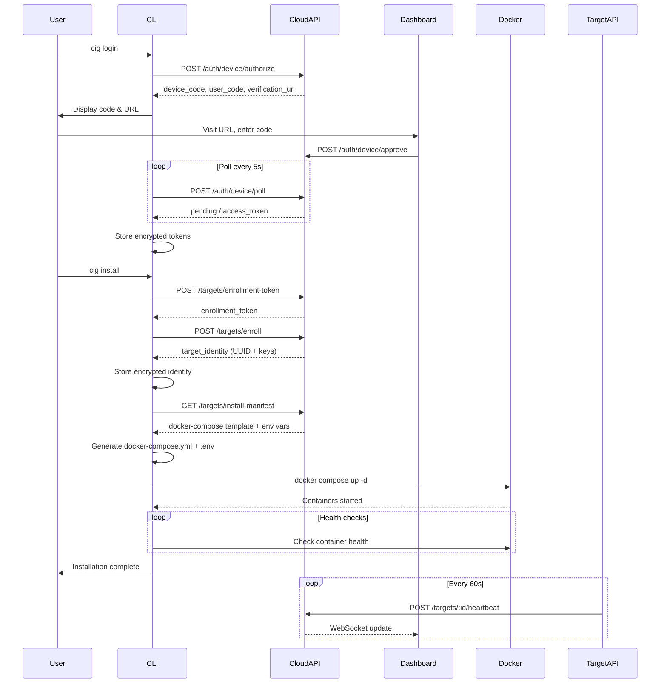
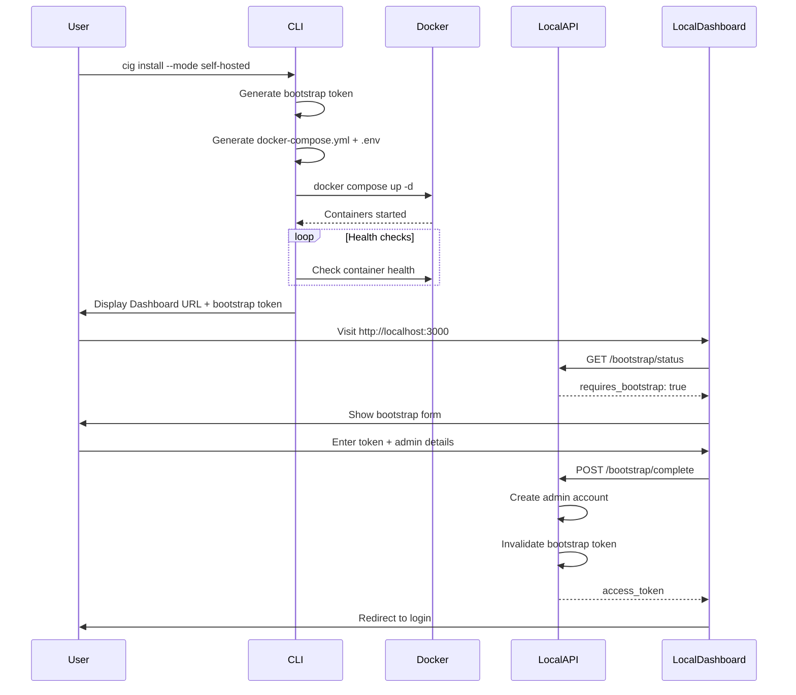
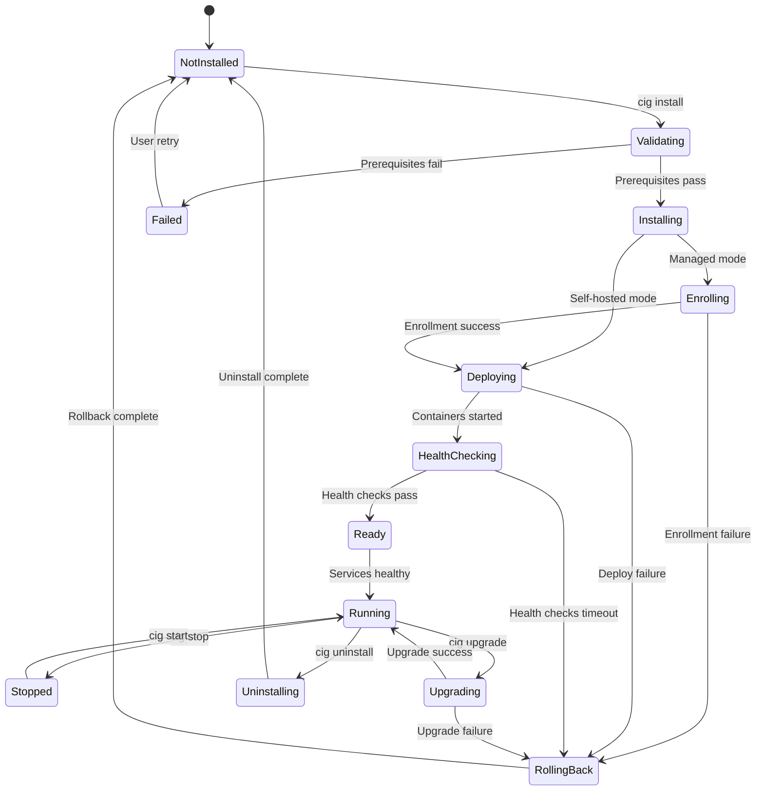
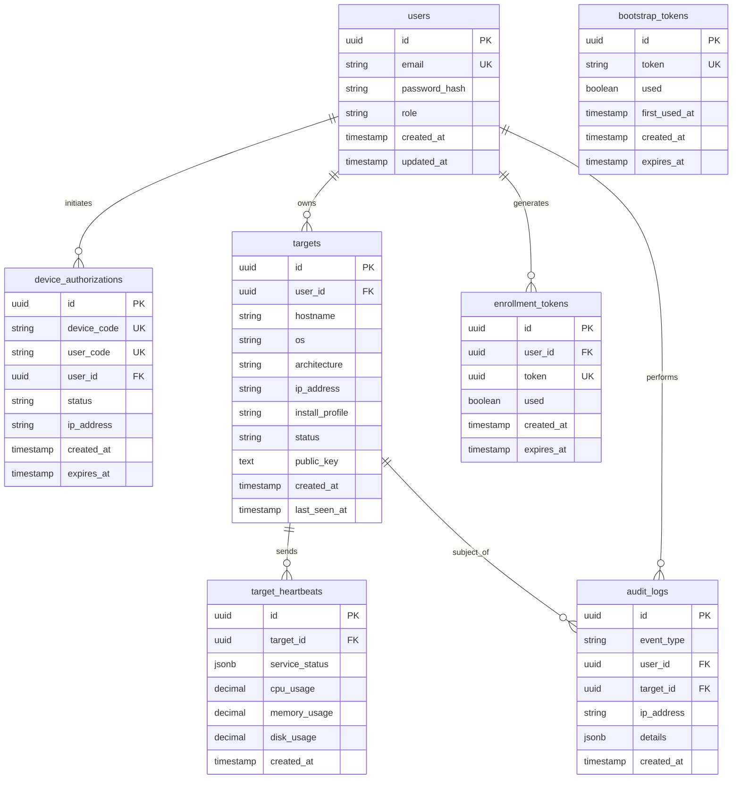

# Technical Design: CIG CLI Onboarding & Installer

## Overview

The CIG CLI Onboarding & Installer transforms the existing CLI scaffolding into a production-grade system for authenticating users, enrolling target machines, and deploying CIG infrastructure via Docker Compose. The system supports two operational modes:

- **Managed Mode**: CLI authenticates with CIG cloud service, enrolls target machines, and maintains persistent connections for remote management
- **Self-Hosted Mode**: CLI deploys CIG entirely locally with bootstrap-based admin account creation

The design follows OAuth 2.0 device authorization flow (RFC 8628) for authentication, uses Ed25519 cryptographic identities for target machines, and implements comprehensive security controls including AES-256-GCM credential encryption, rate limiting, and audit logging.

### Key Design Decisions

1. **Command Handler Architecture**: Class-based handlers with dependency injection for testability
2. **State Persistence**: JSON files for simplicity and human readability (SQLite considered but rejected for v1.0 to minimize dependencies)
3. **Docker Compose Templates**: Embedded YAML templates with environment variable substitution
4. **Heartbeat Transport**: HTTP polling with exponential backoff (WebSocket considered for v2.0)
5. **Bootstrap Token Storage**: File-based with API validation for security
6. **Error Recovery**: Automatic rollback with user confirmation for destructive operations
7. **Progress Feedback**: ora spinners for indeterminate operations, cli-progress bars for determinate operations

## Architecture

### System Architecture

```mermaid
graph TB
    subgraph "User Machine"
        CLI[CLI Tool]
        Browser[Web Browser]
    end
    
    subgraph "Target Machine"
        CLI_Target[CLI Tool]
        Docker[Docker Engine]
        subgraph "CIG Services"
            API[API Service]
            Dashboard[Dashboard]
            Neo4j[Neo4j]
            Discovery[Discovery]
            Cartography[Cartography]
            Chatbot[Chatbot - Full Profile]
            Chroma[Chroma - Full Profile]
        end
    end
    
    subgraph "CIG Cloud"
        CloudAPI[Cloud API]
        CloudDashboard[Cloud Dashboard]
        Database[(PostgreSQL)]
    end
    
    CLI -->|1. Device Auth Request| CloudAPI
    CloudAPI -->|2. Device Code + User Code| CLI
    CLI -->|3. Display Code| Browser
    Browser -->|4. Approve Device| CloudDashboard
    CloudDashboard -->|5. Approve| CloudAPI
    CLI -->|6. Poll for Token| CloudAPI
    CloudAPI -->|7. Access Token| CLI
    
    CLI_Target -->|8. Enroll Request| CloudAPI
    CloudAPI -->|9. Target Identity| CLI_Target
    CLI_Target -->|10. Deploy| Docker
    Docker -->|11. Start Containers| CIG Services
    API -->|12. Heartbeat| CloudAPI
    
    style CLI fill:#e1f5ff
    style CLI_Target fill:#e1f5ff
    style CloudAPI fill:#fff4e1
    style CloudDashboard fill:#fff4e1
```

### Managed Mode Sequence



### Self-Hosted Mode Sequence




### Installation State Machine



## Components and Interfaces

### CLI Architecture

The CLI is organized into command handlers, services, and utilities:

```
packages/cli/src/
├── index.ts                    # Entry point, command registration
├── commands/
│   ├── login.ts               # Device authorization flow
│   ├── logout.ts              # Credential cleanup
│   ├── install.ts             # Installation orchestration
│   ├── uninstall.ts           # Cleanup and rollback
│   ├── start.ts               # Service lifecycle
│   ├── stop.ts                # Service lifecycle
│   ├── restart.ts             # Service lifecycle
│   ├── status.ts              # Status reporting
│   ├── enroll.ts              # Re-enrollment
│   ├── doctor.ts              # Prerequisite checks
│   ├── health.ts              # Health diagnostics
│   ├── logs.ts                # Log viewing
│   ├── upgrade.ts             # Version upgrades
│   └── bootstrap-reset.ts     # Bootstrap token regeneration
├── services/
│   ├── auth.ts                # Authentication service
│   ├── enrollment.ts          # Enrollment service
│   ├── installation.ts        # Installation engine
│   ├── docker.ts              # Docker orchestration
│   ├── heartbeat.ts           # Heartbeat client
│   └── api-client.ts          # Cloud API client
├── managers/
│   ├── credential-manager.ts  # Enhanced credential storage
│   ├── state-manager.ts       # Installation state persistence
│   └── config-manager.ts      # Configuration management
├── validators/
│   ├── prerequisites.ts       # System prerequisite checks
│   └── ports.ts               # Port availability checks
├── utils/
│   ├── crypto.ts              # Ed25519 key generation
│   ├── progress.ts            # Progress indicators
│   ├── errors.ts              # Error types and handling
│   └── platform.ts            # Platform detection
└── types/
    ├── state.ts               # State interfaces
    ├── config.ts              # Configuration interfaces
    └── api.ts                 # API request/response types
```

### Command Handler Pattern

All commands follow a consistent class-based pattern:

```typescript
// packages/cli/src/commands/install.ts
import { Command } from 'commander';
import { InstallationService } from '../services/installation.js';
import { StateManager } from '../managers/state-manager.js';
import { PrerequisiteValidator } from '../validators/prerequisites.js';
import { ProgressReporter } from '../utils/progress.js';

export interface InstallOptions {
  mode?: 'managed' | 'self-hosted';
  profile?: 'core' | 'full';
  installDir?: string;
  nonInteractive?: boolean;
  force?: boolean;
  quiet?: boolean;
  verbose?: boolean;
}

export class InstallCommand {
  constructor(
    private installationService: InstallationService,
    private stateManager: StateManager,
    private validator: PrerequisiteValidator,
    private progress: ProgressReporter
  ) {}

  async execute(options: InstallOptions): Promise<void> {
    try {
      // Check existing installation
      const existingState = await this.stateManager.load();
      if (existingState && !options.force) {
        throw new Error('CIG is already installed. Use --force to reinstall.');
      }

      // Validate prerequisites
      this.progress.start('Validating prerequisites');
      const validationResult = await this.validator.validate();
      if (!validationResult.success) {
        this.progress.fail('Prerequisites check failed');
        throw new Error(validationResult.errors.join('\n'));
      }
      this.progress.succeed('Prerequisites validated');

      // Determine mode
      const mode = options.mode || await this.promptForMode(options.nonInteractive);
      
      // Execute installation
      if (mode === 'managed') {
        await this.installManaged(options);
      } else {
        await this.installSelfHosted(options);
      }

      this.progress.succeed('Installation complete');
    } catch (error) {
      this.progress.fail('Installation failed');
      await this.handleError(error, options);
    }
  }

  private async installManaged(options: InstallOptions): Promise<void> {
    // Implementation details...
  }

  private async installSelfHosted(options: InstallOptions): Promise<void> {
    // Implementation details...
  }

  private async handleError(error: unknown, options: InstallOptions): Promise<void> {
    // Error handling and rollback logic...
  }
}

export function registerInstallCommand(program: Command): void {
  program
    .command('install')
    .description('Install CIG infrastructure')
    .option('--mode <mode>', 'Installation mode: managed or self-hosted')
    .option('--profile <profile>', 'Install profile: core or full', 'core')
    .option('--install-dir <path>', 'Installation directory', '~/.cig/install')
    .option('--non-interactive', 'Run without prompts')
    .option('--force', 'Force reinstall over existing installation')
    .option('--quiet', 'Suppress progress output')
    .option('--verbose', 'Display detailed debug logs')
    .action(async (options) => {
      const command = new InstallCommand(
        new InstallationService(),
        new StateManager(),
        new PrerequisiteValidator(),
        new ProgressReporter(options.quiet, options.verbose)
      );
      await command.execute(options);
    });
}
```

### Enhanced Credential Manager

Extends the existing CredentialManager to support authentication tokens and target identities:

```typescript
// packages/cli/src/managers/credential-manager.ts
import * as crypto from 'crypto';
import * as fs from 'fs';
import * as os from 'os';
import * as path from 'path';

export interface AuthTokens {
  accessToken: string;
  refreshToken: string;
  expiresAt: number;
  refreshExpiresAt: number;
}

export interface TargetIdentity {
  targetId: string;
  publicKey: string;
  privateKey: string;
  enrolledAt: string;
}

export interface BootstrapToken {
  token: string;
  createdAt: string;
  expiresAt: string;
}

interface AuthFile {
  tokens?: EncryptedData;
  identity?: EncryptedData;
  bootstrap?: EncryptedData;
  cloudCredentials?: Record<string, EncryptedData>; // Existing AWS/GCP creds
}

interface EncryptedData {
  iv: string;
  tag: string;
  data: string;
}

export class CredentialManager {
  private readonly configDir: string;
  private readonly authFile: string;
  private readonly encryptionKey: Buffer;

  constructor() {
    this.configDir = path.join(os.homedir(), '.cig');
    this.authFile = path.join(this.configDir, 'auth.json');
    
    // Derive encryption key from machine-specific identifiers
    this.encryptionKey = crypto
      .pbkdf2Sync(
        os.hostname() + os.userInfo().username,
        'cig-credential-salt',
        100000,
        32,
        'sha256'
      );
  }

  private encrypt(plaintext: string): EncryptedData {
    const iv = crypto.randomBytes(12);
    const cipher = crypto.createCipheriv('aes-256-gcm', this.encryptionKey, iv);
    const encrypted = Buffer.concat([
      cipher.update(plaintext, 'utf8'),
      cipher.final()
    ]);
    const tag = cipher.getAuthTag();
    
    return {
      iv: iv.toString('hex'),
      tag: tag.toString('hex'),
      data: encrypted.toString('hex')
    };
  }

  private decrypt(encrypted: EncryptedData): string {
    const iv = Buffer.from(encrypted.iv, 'hex');
    const tag = Buffer.from(encrypted.tag, 'hex');
    const data = Buffer.from(encrypted.data, 'hex');
    
    const decipher = crypto.createDecipheriv('aes-256-gcm', this.encryptionKey, iv);
    decipher.setAuthTag(tag);
    
    return Buffer.concat([
      decipher.update(data),
      decipher.final()
    ]).toString('utf8');
  }

  private readAuthFile(): AuthFile {
    if (!fs.existsSync(this.authFile)) {
      return {};
    }
    const raw = fs.readFileSync(this.authFile, 'utf8');
    return JSON.parse(raw) as AuthFile;
  }

  private writeAuthFile(data: AuthFile): void {
    if (!fs.existsSync(this.configDir)) {
      fs.mkdirSync(this.configDir, { mode: 0o700, recursive: true });
    }
    fs.writeFileSync(this.authFile, JSON.stringify(data, null, 2), { mode: 0o600 });
  }

  // Authentication tokens
  saveTokens(tokens: AuthTokens): void {
    const data = this.readAuthFile();
    data.tokens = this.encrypt(JSON.stringify(tokens));
    this.writeAuthFile(data);
  }

  loadTokens(): AuthTokens | null {
    const data = this.readAuthFile();
    if (!data.tokens) return null;
    
    try {
      const decrypted = this.decrypt(data.tokens);
      return JSON.parse(decrypted) as AuthTokens;
    } catch (error) {
      console.error('Failed to decrypt tokens. Re-authentication required.');
      return null;
    }
  }

  // Target identity
  saveIdentity(identity: TargetIdentity): void {
    const data = this.readAuthFile();
    data.identity = this.encrypt(JSON.stringify(identity));
    this.writeAuthFile(data);
  }

  loadIdentity(): TargetIdentity | null {
    const data = this.readAuthFile();
    if (!data.identity) return null;
    
    try {
      const decrypted = this.decrypt(data.identity);
      return JSON.parse(decrypted) as TargetIdentity;
    } catch (error) {
      console.error('Failed to decrypt identity. Re-enrollment required.');
      return null;
    }
  }

  // Bootstrap token
  saveBootstrapToken(token: BootstrapToken): void {
    const data = this.readAuthFile();
    data.bootstrap = this.encrypt(JSON.stringify(token));
    this.writeAuthFile(data);
  }

  loadBootstrapToken(): BootstrapToken | null {
    const data = this.readAuthFile();
    if (!data.bootstrap) return null;
    
    try {
      const decrypted = this.decrypt(data.bootstrap);
      return JSON.parse(decrypted) as BootstrapToken;
    } catch (error) {
      console.error('Failed to decrypt bootstrap token.');
      return null;
    }
  }

  // Clear all credentials
  clearAll(): void {
    if (fs.existsSync(this.authFile)) {
      fs.unlinkSync(this.authFile);
    }
  }

  // Token refresh check
  needsRefresh(tokens: AuthTokens): boolean {
    const now = Date.now();
    const expiresIn = tokens.expiresAt - now;
    // Refresh if token expires in less than 5 minutes
    return expiresIn < 5 * 60 * 1000;
  }

  isRefreshTokenValid(tokens: AuthTokens): boolean {
    return Date.now() < tokens.refreshExpiresAt;
  }
}
```


### State Manager

Manages installation state persistence:

```typescript
// packages/cli/src/managers/state-manager.ts
import * as fs from 'fs';
import * as os from 'os';
import * as path from 'path';

export interface InstallationState {
  version: string;
  mode: 'managed' | 'self-hosted';
  profile: 'core' | 'full';
  installDir: string;
  installedAt: string;
  status: 'ready' | 'running' | 'stopped' | 'degraded' | 'failed';
  services: ServiceState[];
}

export interface ServiceState {
  name: string;
  status: 'running' | 'stopped' | 'restarting' | 'unhealthy';
  containerId?: string;
}

export class StateManager {
  private readonly stateFile: string;

  constructor() {
    const configDir = path.join(os.homedir(), '.cig');
    this.stateFile = path.join(configDir, 'state.json');
  }

  async save(state: InstallationState): Promise<void> {
    const dir = path.dirname(this.stateFile);
    if (!fs.existsSync(dir)) {
      fs.mkdirSync(dir, { mode: 0o700, recursive: true });
    }
    fs.writeFileSync(this.stateFile, JSON.stringify(state, null, 2), { mode: 0o600 });
  }

  async load(): Promise<InstallationState | null> {
    if (!fs.existsSync(this.stateFile)) {
      return null;
    }
    const raw = fs.readFileSync(this.stateFile, 'utf8');
    return JSON.parse(raw) as InstallationState;
  }

  async update(updates: Partial<InstallationState>): Promise<void> {
    const current = await this.load();
    if (!current) {
      throw new Error('No installation state found');
    }
    await this.save({ ...current, ...updates });
  }

  async delete(): Promise<void> {
    if (fs.existsSync(this.stateFile)) {
      fs.unlinkSync(this.stateFile);
    }
  }

  async validateInstallDir(state: InstallationState): Promise<boolean> {
    return fs.existsSync(state.installDir);
  }
}
```

### Installation Service

Core installation orchestration logic:

```typescript
// packages/cli/src/services/installation.ts
import * as fs from 'fs';
import * as path from 'path';
import * as crypto from 'crypto';
import { DockerService } from './docker.js';
import { EnrollmentService } from './enrollment.js';
import { StateManager } from '../managers/state-manager.js';
import { CredentialManager } from '../managers/credential-manager.js';
import { ApiClient } from './api-client.js';

export interface InstallConfig {
  mode: 'managed' | 'self-hosted';
  profile: 'core' | 'full';
  installDir: string;
}

export class InstallationService {
  constructor(
    private docker: DockerService,
    private enrollment: EnrollmentService,
    private state: StateManager,
    private credentials: CredentialManager,
    private apiClient: ApiClient
  ) {}

  async install(config: InstallConfig): Promise<void> {
    const installDir = this.resolveInstallDir(config.installDir);
    
    // Create installation directory
    if (!fs.existsSync(installDir)) {
      fs.mkdirSync(installDir, { mode: 0o700, recursive: true });
    }

    // Generate secrets
    const secrets = this.generateSecrets();

    // Get compose template and env vars
    let composeTemplate: string;
    let envVars: Record<string, string>;

    if (config.mode === 'managed') {
      // Get manifest from cloud API
      const manifest = await this.apiClient.getInstallManifest();
      composeTemplate = manifest.dockerComposeTemplate;
      envVars = { ...manifest.environmentVariables, ...secrets };
    } else {
      // Use embedded template
      composeTemplate = this.getEmbeddedTemplate(config.profile);
      envVars = this.getDefaultEnvVars(secrets);
      
      // Generate bootstrap token
      const bootstrapToken = this.generateBootstrapToken();
      await this.credentials.saveBootstrapToken(bootstrapToken);
    }

    // Write docker-compose.yml
    const composePath = path.join(installDir, 'docker-compose.yml');
    fs.writeFileSync(composePath, composeTemplate, { mode: 0o600 });

    // Write .env file
    const envPath = path.join(installDir, '.env');
    const envContent = Object.entries(envVars)
      .map(([key, value]) => `${key}=${value}`)
      .join('\n');
    fs.writeFileSync(envPath, envContent, { mode: 0o600 });

    // Start services
    await this.docker.composeUp(installDir);

    // Wait for health checks
    await this.waitForHealthy(installDir, config.profile);

    // Save installation state
    await this.state.save({
      version: '0.1.0',
      mode: config.mode,
      profile: config.profile,
      installDir,
      installedAt: new Date().toISOString(),
      status: 'ready',
      services: await this.docker.getServiceStatus(installDir)
    });
  }

  private generateSecrets(): Record<string, string> {
    return {
      NEO4J_PASSWORD: crypto.randomBytes(16).toString('hex'),
      JWT_SECRET: crypto.randomBytes(32).toString('hex'),
      API_SECRET: crypto.randomBytes(32).toString('hex')
    };
  }

  private generateBootstrapToken(): { token: string; createdAt: string; expiresAt: string } {
    const token = crypto.randomBytes(16).toString('hex');
    const createdAt = new Date().toISOString();
    const expiresAt = new Date(Date.now() + 30 * 60 * 1000).toISOString(); // 30 minutes
    return { token, createdAt, expiresAt };
  }

  private getEmbeddedTemplate(profile: 'core' | 'full'): string {
    // Read from embedded resources
    const templatePath = path.join(__dirname, '../../templates', `docker-compose.${profile}.yml`);
    return fs.readFileSync(templatePath, 'utf8');
  }

  private getDefaultEnvVars(secrets: Record<string, string>): Record<string, string> {
    return {
      ...secrets,
      NEO4J_USER: 'neo4j',
      NODE_ENV: 'production',
      API_PORT: '8080',
      DASHBOARD_PORT: '3000'
    };
  }

  private async waitForHealthy(installDir: string, profile: string, timeoutMs = 300000): Promise<void> {
    const startTime = Date.now();
    const services = profile === 'core' 
      ? ['neo4j', 'api', 'dashboard', 'discovery', 'cartography']
      : ['neo4j', 'api', 'dashboard', 'discovery', 'cartography', 'chroma', 'chatbot'];

    while (Date.now() - startTime < timeoutMs) {
      const statuses = await this.docker.getServiceStatus(installDir);
      const allHealthy = services.every(svc => {
        const status = statuses.find(s => s.name === svc);
        return status && status.status === 'running';
      });

      if (allHealthy) {
        return;
      }

      await new Promise(resolve => setTimeout(resolve, 5000));
    }

    throw new Error('Health check timeout: services did not become healthy within 5 minutes');
  }

  private resolveInstallDir(dir: string): string {
    if (dir.startsWith('~')) {
      return path.join(require('os').homedir(), dir.slice(1));
    }
    return path.resolve(dir);
  }

  async rollback(installDir: string, purgeData = false): Promise<void> {
    // Stop and remove containers
    await this.docker.composeDown(installDir, purgeData);

    // Remove configuration files
    const composePath = path.join(installDir, 'docker-compose.yml');
    const envPath = path.join(installDir, '.env');
    
    if (fs.existsSync(composePath)) {
      fs.unlinkSync(composePath);
    }
    if (fs.existsSync(envPath)) {
      fs.unlinkSync(envPath);
    }

    // Remove installation state
    await this.state.delete();
  }
}
```

### Docker Service

Abstracts Docker and Docker Compose operations:

```typescript
// packages/cli/src/services/docker.ts
import { exec } from 'child_process';
import { promisify } from 'util';
import * as path from 'path';

const execAsync = promisify(exec);

export interface ContainerStatus {
  name: string;
  status: 'running' | 'stopped' | 'restarting' | 'unhealthy';
  containerId: string;
  health?: string;
}

export class DockerService {
  async isInstalled(): Promise<boolean> {
    try {
      await execAsync('docker --version');
      return true;
    } catch {
      return false;
    }
  }

  async isRunning(): Promise<boolean> {
    try {
      await execAsync('docker info');
      return true;
    } catch {
      return false;
    }
  }

  async isComposeAvailable(): Promise<boolean> {
    try {
      await execAsync('docker compose version');
      return true;
    } catch {
      return false;
    }
  }

  async composeUp(installDir: string): Promise<void> {
    const composePath = path.join(installDir, 'docker-compose.yml');
    await execAsync(`docker compose -f ${composePath} up -d`, {
      cwd: installDir
    });
  }

  async composeDown(installDir: string, removeVolumes = false): Promise<void> {
    const composePath = path.join(installDir, 'docker-compose.yml');
    const volumeFlag = removeVolumes ? '-v' : '';
    await execAsync(`docker compose -f ${composePath} down ${volumeFlag}`, {
      cwd: installDir
    });
  }

  async composeStart(installDir: string): Promise<void> {
    const composePath = path.join(installDir, 'docker-compose.yml');
    await execAsync(`docker compose -f ${composePath} start`, {
      cwd: installDir
    });
  }

  async composeStop(installDir: string): Promise<void> {
    const composePath = path.join(installDir, 'docker-compose.yml');
    await execAsync(`docker compose -f ${composePath} stop`, {
      cwd: installDir
    });
  }

  async composeRestart(installDir: string, service?: string): Promise<void> {
    const composePath = path.join(installDir, 'docker-compose.yml');
    const serviceArg = service ? service : '';
    await execAsync(`docker compose -f ${composePath} restart ${serviceArg}`, {
      cwd: installDir
    });
  }

  async getServiceStatus(installDir: string): Promise<ContainerStatus[]> {
    const composePath = path.join(installDir, 'docker-compose.yml');
    const { stdout } = await execAsync(
      `docker compose -f ${composePath} ps --format json`,
      { cwd: installDir }
    );

    const lines = stdout.trim().split('\n').filter(line => line);
    return lines.map(line => {
      const container = JSON.parse(line);
      return {
        name: container.Service,
        status: this.parseStatus(container.State),
        containerId: container.ID,
        health: container.Health
      };
    });
  }

  async getLogs(installDir: string, service?: string, tail = 100): Promise<string> {
    const composePath = path.join(installDir, 'docker-compose.yml');
    const serviceArg = service ? service : '';
    const { stdout } = await execAsync(
      `docker compose -f ${composePath} logs --tail ${tail} ${serviceArg}`,
      { cwd: installDir }
    );
    return stdout;
  }

  private parseStatus(state: string): 'running' | 'stopped' | 'restarting' | 'unhealthy' {
    const lower = state.toLowerCase();
    if (lower.includes('running')) return 'running';
    if (lower.includes('restarting')) return 'restarting';
    if (lower.includes('unhealthy')) return 'unhealthy';
    return 'stopped';
  }

  async checkPortAvailable(port: number): Promise<boolean> {
    try {
      const { stdout } = await execAsync(`lsof -i :${port} || netstat -an | grep ${port}`);
      return stdout.trim() === '';
    } catch {
      // Command failed means port is available
      return true;
    }
  }
}
```


### Authentication Service

Implements OAuth 2.0 device authorization flow:

```typescript
// packages/cli/src/services/auth.ts
import { ApiClient } from './api-client.js';
import { CredentialManager, AuthTokens } from '../managers/credential-manager.js';

export interface DeviceAuthResponse {
  deviceCode: string;
  userCode: string;
  verificationUri: string;
  verificationUriComplete?: string;
  expiresIn: number;
  interval: number;
}

export interface TokenResponse {
  accessToken: string;
  refreshToken: string;
  expiresIn: number;
  refreshExpiresIn: number;
}

export class AuthService {
  constructor(
    private apiClient: ApiClient,
    private credentials: CredentialManager
  ) {}

  async initiateDeviceAuth(): Promise<DeviceAuthResponse> {
    return await this.apiClient.post<DeviceAuthResponse>('/auth/device/authorize', {});
  }

  async pollForToken(deviceCode: string, interval: number, expiresIn: number): Promise<TokenResponse> {
    const startTime = Date.now();
    const expiresAt = startTime + expiresIn * 1000;
    let currentInterval = interval;

    while (Date.now() < expiresAt) {
      await this.sleep(currentInterval * 1000);

      try {
        const response = await this.apiClient.post<{ status: string } & Partial<TokenResponse>>(
          '/auth/device/poll',
          { deviceCode }
        );

        if (response.status === 'approved' && response.accessToken) {
          return {
            accessToken: response.accessToken,
            refreshToken: response.refreshToken!,
            expiresIn: response.expiresIn!,
            refreshExpiresIn: response.refreshExpiresIn!
          };
        }

        if (response.status === 'denied') {
          throw new Error('Device authorization was denied');
        }

        // Exponential backoff up to 15 seconds
        currentInterval = Math.min(currentInterval * 1.5, 15);
      } catch (error) {
        if (error instanceof Error && error.message.includes('denied')) {
          throw error;
        }
        // Continue polling on other errors
      }
    }

    throw new Error('Device authorization expired. Please try again.');
  }

  async saveTokens(tokenResponse: TokenResponse): Promise<void> {
    const now = Date.now();
    const tokens: AuthTokens = {
      accessToken: tokenResponse.accessToken,
      refreshToken: tokenResponse.refreshToken,
      expiresAt: now + tokenResponse.expiresIn * 1000,
      refreshExpiresAt: now + tokenResponse.refreshExpiresIn * 1000
    };
    this.credentials.saveTokens(tokens);
  }

  async getValidToken(): Promise<string> {
    const tokens = this.credentials.loadTokens();
    if (!tokens) {
      throw new Error('Not authenticated. Please run: cig login');
    }

    // Check if refresh is needed
    if (this.credentials.needsRefresh(tokens)) {
      if (!this.credentials.isRefreshTokenValid(tokens)) {
        throw new Error('Session expired. Please run: cig login');
      }
      
      // Refresh token
      const newTokens = await this.refreshToken(tokens.refreshToken);
      await this.saveTokens(newTokens);
      return newTokens.accessToken;
    }

    return tokens.accessToken;
  }

  async refreshToken(refreshToken: string): Promise<TokenResponse> {
    return await this.apiClient.post<TokenResponse>('/auth/refresh', { refreshToken });
  }

  async logout(): Promise<void> {
    this.credentials.clearAll();
  }

  private sleep(ms: number): Promise<void> {
    return new Promise(resolve => setTimeout(resolve, ms));
  }
}
```

### Enrollment Service

Handles target machine enrollment:

```typescript
// packages/cli/src/services/enrollment.ts
import * as os from 'os';
import * as crypto from 'crypto';
import { ApiClient } from './api-client.js';
import { CredentialManager, TargetIdentity } from '../managers/credential-manager.js';
import { generateKeyPair } from '../utils/crypto.js';

export interface EnrollmentRequest {
  enrollmentToken: string;
  hostname: string;
  os: string;
  architecture: string;
  ipAddress: string;
}

export interface EnrollmentResponse {
  targetId: string;
  publicKey: string;
  privateKey: string;
}

export class EnrollmentService {
  constructor(
    private apiClient: ApiClient,
    private credentials: CredentialManager
  ) {}

  async requestEnrollmentToken(): Promise<string> {
    const response = await this.apiClient.post<{ token: string }>('/targets/enrollment-token', {});
    return response.token;
  }

  async enroll(enrollmentToken: string): Promise<TargetIdentity> {
    const metadata = this.collectMetadata();
    
    const request: EnrollmentRequest = {
      enrollmentToken,
      ...metadata
    };

    const response = await this.apiClient.post<EnrollmentResponse>('/targets/enroll', request);

    const identity: TargetIdentity = {
      targetId: response.targetId,
      publicKey: response.publicKey,
      privateKey: response.privateKey,
      enrolledAt: new Date().toISOString()
    };

    this.credentials.saveIdentity(identity);
    return identity;
  }

  private collectMetadata(): { hostname: string; os: string; architecture: string; ipAddress: string } {
    return {
      hostname: os.hostname(),
      os: `${os.type()} ${os.release()}`,
      architecture: os.arch(),
      ipAddress: this.getLocalIpAddress()
    };
  }

  private getLocalIpAddress(): string {
    const interfaces = os.networkInterfaces();
    for (const name of Object.keys(interfaces)) {
      for (const iface of interfaces[name]!) {
        if (iface.family === 'IPv4' && !iface.internal) {
          return iface.address;
        }
      }
    }
    return '127.0.0.1';
  }

  async getIdentity(): Promise<TargetIdentity | null> {
    return this.credentials.loadIdentity();
  }
}
```

### API Client

HTTP client for CIG cloud API:

```typescript
// packages/cli/src/services/api-client.ts
import fetch from 'node-fetch';
import { CIG_CLOUD_API_URL } from '@cig/config';

export class ApiClient {
  private baseUrl: string;
  private accessToken?: string;

  constructor(baseUrl: string = CIG_CLOUD_API_URL) {
    this.baseUrl = baseUrl;
  }

  setAccessToken(token: string): void {
    this.accessToken = token;
  }

  async get<T>(path: string): Promise<T> {
    return this.request<T>('GET', path);
  }

  async post<T>(path: string, body: unknown): Promise<T> {
    return this.request<T>('POST', path, body);
  }

  async delete<T>(path: string): Promise<T> {
    return this.request<T>('DELETE', path);
  }

  private async request<T>(method: string, path: string, body?: unknown): Promise<T> {
    const url = `${this.baseUrl}${path}`;
    const headers: Record<string, string> = {
      'Content-Type': 'application/json'
    };

    if (this.accessToken) {
      headers['Authorization'] = `Bearer ${this.accessToken}`;
    }

    const response = await fetch(url, {
      method,
      headers,
      body: body ? JSON.stringify(body) : undefined
    });

    if (!response.ok) {
      const error = await response.text();
      throw new Error(`API request failed: ${response.status} ${error}`);
    }

    return await response.json() as T;
  }

  async getInstallManifest(): Promise<{
    dockerComposeTemplate: string;
    environmentVariables: Record<string, string>;
    serviceVersions: Record<string, string>;
  }> {
    return this.get('/targets/install-manifest');
  }
}
```

## Data Models

### Database Schema



### Migration Scripts

```sql
-- Migration: 001_create_device_authorizations.sql
CREATE TABLE device_authorizations (
    id UUID PRIMARY KEY DEFAULT gen_random_uuid(),
    device_code VARCHAR(32) NOT NULL UNIQUE,
    user_code VARCHAR(8) NOT NULL UNIQUE,
    user_id UUID REFERENCES users(id) ON DELETE CASCADE,
    status VARCHAR(20) NOT NULL CHECK (status IN ('pending', 'approved', 'denied', 'expired')),
    ip_address VARCHAR(45),
    created_at TIMESTAMP NOT NULL DEFAULT NOW(),
    expires_at TIMESTAMP NOT NULL
);

CREATE INDEX idx_device_authorizations_device_code ON device_authorizations(device_code);
CREATE INDEX idx_device_authorizations_user_code ON device_authorizations(user_code);
CREATE INDEX idx_device_authorizations_status ON device_authorizations(status);
CREATE INDEX idx_device_authorizations_expires_at ON device_authorizations(expires_at);

-- Migration: 002_create_targets.sql
CREATE TABLE targets (
    id UUID PRIMARY KEY DEFAULT gen_random_uuid(),
    user_id UUID NOT NULL REFERENCES users(id) ON DELETE CASCADE,
    hostname VARCHAR(255) NOT NULL,
    os VARCHAR(100) NOT NULL,
    architecture VARCHAR(50) NOT NULL,
    ip_address VARCHAR(45) NOT NULL,
    install_profile VARCHAR(20) NOT NULL CHECK (install_profile IN ('core', 'full')),
    status VARCHAR(20) NOT NULL CHECK (status IN ('enrolled', 'online', 'degraded', 'offline', 'unauthorized')),
    public_key TEXT NOT NULL,
    created_at TIMESTAMP NOT NULL DEFAULT NOW(),
    last_seen_at TIMESTAMP
);

CREATE INDEX idx_targets_user_id ON targets(user_id);
CREATE INDEX idx_targets_status ON targets(status);
CREATE INDEX idx_targets_last_seen_at ON targets(last_seen_at);

-- Migration: 003_create_enrollment_tokens.sql
CREATE TABLE enrollment_tokens (
    id UUID PRIMARY KEY DEFAULT gen_random_uuid(),
    user_id UUID NOT NULL REFERENCES users(id) ON DELETE CASCADE,
    token UUID NOT NULL UNIQUE,
    used BOOLEAN NOT NULL DEFAULT FALSE,
    created_at TIMESTAMP NOT NULL DEFAULT NOW(),
    expires_at TIMESTAMP NOT NULL
);

CREATE INDEX idx_enrollment_tokens_token ON enrollment_tokens(token);
CREATE INDEX idx_enrollment_tokens_user_id ON enrollment_tokens(user_id);
CREATE INDEX idx_enrollment_tokens_expires_at ON enrollment_tokens(expires_at);

-- Migration: 004_create_bootstrap_tokens.sql
CREATE TABLE bootstrap_tokens (
    id UUID PRIMARY KEY DEFAULT gen_random_uuid(),
    token VARCHAR(32) NOT NULL UNIQUE,
    used BOOLEAN NOT NULL DEFAULT FALSE,
    first_used_at TIMESTAMP,
    created_at TIMESTAMP NOT NULL DEFAULT NOW(),
    expires_at TIMESTAMP
);

CREATE INDEX idx_bootstrap_tokens_token ON bootstrap_tokens(token);

-- Migration: 005_create_target_heartbeats.sql
CREATE TABLE target_heartbeats (
    id UUID PRIMARY KEY DEFAULT gen_random_uuid(),
    target_id UUID NOT NULL REFERENCES targets(id) ON DELETE CASCADE,
    service_status JSONB NOT NULL,
    cpu_usage DECIMAL(5,2),
    memory_usage DECIMAL(5,2),
    disk_usage DECIMAL(5,2),
    created_at TIMESTAMP NOT NULL DEFAULT NOW()
);

CREATE INDEX idx_target_heartbeats_target_id ON target_heartbeats(target_id);
CREATE INDEX idx_target_heartbeats_created_at ON target_heartbeats(created_at);

-- Migration: 006_create_audit_logs.sql
CREATE TABLE audit_logs (
    id UUID PRIMARY KEY DEFAULT gen_random_uuid(),
    event_type VARCHAR(100) NOT NULL,
    user_id UUID REFERENCES users(id) ON DELETE SET NULL,
    target_id UUID REFERENCES targets(id) ON DELETE SET NULL,
    ip_address VARCHAR(45),
    details JSONB,
    created_at TIMESTAMP NOT NULL DEFAULT NOW()
);

CREATE INDEX idx_audit_logs_event_type ON audit_logs(event_type);
CREATE INDEX idx_audit_logs_user_id ON audit_logs(user_id);
CREATE INDEX idx_audit_logs_target_id ON audit_logs(target_id);
CREATE INDEX idx_audit_logs_created_at ON audit_logs(created_at);

-- Migration: 007_create_cleanup_jobs.sql
-- Cleanup expired device authorizations (run daily)
CREATE OR REPLACE FUNCTION cleanup_expired_device_authorizations()
RETURNS void AS $$
BEGIN
    DELETE FROM device_authorizations
    WHERE created_at < NOW() - INTERVAL '24 hours';
END;
$$ LANGUAGE plpgsql;

-- Cleanup expired enrollment tokens (run daily)
CREATE OR REPLACE FUNCTION cleanup_expired_enrollment_tokens()
RETURNS void AS $$
BEGIN
    DELETE FROM enrollment_tokens
    WHERE created_at < NOW() - INTERVAL '24 hours';
END;
$$ LANGUAGE plpgsql;

-- Cleanup old heartbeats (run daily)
CREATE OR REPLACE FUNCTION cleanup_old_heartbeats()
RETURNS void AS $$
BEGIN
    DELETE FROM target_heartbeats
    WHERE created_at < NOW() - INTERVAL '30 days';
END;
$$ LANGUAGE plpgsql;

-- Cleanup old audit logs (run weekly)
CREATE OR REPLACE FUNCTION cleanup_old_audit_logs()
RETURNS void AS $$
BEGIN
    DELETE FROM audit_logs
    WHERE created_at < NOW() - INTERVAL '90 days';
END;
$$ LANGUAGE plpgsql;
```


## API Endpoints

### Device Authorization Endpoints

```typescript
// packages/api/src/routes/auth/device.ts
import { FastifyInstance, FastifyRequest, FastifyReply } from 'fastify';
import { randomBytes } from 'crypto';
import { DeviceAuthService } from '../../services/device-auth.js';

interface AuthorizeRequest {}

interface PollRequest {
  deviceCode: string;
}

interface ApproveRequest {
  userCode: string;
}

export async function deviceAuthRoutes(fastify: FastifyInstance) {
  const deviceAuth = new DeviceAuthService(fastify.pg);

  // POST /api/v1/auth/device/authorize
  fastify.post<{ Body: AuthorizeRequest }>(
    '/authorize',
    {
      schema: {
        body: {
          type: 'object',
          properties: {}
        },
        response: {
          200: {
            type: 'object',
            properties: {
              deviceCode: { type: 'string' },
              userCode: { type: 'string' },
              verificationUri: { type: 'string' },
              verificationUriComplete: { type: 'string' },
              expiresIn: { type: 'number' },
              interval: { type: 'number' }
            }
          }
        }
      },
      config: {
        rateLimit: {
          max: 5,
          timeWindow: '1 minute'
        }
      }
    },
    async (request: FastifyRequest<{ Body: AuthorizeRequest }>, reply: FastifyReply) => {
      const deviceCode = randomBytes(16).toString('hex');
      const userCode = randomBytes(4).toString('hex').toUpperCase();
      const expiresIn = 900; // 15 minutes
      const interval = 5; // 5 seconds

      await deviceAuth.createAuthorization({
        deviceCode,
        userCode,
        ipAddress: request.ip,
        expiresAt: new Date(Date.now() + expiresIn * 1000)
      });

      const verificationUri = `${process.env.DASHBOARD_URL}/device-auth`;
      const verificationUriComplete = `${verificationUri}?code=${userCode}`;

      return reply.send({
        deviceCode,
        userCode,
        verificationUri,
        verificationUriComplete,
        expiresIn,
        interval
      });
    }
  );

  // POST /api/v1/auth/device/poll
  fastify.post<{ Body: PollRequest }>(
    '/poll',
    {
      schema: {
        body: {
          type: 'object',
          required: ['deviceCode'],
          properties: {
            deviceCode: { type: 'string' }
          }
        },
        response: {
          200: {
            type: 'object',
            properties: {
              status: { type: 'string' },
              accessToken: { type: 'string' },
              refreshToken: { type: 'string' },
              expiresIn: { type: 'number' },
              refreshExpiresIn: { type: 'number' }
            }
          }
        }
      },
      config: {
        rateLimit: {
          max: 1,
          timeWindow: '5 seconds',
          keyGenerator: (request: FastifyRequest) => {
            return (request.body as PollRequest).deviceCode;
          }
        }
      }
    },
    async (request: FastifyRequest<{ Body: PollRequest }>, reply: FastifyReply) => {
      const { deviceCode } = request.body;
      const auth = await deviceAuth.getByDeviceCode(deviceCode);

      if (!auth) {
        return reply.code(404).send({ status: 'expired' });
      }

      if (auth.status === 'denied') {
        return reply.send({ status: 'denied' });
      }

      if (auth.status === 'approved') {
        const tokens = await deviceAuth.generateTokens(auth.userId);
        return reply.send({
          status: 'approved',
          accessToken: tokens.accessToken,
          refreshToken: tokens.refreshToken,
          expiresIn: 3600,
          refreshExpiresIn: 2592000
        });
      }

      return reply.send({ status: 'pending' });
    }
  );

  // POST /api/v1/auth/device/approve
  fastify.post<{ Body: ApproveRequest }>(
    '/approve',
    {
      preHandler: [fastify.authenticate], // Requires authenticated user
      schema: {
        body: {
          type: 'object',
          required: ['userCode'],
          properties: {
            userCode: { type: 'string' }
          }
        }
      }
    },
    async (request: FastifyRequest<{ Body: ApproveRequest }>, reply: FastifyReply) => {
      const { userCode } = request.body;
      const userId = request.user.id;

      const auth = await deviceAuth.getByUserCode(userCode);
      if (!auth) {
        return reply.code(404).send({ error: 'Invalid user code' });
      }

      await deviceAuth.approve(auth.id, userId);
      await deviceAuth.auditLog({
        eventType: 'device_authorization_approved',
        userId,
        ipAddress: request.ip,
        details: { userCode }
      });

      return reply.send({ success: true });
    }
  );
}
```

### Target Enrollment Endpoints

```typescript
// packages/api/src/routes/targets/enrollment.ts
import { FastifyInstance, FastifyRequest, FastifyReply } from 'fastify';
import { randomUUID } from 'crypto';
import { EnrollmentService } from '../../services/enrollment.js';
import { generateEd25519KeyPair } from '../../utils/crypto.js';

interface EnrollmentTokenRequest {}

interface EnrollRequest {
  enrollmentToken: string;
  hostname: string;
  os: string;
  architecture: string;
  ipAddress: string;
}

export async function enrollmentRoutes(fastify: FastifyInstance) {
  const enrollment = new EnrollmentService(fastify.pg);

  // POST /api/v1/targets/enrollment-token
  fastify.post<{ Body: EnrollmentTokenRequest }>(
    '/enrollment-token',
    {
      preHandler: [fastify.authenticate],
      config: {
        rateLimit: {
          max: 10,
          timeWindow: '1 hour'
        }
      }
    },
    async (request: FastifyRequest, reply: FastifyReply) => {
      const userId = request.user.id;
      const token = randomUUID();
      const expiresAt = new Date(Date.now() + 600000); // 10 minutes

      await enrollment.createToken({
        userId,
        token,
        expiresAt
      });

      return reply.send({ token });
    }
  );

  // POST /api/v1/targets/enroll
  fastify.post<{ Body: EnrollRequest }>(
    '/enroll',
    {
      schema: {
        body: {
          type: 'object',
          required: ['enrollmentToken', 'hostname', 'os', 'architecture', 'ipAddress'],
          properties: {
            enrollmentToken: { type: 'string' },
            hostname: { type: 'string' },
            os: { type: 'string' },
            architecture: { type: 'string' },
            ipAddress: { type: 'string' }
          }
        }
      }
    },
    async (request: FastifyRequest<{ Body: EnrollRequest }>, reply: FastifyReply) => {
      const { enrollmentToken, hostname, os, architecture, ipAddress } = request.body;

      // Validate token
      const tokenData = await enrollment.validateToken(enrollmentToken);
      if (!tokenData) {
        return reply.code(401).send({ error: 'Invalid or expired enrollment token' });
      }

      // Generate target identity
      const targetId = randomUUID();
      const { publicKey, privateKey } = await generateEd25519KeyPair();

      // Create target record
      await enrollment.createTarget({
        id: targetId,
        userId: tokenData.userId,
        hostname,
        os,
        architecture,
        ipAddress,
        installProfile: 'core', // Will be updated during installation
        status: 'enrolled',
        publicKey
      });

      // Mark token as used
      await enrollment.markTokenUsed(enrollmentToken);

      // Audit log
      await enrollment.auditLog({
        eventType: 'target_enrolled',
        userId: tokenData.userId,
        targetId,
        ipAddress,
        details: { hostname, os, architecture }
      });

      return reply.send({
        targetId,
        publicKey,
        privateKey
      });
    }
  );

  // GET /api/v1/targets
  fastify.get(
    '/',
    {
      preHandler: [fastify.authenticate]
    },
    async (request: FastifyRequest, reply: FastifyReply) => {
      const userId = request.user.id;
      const targets = await enrollment.getTargetsByUser(userId);
      return reply.send({ targets });
    }
  );

  // DELETE /api/v1/targets/:id
  fastify.delete<{ Params: { id: string } }>(
    '/:id',
    {
      preHandler: [fastify.authenticate]
    },
    async (request: FastifyRequest<{ Params: { id: string } }>, reply: FastifyReply) => {
      const { id } = request.params;
      const userId = request.user.id;

      const target = await enrollment.getTarget(id);
      if (!target || target.userId !== userId) {
        return reply.code(404).send({ error: 'Target not found' });
      }

      await enrollment.revokeTarget(id);
      await enrollment.auditLog({
        eventType: 'target_revoked',
        userId,
        targetId: id,
        ipAddress: request.ip,
        details: { hostname: target.hostname }
      });

      return reply.send({ success: true });
    }
  );
}
```

### Heartbeat Endpoint

```typescript
// packages/api/src/routes/targets/heartbeat.ts
import { FastifyInstance, FastifyRequest, FastifyReply } from 'fastify';
import { HeartbeatService } from '../../services/heartbeat.js';
import { verifyEd25519Signature } from '../../utils/crypto.js';

interface HeartbeatRequest {
  serviceStatus: Record<string, string>;
  systemMetrics: {
    cpuUsage: number;
    memoryUsage: number;
    diskUsage: number;
  };
  signature: string;
}

export async function heartbeatRoutes(fastify: FastifyInstance) {
  const heartbeat = new HeartbeatService(fastify.pg);

  // POST /api/v1/targets/:id/heartbeat
  fastify.post<{ Params: { id: string }; Body: HeartbeatRequest }>(
    '/:id/heartbeat',
    {
      schema: {
        params: {
          type: 'object',
          required: ['id'],
          properties: {
            id: { type: 'string', format: 'uuid' }
          }
        },
        body: {
          type: 'object',
          required: ['serviceStatus', 'systemMetrics', 'signature'],
          properties: {
            serviceStatus: { type: 'object' },
            systemMetrics: {
              type: 'object',
              required: ['cpuUsage', 'memoryUsage', 'diskUsage'],
              properties: {
                cpuUsage: { type: 'number' },
                memoryUsage: { type: 'number' },
                diskUsage: { type: 'number' }
              }
            },
            signature: { type: 'string' }
          }
        }
      },
      config: {
        rateLimit: {
          max: 1,
          timeWindow: '30 seconds',
          keyGenerator: (request: FastifyRequest) => {
            return (request.params as { id: string }).id;
          }
        }
      }
    },
    async (request: FastifyRequest<{ Params: { id: string }; Body: HeartbeatRequest }>, reply: FastifyReply) => {
      const { id } = request.params;
      const { serviceStatus, systemMetrics, signature } = request.body;

      // Get target and verify signature
      const target = await heartbeat.getTarget(id);
      if (!target) {
        return reply.code(404).send({ error: 'Target not found' });
      }

      const payload = JSON.stringify({ serviceStatus, systemMetrics, timestamp: Date.now() });
      const isValid = await verifyEd25519Signature(payload, signature, target.publicKey);
      
      if (!isValid) {
        await heartbeat.updateTargetStatus(id, 'unauthorized');
        return reply.code(401).send({ error: 'Invalid signature' });
      }

      // Update target status
      await heartbeat.updateLastSeen(id);
      await heartbeat.updateTargetStatus(id, 'online');

      // Store heartbeat data
      await heartbeat.storeHeartbeat({
        targetId: id,
        serviceStatus,
        cpuUsage: systemMetrics.cpuUsage,
        memoryUsage: systemMetrics.memoryUsage,
        diskUsage: systemMetrics.diskUsage
      });

      // Emit WebSocket event for real-time dashboard updates
      fastify.websocketServer.emit('target:heartbeat', {
        targetId: id,
        status: 'online',
        metrics: systemMetrics
      });

      return reply.send({ success: true });
    }
  );
}
```

### Bootstrap Endpoints

```typescript
// packages/api/src/routes/bootstrap.ts
import { FastifyInstance, FastifyRequest, FastifyReply } from 'fastify';
import { randomBytes } from 'crypto';
import { BootstrapService } from '../services/bootstrap.js';
import bcrypt from 'bcryptjs';

interface InitRequest {}

interface CompleteRequest {
  token: string;
  username: string;
  email: string;
  password: string;
}

export async function bootstrapRoutes(fastify: FastifyInstance) {
  const bootstrap = new BootstrapService(fastify.pg);

  // POST /api/v1/bootstrap/init
  fastify.post<{ Body: InitRequest }>(
    '/init',
    {
      schema: {
        body: { type: 'object' }
      },
      config: {
        rateLimit: {
          max: 5,
          timeWindow: '1 hour'
        }
      }
    },
    async (request: FastifyRequest, reply: FastifyReply) => {
      // Only allow from localhost
      if (request.ip !== '127.0.0.1' && request.ip !== '::1') {
        return reply.code(403).send({ error: 'Bootstrap init only allowed from localhost' });
      }

      const token = randomBytes(16).toString('hex');
      await bootstrap.createToken(token);

      return reply.send({ token });
    }
  );

  // POST /api/v1/bootstrap/complete
  fastify.post<{ Body: CompleteRequest }>(
    '/complete',
    {
      schema: {
        body: {
          type: 'object',
          required: ['token', 'username', 'email', 'password'],
          properties: {
            token: { type: 'string' },
            username: { type: 'string', minLength: 3 },
            email: { type: 'string', format: 'email' },
            password: { type: 'string', minLength: 12 }
          }
        }
      }
    },
    async (request: FastifyRequest<{ Body: CompleteRequest }>, reply: FastifyReply) => {
      const { token, username, email, password } = request.body;

      // Validate token
      const tokenData = await bootstrap.validateToken(token);
      if (!tokenData) {
        return reply.code(401).send({ error: 'Invalid or expired bootstrap token' });
      }

      // Check if admin already exists
      const adminExists = await bootstrap.adminExists();
      if (adminExists) {
        return reply.code(400).send({ error: 'Admin account already exists' });
      }

      // Create admin account
      const passwordHash = await bcrypt.hash(password, 10);
      const userId = await bootstrap.createAdmin({
        username,
        email,
        passwordHash,
        role: 'admin'
      });

      // Mark token as used
      await bootstrap.markTokenUsed(token);

      // Generate access tokens
      const tokens = await bootstrap.generateTokens(userId);

      // Audit log
      await bootstrap.auditLog({
        eventType: 'bootstrap_completed',
        userId,
        ipAddress: request.ip,
        details: { username, email }
      });

      return reply.send({
        accessToken: tokens.accessToken,
        refreshToken: tokens.refreshToken,
        expiresIn: 3600,
        refreshExpiresIn: 2592000
      });
    }
  );

  // GET /api/v1/bootstrap/status
  fastify.get('/status', async (request: FastifyRequest, reply: FastifyReply) => {
    const adminExists = await bootstrap.adminExists();
    return reply.send({ requiresBootstrap: !adminExists });
  });
}
```


## Security Architecture

### Credential Encryption

All credentials stored by the CLI use AES-256-GCM encryption:

```typescript
// packages/cli/src/utils/crypto.ts
import * as crypto from 'crypto';
import * as os from 'os';

export function deriveEncryptionKey(): Buffer {
  const salt = 'cig-credential-salt';
  const input = os.hostname() + os.userInfo().username;
  return crypto.pbkdf2Sync(input, salt, 100000, 32, 'sha256');
}

export function encryptData(plaintext: string, key: Buffer): {
  iv: string;
  tag: string;
  data: string;
} {
  const iv = crypto.randomBytes(12);
  const cipher = crypto.createCipheriv('aes-256-gcm', key, iv);
  const encrypted = Buffer.concat([
    cipher.update(plaintext, 'utf8'),
    cipher.final()
  ]);
  const tag = cipher.getAuthTag();
  
  return {
    iv: iv.toString('hex'),
    tag: tag.toString('hex'),
    data: encrypted.toString('hex')
  };
}

export function decryptData(encrypted: { iv: string; tag: string; data: string }, key: Buffer): string {
  const iv = Buffer.from(encrypted.iv, 'hex');
  const tag = Buffer.from(encrypted.tag, 'hex');
  const data = Buffer.from(encrypted.data, 'hex');
  
  const decipher = crypto.createDecipheriv('aes-256-gcm', key, iv);
  decipher.setAuthTag(tag);
  
  return Buffer.concat([
    decipher.update(data),
    decipher.final()
  ]).toString('utf8');
}
```

### Ed25519 Target Identity

Target machines use Ed25519 key pairs for cryptographic identity:

```typescript
// packages/cli/src/utils/crypto.ts (continued)
import { ed25519 } from '@noble/curves/ed25519';

export async function generateEd25519KeyPair(): Promise<{
  publicKey: string;
  privateKey: string;
}> {
  const privateKey = ed25519.utils.randomPrivateKey();
  const publicKey = ed25519.getPublicKey(privateKey);
  
  return {
    publicKey: Buffer.from(publicKey).toString('hex'),
    privateKey: Buffer.from(privateKey).toString('hex')
  };
}

export async function signMessage(message: string, privateKeyHex: string): Promise<string> {
  const privateKey = Buffer.from(privateKeyHex, 'hex');
  const messageBytes = Buffer.from(message, 'utf8');
  const signature = ed25519.sign(messageBytes, privateKey);
  return Buffer.from(signature).toString('hex');
}

export async function verifyEd25519Signature(
  message: string,
  signatureHex: string,
  publicKeyHex: string
): Promise<boolean> {
  try {
    const publicKey = Buffer.from(publicKeyHex, 'hex');
    const signature = Buffer.from(signatureHex, 'hex');
    const messageBytes = Buffer.from(message, 'utf8');
    return ed25519.verify(signature, messageBytes, publicKey);
  } catch {
    return false;
  }
}
```

### Rate Limiting Implementation

```typescript
// packages/api/src/plugins/rate-limit.ts
import rateLimit from '@fastify/rate-limit';
import { FastifyInstance } from 'fastify';

export async function rateLimitPlugin(fastify: FastifyInstance) {
  await fastify.register(rateLimit, {
    global: false, // Apply per-route
    max: 100,
    timeWindow: '1 minute',
    cache: 10000,
    allowList: ['127.0.0.1', '::1'],
    redis: fastify.redis, // Use Redis for distributed rate limiting
    skipOnError: true,
    keyGenerator: (request) => {
      return request.ip;
    },
    errorResponseBuilder: (request, context) => {
      return {
        statusCode: 429,
        error: 'Too Many Requests',
        message: `Rate limit exceeded. Retry after ${context.after}`,
        retryAfter: context.after
      };
    }
  });
}
```

### Audit Logging

```typescript
// packages/api/src/services/audit.ts
import { Pool } from 'pg';

export interface AuditLogEntry {
  eventType: string;
  userId?: string;
  targetId?: string;
  ipAddress?: string;
  details?: Record<string, unknown>;
}

export class AuditService {
  constructor(private pg: Pool) {}

  async log(entry: AuditLogEntry): Promise<void> {
    await this.pg.query(
      `INSERT INTO audit_logs (event_type, user_id, target_id, ip_address, details, created_at)
       VALUES ($1, $2, $3, $4, $5, NOW())`,
      [
        entry.eventType,
        entry.userId || null,
        entry.targetId || null,
        entry.ipAddress || null,
        entry.details ? JSON.stringify(entry.details) : null
      ]
    );
  }

  async getLogsByUser(userId: string, limit = 100): Promise<AuditLogEntry[]> {
    const result = await this.pg.query(
      `SELECT * FROM audit_logs WHERE user_id = $1 ORDER BY created_at DESC LIMIT $2`,
      [userId, limit]
    );
    return result.rows;
  }

  async getLogsByTarget(targetId: string, limit = 100): Promise<AuditLogEntry[]> {
    const result = await this.pg.query(
      `SELECT * FROM audit_logs WHERE target_id = $1 ORDER BY created_at DESC LIMIT $2`,
      [targetId, limit]
    );
    return result.rows;
  }
}
```

## File System Layout

```
~/.cig/
├── auth.json                    # Encrypted credentials (mode 0600)
│   ├── tokens                   # Access/refresh tokens
│   ├── identity                 # Target identity (UUID + keys)
│   ├── bootstrap                # Bootstrap token (self-hosted)
│   └── cloudCredentials         # AWS/GCP credentials (existing)
├── state.json                   # Installation state (mode 0600)
│   ├── version
│   ├── mode
│   ├── profile
│   ├── installDir
│   ├── installedAt
│   ├── status
│   └── services[]
├── config.json                  # User preferences (mode 0600)
│   ├── telemetryEnabled
│   ├── defaultProfile
│   └── defaultMode
├── install/                     # Installation directory (mode 0700)
│   ├── docker-compose.yml       # Generated compose file (mode 0600)
│   ├── .env                     # Environment variables (mode 0600)
│   └── data/                    # Docker volumes mount point
│       ├── neo4j/
│       ├── chroma/
│       └── logs/
├── backups/                     # Backup archives (mode 0700)
│   ├── backup-2026-03-16-120000.tar.gz
│   └── backup-2026-03-15-120000.tar.gz
└── logs/                        # CLI logs (mode 0700)
    ├── install.log
    ├── heartbeat.log
    └── error.log
```

## Configuration Management

```typescript
// packages/config/src/index.ts
export const CIG_CLOUD_API_URL = process.env.CIG_CLOUD_API_URL || 'https://api.cig.cloud';

export const DEFAULT_INSTALL_PROFILE = 'core';

export const DEFAULT_PORTS = {
  api: 8080,
  dashboard: 3000,
  neo4j_http: 7474,
  neo4j_bolt: 7687,
  chroma: 8000,
  cartography: 8001
} as const;

export const TOKEN_EXPIRATION = {
  access: 3600,        // 1 hour
  refresh: 2592000,    // 30 days
  device: 900,         // 15 minutes
  enrollment: 600,     // 10 minutes
  bootstrap: 1800      // 30 minutes
} as const;

export const HEARTBEAT_INTERVAL = 60; // seconds

export const HEALTH_CHECK_TIMEOUT = 300000; // 5 minutes

export const INSTALL_PROFILES = {
  core: ['neo4j', 'api', 'dashboard', 'discovery', 'cartography'],
  full: ['neo4j', 'api', 'dashboard', 'discovery', 'cartography', 'chroma', 'chatbot']
} as const;

export const SYSTEM_REQUIREMENTS = {
  minMemoryGB: 4,
  minDiskGB: 10,
  dockerMinVersion: '20.10.0',
  composeMinVersion: '2.0.0'
} as const;
```

## Error Handling

### Error Type Hierarchy

```typescript
// packages/cli/src/utils/errors.ts
export class CIGError extends Error {
  constructor(
    message: string,
    public code: string,
    public remediation?: string
  ) {
    super(message);
    this.name = 'CIGError';
  }
}

export class PrerequisiteError extends CIGError {
  constructor(message: string, remediation: string) {
    super(message, 'PREREQUISITE_FAILED', remediation);
    this.name = 'PrerequisiteError';
  }
}

export class AuthenticationError extends CIGError {
  constructor(message: string) {
    super(message, 'AUTH_FAILED', 'Please run: cig login');
    this.name = 'AuthenticationError';
  }
}

export class EnrollmentError extends CIGError {
  constructor(message: string) {
    super(message, 'ENROLLMENT_FAILED', 'Please check your network connection and try again');
    this.name = 'EnrollmentError';
  }
}

export class InstallationError extends CIGError {
  constructor(message: string, remediation: string) {
    super(message, 'INSTALLATION_FAILED', remediation);
    this.name = 'InstallationError';
  }
}

export class DockerError extends CIGError {
  constructor(message: string, remediation: string) {
    super(message, 'DOCKER_ERROR', remediation);
    this.name = 'DockerError';
  }
}

export function formatError(error: unknown): string {
  if (error instanceof CIGError) {
    let output = `Error: ${error.message}\n`;
    if (error.remediation) {
      output += `\nHow to fix:\n${error.remediation}\n`;
    }
    return output;
  }
  
  if (error instanceof Error) {
    return `Error: ${error.message}`;
  }
  
  return `Error: ${String(error)}`;
}
```

### Recovery Strategies

```typescript
// packages/cli/src/utils/recovery.ts
import { InstallationService } from '../services/installation.js';
import { StateManager } from '../managers/state-manager.js';

export class RecoveryManager {
  constructor(
    private installation: InstallationService,
    private state: StateManager
  ) {}

  async handleInstallationFailure(installDir: string, error: Error): Promise<void> {
    console.error('Installation failed:', error.message);
    
    const shouldRollback = await this.promptRollback();
    if (shouldRollback) {
      console.log('Rolling back installation...');
      await this.installation.rollback(installDir, false);
      console.log('Rollback complete. System restored to previous state.');
    } else {
      console.log('Installation state preserved. You can retry with: cig install --force');
    }
  }

  async handlePartialFailure(installDir: string, failedServices: string[]): Promise<void> {
    console.warn(`Some services failed to start: ${failedServices.join(', ')}`);
    console.log('Other services are running. You can:');
    console.log('  1. Check logs: cig logs --service <service-name>');
    console.log('  2. Restart failed services: cig restart --service <service-name>');
    console.log('  3. Rollback completely: cig uninstall');
  }

  private async promptRollback(): Promise<boolean> {
    const inquirer = await import('inquirer');
    const { rollback } = await inquirer.default.prompt([
      {
        type: 'confirm',
        name: 'rollback',
        message: 'Do you want to rollback the installation?',
        default: true
      }
    ]);
    return rollback;
  }
}
```


## Correctness Properties

*A property is a characteristic or behavior that should hold true across all valid executions of a system—essentially, a formal statement about what the system should do. Properties serve as the bridge between human-readable specifications and machine-verifiable correctness guarantees.*

### Property 1: Credential Encryption Round-Trip

*For any* credential data (tokens, identities, bootstrap tokens), encrypting with AES-256-GCM then decrypting with the same key should produce data equivalent to the original.

**Validates: Requirements 1.8, 2.1, 2.5, 3.7, 17.3**

### Property 2: Encryption Key Derivation Determinism

*For any* machine with fixed hostname and username, calling deriveEncryptionKey multiple times should always produce the same key.

**Validates: Requirements 2.2**

### Property 3: File Permission Enforcement

*For any* credential file created by the CLI, the file permissions should be 0600 (owner read/write only).

**Validates: Requirements 2.3**

### Property 4: Token Format Validation

*For any* generated token (device codes, user codes, enrollment tokens, bootstrap tokens), the token should match its specified format: device codes are 32 hex characters, user codes are 6-8 alphanumeric characters, enrollment tokens are UUIDs, bootstrap tokens are 32 hex characters.

**Validates: Requirements 1.2, 1.3, 7.3, 19.2**

### Property 5: Exponential Backoff Timing

*For any* retry sequence with exponential backoff, each retry interval should be at most 1.5x the previous interval, and no interval should exceed the specified maximum.

**Validates: Requirements 1.6, 16.10**

### Property 6: Token Single-Use Constraint

*For any* single-use token (enrollment token, bootstrap token), attempting to use the token a second time should fail with an error indicating the token has already been used.

**Validates: Requirements 3.2**

### Property 7: Password Generation Entropy

*For any* generated password or secret, the entropy should be at least 128 bits (16 random bytes), ensuring cryptographic strength.

**Validates: Requirements 6.3**

### Property 8: Ed25519 Signature Round-Trip

*For any* message and Ed25519 key pair, signing the message with the private key then verifying with the public key should succeed, and verifying with a different public key should fail.

**Validates: Requirements 16.4, 20.6, 21.3**

### Property 9: Heartbeat Message Structure

*For any* heartbeat message, it must contain all required fields: targetId, serviceStatus (object), systemMetrics (object with cpuUsage, memoryUsage, diskUsage), and signature.

**Validates: Requirements 16.2**

### Property 10: Heartbeat Timing Interval

*For any* sequence of heartbeats in managed mode, the time between consecutive heartbeats should be approximately 60 seconds (±5 seconds tolerance).

**Validates: Requirements 8.8**

### Property 11: Rollback Container Cleanup

*For any* installation that is rolled back, after rollback completes, no CIG containers should be in running state.

**Validates: Requirements 9.2**

### Property 12: Rollback Volume Preservation

*For any* rollback operation without --purge-data flag, Docker volumes should still exist after rollback completes.

**Validates: Requirements 9.4**

### Property 13: Status Reporting Accuracy

*For any* Docker container state, the CLI status command should report a status that matches the actual container state (running, stopped, restarting, unhealthy).

**Validates: Requirements 10.2**

### Property 14: Rate Limit Enforcement

*For any* rate-limited endpoint, making requests that exceed the rate limit should result in HTTP 429 responses with Retry-After headers.

**Validates: Requirements 19.13, 32.6**

### Property 15: Timestamp Monotonicity

*For any* target machine, after a heartbeat is received, the last_seen_at timestamp should be greater than or equal to the previous last_seen_at timestamp.

**Validates: Requirements 25.6**

### Property 16: Encryption Integrity Validation

*For any* encrypted data with authentication tag, tampering with the ciphertext, IV, or tag should cause decryption to fail with an authentication error.

**Validates: Requirements 29.5**

### Property 17: Progress Indicator Consistency

*For any* successful CLI operation step, the output should contain a success indicator (green checkmark or "✓" symbol).

**Validates: Requirements 33.3**

### Property 18: Error Message Remediation

*For any* prerequisite check failure, the error message should contain both a description of the problem and suggested remediation steps.

**Validates: Requirements 4.6**

### Property 19: Installation Idempotency Detection

*For any* system with an existing CIG installation, running `cig install` should detect the existing installation and prompt the user rather than proceeding automatically.

**Validates: Requirements 49.1**

### Property 20: Service Lifecycle Idempotency

*For any* service lifecycle command (start, stop) executed on services already in the target state, the command should complete successfully without changing the state and display an appropriate message.

**Validates: Requirements 49.5**


## Testing Strategy

### Dual Testing Approach

The testing strategy employs both unit tests and property-based tests as complementary approaches:

- **Unit tests**: Verify specific examples, edge cases, error conditions, and integration points between components
- **Property-based tests**: Verify universal properties across all inputs through randomized testing

Together, these approaches provide comprehensive coverage: unit tests catch concrete bugs in specific scenarios, while property tests verify general correctness across the input space.

### Property-Based Testing Configuration

**Library Selection**: 
- CLI (TypeScript): Use `fast-check` for property-based testing
- API (TypeScript): Use `fast-check` for property-based testing

**Test Configuration**:
- Each property test must run minimum 100 iterations to ensure adequate randomization coverage
- Each test must include a comment tag referencing the design document property
- Tag format: `// Feature: cli-onboarding-installer, Property {number}: {property_text}`

**Example Property Test**:

```typescript
// packages/cli/src/managers/credential-manager.test.ts
import fc from 'fast-check';
import { CredentialManager } from './credential-manager.js';

describe('CredentialManager', () => {
  // Feature: cli-onboarding-installer, Property 1: Credential Encryption Round-Trip
  it('should encrypt and decrypt credentials to equivalent values', () => {
    fc.assert(
      fc.property(
        fc.record({
          accessToken: fc.string({ minLength: 20, maxLength: 200 }),
          refreshToken: fc.string({ minLength: 20, maxLength: 200 }),
          expiresAt: fc.integer({ min: Date.now(), max: Date.now() + 86400000 }),
          refreshExpiresAt: fc.integer({ min: Date.now(), max: Date.now() + 2592000000 })
        }),
        (tokens) => {
          const manager = new CredentialManager();
          manager.saveTokens(tokens);
          const loaded = manager.loadTokens();
          
          expect(loaded).not.toBeNull();
          expect(loaded!.accessToken).toBe(tokens.accessToken);
          expect(loaded!.refreshToken).toBe(tokens.refreshToken);
          expect(loaded!.expiresAt).toBe(tokens.expiresAt);
          expect(loaded!.refreshExpiresAt).toBe(tokens.refreshExpiresAt);
        }
      ),
      { numRuns: 100 }
    );
  });

  // Feature: cli-onboarding-installer, Property 2: Encryption Key Derivation Determinism
  it('should derive the same encryption key for the same machine', () => {
    fc.assert(
      fc.property(
        fc.constant(null), // No random input needed
        () => {
          const manager1 = new CredentialManager();
          const manager2 = new CredentialManager();
          
          // Both managers should derive the same key
          const key1 = (manager1 as any).encryptionKey;
          const key2 = (manager2 as any).encryptionKey;
          
          expect(key1.equals(key2)).toBe(true);
        }
      ),
      { numRuns: 100 }
    );
  });

  // Feature: cli-onboarding-installer, Property 16: Encryption Integrity Validation
  it('should fail decryption when ciphertext is tampered', () => {
    fc.assert(
      fc.property(
        fc.string({ minLength: 10, maxLength: 100 }),
        fc.integer({ min: 0, max: 100 }), // Position to tamper
        (plaintext, tamperPos) => {
          const manager = new CredentialManager();
          const encrypted = (manager as any).encrypt(plaintext);
          
          // Tamper with the ciphertext
          const dataBuffer = Buffer.from(encrypted.data, 'hex');
          if (tamperPos < dataBuffer.length) {
            dataBuffer[tamperPos] ^= 0xFF; // Flip all bits at position
            encrypted.data = dataBuffer.toString('hex');
          }
          
          // Decryption should fail
          expect(() => {
            (manager as any).decrypt(encrypted);
          }).toThrow();
        }
      ),
      { numRuns: 100 }
    );
  });
});
```

### Unit Testing Strategy

Unit tests focus on:

1. **Specific Examples**: Test concrete scenarios like "login with valid credentials succeeds"
2. **Edge Cases**: Test boundary conditions like empty strings, null values, maximum lengths
3. **Error Conditions**: Test error handling like "install fails when Docker is not running"
4. **Integration Points**: Test component interactions like "CLI calls API with correct headers"

**Example Unit Tests**:

```typescript
// packages/cli/src/commands/install.test.ts
import { InstallCommand } from './install.js';
import { InstallationService } from '../services/installation.js';
import { StateManager } from '../managers/state-manager.js';
import { PrerequisiteValidator } from '../validators/prerequisites.js';

describe('InstallCommand', () => {
  let command: InstallCommand;
  let mockInstallation: jest.Mocked<InstallationService>;
  let mockState: jest.Mocked<StateManager>;
  let mockValidator: jest.Mocked<PrerequisiteValidator>;

  beforeEach(() => {
    mockInstallation = {
      install: jest.fn(),
      rollback: jest.fn()
    } as any;
    
    mockState = {
      load: jest.fn(),
      save: jest.fn()
    } as any;
    
    mockValidator = {
      validate: jest.fn()
    } as any;
    
    command = new InstallCommand(
      mockInstallation,
      mockState,
      mockValidator,
      {} as any
    );
  });

  it('should fail when Docker is not installed', async () => {
    mockValidator.validate.mockResolvedValue({
      success: false,
      errors: ['Docker is not installed']
    });

    await expect(
      command.execute({ mode: 'self-hosted', profile: 'core', installDir: '~/.cig/install' })
    ).rejects.toThrow('Docker is not installed');
  });

  it('should detect existing installation without --force flag', async () => {
    mockState.load.mockResolvedValue({
      version: '0.1.0',
      mode: 'self-hosted',
      profile: 'core',
      installDir: '/home/user/.cig/install',
      installedAt: '2026-03-16T12:00:00Z',
      status: 'ready',
      services: []
    });

    await expect(
      command.execute({ mode: 'self-hosted', profile: 'core', installDir: '~/.cig/install' })
    ).rejects.toThrow('CIG is already installed');
  });

  it('should proceed with installation when prerequisites pass', async () => {
    mockState.load.mockResolvedValue(null);
    mockValidator.validate.mockResolvedValue({ success: true, errors: [] });
    mockInstallation.install.mockResolvedValue();

    await command.execute({
      mode: 'self-hosted',
      profile: 'core',
      installDir: '~/.cig/install',
      nonInteractive: true
    });

    expect(mockInstallation.install).toHaveBeenCalledWith({
      mode: 'self-hosted',
      profile: 'core',
      installDir: expect.stringContaining('.cig/install')
    });
  });
});
```

### API Integration Tests

```typescript
// packages/api/src/routes/auth/device.test.ts
import { build } from '../../app.js';
import { FastifyInstance } from 'fastify';

describe('Device Authorization API', () => {
  let app: FastifyInstance;

  beforeAll(async () => {
    app = await build();
  });

  afterAll(async () => {
    await app.close();
  });

  it('should initiate device authorization', async () => {
    const response = await app.inject({
      method: 'POST',
      url: '/api/v1/auth/device/authorize'
    });

    expect(response.statusCode).toBe(200);
    const body = JSON.parse(response.body);
    expect(body.deviceCode).toHaveLength(32);
    expect(body.userCode).toMatch(/^[A-Z0-9]{6,8}$/);
    expect(body.verificationUri).toContain('http');
    expect(body.expiresIn).toBe(900);
    expect(body.interval).toBe(5);
  });

  it('should return pending status when device not yet approved', async () => {
    // First, create a device authorization
    const authResponse = await app.inject({
      method: 'POST',
      url: '/api/v1/auth/device/authorize'
    });
    const { deviceCode } = JSON.parse(authResponse.body);

    // Poll immediately
    const pollResponse = await app.inject({
      method: 'POST',
      url: '/api/v1/auth/device/poll',
      payload: { deviceCode }
    });

    expect(pollResponse.statusCode).toBe(200);
    const body = JSON.parse(pollResponse.body);
    expect(body.status).toBe('pending');
  });

  // Feature: cli-onboarding-installer, Property 14: Rate Limit Enforcement
  it('should enforce rate limits on poll endpoint', async () => {
    const authResponse = await app.inject({
      method: 'POST',
      url: '/api/v1/auth/device/authorize'
    });
    const { deviceCode } = JSON.parse(authResponse.body);

    // Make rapid requests
    const responses = await Promise.all(
      Array(10).fill(null).map(() =>
        app.inject({
          method: 'POST',
          url: '/api/v1/auth/device/poll',
          payload: { deviceCode }
        })
      )
    );

    // At least one should be rate limited
    const rateLimited = responses.some(r => r.statusCode === 429);
    expect(rateLimited).toBe(true);

    // Rate limited response should have Retry-After header
    const limitedResponse = responses.find(r => r.statusCode === 429);
    expect(limitedResponse?.headers['retry-after']).toBeDefined();
  });
});
```

### Dashboard E2E Tests

```typescript
// apps/dashboard/e2e/device-auth.spec.ts
import { test, expect } from '@playwright/test';

test.describe('Device Authorization', () => {
  test('should approve device authorization request', async ({ page }) => {
    // Mock API responses
    await page.route('**/api/v1/auth/device/pending', async route => {
      await route.fulfill({
        json: [{
          id: '123',
          userCode: 'ABC123',
          ipAddress: '192.168.1.100',
          createdAt: new Date().toISOString()
        }]
      });
    });

    await page.route('**/api/v1/auth/device/approve', async route => {
      await route.fulfill({ json: { success: true } });
    });

    // Navigate to device auth page
    await page.goto('/device-auth');

    // Should display pending request
    await expect(page.locator('text=ABC123')).toBeVisible();
    await expect(page.locator('text=192.168.1.100')).toBeVisible();

    // Click approve button
    await page.click('button:has-text("Approve")');

    // Should show success message
    await expect(page.locator('text=Device approved')).toBeVisible();
  });
});
```

### Test Coverage Goals

- CLI package: >80% code coverage
- API endpoints (new): >80% code coverage
- Dashboard components (new): >70% code coverage
- Property tests: 100% of correctness properties implemented
- Integration tests: All critical user flows covered

### Continuous Integration

```yaml
# .github/workflows/test.yml
name: Test

on: [push, pull_request]

jobs:
  test-cli:
    runs-on: ubuntu-latest
    steps:
      - uses: actions/checkout@v3
      - uses: actions/setup-node@v3
        with:
          node-version: '18'
      - run: pnpm install
      - run: pnpm --filter @cig/cli test
      - run: pnpm --filter @cig/cli test:coverage
      - uses: codecov/codecov-action@v3
        with:
          files: ./packages/cli/coverage/lcov.info

  test-api:
    runs-on: ubuntu-latest
    services:
      postgres:
        image: postgres:15
        env:
          POSTGRES_PASSWORD: test
        options: >-
          --health-cmd pg_isready
          --health-interval 10s
          --health-timeout 5s
          --health-retries 5
    steps:
      - uses: actions/checkout@v3
      - uses: actions/setup-node@v3
        with:
          node-version: '18'
      - run: pnpm install
      - run: pnpm --filter @cig/api test
      - run: pnpm --filter @cig/api test:coverage

  test-e2e:
    runs-on: ubuntu-latest
    steps:
      - uses: actions/checkout@v3
      - uses: actions/setup-node@v3
        with:
          node-version: '18'
      - run: pnpm install
      - run: npx playwright install
      - run: pnpm --filter dashboard test:e2e
```


## Implementation Phases

### Phase 1: Foundation and Authentication (Week 1-2)

**Objective**: Implement device authorization flow and credential storage

**Tasks**:
1. Enhance CredentialManager to support tokens and identities
2. Implement StateManager for installation state persistence
3. Implement AuthService with device authorization flow
4. Implement API device authorization endpoints
5. Add rate limiting middleware to API
6. Create Dashboard device approval UI component
7. Write unit tests for credential encryption
8. Write property tests for encryption round-trip
9. Write integration tests for device auth flow

**Deliverables**:
- `cig login` command functional
- `cig logout` command functional
- Device approval working in Dashboard
- Credentials stored securely with AES-256-GCM
- >80% test coverage for auth components

### Phase 2: Target Enrollment (Week 3)

**Objective**: Implement target machine enrollment with cryptographic identity

**Tasks**:
1. Implement Ed25519 key pair generation utilities
2. Implement EnrollmentService in CLI
3. Implement API enrollment endpoints
4. Create database migrations for targets and enrollment_tokens tables
5. Implement signature generation and verification
6. Add audit logging for enrollment events
7. Write property tests for Ed25519 signatures
8. Write integration tests for enrollment flow

**Deliverables**:
- `cig enroll` command functional
- Target machines can enroll with cloud API
- Ed25519 identities generated and stored securely
- Enrollment tokens validated correctly
- >80% test coverage for enrollment components

### Phase 3: Installation Engine (Week 4-5)

**Objective**: Implement Docker Compose installation for both modes

**Tasks**:
1. Create Docker Compose templates (core and full profiles)
2. Implement DockerService for container orchestration
3. Implement InstallationService with prerequisite validation
4. Implement secret generation for Neo4j, JWT, etc.
5. Implement health check polling
6. Implement rollback mechanism
7. Create `cig install` command with mode selection
8. Create `cig uninstall` command
9. Create `cig doctor` command for prerequisite checks
10. Write property tests for password generation
11. Write integration tests for installation flow
12. Write E2E tests with real Docker containers

**Deliverables**:
- `cig install --mode self-hosted` functional
- `cig install` (managed mode) functional
- `cig uninstall` functional
- `cig doctor` functional
- Docker Compose templates for both profiles
- Automatic rollback on failure
- >80% test coverage for installation components

### Phase 4: Bootstrap and Manifest (Week 6)

**Objective**: Implement self-hosted bootstrap and managed mode manifest

**Tasks**:
1. Implement bootstrap token generation in CLI
2. Implement API bootstrap endpoints
3. Create Dashboard bootstrap page UI
4. Implement install manifest endpoint in API
5. Integrate manifest fetching in CLI installation flow
6. Create database migrations for bootstrap_tokens table
7. Write integration tests for bootstrap flow
8. Write E2E tests for Dashboard bootstrap

**Deliverables**:
- Self-hosted bootstrap flow complete
- Managed mode receives manifests from API
- Dashboard bootstrap page functional
- Bootstrap tokens validated and invalidated correctly
- >80% test coverage for bootstrap components

### Phase 5: Heartbeat and Monitoring (Week 7)

**Objective**: Implement target heartbeat and status monitoring

**Tasks**:
1. Implement HeartbeatService in target API
2. Implement heartbeat endpoint in cloud API
3. Implement signature-based authentication for heartbeats
4. Create database migrations for target_heartbeats table
5. Implement status update logic (online, degraded, offline)
6. Implement WebSocket events for real-time Dashboard updates
7. Create Dashboard target management UI
8. Implement `cig status` command
9. Write property tests for heartbeat timing
10. Write integration tests for heartbeat processing

**Deliverables**:
- Target machines send heartbeats every 60 seconds
- Cloud API validates signatures and updates status
- Dashboard shows real-time target status
- `cig status` command functional
- >80% test coverage for heartbeat components

### Phase 6: Service Lifecycle (Week 8)

**Objective**: Implement service lifecycle management commands

**Tasks**:
1. Implement `cig start` command
2. Implement `cig stop` command
3. Implement `cig restart` command
4. Implement `cig logs` command
5. Implement `cig health` command
6. Add progress indicators with ora spinners
7. Add color-coded output with chalk
8. Write property tests for idempotency
9. Write integration tests for lifecycle commands

**Deliverables**:
- `cig start`, `cig stop`, `cig restart` functional
- `cig logs` functional with filtering
- `cig health` functional with diagnostics
- Progress indicators and color output
- >80% test coverage for lifecycle components

### Phase 7: Security Hardening (Week 9)

**Objective**: Implement security controls and audit logging

**Tasks**:
1. Create database migrations for audit_logs table
2. Implement AuditService in API
3. Add audit logging to all security-relevant endpoints
4. Implement rate limiting for all endpoints
5. Add IP address tracking for device auth
6. Implement token rotation for refresh tokens
7. Add security headers to API responses
8. Write security-focused integration tests
9. Conduct security review and penetration testing

**Deliverables**:
- All security events logged to audit_logs
- Rate limiting enforced on all endpoints
- Token rotation working correctly
- Security headers configured
- Security review completed

### Phase 8: Documentation and Polish (Week 10)

**Objective**: Complete documentation and user experience improvements

**Tasks**:
1. Write user guide for managed mode setup
2. Write user guide for self-hosted mode setup
3. Write CLI command reference
4. Write troubleshooting guide
5. Write API reference with OpenAPI spec
6. Improve error messages with remediation steps
7. Add `cig troubleshoot` command
8. Add `--help` text for all commands
9. Create demo videos and screenshots
10. Conduct user acceptance testing

**Deliverables**:
- Complete user documentation
- Complete API documentation
- Improved error messages
- `cig troubleshoot` command functional
- User acceptance testing completed

### Phase 9: Testing and Validation (Week 11)

**Objective**: Achieve test coverage goals and validate on multiple platforms

**Tasks**:
1. Increase test coverage to >80% for all packages
2. Test on Ubuntu 20.04, 22.04, 24.04
3. Test on Debian 11, 12
4. Test on RHEL 8, 9
5. Test with Docker Engine and Docker Desktop
6. Run property tests with 1000 iterations
7. Conduct load testing for API endpoints
8. Fix all identified bugs
9. Optimize performance bottlenecks

**Deliverables**:
- >80% test coverage achieved
- Validated on all supported Linux distributions
- All critical bugs fixed
- Performance optimized

### Phase 10: Release Preparation (Week 12)

**Objective**: Prepare for v1.0 release

**Tasks**:
1. Create release notes
2. Update version numbers
3. Build and test release artifacts
4. Create installation packages
5. Update landing page with installation instructions
6. Prepare announcement blog post
7. Set up support channels
8. Train support team
9. Deploy to production
10. Monitor initial rollout

**Deliverables**:
- v1.0 release artifacts
- Updated landing page
- Release announcement
- Production deployment
- Monitoring and support in place

## Dashboard Integration

### Device Approval Component

```typescript
// apps/dashboard/components/DeviceApproval.tsx
import { useState, useEffect } from 'react';
import { useApi } from '../lib/api';

interface DeviceRequest {
  id: string;
  userCode: string;
  ipAddress: string;
  createdAt: string;
}

export function DeviceApproval() {
  const [requests, setRequests] = useState<DeviceRequest[]>([]);
  const api = useApi();

  useEffect(() => {
    const fetchRequests = async () => {
      const data = await api.get('/auth/device/pending');
      setRequests(data);
    };

    fetchRequests();
    const interval = setInterval(fetchRequests, 5000);
    return () => clearInterval(interval);
  }, []);

  const handleApprove = async (userCode: string) => {
    await api.post('/auth/device/approve', { userCode });
    setRequests(requests.filter(r => r.userCode !== userCode));
  };

  const handleDeny = async (userCode: string) => {
    await api.post('/auth/device/deny', { userCode });
    setRequests(requests.filter(r => r.userCode !== userCode));
  };

  return (
    <div className="device-approval">
      <h2>Pending Device Authorizations</h2>
      {requests.length === 0 ? (
        <p>No pending requests</p>
      ) : (
        <ul>
          {requests.map(request => (
            <li key={request.id}>
              <div className="request-info">
                <strong>Code: {request.userCode}</strong>
                <span>IP: {request.ipAddress}</span>
                <span>Time: {new Date(request.createdAt).toLocaleString()}</span>
              </div>
              <div className="request-actions">
                <button onClick={() => handleApprove(request.userCode)}>
                  Approve
                </button>
                <button onClick={() => handleDeny(request.userCode)}>
                  Deny
                </button>
              </div>
            </li>
          ))}
        </ul>
      )}
    </div>
  );
}
```

### Target Management Component

```typescript
// apps/dashboard/components/TargetList.tsx
import { useState, useEffect } from 'react';
import { useApi } from '../lib/api';
import { useWebSocket } from '../lib/websocket';

interface Target {
  id: string;
  hostname: string;
  os: string;
  status: 'online' | 'degraded' | 'offline' | 'unauthorized';
  lastSeenAt: string;
  installProfile: string;
}

export function TargetList() {
  const [targets, setTargets] = useState<Target[]>([]);
  const api = useApi();
  const ws = useWebSocket();

  useEffect(() => {
    const fetchTargets = async () => {
      const data = await api.get('/targets');
      setTargets(data.targets);
    };

    fetchTargets();

    // Listen for real-time updates
    ws.on('target:heartbeat', (event: { targetId: string; status: string }) => {
      setTargets(prev =>
        prev.map(t =>
          t.id === event.targetId
            ? { ...t, status: event.status as Target['status'], lastSeenAt: new Date().toISOString() }
            : t
        )
      );
    });

    return () => {
      ws.off('target:heartbeat');
    };
  }, []);

  const handleRevoke = async (targetId: string) => {
    if (confirm('Are you sure you want to revoke access for this target?')) {
      await api.delete(`/targets/${targetId}`);
      setTargets(targets.filter(t => t.id !== targetId));
    }
  };

  const getStatusColor = (status: Target['status']) => {
    switch (status) {
      case 'online': return 'green';
      case 'degraded': return 'yellow';
      case 'offline': return 'red';
      case 'unauthorized': return 'red';
    }
  };

  return (
    <div className="target-list">
      <h2>Target Machines</h2>
      <table>
        <thead>
          <tr>
            <th>Hostname</th>
            <th>OS</th>
            <th>Profile</th>
            <th>Status</th>
            <th>Last Seen</th>
            <th>Actions</th>
          </tr>
        </thead>
        <tbody>
          {targets.map(target => (
            <tr key={target.id}>
              <td>{target.hostname}</td>
              <td>{target.os}</td>
              <td>{target.installProfile}</td>
              <td>
                <span className={`status-badge status-${getStatusColor(target.status)}`}>
                  {target.status}
                </span>
              </td>
              <td>{new Date(target.lastSeenAt).toLocaleString()}</td>
              <td>
                <button onClick={() => handleRevoke(target.id)}>
                  Revoke Access
                </button>
              </td>
            </tr>
          ))}
        </tbody>
      </table>
    </div>
  );
}
```

### Bootstrap Page

```typescript
// apps/dashboard/app/bootstrap/page.tsx
'use client';

import { useState, useEffect } from 'react';
import { useRouter } from 'next/navigation';
import { useApi } from '../../lib/api';

export default function BootstrapPage() {
  const [requiresBootstrap, setRequiresBootstrap] = useState(false);
  const [token, setToken] = useState('');
  const [username, setUsername] = useState('');
  const [email, setEmail] = useState('');
  const [password, setPassword] = useState('');
  const [error, setError] = useState('');
  const api = useApi();
  const router = useRouter();

  useEffect(() => {
    const checkStatus = async () => {
      const status = await api.get('/bootstrap/status');
      setRequiresBootstrap(status.requiresBootstrap);
      if (!status.requiresBootstrap) {
        router.push('/login');
      }
    };
    checkStatus();
  }, []);

  const handleSubmit = async (e: React.FormEvent) => {
    e.preventDefault();
    setError('');

    try {
      const response = await api.post('/bootstrap/complete', {
        token,
        username,
        email,
        password
      });

      // Store tokens
      localStorage.setItem('accessToken', response.accessToken);
      localStorage.setItem('refreshToken', response.refreshToken);

      // Redirect to dashboard
      router.push('/');
    } catch (err) {
      setError(err instanceof Error ? err.message : 'Bootstrap failed');
    }
  };

  if (!requiresBootstrap) {
    return <div>Loading...</div>;
  }

  return (
    <div className="bootstrap-page">
      <h1>CIG Bootstrap Setup</h1>
      <p>Complete the initial setup by creating an admin account.</p>
      
      <form onSubmit={handleSubmit}>
        <div className="form-group">
          <label>Bootstrap Token</label>
          <input
            type="text"
            value={token}
            onChange={e => setToken(e.target.value)}
            placeholder="Enter the token from CLI"
            required
          />
          <small>Run `cig bootstrap-reset` if you need a new token</small>
        </div>

        <div className="form-group">
          <label>Username</label>
          <input
            type="text"
            value={username}
            onChange={e => setUsername(e.target.value)}
            minLength={3}
            required
          />
        </div>

        <div className="form-group">
          <label>Email</label>
          <input
            type="email"
            value={email}
            onChange={e => setEmail(e.target.value)}
            required
          />
        </div>

        <div className="form-group">
          <label>Password</label>
          <input
            type="password"
            value={password}
            onChange={e => setPassword(e.target.value)}
            minLength={12}
            required
          />
          <small>Minimum 12 characters</small>
        </div>

        {error && <div className="error">{error}</div>}

        <button type="submit">Create Admin Account</button>
      </form>
    </div>
  );
}
```

## Performance Considerations

### CLI Performance Targets

- Command startup time: <100ms
- Prerequisite checks: <5 seconds
- Docker Compose deployment: <3 minutes (excluding image pulls)
- Health checks: <2 minutes
- Status command: <1 second

### Optimization Strategies

1. **Lazy Loading**: Load heavy dependencies only when needed
2. **Parallel Operations**: Pull Docker images in parallel
3. **Caching**: Cache API responses for 5 minutes
4. **Streaming**: Use streaming for large file operations
5. **Connection Pooling**: Reuse HTTP connections to API

### API Performance Targets

- Device authorization: <100ms
- Enrollment: <200ms
- Heartbeat processing: <50ms
- Rate limit check: <10ms

## Security Considerations

### Threat Model

**Threats Mitigated**:
1. Credential theft from filesystem (AES-256-GCM encryption)
2. Man-in-the-middle attacks (TLS 1.3, certificate pinning)
3. Replay attacks (Ed25519 signatures with timestamps)
4. Brute force attacks (rate limiting)
5. Token theft (short-lived tokens, rotation)

**Threats Not Mitigated** (out of scope for v1.0):
1. Compromised target machine (requires host-based security)
2. Compromised cloud API (requires infrastructure security)
3. Social engineering (requires user training)

### Security Best Practices

1. Never log credentials or tokens
2. Use secure random number generation for all secrets
3. Validate all user input
4. Use parameterized queries to prevent SQL injection
5. Implement CSRF protection for Dashboard
6. Use Content Security Policy headers
7. Regularly rotate secrets
8. Monitor audit logs for suspicious activity

## Deployment Considerations

### Docker Compose Templates

Templates are embedded in the CLI package at build time:

```
packages/cli/templates/
├── docker-compose.core.yml
└── docker-compose.full.yml
```

During build, templates are copied to `dist/templates/` and included in the npm package.

### Environment Variables

The CLI generates `.env` files with these variables:

```bash
# Neo4j
NEO4J_USER=neo4j
NEO4J_PASSWORD=<generated>

# API
NODE_ENV=production
API_PORT=8080
JWT_SECRET=<generated>
API_SECRET=<generated>

# Dashboard
DASHBOARD_PORT=3000
NEXT_PUBLIC_API_URL=http://localhost:8080

# Managed Mode (if applicable)
CIG_CLOUD_API_URL=https://api.cig.cloud
TARGET_ID=<from enrollment>
TARGET_PRIVATE_KEY=<from enrollment>
```

### System Requirements Validation

The CLI validates these requirements before installation:

- Docker Engine 20.10+ or Docker Desktop
- Docker Compose v2.0+
- Minimum 4GB RAM
- Minimum 10GB disk space
- Ports available: 3000, 7474, 7687, 8000, 8080

## Monitoring and Observability

### Metrics Collection

Target machines collect and report:
- CPU usage (percentage)
- Memory usage (percentage)
- Disk usage (percentage)
- Service health status
- Uptime

### Logging Strategy

- CLI logs to `~/.cig/logs/` with rotation
- API logs to stdout (captured by Docker)
- Structured logging with JSON format
- Log levels: ERROR, WARN, INFO, DEBUG

### Alerting (Future)

v1.1 will add alerting for:
- Target offline for >15 minutes
- Service unhealthy for >5 minutes
- Disk usage >90%
- Memory usage >90%

---

**Document Version:** 1.0  
**Last Updated:** 2026-03-16  
**Status:** Ready for Implementation
