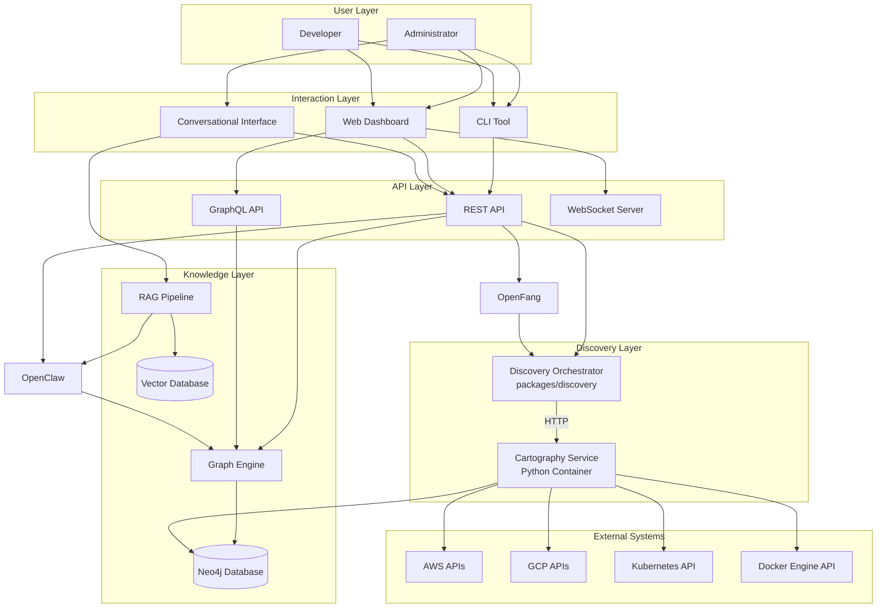
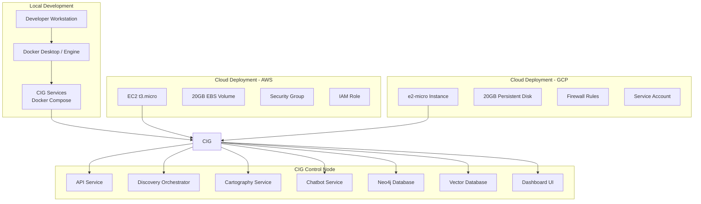
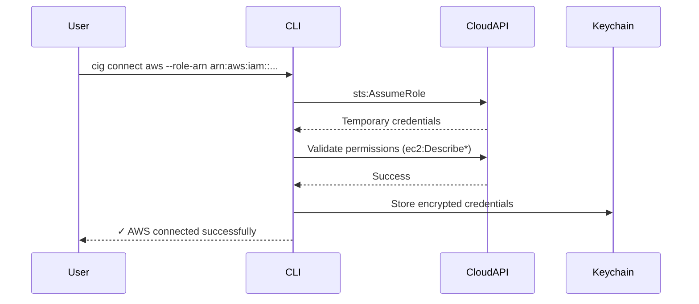
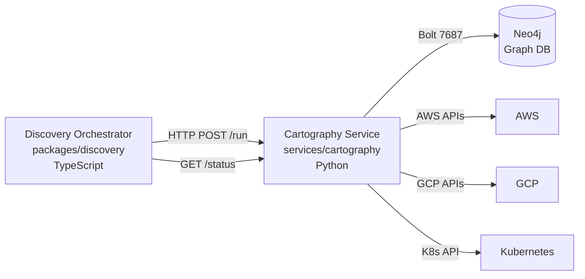
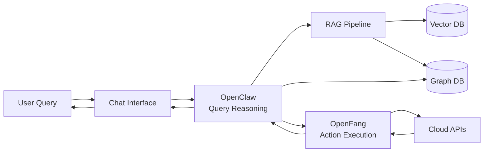
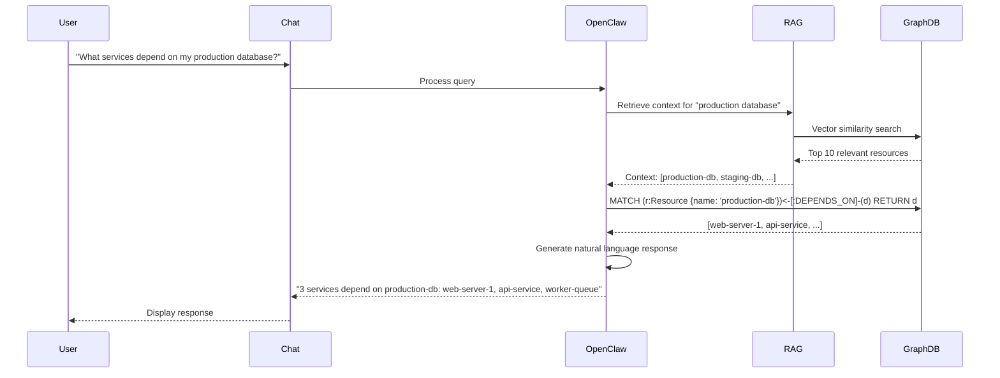
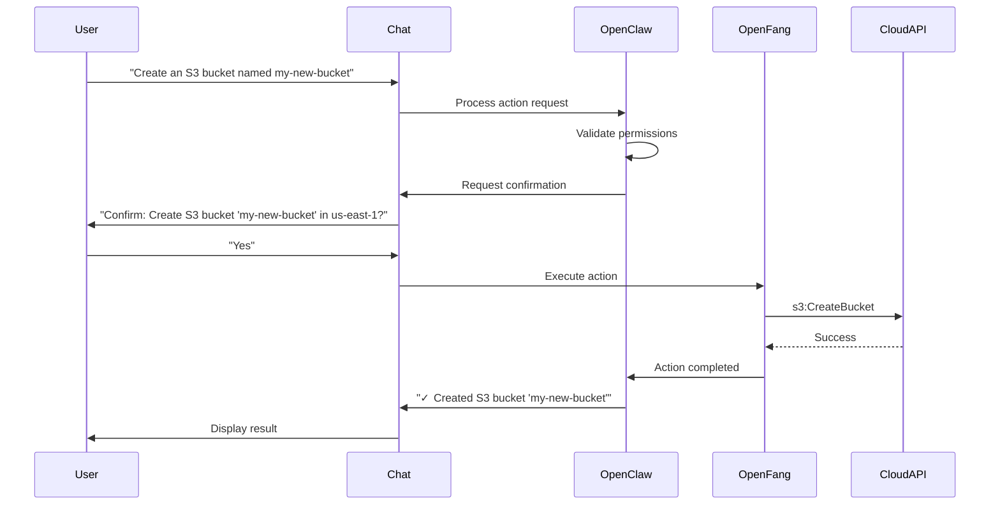
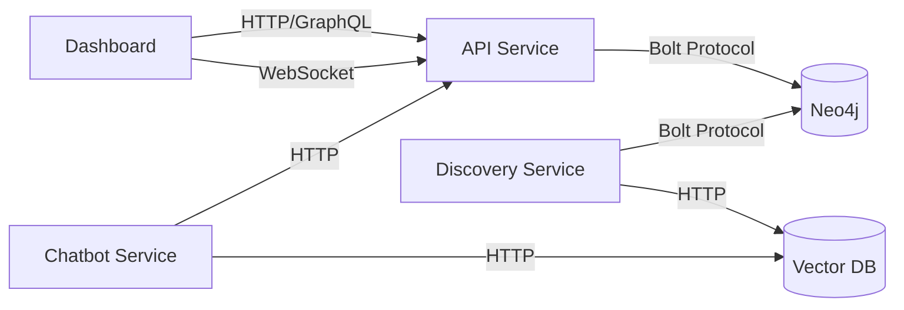
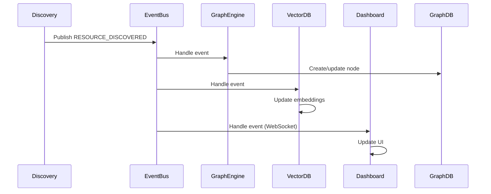

# Design Document: CIG (Compute Intelligence Graph)

## Overview

CIG (Compute Intelligence Graph) is an open-source, self-hosted infrastructure intelligence platform that automatically discovers cloud and local infrastructure, constructs a comprehensive dependency graph, and provides both visual and conversational interfaces for infrastructure exploration and management.

### Core Principles

- **Self-Hosted**: Runs entirely within the user's infrastructure for security and compliance
- **Multi-Cloud**: Unified support for AWS, GCP, Kubernetes, and Docker
- **Local-First**: Seamless development experience on Linux, macOS, and Windows
- **Graph-Native**: Infrastructure represented as a property graph with typed nodes and relationships
- **Conversational**: Natural language interface powered by LLM and RAG pipeline
- **Security-First**: Least-privilege access, credential encryption, container hardening

### System Capabilities

1. **Infrastructure Discovery**: Automatic detection of cloud resources (AWS, GCP), Kubernetes workloads, and Docker containers
2. **Dependency Mapping**: Intelligent relationship detection across compute, storage, network, and database resources
3. **Graph Storage**: Neo4j-based property graph for efficient traversal and querying
4. **Visual Dashboard**: Next.js web interface with interactive graph visualization
5. **Conversational Interface**: LLM-powered chatbot with RAG pipeline for natural language queries
6. **Infrastructure Actions**: Controlled execution of infrastructure operations with confirmation workflows
7. **Cost Analysis**: Resource cost tracking and optimization recommendations
8. **Security Scanning**: Misconfiguration detection and security posture assessment
9. **IaC Export**: Generate Terraform/CloudFormation from discovered infrastructure


## Architecture

### High-Level Architecture




### Deployment Architecture



### Monorepo Structure

```
cig/
├── apps/
│   ├── landing/              # Next.js landing page
│   ├── dashboard/            # Next.js dashboard UI
│   └── wizard-ui/            # Installation wizard UI
├── packages/
│   ├── cli/                  # CLI tool (cig command)
│   ├── iac/                  # Infrastructure provisioning
│   ├── discovery/            # Orchestration only (no cloud SDK calls)
│   ├── graph/                # Graph engine and queries
│   ├── api/                  # REST and GraphQL APIs
│   ├── chatbot/              # Conversational interface
│   ├── agents/               # OpenClaw and OpenFang
│   ├── config/               # Configuration management
│   └── sdk/                  # TypeScript and Python SDKs
├── services/
│   └── cartography/          # Python Cartography microservice
├── infra/
│   ├── terraform/            # Terraform modules
│   └── docker/               # Dockerfiles and compose
├── docs/                     # Documentation
├── pnpm-workspace.yaml       # pnpm workspace config
├── turbo.json                # TurboRepo config
└── package.json              # Root package.json
```


## Components and Interfaces

### 1. CLI Tool (`packages/cli`)

**Technology**: Node.js with Commander.js

**Commands**:
- `cig install` - Launch installation wizard
- `cig connect aws --role-arn <arn>` - Configure AWS credentials
- `cig connect gcp --service-account <path>` - Configure GCP credentials
- `cig deploy --target <local|aws|gcp>` - Provision infrastructure
- `cig start` - Start CIG services
- `cig stop` - Stop CIG services
- `cig status` - Show service status
- `cig seed --scenario <small|medium|large>` - Seed test data
- `cig reset` - Clear all local data

**Configuration Storage**:
- Location: `~/.cig/config.json` (encrypted)
- Encryption: AES-256-GCM with key stored in OS keychain
- Permissions: 0600 (owner read/write only)

**Credential Validation Flow**:


### 2. Installation Wizard (`packages/cli` + `apps/wizard-ui`)

**Flow**:
1. Detect host OS (Linux, macOS, Windows)
2. Verify Docker installation
3. Prompt for deployment target (local, AWS, GCP, hybrid)
4. Collect cloud credentials (if cloud deployment)
5. Validate permissions
6. Provision infrastructure (Terraform)
7. Deploy CIG services (Docker Compose)
8. Initialize graph database
9. Trigger initial discovery
10. Display dashboard URL

**Terraform Modules** (`packages/iac`):
- `aws-minimal`: t3.micro + 20GB EBS + security group + IAM role
- `gcp-minimal`: e2-micro + 20GB PD + firewall + service account
- `local`: Docker Compose configuration


### 3. Cartography Discovery Service (`services/cartography`)

**Technology**: Python 3.11, Cartography (lyft/cartography), Docker container

**What Cartography provides out of the box:**
- AWS: EC2, RDS, S3, Lambda, VPC, IAM, EKS, ECS, Route53, CloudFront, SQS, SNS, DynamoDB, ElasticSearch, Redshift, and 50+ more resource types
- GCP: Compute Engine, Cloud SQL, GCS, Cloud Functions, GKE, IAM, DNS, and more
- Kubernetes: Pods, Services, Deployments, Namespaces, Ingresses, PersistentVolumes
- GitHub, Okta, Duo, PagerDuty, and other integrations

**Why Cartography instead of custom agents:**
- Battle-tested at Lyft scale (millions of resources)
- Automatic relationship detection built-in
- Writes directly to Neo4j using the same graph schema
- No custom normalization code needed
- Community-maintained with regular updates for new AWS services
- Supports all required providers natively

**Container Architecture:**


**Cartography Service API (FastAPI wrapper):**
```
POST /run          # Trigger a discovery run
GET  /status       # Get current run status
GET  /health       # Health check
GET  /runs         # List recent runs
```

**services/cartography/ structure:**
```
services/cartography/
├── Dockerfile
├── requirements.txt
├── app/
│   ├── main.py               # FastAPI wrapper
│   ├── runner.py             # Cartography subprocess runner
│   └── config.py             # Config from env vars
└── tests/
    └── test_runner.py
```

**Environment variables:**
```bash
NEO4J_URI=bolt://neo4j:7687
NEO4J_USER=neo4j
NEO4J_PASSWORD=cigpassword
AWS_ROLE_ARN=arn:aws:iam::123456789:role/CIGDiscovery
AWS_REGIONS=us-east-1,us-west-2
GCP_PROJECT_ID=my-project
GCP_SERVICE_ACCOUNT_PATH=/secrets/gcp-sa.json
DISCOVERY_INTERVAL_MINUTES=5
```

**packages/discovery role (TypeScript orchestrator):**
The TypeScript `packages/discovery` package becomes a thin orchestration layer that:
- Schedules discovery runs (calls Cartography service HTTP API)
- Tracks job status and history
- Emits WebSocket events on completion
- Handles credential injection to Cartography
- Does NOT implement any cloud API calls itself


### 4. Graph Engine (`packages/graph`)

**Technology**: Neo4j 5.x with Node.js driver

**Graph Schema**:

**Node Labels**:
- `Resource`: Base label for all infrastructure resources
- `Compute`: EC2, GCE, Pod, Container
- `Storage`: S3, GCS, Volume, PersistentVolume
- `Network`: VPC, Subnet, SecurityGroup, Service, Ingress
- `Database`: RDS, CloudSQL
- `Function`: Lambda, CloudFunction
- `Identity`: IAM Role, Service Account

**Node Properties**:
```cypher
CREATE CONSTRAINT resource_id IF NOT EXISTS
FOR (r:Resource) REQUIRE r.id IS UNIQUE;

CREATE INDEX resource_type IF NOT EXISTS
FOR (r:Resource) ON (r.type);

CREATE INDEX resource_provider IF NOT EXISTS
FOR (r:Resource) ON (r.provider);

CREATE INDEX resource_state IF NOT EXISTS
FOR (r:Resource) ON (r.state);
```

**Relationship Types**:
- `DEPENDS_ON`: Service dependency (e.g., EC2 → RDS)
- `CONNECTS_TO`: Network connectivity (e.g., Service → Pod)
- `USES`: Resource usage (e.g., Lambda → S3)
- `MEMBER_OF`: Group membership (e.g., EC2 → VPC)
- `HAS_PERMISSION`: IAM relationship (e.g., Role → Resource)
- `MOUNTS`: Volume attachment (e.g., Container → Volume)
- `ROUTES_TO`: Traffic routing (e.g., Ingress → Service)

**Example Graph Structure**:
```cypher
// Create resources
CREATE (ec2:Resource:Compute {
  id: 'i-1234567890abcdef0',
  name: 'web-server-1',
  type: 'compute',
  provider: 'aws',
  region: 'us-east-1',
  state: 'running',
  tags: {Environment: 'production', Team: 'platform'}
})

CREATE (rds:Resource:Database {
  id: 'mydb-instance',
  name: 'production-db',
  type: 'database',
  provider: 'aws',
  region: 'us-east-1',
  state: 'active'
})

CREATE (s3:Resource:Storage {
  id: 'my-app-bucket',
  name: 'my-app-bucket',
  type: 'storage',
  provider: 'aws',
  region: 'us-east-1',
  state: 'active'
})

// Create relationships
CREATE (ec2)-[:DEPENDS_ON {type: 'database_connection'}]->(rds)
CREATE (ec2)-[:USES {type: 'read_write'}]->(s3)
```

**Query Interface**:

```typescript
interface GraphEngine {
  // Resource queries
  getResource(id: string): Promise<Resource_Model>;
  listResources(filters: ResourceFilters): Promise<Resource_Model[]>;
  searchResources(query: string): Promise<Resource_Model[]>;
  
  // Relationship queries
  getDependencies(resourceId: string, depth?: number): Promise<Resource_Model[]>;
  getDependents(resourceId: string, depth?: number): Promise<Resource_Model[]>;
  getRelationships(resourceId: string): Promise<Relationship[]>;
  
  // Graph traversal
  findPath(fromId: string, toId: string): Promise<Path>;
  findUnusedResources(): Promise<Resource_Model[]>;
  findCircularDependencies(): Promise<Cycle[]>;
  
  // Aggregations
  getResourceCounts(): Promise<ResourceCounts>;
  getResourcesByType(type: ResourceType): Promise<Resource_Model[]>;
  getResourcesByProvider(provider: Provider): Promise<Resource_Model[]>;
  getResourcesByRegion(region: string): Promise<Resource_Model[]>;
  getResourcesByTag(key: string, value: string): Promise<Resource_Model[]>;
  
  // Mutations
  createResource(resource: Resource_Model): Promise<void>;
  updateResource(id: string, updates: Partial<Resource_Model>): Promise<void>;
  deleteResource(id: string): Promise<void>;
  createRelationship(from: string, to: string, type: string): Promise<void>;
}
```


### 5. API Service (`packages/api`)

**Technology**: Node.js with Fastify, GraphQL Yoga

**REST API Endpoints**:

```
GET    /api/v1/resources                    # List all resources
GET    /api/v1/resources/:id                # Get resource by ID
GET    /api/v1/resources/:id/dependencies   # Get resource dependencies
GET    /api/v1/resources/:id/dependents     # Get resources that depend on this
GET    /api/v1/resources/search?q=:query    # Search resources
GET    /api/v1/discovery/status             # Get discovery status
POST   /api/v1/discovery/trigger            # Manually trigger discovery
POST   /api/v1/graph/query                  # Execute custom Cypher query
GET    /api/v1/costs                        # Get cost summary
GET    /api/v1/costs/breakdown              # Get cost breakdown
GET    /api/v1/security/findings            # Get security findings
GET    /api/v1/security/score               # Get security score
POST   /api/v1/actions/execute              # Execute infrastructure action
GET    /api/v1/health                       # Health check
```

**GraphQL Schema**:

```graphql
type Resource {
  id: ID!
  name: String!
  type: ResourceType!
  provider: Provider!
  region: String
  zone: String
  state: ResourceState!
  tags: [Tag!]!
  metadata: JSON
  cost: Float
  createdAt: DateTime!
  updatedAt: DateTime!
  discoveredAt: DateTime!
  dependencies(depth: Int = 1): [Resource!]!
  dependents(depth: Int = 1): [Resource!]!
  relationships: [Relationship!]!
}

type Relationship {
  id: ID!
  from: Resource!
  to: Resource!
  type: RelationshipType!
  metadata: JSON
}

type Tag {
  key: String!
  value: String!
}

enum ResourceType {
  COMPUTE
  STORAGE
  NETWORK
  DATABASE
  SERVICE
  FUNCTION
  CONTAINER
  VOLUME
}

enum Provider {
  AWS
  GCP
  KUBERNETES
  DOCKER
}

enum ResourceState {
  RUNNING
  STOPPED
  TERMINATED
  ACTIVE
  INACTIVE
  PENDING
  FAILED
}

enum RelationshipType {
  DEPENDS_ON
  CONNECTS_TO
  USES
  MEMBER_OF
  HAS_PERMISSION
  MOUNTS
  ROUTES_TO
}

type Query {
  resource(id: ID!): Resource
  resources(
    type: ResourceType
    provider: Provider
    region: String
    state: ResourceState
    tags: [TagInput!]
    limit: Int = 100
    offset: Int = 0
  ): ResourceConnection!
  searchResources(query: String!): [Resource!]!
  unusedResources: [Resource!]!
  circularDependencies: [Cycle!]!
  resourceCounts: ResourceCounts!
  discoveryStatus: DiscoveryStatus!
  costSummary: CostSummary!
  securityFindings: [SecurityFinding!]!
  securityScore: SecurityScore!
}

type Mutation {
  triggerDiscovery: DiscoveryJob!
  executeAction(input: ActionInput!): ActionResult!
}

type Subscription {
  resourceUpdated: Resource!
  discoveryProgress: DiscoveryProgress!
}

type ResourceConnection {
  edges: [ResourceEdge!]!
  pageInfo: PageInfo!
  totalCount: Int!
}

type ResourceEdge {
  node: Resource!
  cursor: String!
}

type PageInfo {
  hasNextPage: Boolean!
  hasPreviousPage: Boolean!
  startCursor: String
  endCursor: String
}

input TagInput {
  key: String!
  value: String!
}

input ActionInput {
  type: ActionType!
  resourceId: ID
  parameters: JSON
}

enum ActionType {
  CREATE_S3_BUCKET
  START_EC2_INSTANCE
  STOP_EC2_INSTANCE
}

type ActionResult {
  success: Boolean!
  message: String
  resourceId: ID
}
```

**Authentication**:
- API Keys: `X-API-Key` header
- JWT Tokens: `Authorization: Bearer <token>` header
- Rate Limiting: 100 requests/minute per client


### 6. Dashboard (`apps/dashboard`)

**Technology**: Next.js 14 (App Router), React 18, TailwindCSS, Recharts, React Flow

**Pages**:
- `/` - Overview dashboard with metrics
- `/resources` - Resource list view with filters
- `/graph` - Interactive graph visualization
- `/costs` - Cost analysis and breakdown
- `/security` - Security findings and score
- `/settings` - Configuration and credentials

**Graph Visualization**:
- Library: React Flow
- Layout: Force-directed graph (D3-force)
- Node colors: By resource type
- Node sizes: By cost or connection count
- Edge styles: By relationship type
- Interactions: Click to select, drag to pan, scroll to zoom
- Details panel: Shows resource metadata on selection

**Real-time Updates**:
- WebSocket connection for live updates
- Optimistic UI updates
- Automatic refresh on discovery completion

### 7. Conversational Interface (`packages/chatbot`)

**Technology**: Node.js, LangChain, OpenAI API / Local LLM

**Architecture**:


**RAG Pipeline**:

1. **Embedding Generation**:
   - Model: OpenAI text-embedding-3-small or local sentence-transformers
   - Embedded content: Resource metadata, tags, relationships
   - Update frequency: On every discovery cycle

2. **Vector Database**:
   - Technology: Chroma or FAISS
   - Index: HNSW for fast similarity search
   - Retrieval: Top-k=10 most relevant resources

3. **Context Assembly**:
   - Retrieved resources + relationships
   - Recent conversation history (last 5 turns)
   - System prompt with infrastructure context

4. **LLM Inference**:
   - Model: GPT-4 or local Llama 3
   - Temperature: 0.3 (deterministic)
   - Max tokens: 1000
   - Streaming: Yes

**Query Interpretation Flow**:


**Action Execution Flow**:


**Supported Query Types**:
- Resource lookup: "Show me all EC2 instances"
- Dependency queries: "What depends on this database?"
- Cost queries: "What are my most expensive resources?"
- Security queries: "What security issues do I have?"
- Filtering: "Show resources in us-east-1 with tag Environment=production"
- Actions: "Start instance i-1234567890abcdef0"


### 8. Agents (`packages/agents`)

**OpenClaw (Query Reasoning Agent)**:
- Interprets natural language queries
- Translates to Cypher queries
- Manages conversation context
- Generates natural language responses
- Validates action requests

**OpenFang (Action Execution Agent)**:
- Executes infrastructure actions
- Validates permissions before execution
- Implements confirmation workflows
- Logs all actions for audit
- Prevents destructive actions without explicit confirmation

**Supported Actions**:
- `CREATE_S3_BUCKET`: Create new S3 bucket
- `START_EC2_INSTANCE`: Start stopped EC2 instance
- `STOP_EC2_INSTANCE`: Stop running EC2 instance

### 9. Configuration Management (`packages/config`)

**Configuration Schema**:

```typescript
interface CIGConfig {
  deployment: {
    target: 'local' | 'aws' | 'gcp' | 'hybrid';
    region?: string;
    zone?: string;
  };
  
  discovery: {
    interval: number;              // Minutes between discovery runs (default: 5)
    enabled: boolean;              // Enable/disable automatic discovery
    providers: {
      aws: {
        enabled: boolean;
        roleArn?: string;
        regions: string[];
      };
      gcp: {
        enabled: boolean;
        projectId?: string;
        serviceAccountPath?: string;
        regions: string[];
      };
      kubernetes: {
        enabled: boolean;
        kubeconfig?: string;
        contexts: string[];
      };
      docker: {
        enabled: boolean;
        socketPath: string;        // Default: /var/run/docker.sock
      };
    };
  };
  
  cartography: {
    serviceUrl: string;            // Default: http://cartography:8001
    intervalMinutes: number;       // Default: 5
    aws: {
      enabled: boolean;
      roleArn?: string;
      regions: string[];
    };
    gcp: {
      enabled: boolean;
      projectId?: string;
      serviceAccountPath?: string;
    };
    kubernetes: {
      enabled: boolean;
      kubeconfig?: string;
    };
  };
  
  graph: {
    uri: string;                   // Neo4j connection URI
    username: string;
    password: string;
    database: string;              // Default: neo4j
  };
  
  vector: {
    provider: 'chroma' | 'faiss';
    path: string;                  // Storage path for vector index
  };
  
  llm: {
    provider: 'openai' | 'local' | 'custom';
    apiKey?: string;
    endpoint?: string;
    model: string;                 // Default: gpt-4
    temperature: number;           // Default: 0.3
    maxTokens: number;             // Default: 1000
  };
  
  api: {
    port: number;                  // Default: 8080
    host: string;                  // Default: 0.0.0.0
    cors: {
      enabled: boolean;
      origins: string[];
    };
    rateLimit: {
      enabled: boolean;
      requestsPerMinute: number;   // Default: 100
    };
  };
  
  dashboard: {
    port: number;                  // Default: 3000
    host: string;                  // Default: 0.0.0.0
  };
  
  security: {
    encryptionKey: string;         // AES-256 key for credential encryption
    tlsEnabled: boolean;
    certPath?: string;
    keyPath?: string;
  };
  
  logging: {
    level: 'debug' | 'info' | 'warn' | 'error';
    format: 'json' | 'text';
    destination: 'stdout' | 'file';
    filePath?: string;
  };
  
  observability: {
    metricsEnabled: boolean;
    prometheusPort?: number;
    tracingEnabled: boolean;
    jaegerEndpoint?: string;
  };
}
```

**Configuration Sources** (priority order):
1. Command-line arguments
2. Environment variables (prefixed with `CIG_`)
3. Configuration file (`~/.cig/config.yaml` or `/etc/cig/config.yaml`)
4. Default values

**Environment Variable Mapping**:
```bash
CIG_DEPLOYMENT_TARGET=local
CIG_DISCOVERY_INTERVAL=5
CIG_GRAPH_URI=bolt://localhost:7687
CIG_LLM_PROVIDER=openai
CIG_LLM_API_KEY=sk-...
CIG_API_PORT=8080
CIG_DASHBOARD_PORT=3000
```


### 10. SDK (`packages/sdk`)

**TypeScript SDK**:

```typescript
import { CIGClient } from '@cig/sdk';

const client = new CIGClient({
  apiUrl: 'http://localhost:8080',
  apiKey: 'your-api-key'
});

// Query resources
const resources = await client.resources.list({
  type: 'compute',
  provider: 'aws',
  region: 'us-east-1'
});

// Get dependencies
const deps = await client.resources.getDependencies('i-1234567890abcdef0');

// Execute custom query
const result = await client.graph.query(`
  MATCH (r:Resource {type: 'compute'})-[:DEPENDS_ON]->(d:Database)
  RETURN r, d
`);

// Subscribe to updates
client.resources.subscribe((resource) => {
  console.log('Resource updated:', resource);
});

// Register custom discovery agent
client.discovery.registerAgent({
  name: 'custom-provider',
  discover: async () => {
    // Custom discovery logic
    return resources;
  }
});
```

**Python SDK**:

```python
from cig_sdk import CIGClient

client = CIGClient(
    api_url='http://localhost:8080',
    api_key='your-api-key'
)

# Query resources
resources = client.resources.list(
    type='compute',
    provider='aws',
    region='us-east-1'
)

# Get dependencies
deps = client.resources.get_dependencies('i-1234567890abcdef0')

# Execute custom query
result = client.graph.query("""
    MATCH (r:Resource {type: 'compute'})-[:DEPENDS_ON]->(d:Database)
    RETURN r, d
""")

# Register custom chatbot command
@client.chatbot.command('cost-report')
def cost_report(args):
    # Custom command logic
    return f"Total cost: ${total}"
```


## Data Models

### Resource Model

```typescript
interface Resource_Model {
  // Core identifiers
  id: string;                    // Unique identifier (cloud provider ID)
  name: string;                  // Human-readable name
  arn?: string;                  // AWS ARN (if applicable)
  
  // Classification
  type: ResourceType;            // compute, storage, network, database, service, function, container, volume
  provider: Provider;            // aws, gcp, kubernetes, docker
  platform: string;              // Specific platform (ec2, gce, eks, gke, docker)
  
  // Location
  region?: string;               // Cloud region (us-east-1, us-central1)
  zone?: string;                 // Availability zone
  cluster?: string;              // Kubernetes cluster name
  namespace?: string;            // Kubernetes namespace
  
  // State
  state: ResourceState;          // running, stopped, terminated, active, inactive, pending, failed
  health?: HealthStatus;         // healthy, unhealthy, degraded, unknown
  
  // Metadata
  tags: Record<string, string>;  // Resource tags/labels
  metadata: Record<string, any>; // Provider-specific metadata
  
  // Cost
  cost?: {
    monthly: number;             // Estimated monthly cost (USD)
    currency: string;            // Currency code (USD, EUR, etc.)
    lastUpdated: Date;
  };
  
  // Security
  publiclyAccessible?: boolean;
  encryptionEnabled?: boolean;
  securityFindings?: SecurityFinding[];
  
  // Timestamps
  createdAt: Date;               // Resource creation time
  updatedAt: Date;               // Last update time
  discoveredAt: Date;            // Last discovery time
  lastSeenAt: Date;              // Last time resource was seen
}

interface SecurityFinding {
  id: string;
  severity: 'critical' | 'high' | 'medium' | 'low';
  title: string;
  description: string;
  remediation: string;
  detectedAt: Date;
}
```

### Relationship Model

```typescript
interface Relationship {
  id: string;
  type: RelationshipType;
  from: string;                  // Source resource ID
  to: string;                    // Target resource ID
  metadata: {
    protocol?: string;           // Network protocol (TCP, HTTP, etc.)
    port?: number;               // Network port
    permission?: string;         // IAM permission
    mountPath?: string;          // Volume mount path
    [key: string]: any;
  };
  createdAt: Date;
  updatedAt: Date;
}

enum RelationshipType {
  DEPENDS_ON = 'DEPENDS_ON',           // Service dependency
  CONNECTS_TO = 'CONNECTS_TO',         // Network connectivity
  USES = 'USES',                       // Resource usage
  MEMBER_OF = 'MEMBER_OF',             // Group membership
  HAS_PERMISSION = 'HAS_PERMISSION',   // IAM relationship
  MOUNTS = 'MOUNTS',                   // Volume attachment
  ROUTES_TO = 'ROUTES_TO',             // Traffic routing
  EXPOSES = 'EXPOSES',                 // Service exposure
  MANAGES = 'MANAGES'                  // Management relationship
}
```

### Discovery Event Model

```typescript
interface DiscoveryEvent {
  id: string;
  type: 'resource_created' | 'resource_updated' | 'resource_deleted' | 'relationship_created' | 'relationship_deleted';
  provider: Provider;
  resourceId: string;
  resource?: Resource_Model;
  relationship?: Relationship;
  timestamp: Date;
}

interface DiscoveryJob {
  id: string;
  status: 'pending' | 'running' | 'completed' | 'failed';
  provider: Provider;
  startedAt: Date;
  completedAt?: Date;
  resourcesDiscovered: number;
  relationshipsCreated: number;
  errors: DiscoveryError[];
}

interface DiscoveryError {
  provider: Provider;
  resourceType: string;
  error: string;
  timestamp: Date;
}
```

### Cost Model

```typescript
interface CostSummary {
  total: number;
  currency: string;
  period: {
    start: Date;
    end: Date;
  };
  breakdown: {
    byProvider: Record<Provider, number>;
    byType: Record<ResourceType, number>;
    byRegion: Record<string, number>;
    byTag: Record<string, number>;
  };
  topResources: Array<{
    resourceId: string;
    name: string;
    cost: number;
  }>;
  trend: Array<{
    date: Date;
    cost: number;
  }>;
}
```

### Security Model

```typescript
interface SecurityScore {
  score: number;                 // 0-100
  grade: 'A' | 'B' | 'C' | 'D' | 'F';
  findings: {
    critical: number;
    high: number;
    medium: number;
    low: number;
  };
  categories: {
    publicAccess: number;
    encryption: number;
    iam: number;
    network: number;
  };
  lastUpdated: Date;
}

interface SecurityFinding {
  id: string;
  severity: 'critical' | 'high' | 'medium' | 'low';
  category: 'public_access' | 'encryption' | 'iam' | 'network' | 'compliance';
  title: string;
  description: string;
  resourceId: string;
  resourceName: string;
  remediation: string;
  detectedAt: Date;
  status: 'open' | 'acknowledged' | 'resolved' | 'false_positive';
}
```


## Database Schema

### Neo4j Graph Schema

**Node Labels and Properties**:

```cypher
// Base Resource node
CREATE CONSTRAINT resource_id IF NOT EXISTS
FOR (r:Resource) REQUIRE r.id IS UNIQUE;

// Indexes for efficient querying
CREATE INDEX resource_type IF NOT EXISTS
FOR (r:Resource) ON (r.type);

CREATE INDEX resource_provider IF NOT EXISTS
FOR (r:Resource) ON (r.provider);

CREATE INDEX resource_state IF NOT EXISTS
FOR (r:Resource) ON (r.state);

CREATE INDEX resource_region IF NOT EXISTS
FOR (r:Resource) ON (r.region);

CREATE INDEX resource_name IF NOT EXISTS
FOR (r:Resource) ON (r.name);

CREATE FULLTEXT INDEX resource_search IF NOT EXISTS
FOR (r:Resource) ON EACH [r.name, r.id];

// Composite indexes for common queries
CREATE INDEX resource_provider_type IF NOT EXISTS
FOR (r:Resource) ON (r.provider, r.type);

CREATE INDEX resource_provider_region IF NOT EXISTS
FOR (r:Resource) ON (r.provider, r.region);
```

**Example Queries**:

```cypher
// Find all dependencies of a resource (1 level)
MATCH (r:Resource {id: $resourceId})-[:DEPENDS_ON]->(dep)
RETURN dep;

// Find all dependencies (up to 3 levels)
MATCH path = (r:Resource {id: $resourceId})-[:DEPENDS_ON*1..3]->(dep)
RETURN dep, path;

// Find all resources that depend on a resource
MATCH (dependent)-[:DEPENDS_ON]->(r:Resource {id: $resourceId})
RETURN dependent;

// Find unused resources (no incoming dependencies)
MATCH (r:Resource)
WHERE NOT (r)<-[:DEPENDS_ON]-()
AND r.type IN ['storage', 'database']
RETURN r;

// Find circular dependencies
MATCH path = (r:Resource)-[:DEPENDS_ON*]->(r)
RETURN path;

// Find resources by tag
MATCH (r:Resource)
WHERE r.tags.Environment = $environment
RETURN r;

// Find all resources in a VPC
MATCH (r:Resource)-[:MEMBER_OF]->(vpc:Resource {type: 'network'})
WHERE vpc.id = $vpcId
RETURN r;

// Find path between two resources
MATCH path = shortestPath(
  (from:Resource {id: $fromId})-[*]-(to:Resource {id: $toId})
)
RETURN path;

// Get resource counts by type
MATCH (r:Resource)
RETURN r.type AS type, count(r) AS count
ORDER BY count DESC;

// Get most connected resources
MATCH (r:Resource)
RETURN r, size((r)--()) AS connections
ORDER BY connections DESC
LIMIT 10;
```

### Vector Database Schema (Chroma)

**Collection Structure**:

```python
# Resource embeddings collection
collection = client.create_collection(
    name="infrastructure_resources",
    metadata={
        "description": "Infrastructure resource embeddings for RAG",
        "embedding_model": "text-embedding-3-small"
    }
)

# Document structure
{
    "id": "i-1234567890abcdef0",
    "embedding": [0.123, -0.456, ...],  # 1536-dimensional vector
    "metadata": {
        "name": "web-server-1",
        "type": "compute",
        "provider": "aws",
        "region": "us-east-1",
        "state": "running",
        "tags": {"Environment": "production", "Team": "platform"},
        "description": "EC2 instance web-server-1 in us-east-1, running, tagged Environment=production Team=platform"
    },
    "document": "EC2 instance named web-server-1 in AWS us-east-1 region. Current state: running. Tags: Environment=production, Team=platform. Depends on: production-db (RDS), my-app-bucket (S3)."
}
```

**Embedding Strategy**:

Each resource is embedded as a text document containing:
1. Resource type and name
2. Provider and location
3. Current state
4. Tags and metadata
5. Direct dependencies (1 level)

This allows semantic search like:
- "production database" → finds resources with tag Environment=production and type=database
- "web servers in us-east-1" → finds compute resources in us-east-1 region
- "storage buckets for the platform team" → finds storage resources with Team=platform tag


## Deployment Architecture

### Local Development (Docker Compose)

**docker-compose.yml**:

```yaml
version: '3.9'

services:
  neo4j:
    image: neo4j:5.15-community
    container_name: cig-neo4j
    ports:
      - "7474:7474"  # HTTP
      - "7687:7687"  # Bolt
    environment:
      NEO4J_AUTH: neo4j/password
      NEO4J_PLUGINS: '["apoc"]'
      NEO4J_dbms_memory_heap_max__size: 2G
    volumes:
      - neo4j-data:/data
      - neo4j-logs:/logs
    healthcheck:
      test: ["CMD", "cypher-shell", "-u", "neo4j", "-p", "password", "RETURN 1"]
      interval: 10s
      timeout: 5s
      retries: 5
    restart: unless-stopped
    security_opt:
      - no-new-privileges:true
    read_only: false
    user: "7474:7474"

  vector-db:
    image: chromadb/chroma:0.4.22
    container_name: cig-vector-db
    ports:
      - "8000:8000"
    volumes:
      - chroma-data:/chroma/chroma
    environment:
      CHROMA_SERVER_AUTH_CREDENTIALS: "admin:password"
    healthcheck:
      test: ["CMD", "curl", "-f", "http://localhost:8000/api/v1/heartbeat"]
      interval: 10s
      timeout: 5s
      retries: 5
    restart: unless-stopped
    security_opt:
      - no-new-privileges:true

  api:
    build:
      context: .
      dockerfile: packages/api/Dockerfile
    container_name: cig-api
    ports:
      - "8080:8080"
    environment:
      NODE_ENV: production
      CIG_GRAPH_URI: bolt://neo4j:7687
      CIG_GRAPH_USERNAME: neo4j
      CIG_GRAPH_PASSWORD: password
      CIG_VECTOR_URI: http://vector-db:8000
      CIG_API_PORT: 8080
    depends_on:
      neo4j:
        condition: service_healthy
      vector-db:
        condition: service_healthy
    healthcheck:
      test: ["CMD", "curl", "-f", "http://localhost:8080/api/v1/health"]
      interval: 10s
      timeout: 5s
      retries: 5
    restart: unless-stopped
    security_opt:
      - no-new-privileges:true
    read_only: true
    tmpfs:
      - /tmp
    user: "node"

  discovery:
    build:
      context: .
      dockerfile: packages/discovery/Dockerfile
    container_name: cig-discovery
    environment:
      NODE_ENV: production
      CIG_GRAPH_URI: bolt://neo4j:7687
      CIG_GRAPH_USERNAME: neo4j
      CIG_GRAPH_PASSWORD: password
      CIG_DISCOVERY_INTERVAL: 5
      DOCKER_HOST: unix:///var/run/docker.sock
    volumes:
      - /var/run/docker.sock:/var/run/docker.sock:ro
      - ~/.aws:/home/node/.aws:ro
      - ~/.config/gcloud:/home/node/.config/gcloud:ro
    depends_on:
      neo4j:
        condition: service_healthy
      api:
        condition: service_healthy
    restart: unless-stopped
    security_opt:
      - no-new-privileges:true
    user: "node"

  chatbot:
    build:
      context: .
      dockerfile: packages/chatbot/Dockerfile
    container_name: cig-chatbot
    environment:
      NODE_ENV: production
      CIG_API_URI: http://api:8080
      CIG_VECTOR_URI: http://vector-db:8000
      CIG_LLM_PROVIDER: openai
      CIG_LLM_API_KEY: ${OPENAI_API_KEY}
      CIG_LLM_MODEL: gpt-4
    depends_on:
      api:
        condition: service_healthy
      vector-db:
        condition: service_healthy
    restart: unless-stopped
    security_opt:
      - no-new-privileges:true
    read_only: true
    tmpfs:
      - /tmp
    user: "node"

  dashboard:
    build:
      context: .
      dockerfile: apps/dashboard/Dockerfile
    container_name: cig-dashboard
    ports:
      - "3000:3000"
    environment:
      NODE_ENV: production
      NEXT_PUBLIC_API_URL: http://localhost:8080
      NEXT_PUBLIC_WS_URL: ws://localhost:8080
    depends_on:
      api:
        condition: service_healthy
    healthcheck:
      test: ["CMD", "curl", "-f", "http://localhost:3000/api/health"]
      interval: 10s
      timeout: 5s
      retries: 5
    restart: unless-stopped
    security_opt:
      - no-new-privileges:true
    read_only: true
    tmpfs:
      - /tmp
      - /app/.next/cache
    user: "node"

volumes:
  neo4j-data:
  neo4j-logs:
  chroma-data:

networks:
  default:
    name: cig-network
    driver: bridge
```

**docker-compose.dev.yml** (Development overrides):

```yaml
version: '3.9'

services:
  api:
    build:
      target: development
    environment:
      NODE_ENV: development
      DEBUG: cig:*
    volumes:
      - ./packages/api:/app/packages/api
      - /app/packages/api/node_modules
    command: npm run dev
    ports:
      - "9229:9229"  # Node.js debugger
    read_only: false
    user: "root"

  discovery:
    build:
      target: development
    environment:
      NODE_ENV: development
      DEBUG: cig:*
    volumes:
      - ./packages/discovery:/app/packages/discovery
      - /app/packages/discovery/node_modules
    command: npm run dev
    read_only: false
    user: "root"

  chatbot:
    build:
      target: development
    environment:
      NODE_ENV: development
      DEBUG: cig:*
    volumes:
      - ./packages/chatbot:/app/packages/chatbot
      - /app/packages/chatbot/node_modules
    command: npm run dev
    read_only: false
    user: "root"

  dashboard:
    build:
      target: development
    environment:
      NODE_ENV: development
    volumes:
      - ./apps/dashboard:/app/apps/dashboard
      - /app/apps/dashboard/node_modules
      - /app/apps/dashboard/.next
    command: npm run dev
    read_only: false
    user: "root"
```


### Cloud Deployment (Terraform)

**AWS Deployment** (`infra/terraform/aws/main.tf`):

```hcl
terraform {
  required_version = ">= 1.0"
  required_providers {
    aws = {
      source  = "hashicorp/aws"
      version = "~> 5.0"
    }
  }
}

provider "aws" {
  region = var.region
}

# IAM Role for CIG
resource "aws_iam_role" "cig_role" {
  name = "cig-discovery-role"

  assume_role_policy = jsonencode({
    Version = "2012-10-17"
    Statement = [{
      Action = "sts:AssumeRole"
      Effect = "Allow"
      Principal = {
        Service = "ec2.amazonaws.com"
      }
    }]
  })

  tags = {
    Name        = "cig-discovery-role"
    ManagedBy   = "cig"
  }
}

# IAM Policy for read-only discovery
resource "aws_iam_role_policy" "cig_discovery_policy" {
  name = "cig-discovery-policy"
  role = aws_iam_role.cig_role.id

  policy = jsonencode({
    Version = "2012-10-17"
    Statement = [
      {
        Effect = "Allow"
        Action = [
          "ec2:Describe*",
          "rds:Describe*",
          "s3:List*",
          "s3:GetBucket*",
          "lambda:List*",
          "lambda:GetFunction",
          "iam:List*",
          "iam:GetRole",
          "iam:GetPolicy",
          "ce:GetCostAndUsage"
        ]
        Resource = "*"
      }
    ]
  })
}

# Instance Profile
resource "aws_iam_instance_profile" "cig_profile" {
  name = "cig-instance-profile"
  role = aws_iam_role.cig_role.name
}

# Security Group
resource "aws_security_group" "cig_sg" {
  name        = "cig-control-node-sg"
  description = "Security group for CIG control node"
  vpc_id      = var.vpc_id

  ingress {
    description = "Dashboard HTTPS"
    from_port   = 443
    to_port     = 443
    protocol    = "tcp"
    cidr_blocks = var.allowed_cidr_blocks
  }

  ingress {
    description = "Dashboard HTTP"
    from_port   = 3000
    to_port     = 3000
    protocol    = "tcp"
    cidr_blocks = var.allowed_cidr_blocks
  }

  ingress {
    description = "API"
    from_port   = 8080
    to_port     = 8080
    protocol    = "tcp"
    cidr_blocks = var.allowed_cidr_blocks
  }

  ingress {
    description = "SSH"
    from_port   = 22
    to_port     = 22
    protocol    = "tcp"
    cidr_blocks = var.allowed_cidr_blocks
  }

  egress {
    description = "All outbound"
    from_port   = 0
    to_port     = 0
    protocol    = "-1"
    cidr_blocks = ["0.0.0.0/0"]
  }

  tags = {
    Name      = "cig-control-node-sg"
    ManagedBy = "cig"
  }
}

# EC2 Instance
resource "aws_instance" "cig_control_node" {
  ami                    = data.aws_ami.ubuntu.id
  instance_type          = "t3.micro"
  iam_instance_profile   = aws_iam_instance_profile.cig_profile.name
  vpc_security_group_ids = [aws_security_group.cig_sg.id]
  subnet_id              = var.subnet_id

  root_block_device {
    volume_size           = 20
    volume_type           = "gp3"
    encrypted             = true
    delete_on_termination = true
  }

  user_data = templatefile("${path.module}/user-data.sh", {
    docker_compose_config = file("${path.module}/../docker/docker-compose.yml")
  })

  tags = {
    Name      = "cig-control-node"
    ManagedBy = "cig"
  }
}

# Data source for Ubuntu AMI
data "aws_ami" "ubuntu" {
  most_recent = true
  owners      = ["099720109477"] # Canonical

  filter {
    name   = "name"
    values = ["ubuntu/images/hvm-ssd/ubuntu-jammy-22.04-amd64-server-*"]
  }

  filter {
    name   = "virtualization-type"
    values = ["hvm"]
  }
}

# Outputs
output "instance_id" {
  value = aws_instance.cig_control_node.id
}

output "public_ip" {
  value = aws_instance.cig_control_node.public_ip
}

output "dashboard_url" {
  value = "http://${aws_instance.cig_control_node.public_ip}:3000"
}
```

**User Data Script** (`infra/terraform/aws/user-data.sh`):

```bash
#!/bin/bash
set -e

# Update system
apt-get update
apt-get upgrade -y

# Install Docker
curl -fsSL https://get.docker.com -o get-docker.sh
sh get-docker.sh
usermod -aG docker ubuntu

# Install Docker Compose
curl -L "https://github.com/docker/compose/releases/latest/download/docker-compose-$(uname -s)-$(uname -m)" -o /usr/local/bin/docker-compose
chmod +x /usr/local/bin/docker-compose

# Create CIG directory
mkdir -p /opt/cig
cd /opt/cig

# Write Docker Compose config
cat > docker-compose.yml <<'EOF'
${docker_compose_config}
EOF

# Start CIG services
docker-compose up -d

# Wait for services to be healthy
sleep 30

# Trigger initial discovery
curl -X POST http://localhost:8080/api/v1/discovery/trigger

echo "CIG installation complete"
```


## Security Architecture

### Authentication and Authorization

**API Authentication**:
- API Keys: Generated per user/application, stored hashed (bcrypt)
- JWT Tokens: Short-lived (1 hour), refresh tokens (7 days)
- OAuth 2.0: Optional integration with identity providers

**Authorization Model**:
```typescript
enum Permission {
  READ_RESOURCES = 'read:resources',
  WRITE_RESOURCES = 'write:resources',
  EXECUTE_ACTIONS = 'execute:actions',
  MANAGE_DISCOVERY = 'manage:discovery',
  ADMIN = 'admin'
}

interface User {
  id: string;
  username: string;
  email: string;
  permissions: Permission[];
  apiKeys: ApiKey[];
}

interface ApiKey {
  id: string;
  name: string;
  keyHash: string;
  permissions: Permission[];
  createdAt: Date;
  expiresAt?: Date;
  lastUsedAt?: Date;
}
```

### Credential Encryption

**Encryption Strategy**:
- Algorithm: AES-256-GCM
- Key derivation: PBKDF2 with 100,000 iterations
- Master key storage: OS keychain (Keychain on macOS, Credential Manager on Windows, Secret Service on Linux)
- Credential rotation: Every 90 days

**Implementation**:
```typescript
import { createCipheriv, createDecipheriv, randomBytes, pbkdf2Sync } from 'crypto';

class CredentialManager {
  private masterKey: Buffer;
  
  constructor() {
    this.masterKey = this.loadOrGenerateMasterKey();
  }
  
  encrypt(plaintext: string): { encrypted: string; iv: string; tag: string } {
    const iv = randomBytes(16);
    const cipher = createCipheriv('aes-256-gcm', this.masterKey, iv);
    
    let encrypted = cipher.update(plaintext, 'utf8', 'hex');
    encrypted += cipher.final('hex');
    
    const tag = cipher.getAuthTag();
    
    return {
      encrypted,
      iv: iv.toString('hex'),
      tag: tag.toString('hex')
    };
  }
  
  decrypt(encrypted: string, iv: string, tag: string): string {
    const decipher = createDecipheriv(
      'aes-256-gcm',
      this.masterKey,
      Buffer.from(iv, 'hex')
    );
    
    decipher.setAuthTag(Buffer.from(tag, 'hex'));
    
    let decrypted = decipher.update(encrypted, 'hex', 'utf8');
    decrypted += decipher.final('utf8');
    
    return decrypted;
  }
  
  private loadOrGenerateMasterKey(): Buffer {
    // Load from OS keychain or generate new
    // Implementation depends on platform
  }
}
```

### Container Security

**Security Hardening**:

1. **Non-root users**: All containers run as non-root (UID 1000)
2. **Read-only filesystems**: Where possible, with tmpfs for writable directories
3. **Dropped capabilities**: Remove all unnecessary Linux capabilities
4. **Security options**: Enable no-new-privileges, seccomp, AppArmor
5. **Network isolation**: Custom bridge network, no host network mode
6. **Secret management**: Docker secrets or environment variables (never in images)
7. **Image scanning**: Trivy or Snyk for vulnerability scanning
8. **Minimal base images**: Alpine Linux or distroless images

**Dockerfile Example** (`packages/api/Dockerfile`):

```dockerfile
# Build stage
FROM node:20-alpine AS builder

WORKDIR /app

# Copy package files
COPY package*.json ./
COPY pnpm-lock.yaml ./

# Install dependencies
RUN npm install -g pnpm && pnpm install --frozen-lockfile

# Copy source
COPY . .

# Build
RUN pnpm build

# Production stage
FROM node:20-alpine AS production

# Create non-root user
RUN addgroup -g 1000 node && \
    adduser -u 1000 -G node -s /bin/sh -D node

WORKDIR /app

# Copy built artifacts
COPY --from=builder --chown=node:node /app/dist ./dist
COPY --from=builder --chown=node:node /app/node_modules ./node_modules
COPY --from=builder --chown=node:node /app/package.json ./

# Switch to non-root user
USER node

# Expose port
EXPOSE 8080

# Health check
HEALTHCHECK --interval=30s --timeout=3s --start-period=5s --retries=3 \
  CMD node -e "require('http').get('http://localhost:8080/api/v1/health', (r) => process.exit(r.statusCode === 200 ? 0 : 1))"

# Start application
CMD ["node", "dist/index.js"]
```

### TLS Configuration

**Certificate Management**:
- Self-signed certificates for local development
- Let's Encrypt for cloud deployments
- Certificate rotation: Every 90 days

**TLS Configuration**:
```typescript
import { readFileSync } from 'fs';
import { createServer } from 'https';

const tlsOptions = {
  key: readFileSync('/etc/cig/tls/key.pem'),
  cert: readFileSync('/etc/cig/tls/cert.pem'),
  minVersion: 'TLSv1.3',
  ciphers: [
    'TLS_AES_256_GCM_SHA384',
    'TLS_CHACHA20_POLY1305_SHA256',
    'TLS_AES_128_GCM_SHA256'
  ].join(':')
};

const server = createServer(tlsOptions, app);
```

### Security Scanning

**Misconfiguration Detection Rules**:

```typescript
interface SecurityRule {
  id: string;
  severity: 'critical' | 'high' | 'medium' | 'low';
  check: (resource: Resource_Model) => boolean;
  title: string;
  description: string;
  remediation: string;
}

const securityRules: SecurityRule[] = [
  {
    id: 'S3_PUBLIC_READ',
    severity: 'critical',
    check: (r) => r.type === 'storage' && r.provider === 'aws' && r.metadata.publicRead === true,
    title: 'S3 bucket allows public read access',
    description: 'The S3 bucket is configured to allow public read access, which may expose sensitive data.',
    remediation: 'Remove public read ACL and use bucket policies with specific principals.'
  },
  {
    id: 'EC2_UNRESTRICTED_SSH',
    severity: 'high',
    check: (r) => {
      if (r.type !== 'compute' || r.provider !== 'aws') return false;
      const sg = r.metadata.securityGroups || [];
      return sg.some(g => g.rules.some(rule => 
        rule.port === 22 && rule.cidr === '0.0.0.0/0'
      ));
    },
    title: 'EC2 instance allows unrestricted SSH access',
    description: 'Security group allows SSH (port 22) from any IP address (0.0.0.0/0).',
    remediation: 'Restrict SSH access to specific IP ranges or use AWS Systems Manager Session Manager.'
  },
  {
    id: 'RDS_PUBLIC_ACCESS',
    severity: 'critical',
    check: (r) => r.type === 'database' && r.provider === 'aws' && r.metadata.publiclyAccessible === true,
    title: 'RDS database is publicly accessible',
    description: 'The RDS instance is configured to be publicly accessible from the internet.',
    remediation: 'Disable public accessibility and access the database through a bastion host or VPN.'
  },
  {
    id: 'IAM_UNUSED_KEYS',
    severity: 'medium',
    check: (r) => {
      if (r.type !== 'identity' || r.provider !== 'aws') return false;
      const keys = r.metadata.accessKeys || [];
      const ninetyDaysAgo = new Date(Date.now() - 90 * 24 * 60 * 60 * 1000);
      return keys.some(key => key.lastUsed < ninetyDaysAgo);
    },
    title: 'IAM user has unused access keys',
    description: 'IAM user has access keys that have not been used in over 90 days.',
    remediation: 'Deactivate or delete unused access keys to reduce attack surface.'
  }
];
```


## Integration Points

### Service Communication

**Communication Patterns**:



**Protocol Details**:

1. **Dashboard ↔ API**:
   - Protocol: HTTP/2, WebSocket
   - Format: JSON
   - Authentication: JWT tokens
   - Rate limiting: 100 req/min

2. **Discovery → Graph DB**:
   - Protocol: Bolt (Neo4j native)
   - Connection pooling: Max 10 connections
   - Retry strategy: Exponential backoff (3 retries)

3. **API → Graph DB**:
   - Protocol: Bolt
   - Connection pooling: Max 50 connections
   - Query timeout: 30 seconds

4. **Chatbot → Vector DB**:
   - Protocol: HTTP
   - Format: JSON
   - Batch size: 100 documents

### Event System

**Event Bus Architecture**:

```typescript
interface EventBus {
  publish(event: Event): Promise<void>;
  subscribe(eventType: string, handler: EventHandler): void;
}

interface Event {
  id: string;
  type: string;
  timestamp: Date;
  payload: any;
}

type EventHandler = (event: Event) => Promise<void>;

// Event types
enum EventType {
  RESOURCE_DISCOVERED = 'resource.discovered',
  RESOURCE_UPDATED = 'resource.updated',
  RESOURCE_DELETED = 'resource.deleted',
  RELATIONSHIP_CREATED = 'relationship.created',
  RELATIONSHIP_DELETED = 'relationship.deleted',
  DISCOVERY_STARTED = 'discovery.started',
  DISCOVERY_COMPLETED = 'discovery.completed',
  DISCOVERY_FAILED = 'discovery.failed',
  ACTION_EXECUTED = 'action.executed',
  SECURITY_FINDING = 'security.finding'
}
```

**Event Flow**:



### External API Integration

**Cloud Provider SDKs**:

```typescript
// AWS SDK v3
import { EC2Client, DescribeInstancesCommand } from '@aws-sdk/client-ec2';
import { RDSClient, DescribeDBInstancesCommand } from '@aws-sdk/client-rds';
import { S3Client, ListBucketsCommand } from '@aws-sdk/client-s3';

// GCP SDK
import { Compute } from '@google-cloud/compute';
import { Storage } from '@google-cloud/storage';
import { CloudFunctionsServiceClient } from '@google-cloud/functions';

// Kubernetes client
import { KubeConfig, CoreV1Api, AppsV1Api } from '@kubernetes/client-node';

// Docker SDK
import Docker from 'dockerode';
```

**Error Handling and Retries**:

```typescript
import { retry } from 'ts-retry-promise';

async function discoverWithRetry<T>(
  fn: () => Promise<T>,
  provider: string
): Promise<T> {
  return retry(fn, {
    retries: 3,
    delay: 1000,
    backoff: 'EXPONENTIAL',
    timeout: 30000,
    logger: (msg) => logger.debug(`[${provider}] ${msg}`),
    until: (result) => result !== null
  });
}

// Usage
const instances = await discoverWithRetry(
  () => ec2Client.send(new DescribeInstancesCommand({})),
  'aws'
);
```

### Observability Integration

**Metrics Export** (Prometheus):

```typescript
import { Registry, Counter, Histogram, Gauge } from 'prom-client';

const register = new Registry();

// Discovery metrics
const discoveryDuration = new Histogram({
  name: 'cig_discovery_duration_seconds',
  help: 'Duration of discovery operations',
  labelNames: ['provider', 'resource_type'],
  registers: [register]
});

const resourcesDiscovered = new Counter({
  name: 'cig_resources_discovered_total',
  help: 'Total number of resources discovered',
  labelNames: ['provider', 'resource_type'],
  registers: [register]
});

const graphNodeCount = new Gauge({
  name: 'cig_graph_nodes_total',
  help: 'Total number of nodes in the graph',
  registers: [register]
});

// API metrics
const apiRequestDuration = new Histogram({
  name: 'cig_api_request_duration_seconds',
  help: 'Duration of API requests',
  labelNames: ['method', 'route', 'status'],
  registers: [register]
});

const apiRequestsTotal = new Counter({
  name: 'cig_api_requests_total',
  help: 'Total number of API requests',
  labelNames: ['method', 'route', 'status'],
  registers: [register]
});

// Expose metrics endpoint
app.get('/metrics', async (req, res) => {
  res.set('Content-Type', register.contentType);
  res.end(await register.metrics());
});
```

**Structured Logging**:

```typescript
import pino from 'pino';

const logger = pino({
  level: process.env.LOG_LEVEL || 'info',
  formatters: {
    level: (label) => ({ level: label }),
    bindings: (bindings) => ({
      pid: bindings.pid,
      hostname: bindings.hostname,
      service: 'cig-api'
    })
  },
  timestamp: pino.stdTimeFunctions.isoTime
});

// Usage
logger.info({ resourceId: 'i-123', provider: 'aws' }, 'Resource discovered');
logger.error({ err, resourceId: 'i-123' }, 'Failed to discover resource');
```


## Technology Stack

### Backend Services

| Component | Technology | Version | Justification |
|-----------|-----------|---------|---------------|
| Runtime | Node.js | 20 LTS | Mature ecosystem, excellent async I/O, TypeScript support |
| Package Manager | pnpm | 8.x | Fast, efficient, monorepo support |
| Build Tool | TurboRepo | 1.x | Incremental builds, caching, parallel execution |
| API Framework | Fastify | 4.x | High performance, schema validation, plugin ecosystem |
| GraphQL | GraphQL Yoga | 5.x | Modern, standards-compliant, extensible |
| Graph Database | Neo4j | 5.x Community | Native graph storage, Cypher query language, APOC library |
| Vector Database | Chroma | 0.4.x | Open source, easy deployment, good performance |
| LLM Framework | LangChain | 0.1.x | Abstraction over LLM providers, RAG support |

### Frontend

| Component | Technology | Version | Justification |
|-----------|-----------|---------|---------------|
| Framework | Next.js | 14.x | React framework, App Router, SSR/SSG, API routes |
| UI Library | React | 18.x | Component-based, large ecosystem, TypeScript support |
| Styling | TailwindCSS | 3.x | Utility-first, responsive, customizable |
| Graph Visualization | React Flow | 11.x | Interactive graphs, customizable nodes/edges |
| Charts | Recharts | 2.x | React-native charts, composable, responsive |
| State Management | Zustand | 4.x | Simple, minimal boilerplate, TypeScript support |
| Data Fetching | TanStack Query | 5.x | Caching, optimistic updates, real-time sync |

### Infrastructure

| Component | Technology | Version | Justification |
|-----------|-----------|---------|---------------|
| Containerization | Docker | 24.x | Industry standard, multi-platform support |
| Orchestration | Docker Compose | 2.x | Simple local orchestration, development-friendly |
| IaC | Terraform | 1.6.x | Multi-cloud support, declarative, state management |
| CI/CD | GitHub Actions | N/A | Integrated with GitHub, free for open source |

### Cloud SDKs

| Provider | SDK | Version |
|----------|-----|---------|
| AWS | AWS SDK v3 | 3.x |
| GCP | Google Cloud SDK | Latest |
| Kubernetes | @kubernetes/client-node | 0.20.x |
| Docker | dockerode | 4.x |

### Development Tools

| Tool | Purpose |
|------|---------|
| TypeScript | Type safety, better DX |
| ESLint | Code linting |
| Prettier | Code formatting |
| Jest | Unit testing |
| Vitest | Fast unit testing (alternative) |
| Playwright | E2E testing |
| Husky | Git hooks |
| Commitlint | Commit message linting |

### Observability

| Component | Technology | Purpose |
|-----------|-----------|---------|
| Metrics | Prometheus | Metrics collection and storage |
| Visualization | Grafana | Metrics dashboards |
| Logging | Pino | Structured JSON logging |
| Tracing | OpenTelemetry | Distributed tracing |


## Correctness Properties

A property is a characteristic or behavior that should hold true across all valid executions of a system—essentially, a formal statement about what the system should do. Properties serve as the bridge between human-readable specifications and machine-verifiable correctness guarantees.

### Property 1: Credential Encryption Round-Trip

For any credential (AWS keys, GCP service account, API keys), encrypting then decrypting should produce an equivalent credential.

**Validates: Requirements 2.10, 15.1, 15.2, 15.3**

### Property 2: Resource Normalization Consistency

For any resource discovered from any provider (AWS, GCP, Kubernetes, Docker), the normalized Resource_Model should contain all required fields (id, name, type, provider, state, tags, metadata, discoveredAt).

**Validates: Requirements 5.8, 18.7, 28.7, 34.6**

### Property 3: Configuration File Permissions

For any configuration file created by the CLI, the file permissions should be 0600 (owner read/write only).

**Validates: Requirements 2.9**

### Property 4: Credential Validation Before Provisioning

For any cloud credentials provided to the Setup_Wizard, the wizard should validate permissions before attempting to provision infrastructure.

**Validates: Requirements 3.6**

### Property 5: Provisioning Rollback on Failure

For any infrastructure provisioning operation that fails, all created resources should be rolled back and removed.

**Validates: Requirements 3.11**

### Property 6: Discovery Interval Execution

For any configured discovery interval, the Clawbot should execute discovery operations at that interval (±10% tolerance).

**Validates: Requirements 5.10**

### Property 7: Dependency Edge Labeling

For any detected dependency between resources, the created Graph_Edge should have a relationship type label (DEPENDS_ON, CONNECTS_TO, USES, MEMBER_OF, HAS_PERMISSION, MOUNTS, ROUTES_TO).

**Validates: Requirements 6.7**

### Property 8: Transitive Dependency Resolution

For any resource with dependencies, the Clawbot should resolve transitive dependencies up to 3 levels deep.

**Validates: Requirements 6.8**

### Property 9: Circular Dependency Detection

For any infrastructure graph, if a circular dependency exists (resource A depends on B, B depends on C, C depends on A), the Clawbot should detect and mark it.

**Validates: Requirements 6.9**

### Property 10: Resource State Synchronization

For any resource that is deleted from cloud infrastructure, the corresponding Graph_Node should be marked as inactive within 10 minutes of the next discovery cycle.

**Validates: Requirements 7.10**

### Property 11: Natural Language Query Translation

For any natural language query accepted by the Conversational_Interface, the OpenClaw should translate it into a valid graph database query (Cypher).

**Validates: Requirements 11.5**

### Property 12: Conversation Context Maintenance

For any conversation with follow-up questions, the Conversational_Interface should maintain context from previous turns (last 5 turns).

**Validates: Requirements 11.10**

### Property 13: Permission Validation Before Action Execution

For any infrastructure action requested by a user, the OpenFang should validate that the system has the required permissions before executing the action.

**Validates: Requirements 12.1, 14.1, 14.6**

### Property 14: Action Confirmation for Destructive Operations

For any destructive action (delete, terminate), the system should require explicit user confirmation before execution.

**Validates: Requirements 12.10**

### Property 15: Action Audit Logging

For any infrastructure action executed by OpenFang, the system should create an audit log entry with timestamp, user, action type, resource ID, and result.

**Validates: Requirements 12.9**

### Property 16: RAG Context Retrieval

For any user query, the RAG_Pipeline should retrieve the top 10 most relevant resources from the vector database based on semantic similarity.

**Validates: Requirements 13.1, 13.2, 13.6**

### Property 17: Vector Embedding Updates

For any infrastructure change (resource created, updated, or deleted), the RAG_Pipeline should update the corresponding vector embeddings.

**Validates: Requirements 13.7**

### Property 18: Embedding Content Completeness

For any resource embedding, the embedded document should include resource metadata, tags, and direct dependencies (1 level).

**Validates: Requirements 13.10**

### Property 19: Read-Only Discovery Permissions

For any discovery operation, the system should only use read permissions (ec2:Describe*, rds:Describe*, s3:List*, etc.) and never require write permissions.

**Validates: Requirements 14.1, 14.4**

### Property 20: Credential Non-Logging

For any credential (AWS keys, GCP service account, API keys), the system should never log the credential value in plaintext.

**Validates: Requirements 15.4**

### Property 21: Credential Non-Transmission Over Unencrypted Connections

For any credential transmission, the system should only transmit over TLS-encrypted connections.

**Validates: Requirements 15.5**

### Property 22: API Authentication Enforcement

For any API request (REST or GraphQL), the system should require valid authentication (API key or JWT token) before processing the request.

**Validates: Requirements 16.8, 17.8**

### Property 23: API Rate Limiting

For any client making API requests, the system should enforce a rate limit of 100 requests per minute.

**Validates: Requirements 16.9**

### Property 24: GraphQL Query Depth Limiting

For any GraphQL query, the system should reject queries with depth greater than 5 levels.

**Validates: Requirements 17.9**

### Property 25: Multi-Cloud Resource Unification

For any resources discovered from different providers (AWS, GCP, Kubernetes, Docker), the Dashboard should display them in unified views with consistent filtering and sorting.

**Validates: Requirements 18.10, 28.10, 34.10**

### Property 26: API Call Retry on Failure

For any cloud API call that fails with a transient error, the Discovery_Agent should retry up to 3 times with exponential backoff.

**Validates: Requirements 23.1**

### Property 27: Discovery Event Queueing on Database Unavailability

For any discovery event when the graph database is unavailable, the system should queue the event for later ingestion when the database becomes available.

**Validates: Requirements 23.3**

### Property 28: Graceful Degradation on LLM Unavailability

For any user query when the LLM service is unavailable, the Conversational_Interface should display a fallback message instead of crashing.

**Validates: Requirements 23.4**

### Property 29: Configuration Validation on Startup

For any configuration provided (environment variables, YAML file, command-line arguments), the config_package should validate the configuration on startup and halt if invalid.

**Validates: Requirements 20.5, 20.6**

### Property 30: IaC Parsing Round-Trip

For any valid Resource_Model entity, parsing to Terraform HCL, then printing, then parsing again should produce an equivalent Resource_Model.

**Validates: Requirements 27.9**

### Property 31: IaC Parse Error Reporting

For any invalid Terraform or CloudFormation file, the Parser should return a descriptive error message with line number.

**Validates: Requirements 27.5, 27.6**

### Property 32: Cross-Platform Path Normalization

For any file path used internally, the system should normalize it to use forward slashes (/) regardless of the host operating system.

**Validates: Requirements 38.1, 38.2, 38.4, 38.5**

### Property 33: Container Non-Root Execution

For any Docker container in the CIG system, the container should run as a non-root user (UID 1000).

**Validates: Requirements 33.1**

### Property 34: Docker Resource Discovery

For any Docker container, volume, network, or image on the local host, the Clawbot should discover it and normalize it into the same Resource_Model as cloud resources.

**Validates: Requirements 34.1, 34.2, 34.3, 34.4, 34.6**


## Error Handling

### Error Categories

**1. Discovery Errors**:
- Cloud API failures (rate limiting, authentication, authorization)
- Network connectivity issues
- Malformed resource data
- Provider SDK errors

**Strategy**:
- Retry with exponential backoff (3 attempts)
- Log error with context (provider, resource type, error message)
- Continue with other resources
- Emit error event for monitoring

**2. Graph Database Errors**:
- Connection failures
- Query timeouts
- Transaction conflicts
- Schema violations

**Strategy**:
- Queue operations for retry
- Use circuit breaker pattern
- Fallback to cached data for reads
- Alert on persistent failures

**3. LLM Service Errors**:
- API rate limiting
- Model unavailability
- Timeout errors
- Invalid responses

**Strategy**:
- Display fallback message to user
- Retry with exponential backoff
- Cache common query responses
- Degrade gracefully (disable chat, keep dashboard functional)

**4. API Errors**:
- Invalid requests (400)
- Authentication failures (401)
- Authorization failures (403)
- Resource not found (404)
- Rate limit exceeded (429)
- Internal server errors (500)

**Strategy**:
- Return appropriate HTTP status codes
- Include error details in response body
- Log errors with request context
- Implement rate limiting and backpressure

**5. Configuration Errors**:
- Invalid configuration values
- Missing required configuration
- Credential validation failures
- Permission errors

**Strategy**:
- Validate on startup
- Fail fast with descriptive error messages
- Provide configuration examples
- Document all configuration options

### Error Response Format

**REST API**:
```json
{
  "error": {
    "code": "RESOURCE_NOT_FOUND",
    "message": "Resource with ID 'i-1234567890abcdef0' not found",
    "details": {
      "resourceId": "i-1234567890abcdef0",
      "provider": "aws"
    },
    "timestamp": "2024-01-15T10:30:00Z",
    "requestId": "req_abc123"
  }
}
```

**GraphQL API**:
```json
{
  "errors": [
    {
      "message": "Resource not found",
      "extensions": {
        "code": "RESOURCE_NOT_FOUND",
        "resourceId": "i-1234567890abcdef0",
        "provider": "aws"
      },
      "path": ["resource"],
      "locations": [{"line": 2, "column": 3}]
    }
  ],
  "data": null
}
```

### Circuit Breaker Implementation

```typescript
class CircuitBreaker {
  private state: 'CLOSED' | 'OPEN' | 'HALF_OPEN' = 'CLOSED';
  private failureCount = 0;
  private successCount = 0;
  private lastFailureTime?: Date;
  
  constructor(
    private threshold: number = 5,
    private timeout: number = 60000,
    private halfOpenSuccessThreshold: number = 2
  ) {}
  
  async execute<T>(fn: () => Promise<T>): Promise<T> {
    if (this.state === 'OPEN') {
      if (Date.now() - this.lastFailureTime!.getTime() > this.timeout) {
        this.state = 'HALF_OPEN';
        this.successCount = 0;
      } else {
        throw new Error('Circuit breaker is OPEN');
      }
    }
    
    try {
      const result = await fn();
      this.onSuccess();
      return result;
    } catch (error) {
      this.onFailure();
      throw error;
    }
  }
  
  private onSuccess() {
    this.failureCount = 0;
    
    if (this.state === 'HALF_OPEN') {
      this.successCount++;
      if (this.successCount >= this.halfOpenSuccessThreshold) {
        this.state = 'CLOSED';
      }
    }
  }
  
  private onFailure() {
    this.failureCount++;
    this.lastFailureTime = new Date();
    
    if (this.failureCount >= this.threshold) {
      this.state = 'OPEN';
    }
  }
}
```

### Retry Strategy

```typescript
async function retryWithBackoff<T>(
  fn: () => Promise<T>,
  maxRetries: number = 3,
  baseDelay: number = 1000
): Promise<T> {
  let lastError: Error;
  
  for (let attempt = 0; attempt <= maxRetries; attempt++) {
    try {
      return await fn();
    } catch (error) {
      lastError = error as Error;
      
      if (attempt < maxRetries) {
        const delay = baseDelay * Math.pow(2, attempt);
        const jitter = Math.random() * 1000;
        await new Promise(resolve => setTimeout(resolve, delay + jitter));
      }
    }
  }
  
  throw lastError!;
}
```


## Testing Strategy

### Dual Testing Approach

CIG employs a comprehensive testing strategy that combines unit tests and property-based tests to ensure correctness:

- **Unit tests**: Verify specific examples, edge cases, error conditions, and integration points
- **Property-based tests**: Verify universal properties across all inputs through randomization

Both approaches are complementary and necessary for comprehensive coverage. Unit tests catch concrete bugs and validate specific scenarios, while property-based tests verify general correctness across a wide input space.

### Unit Testing

**Framework**: Jest or Vitest

**Coverage Target**: 80% code coverage

**Test Categories**:

1. **Component Tests**: Test individual functions and classes in isolation
2. **Integration Tests**: Test interactions between components
3. **API Tests**: Test REST and GraphQL endpoints
4. **E2E Tests**: Test critical user flows end-to-end

**Example Unit Tests**:

```typescript
// packages/discovery/src/normalizer.test.ts
describe('ResourceNormalizer', () => {
  describe('normalizeEC2Instance', () => {
    it('should normalize AWS EC2 instance to Resource_Model', () => {
      const ec2Instance = {
        InstanceId: 'i-1234567890abcdef0',
        InstanceType: 't3.micro',
        State: { Name: 'running' },
        Tags: [
          { Key: 'Name', Value: 'web-server-1' },
          { Key: 'Environment', Value: 'production' }
        ],
        LaunchTime: '2024-01-01T00:00:00Z'
      };
      
      const normalized = normalizer.normalizeEC2Instance(ec2Instance);
      
      expect(normalized).toMatchObject({
        id: 'i-1234567890abcdef0',
        name: 'web-server-1',
        type: 'compute',
        provider: 'aws',
        state: 'running',
        tags: {
          Name: 'web-server-1',
          Environment: 'production'
        }
      });
    });
    
    it('should handle EC2 instance without tags', () => {
      const ec2Instance = {
        InstanceId: 'i-1234567890abcdef0',
        InstanceType: 't3.micro',
        State: { Name: 'running' },
        Tags: []
      };
      
      const normalized = normalizer.normalizeEC2Instance(ec2Instance);
      
      expect(normalized.tags).toEqual({});
    });
  });
});

// packages/graph/src/engine.test.ts
describe('GraphEngine', () => {
  describe('getDependencies', () => {
    it('should return direct dependencies', async () => {
      // Setup: Create test graph
      await graphEngine.createResource({
        id: 'i-123',
        name: 'web-server',
        type: 'compute',
        provider: 'aws'
      });
      await graphEngine.createResource({
        id: 'db-456',
        name: 'production-db',
        type: 'database',
        provider: 'aws'
      });
      await graphEngine.createRelationship('i-123', 'db-456', 'DEPENDS_ON');
      
      // Test
      const deps = await graphEngine.getDependencies('i-123');
      
      // Assert
      expect(deps).toHaveLength(1);
      expect(deps[0].id).toBe('db-456');
    });
    
    it('should return transitive dependencies up to specified depth', async () => {
      // Setup: Create chain A -> B -> C
      await graphEngine.createResource({ id: 'a', name: 'A', type: 'compute', provider: 'aws' });
      await graphEngine.createResource({ id: 'b', name: 'B', type: 'database', provider: 'aws' });
      await graphEngine.createResource({ id: 'c', name: 'C', type: 'storage', provider: 'aws' });
      await graphEngine.createRelationship('a', 'b', 'DEPENDS_ON');
      await graphEngine.createRelationship('b', 'c', 'DEPENDS_ON');
      
      // Test
      const deps = await graphEngine.getDependencies('a', 2);
      
      // Assert
      expect(deps).toHaveLength(2);
      expect(deps.map(d => d.id)).toContain('b');
      expect(deps.map(d => d.id)).toContain('c');
    });
  });
});

// packages/api/src/routes/resources.test.ts
describe('GET /api/v1/resources', () => {
  it('should return 401 without authentication', async () => {
    const response = await request(app).get('/api/v1/resources');
    
    expect(response.status).toBe(401);
  });
  
  it('should return resources with valid API key', async () => {
    const response = await request(app)
      .get('/api/v1/resources')
      .set('X-API-Key', 'valid-api-key');
    
    expect(response.status).toBe(200);
    expect(response.body).toHaveProperty('resources');
    expect(Array.isArray(response.body.resources)).toBe(true);
  });
  
  it('should filter resources by type', async () => {
    const response = await request(app)
      .get('/api/v1/resources?type=compute')
      .set('X-API-Key', 'valid-api-key');
    
    expect(response.status).toBe(200);
    expect(response.body.resources.every(r => r.type === 'compute')).toBe(true);
  });
});
```

### Property-Based Testing

**Framework**: fast-check (JavaScript/TypeScript)

**Configuration**: Minimum 100 iterations per property test

**Tagging**: Each property test must reference its design document property

**Tag Format**: `Feature: compute-intelligence-graph, Property {number}: {property_text}`

**Example Property Tests**:

```typescript
import fc from 'fast-check';

// Feature: compute-intelligence-graph, Property 1: Credential Encryption Round-Trip
describe('Property 1: Credential Encryption Round-Trip', () => {
  it('should preserve credentials through encrypt-decrypt cycle', () => {
    fc.assert(
      fc.property(
        fc.string({ minLength: 1, maxLength: 1000 }),
        (credential) => {
          const credentialManager = new CredentialManager();
          const { encrypted, iv, tag } = credentialManager.encrypt(credential);
          const decrypted = credentialManager.decrypt(encrypted, iv, tag);
          return decrypted === credential;
        }
      ),
      { numRuns: 100 }
    );
  });
});

// Feature: compute-intelligence-graph, Property 2: Resource Normalization Consistency
describe('Property 2: Resource Normalization Consistency', () => {
  const resourceArbitrary = fc.record({
    id: fc.string({ minLength: 1 }),
    name: fc.string({ minLength: 1 }),
    type: fc.constantFrom('compute', 'storage', 'network', 'database'),
    provider: fc.constantFrom('aws', 'gcp', 'kubernetes', 'docker'),
    state: fc.constantFrom('running', 'stopped', 'active', 'inactive'),
    tags: fc.dictionary(fc.string(), fc.string()),
    metadata: fc.object()
  });
  
  it('should normalize any resource with all required fields', () => {
    fc.assert(
      fc.property(resourceArbitrary, (rawResource) => {
        const normalized = normalizer.normalize(rawResource);
        
        return (
          normalized.hasOwnProperty('id') &&
          normalized.hasOwnProperty('name') &&
          normalized.hasOwnProperty('type') &&
          normalized.hasOwnProperty('provider') &&
          normalized.hasOwnProperty('state') &&
          normalized.hasOwnProperty('tags') &&
          normalized.hasOwnProperty('metadata') &&
          normalized.hasOwnProperty('discoveredAt')
        );
      }),
      { numRuns: 100 }
    );
  });
});

// Feature: compute-intelligence-graph, Property 8: Transitive Dependency Resolution
describe('Property 8: Transitive Dependency Resolution', () => {
  it('should resolve dependencies up to 3 levels for any graph', async () => {
    fc.assert(
      fc.asyncProperty(
        fc.array(fc.tuple(fc.string(), fc.string()), { minLength: 1, maxLength: 20 }),
        async (edges) => {
          // Create graph from edges
          const nodes = new Set<string>();
          edges.forEach(([from, to]) => {
            nodes.add(from);
            nodes.add(to);
          });
          
          // Setup graph
          for (const node of nodes) {
            await graphEngine.createResource({
              id: node,
              name: node,
              type: 'compute',
              provider: 'aws'
            });
          }
          
          for (const [from, to] of edges) {
            await graphEngine.createRelationship(from, to, 'DEPENDS_ON');
          }
          
          // Test: Get dependencies for first node
          if (nodes.size > 0) {
            const firstNode = Array.from(nodes)[0];
            const deps = await graphEngine.getDependencies(firstNode, 3);
            
            // Verify: All returned dependencies are reachable within 3 hops
            // (Implementation would verify path length)
            return deps.every(dep => {
              // Check that dep is reachable from firstNode in ≤3 hops
              return true; // Simplified for example
            });
          }
          
          return true;
        }
      ),
      { numRuns: 100 }
    );
  });
});

// Feature: compute-intelligence-graph, Property 9: Circular Dependency Detection
describe('Property 9: Circular Dependency Detection', () => {
  it('should detect any circular dependency in a graph', async () => {
    fc.assert(
      fc.asyncProperty(
        fc.array(fc.string({ minLength: 1, maxLength: 10 }), { minLength: 3, maxLength: 10 }),
        async (nodeIds) => {
          // Create a cycle: node[0] -> node[1] -> ... -> node[n] -> node[0]
          for (const id of nodeIds) {
            await graphEngine.createResource({
              id,
              name: id,
              type: 'compute',
              provider: 'aws'
            });
          }
          
          for (let i = 0; i < nodeIds.length; i++) {
            const from = nodeIds[i];
            const to = nodeIds[(i + 1) % nodeIds.length];
            await graphEngine.createRelationship(from, to, 'DEPENDS_ON');
          }
          
          // Test: Detect circular dependencies
          const cycles = await graphEngine.findCircularDependencies();
          
          // Verify: At least one cycle detected
          return cycles.length > 0;
        }
      ),
      { numRuns: 100 }
    );
  });
});

// Feature: compute-intelligence-graph, Property 30: IaC Parsing Round-Trip
describe('Property 30: IaC Parsing Round-Trip', () => {
  const resourceModelArbitrary = fc.record({
    id: fc.string({ minLength: 1 }),
    name: fc.string({ minLength: 1 }),
    type: fc.constantFrom('compute', 'storage', 'network', 'database'),
    provider: fc.constant('aws'),
    region: fc.constantFrom('us-east-1', 'us-west-2', 'eu-west-1'),
    state: fc.constantFrom('running', 'stopped'),
    tags: fc.dictionary(fc.string(), fc.string()),
    metadata: fc.object()
  });
  
  it('should preserve resource through parse-print-parse cycle', () => {
    fc.assert(
      fc.property(resourceModelArbitrary, (resource) => {
        const hcl = prettyPrinter.toTerraform(resource);
        const parsed = parser.fromTerraform(hcl);
        const hcl2 = prettyPrinter.toTerraform(parsed);
        const parsed2 = parser.fromTerraform(hcl2);
        
        // Check structural equivalence
        return (
          parsed2.id === resource.id &&
          parsed2.name === resource.name &&
          parsed2.type === resource.type &&
          parsed2.provider === resource.provider
        );
      }),
      { numRuns: 100 }
    );
  });
});

// Feature: compute-intelligence-graph, Property 32: Cross-Platform Path Normalization
describe('Property 32: Cross-Platform Path Normalization', () => {
  it('should normalize any path to use forward slashes', () => {
    fc.assert(
      fc.property(
        fc.array(fc.string({ minLength: 1, maxLength: 20 }), { minLength: 1, maxLength: 10 }),
        (pathSegments) => {
          // Create path with backslashes (Windows-style)
          const windowsPath = pathSegments.join('\\');
          const normalized = pathNormalizer.normalize(windowsPath);
          
          // Verify: No backslashes in normalized path
          return !normalized.includes('\\') && normalized.includes('/');
        }
      ),
      { numRuns: 100 }
    );
  });
});
```

### Integration Testing

**Test Scenarios**:

1. **End-to-End Discovery Flow**:
   - Start with empty graph
   - Trigger discovery
   - Verify resources are discovered
   - Verify relationships are created
   - Verify vector embeddings are updated

2. **Conversational Query Flow**:
   - User asks natural language question
   - RAG retrieves relevant context
   - OpenClaw translates to Cypher query
   - Query executes against graph
   - Response generated and returned

3. **Infrastructure Action Flow**:
   - User requests action via chatbot
   - System validates permissions
   - System requests confirmation
   - User confirms
   - OpenFang executes action
   - Result returned to user
   - Audit log created

### Performance Testing

**Load Tests**:
- API: 100 concurrent requests
- Discovery: 1,000 resources in 5 minutes
- Graph queries: 500ms for 10,000 nodes
- Dashboard rendering: 2 seconds for 500 nodes

**Tools**: k6, Artillery, or Apache JMeter

### Security Testing

**Vulnerability Scanning**:
- Container images: Trivy or Snyk
- Dependencies: npm audit, Dependabot
- SAST: SonarQube or CodeQL
- DAST: OWASP ZAP

**Penetration Testing**:
- API authentication bypass attempts
- SQL/Cypher injection attempts
- XSS attempts in dashboard
- CSRF attempts
- Rate limiting bypass attempts

### CI/CD Pipeline

```yaml
# .github/workflows/test.yml
name: Test

on: [push, pull_request]

jobs:
  test:
    runs-on: ubuntu-latest
    
    steps:
      - uses: actions/checkout@v4
      
      - name: Setup Node.js
        uses: actions/setup-node@v4
        with:
          node-version: '20'
      
      - name: Install pnpm
        run: npm install -g pnpm
      
      - name: Install dependencies
        run: pnpm install --frozen-lockfile
      
      - name: Run linter
        run: pnpm lint
      
      - name: Run unit tests
        run: pnpm test:unit
      
      - name: Run property-based tests
        run: pnpm test:property
      
      - name: Run integration tests
        run: pnpm test:integration
      
      - name: Check coverage
        run: pnpm test:coverage
      
      - name: Upload coverage
        uses: codecov/codecov-action@v3
      
      - name: Build
        run: pnpm build
      
      - name: Run E2E tests
        run: pnpm test:e2e
```


## Implementation Phases

### Phase 1: Foundation (Weeks 1-2)

**Objectives**:
- Setup monorepo structure
- Configure build tooling (pnpm, TurboRepo)
- Setup development environment
- Create base Docker images

**Deliverables**:
- Monorepo with all packages scaffolded
- Docker Compose for local development
- CI/CD pipeline configured
- Development documentation

### Phase 2: Graph Engine (Weeks 3-4)

**Objectives**:
- Deploy Neo4j database
- Implement graph schema
- Build graph engine API
- Create query interface

**Deliverables**:
- Neo4j database with schema
- Graph engine package with CRUD operations
- Query API for traversals and aggregations
- Unit tests for graph operations

### Phase 3: AWS Discovery (Weeks 5-6)

**Objectives**:
- Implement AWS SDK integration
- Build resource discovery agents (EC2, RDS, S3, Lambda)
- Implement resource normalization
- Build dependency detection

**Deliverables**:
- AWS discovery agent
- Resource normalizer
- Dependency mapper
- Discovery scheduler
- Integration tests with mocked AWS APIs

### Phase 4: API Layer (Weeks 7-8)

**Objectives**:
- Build REST API with Fastify
- Build GraphQL API
- Implement authentication and authorization
- Add rate limiting

**Deliverables**:
- REST API with all endpoints
- GraphQL API with schema
- API authentication system
- API documentation (OpenAPI/Swagger)
- API integration tests

### Phase 5: Dashboard (Weeks 9-10)

**Objectives**:
- Build Next.js dashboard
- Implement resource list view
- Implement graph visualization
- Add real-time updates via WebSocket

**Deliverables**:
- Dashboard UI with all pages
- Interactive graph visualization
- Real-time updates
- Responsive design
- E2E tests for critical flows

### Phase 6: Conversational Interface (Weeks 11-12)

**Objectives**:
- Implement vector database (Chroma)
- Build RAG pipeline
- Integrate LLM (OpenAI or local)
- Build OpenClaw query reasoning agent
- Build chat interface

**Deliverables**:
- Vector database with embeddings
- RAG pipeline
- OpenClaw agent
- Chat interface in dashboard
- Conversational query tests

### Phase 7: Infrastructure Actions (Weeks 13-14)

**Objectives**:
- Build OpenFang execution agent
- Implement action confirmation workflow
- Add audit logging
- Implement supported actions (S3, EC2)

**Deliverables**:
- OpenFang agent
- Action execution system
- Audit logging
- Action integration tests

### Phase 8: CLI and Installation (Weeks 15-16)

**Objectives**:
- Build CLI tool
- Implement installation wizard
- Create Terraform modules for AWS/GCP
- Build credential management

**Deliverables**:
- CLI with all commands
- Installation wizard
- Terraform modules
- Credential encryption system
- Installation documentation

### Phase 9: Multi-Cloud Support (Weeks 17-18)

**Objectives**:
- Implement GCP discovery agent
- Implement Kubernetes discovery agent
- Implement Docker discovery agent
- Unify resource models

**Deliverables**:
- GCP discovery agent
- Kubernetes discovery agent
- Docker discovery agent
- Multi-cloud integration tests

### Phase 10: Security and Cost Features (Weeks 19-20)

**Objectives**:
- Implement security scanning
- Build cost analysis features
- Add security dashboard
- Add cost dashboard

**Deliverables**:
- Security misconfiguration detection
- Cost tracking and analysis
- Security and cost dashboards
- Security and cost tests

### Phase 11: Testing and Hardening (Weeks 21-22)

**Objectives**:
- Achieve 80% code coverage
- Implement all property-based tests
- Perform security testing
- Perform performance testing
- Fix bugs and issues

**Deliverables**:
- Comprehensive test suite
- Security audit report
- Performance benchmarks
- Bug fixes

### Phase 12: Documentation and Release (Weeks 23-24)

**Objectives**:
- Write user documentation
- Write developer documentation
- Create video tutorials
- Build landing page
- Prepare for open-source release

**Deliverables**:
- Complete documentation
- Landing page
- Tutorial videos
- Release notes
- v1.0.0 release

## Success Metrics

### Technical Metrics

- **Code Coverage**: ≥80%
- **API Response Time**: <500ms (p95)
- **Discovery Time**: <5 minutes for 1,000 resources
- **Graph Query Time**: <500ms for 10,000 nodes
- **Dashboard Load Time**: <2 seconds
- **Uptime**: ≥99.9%

### User Metrics

- **Installation Success Rate**: ≥95%
- **Discovery Success Rate**: ≥99%
- **Query Success Rate**: ≥95%
- **User Satisfaction**: ≥4.5/5

### Security Metrics

- **Zero Critical Vulnerabilities**: In production
- **Credential Encryption**: 100% of stored credentials
- **Audit Log Coverage**: 100% of infrastructure actions
- **Security Scan Frequency**: Daily

## Risks and Mitigations

### Risk 1: Cloud API Rate Limiting

**Impact**: High  
**Probability**: Medium  
**Mitigation**:
- Implement exponential backoff
- Cache discovery results
- Batch API calls where possible
- Allow configurable discovery intervals

### Risk 2: Graph Database Performance at Scale

**Impact**: High  
**Probability**: Medium  
**Mitigation**:
- Implement proper indexing
- Use connection pooling
- Add read replicas for scaling
- Implement query result caching
- Set query timeouts

### Risk 3: LLM Service Costs

**Impact**: Medium  
**Probability**: High  
**Mitigation**:
- Support local LLM models
- Cache common query responses
- Implement query result caching
- Allow users to configure LLM provider

### Risk 4: Multi-Cloud Complexity

**Impact**: Medium  
**Probability**: High  
**Mitigation**:
- Start with AWS only (MVP)
- Build strong abstraction layer
- Comprehensive testing for each provider
- Incremental rollout of providers

### Risk 5: Security Vulnerabilities

**Impact**: Critical  
**Probability**: Low  
**Mitigation**:
- Regular security audits
- Automated vulnerability scanning
- Dependency updates
- Security-first design principles
- Bug bounty program

## Conclusion

This design document provides a comprehensive technical blueprint for implementing CIG (Compute Intelligence Graph), an open-source infrastructure intelligence platform. The design emphasizes:

1. **Self-hosted architecture** for security and compliance
2. **Multi-cloud support** with unified resource models
3. **Graph-native storage** for efficient relationship queries
4. **Conversational interface** powered by LLM and RAG
5. **Local-first development** with cross-platform support
6. **Security hardening** at every layer
7. **Comprehensive testing** with unit and property-based tests

The phased implementation approach allows for incremental delivery of value, starting with core AWS discovery and graph storage, then expanding to multi-cloud support, conversational interface, and advanced features like cost analysis and security scanning.

With proper execution of this design, CIG will provide organizations with unprecedented visibility into their infrastructure, enabling better decision-making, faster troubleshooting, and improved operational efficiency.

