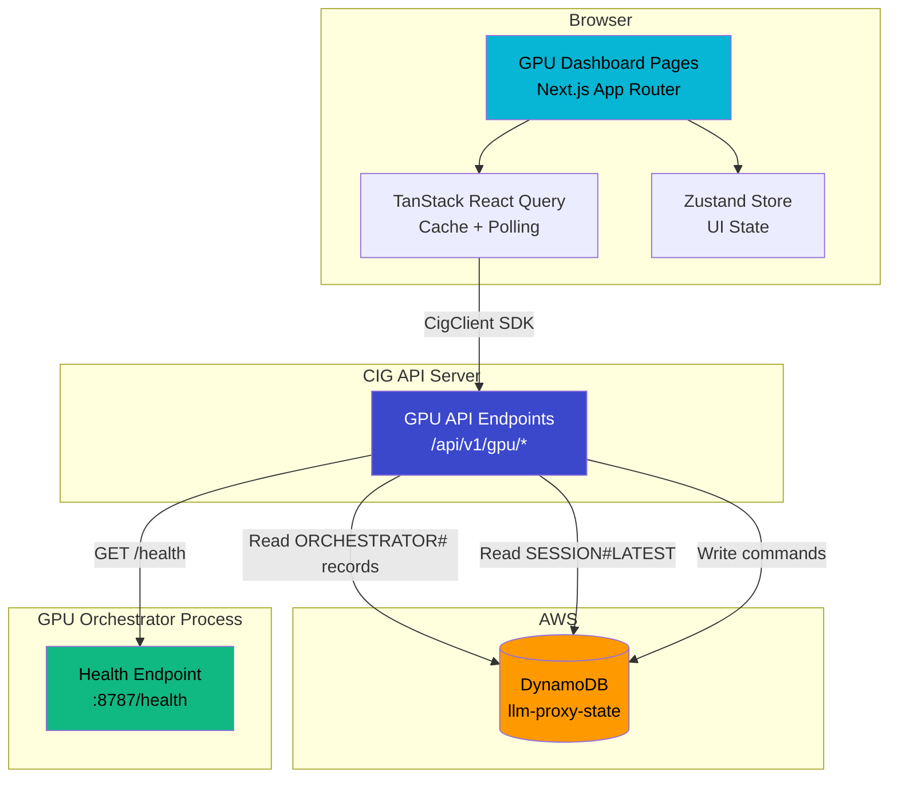
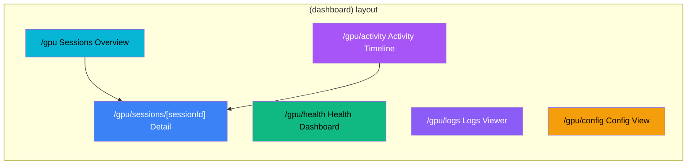

# Design Document: GPU Dashboard

## Overview

The GPU Dashboard adds a GPU management UI to the existing CIG dashboard (`apps/dashboard/`) under the `/gpu` route group. It provides pages for monitoring GPU compute sessions, viewing health status, browsing structured logs, inspecting orchestrator configuration, and reviewing an activity timeline. The dashboard reads data from the CIG API via new `/api/v1/gpu/*` endpoints that query the `llm-proxy-state` DynamoDB table and the orchestrator's health endpoint.

The design follows all existing dashboard conventions: Next.js 14 App Router with the `(dashboard)` layout, Tailwind CSS with CIG design tokens, TanStack React Query for server state, Zustand for local UI state, Refine.dev data provider for resource mapping, CigClient SDK for authenticated API calls, and `@cig-technology/i18n` for translations.

### Key Design Decisions

1. **Reuse existing layout and components**: All GPU pages render inside the existing `(dashboard)/layout.tsx` (Sidebar, Header, Footer, ChatWidget). The `StatCard` component is reused for aggregate metrics. No new layout wrappers are introduced.

2. **Route group under `(dashboard)/gpu/`**: GPU pages live at `apps/dashboard/app/(dashboard)/gpu/` following the same pattern as `/resources`, `/costs`, etc. The dynamic session detail route uses `[sessionId]` matching the existing `[id]` pattern in `/resources/[id]`.

3. **Sidebar navigation section**: A new "GPU Compute" `NavSection` is added between "Platform" and "Operations" in the Sidebar, using the existing `NavSection` component and `NavItem` interface.

4. **Typed API module**: A dedicated `apps/dashboard/lib/gpuApi.ts` module exports typed fetch functions for each GPU endpoint, following the pattern in `apps/dashboard/lib/api.ts`. All functions use `getDashboardClient()` for authenticated requests.

5. **React Query hooks with `["gpu", ...]` namespace**: All GPU queries use keys prefixed with `["gpu"]` to avoid cache collisions. Mutations invalidate relevant query keys on success.

6. **GPU types in a single file**: All TypeScript interfaces for GPU API responses live in `apps/dashboard/types/gpu.ts`, mirroring the existing `types/` directory pattern.

7. **Polling intervals match data freshness needs**: Sessions overview polls every 30s, health dashboard every 15s, logs every 10s (first page only), activity every 30s. Session detail polls every 15s.

8. **Backend API at CIG API server**: The GPU API endpoints are served by the existing CIG API at `NEXT_PUBLIC_API_URL`. They query DynamoDB for orchestrator records and the health endpoint for live status. The dashboard does not call DynamoDB or the health endpoint directly.

## Architecture

### System Context



### Page Routing Structure



### Component Hierarchy

```mermaid
graph TD
    DL["(dashboard)/layout.tsx<br/>Sidebar + Header + Footer"]
    DL --> GP["gpu/page.tsx<br/>Sessions Overview"]
    DL --> SD["gpu/sessions/[sessionId]/page.tsx<br/>Session Detail"]
    DL --> HP["gpu/health/page.tsx<br/>Health Dashboard"]
    DL --> LP["gpu/logs/page.tsx<br/>Logs Viewer"]
    DL --> CP["gpu/config/page.tsx<br/>Config View"]
    DL --> AP["gpu/activity/page.tsx<br/>Activity Timeline"]

    GP --> SC[StatCard]
    GP --> ST[SessionsTable]
    GP --> SF[StatusFilter]
    GP --> NSD[NewSessionDialog]

    SD --> SC
    SD --> HCD[HealthCheckDisplay]
    SD --> SLD[SessionLogSection]
    SD --> SAB[SessionActionButtons]
    SD --> CD[ConfirmDialog]
    SD --> SPI[SessionProgressIndicator]

    HP --> SC
    HP --> SHC[SessionHealthCard]
    HP --> HI[HealthIndicator]
    HP --> RS[RecoveryStateDisplay]

    LP --> LE[LogEntry]
    LP --> LF[LogFilters]

    CP --> CG[ConfigGroup]

    AP --> TE[TimelineEvent]
    AP --> ETF[EventTypeFilter]

    style DL fill:#334155,color:#fff
    style SC fill:#06b6d4,color:#000
    style HI fill:#10b981,color:#000
```



## Components and Interfaces

### 1. File Structure

```
apps/dashboard/
├── app/(dashboard)/gpu/
│   ├── page.tsx                          # Sessions overview (/gpu)
│   ├── sessions/
│   │   └── [sessionId]/
│   │       └── page.tsx                  # Session detail (/gpu/sessions/[sessionId])
│   ├── health/
│   │   └── page.tsx                      # Health dashboard (/gpu/health)
│   ├── logs/
│   │   └── page.tsx                      # Logs viewer (/gpu/logs)
│   ├── config/
│   │   └── page.tsx                      # Config view (/gpu/config)
│   └── activity/
│       └── page.tsx                      # Activity timeline (/gpu/activity)
├── components/gpu/
│   ├── SessionsTable.tsx                 # Sortable session table with status badges
│   ├── StatusFilter.tsx                  # Dropdown filter for session status
│   ├── HealthIndicator.tsx               # Colored dot + text label for health status
│   ├── SessionHealthCard.tsx             # Per-session health card with dimensions
│   ├── HealthCheckDisplay.tsx            # Two-dimension health detail (session + heartbeat)
│   ├── RecoveryStateDisplay.tsx          # Recovery action, failure count, next retry
│   ├── LogEntry.tsx                      # Single log entry (collapsed/expanded)
│   ├── LogFilters.tsx                    # Level, component, session, text search filters
│   ├── ConfigGroup.tsx                   # Grouped key-value config display
│   ├── TimelineEvent.tsx                 # Single timeline event with icon + description
│   ├── EventTypeFilter.tsx              # Multi-select event type filter
│   ├── NewSessionDialog.tsx              # Create session dialog form
│   ├── ConfirmDialog.tsx                 # Generic confirmation dialog
│   ├── SessionActionButtons.tsx          # Stop/Restart action buttons with loading states
│   ├── SessionProgressIndicator.tsx      # Setup phase progress for creating sessions
│   └── SessionLogSection.tsx             # Recent logs filtered to a session
├── lib/
│   └── gpuApi.ts                         # Typed GPU API fetch functions
└── types/
    └── gpu.ts                            # GPU TypeScript interfaces
```

### 2. Sidebar Integration

A new `gpuComputeItems` array is added to `Sidebar.tsx` between `platformItems` and `operationsItems`:

```typescript
const gpuComputeItems: NavItem[] = [
  { labelKey: "nav.gpu.sessions", href: "/gpu",          icon: <GpuIcon />,       color: "#f59e0b" },
  { labelKey: "nav.gpu.health",   href: "/gpu/health",   icon: <HeartPulseIcon />, color: "#10b981" },
  { labelKey: "nav.gpu.logs",     href: "/gpu/logs",     icon: <LogsIcon />,      color: "#8b5cf6" },
  { labelKey: "nav.gpu.config",   href: "/gpu/config",   icon: <ConfigIcon />,    color: "#06b6d4" },
  { labelKey: "nav.gpu.activity", href: "/gpu/activity",  icon: <ActivityIcon />,  color: "#a855f7" },
];
```

A new `<NavSection titleKey="sidebar.gpuCompute" items={gpuComputeItems} ... />` is rendered between the Platform and Operations sections.

### 3. Refine Resource Registration

GPU resources are added to the `resources` array in `providers.tsx`:

```typescript
const resources = [
  // ... existing resources
  { name: "gpu-sessions", list: "/gpu", show: "/gpu/sessions/:id" },
  { name: "gpu-health",   list: "/gpu/health" },
  { name: "gpu-logs",     list: "/gpu/logs" },
  { name: "gpu-config",   list: "/gpu/config" },
  { name: "gpu-activity", list: "/gpu/activity" },
];
```

### 4. Data Provider Resource Paths

New entries in `dataProvider.ts` `resourcePath` map:

```typescript
const resourcePath: Record<string, string> = {
  // ... existing entries
  "gpu-sessions": "/api/v1/gpu/sessions",
  "gpu-health":   "/api/v1/gpu/health",
  "gpu-logs":     "/api/v1/gpu/logs",
  "gpu-config":   "/api/v1/gpu/config",
  "gpu-activity": "/api/v1/gpu/activity",
};
```

### 5. GPU API Module (`lib/gpuApi.ts`)

Typed fetch functions following the pattern in `lib/api.ts`:

```typescript
import { getDashboardClient } from "./cigClient";
import type {
  GpuSession, GpuSessionDetail, GpuHealthSummary,
  GpuLogEntry, GpuConfig, GpuActivityEvent,
  GpuSessionCreateRequest, PaginatedResponse,
} from "../types/gpu";

function getClient() {
  return getDashboardClient();
}

// Sessions
export const getGpuSessions = (params?: string) =>
  getClient().request<PaginatedResponse<GpuSession>>(
    `/api/v1/gpu/sessions${params ? `?${params}` : ""}`
  );

export const getGpuSession = (sessionId: string) =>
  getClient().request<GpuSessionDetail>(`/api/v1/gpu/sessions/${encodeURIComponent(sessionId)}`);

export const createGpuSession = (payload: GpuSessionCreateRequest) =>
  getClient().request<GpuSession>("/api/v1/gpu/sessions", {
    method: "POST",
    body: JSON.stringify(payload),
  });

export const deleteGpuSession = (sessionId: string) =>
  getClient().request<void>(`/api/v1/gpu/sessions/${encodeURIComponent(sessionId)}`, {
    method: "DELETE",
  });

export const restartGpuWorker = (sessionId: string) =>
  getClient().request<void>(`/api/v1/gpu/sessions/${encodeURIComponent(sessionId)}/restart-worker`, {
    method: "POST",
  });

// Health
export const getGpuHealth = () =>
  getClient().request<GpuHealthSummary>("/api/v1/gpu/health");

// Logs
export const getGpuLogs = (params?: string) =>
  getClient().request<PaginatedResponse<GpuLogEntry>>(
    `/api/v1/gpu/logs${params ? `?${params}` : ""}`
  );

// Config
export const getGpuConfig = () =>
  getClient().request<GpuConfig>("/api/v1/gpu/config");

// Activity
export const getGpuActivity = (params?: string) =>
  getClient().request<PaginatedResponse<GpuActivityEvent>>(
    `/api/v1/gpu/activity${params ? `?${params}` : ""}`
  );
```

### 6. React Query Hooks Pattern

Each page uses inline `useQuery` / `useMutation` calls with namespaced keys. Example from the sessions overview:

```typescript
// Query keys
const gpuKeys = {
  all:        ["gpu"] as const,
  sessions:   ["gpu", "sessions"] as const,
  session:    (id: string) => ["gpu", "sessions", id] as const,
  health:     ["gpu", "health"] as const,
  logs:       ["gpu", "logs"] as const,
  config:     ["gpu", "config"] as const,
  activity:   ["gpu", "activity"] as const,
};

// In sessions overview page
const { data, isLoading, isError, refetch } = useQuery({
  queryKey: gpuKeys.sessions,
  queryFn: () => getGpuSessions(statusFilter ? `status=${statusFilter}` : undefined),
  refetchInterval: 30_000,
});

// Mutation with cache invalidation
const queryClient = useQueryClient();
const deleteMutation = useMutation({
  mutationFn: (sessionId: string) => deleteGpuSession(sessionId),
  onSuccess: () => {
    queryClient.invalidateQueries({ queryKey: gpuKeys.sessions });
    queryClient.invalidateQueries({ queryKey: gpuKeys.health });
  },
});
```

### 7. HealthIndicator Component

A reusable component for health status display that satisfies accessibility requirements (color + text label, ARIA labels):

```typescript
interface HealthIndicatorProps {
  status: "healthy" | "unhealthy" | "no_data";
  label?: string;  // e.g., "Session health" or "Worker heartbeat"
}

export function HealthIndicator({ status, label }: HealthIndicatorProps) {
  const config = {
    healthy:  { color: "bg-green-500", text: "Healthy",  textColor: "text-green-700 dark:text-green-400" },
    unhealthy: { color: "bg-red-500",  text: "Unhealthy", textColor: "text-red-700 dark:text-red-400" },
    no_data:  { color: "bg-gray-400",  text: "No Data",  textColor: "text-gray-600 dark:text-gray-400" },
  }[status];

  return (
    <span
      className={`inline-flex items-center gap-1.5 ${config.textColor}`}
      role="status"
      aria-label={label ? `${label}: ${config.text}` : config.text}
    >
      <span className={`size-2 rounded-full ${config.color}`} aria-hidden="true" />
      <span className="text-xs font-medium">{config.text}</span>
    </span>
  );
}
```

### 8. GPU API Endpoints (Backend)

| Method | Path | Description | Query Params |
|--------|------|-------------|-------------|
| `GET` | `/api/v1/gpu/sessions` | List all sessions | `status`, `limit`, `offset` |
| `GET` | `/api/v1/gpu/sessions/[sessionId]` | Session detail + health | — |
| `POST` | `/api/v1/gpu/sessions` | Create new session | — |
| `DELETE` | `/api/v1/gpu/sessions/[sessionId]` | Stop/destroy session | — |
| `POST` | `/api/v1/gpu/sessions/[sessionId]/restart-worker` | Restart worker | — |
| `GET` | `/api/v1/gpu/health` | Health summary for all sessions | — |
| `GET` | `/api/v1/gpu/logs` | Paginated structured logs | `level`, `component`, `sessionId`, `limit`, `offset` |
| `GET` | `/api/v1/gpu/config` | Redacted orchestrator config | — |
| `GET` | `/api/v1/gpu/activity` | Paginated activity events | `eventType`, `sessionId`, `limit`, `offset` |

All endpoints require authentication via the existing CIG auth mechanism (Authentik/Supabase token validation). On DynamoDB read errors, endpoints return HTTP 503 with `{ "error": "..." }`.

**Session list endpoint** queries DynamoDB for all records with PK prefix `ORCHESTRATOR#`, maps them to `GpuSession` objects, and optionally filters by status.

**Session detail endpoint** reads the `ORCHESTRATOR#{sessionId}/META` record, then fetches the health endpoint response and the `SESSION#LATEST` heartbeat record, merging them into a `GpuSessionDetail` response.

**Health endpoint** iterates all active sessions, queries each session's health endpoint (`GET http://orchestrator-host:{port}/health`), reads the `SESSION#LATEST` heartbeat from DynamoDB, and aggregates results into a `GpuHealthSummary`.

**Config endpoint** calls `redactConfig()` from the gpu-orchestrator package to return the current configuration with sensitive values masked as `***`.

## Data Models

### TypeScript Interfaces (`types/gpu.ts`)

```typescript
/** Generic paginated response wrapper */
export interface PaginatedResponse<T> {
  items: T[];
  total: number;
  limit: number;
  offset: number;
}

/** Session status values matching gpu-orchestrator SessionStatus */
export type GpuSessionStatus =
  | "creating"
  | "connected"
  | "running"
  | "disconnected"
  | "error"
  | "terminated";

/** Session summary for the sessions list */
export interface GpuSession {
  sessionId: string;
  status: GpuSessionStatus;
  provider: string;
  models: string[];
  createdAt: string;       // ISO 8601
  lastVerifiedAt: string;  // ISO 8601
  uptimeSeconds: number;
  healthStatus: "healthy" | "unhealthy" | "no_data";
}

/** Health dimension result */
export interface GpuHealthDimension {
  healthy: boolean;
  latencyMs: number;
}

/** Session health dimension with status string */
export interface GpuSessionHealthDimension extends GpuHealthDimension {
  status: string;
}

/** Worker heartbeat health dimension */
export interface GpuWorkerHeartbeatDimension extends GpuHealthDimension {
  lastHeartbeatAt?: string;
  ageSeconds?: number;
}

/** Full health check result for a session */
export interface GpuHealthCheck {
  timestamp: string;
  sessionId: string;
  checks: {
    session: GpuSessionHealthDimension;
    workerHeartbeat: GpuWorkerHeartbeatDimension;
  };
  overall: boolean;
}

/** Recovery state for unhealthy sessions */
export interface GpuRecoveryState {
  actionType: "restart_worker" | "recreate_session" | "enter_dormant";
  consecutiveFailures: number;
  nextRetryAt: string;  // ISO 8601
}

/** Detailed session view (single session) */
export interface GpuSessionDetail {
  sessionId: string;
  status: GpuSessionStatus;
  provider: string;
  models: string[];
  createdAt: string;
  lastVerifiedAt: string;
  ttlExpiry: string;       // ISO 8601
  uptimeSeconds: number;
  healthCheck: GpuHealthCheck | null;
  recoveryState: GpuRecoveryState | null;
  recentLogs: GpuLogEntry[];
}

/** Per-session health card data */
export interface GpuSessionHealth {
  sessionId: string;
  healthStatus: "healthy" | "unhealthy" | "no_data";
  healthCheck: GpuHealthCheck | null;
  recoveryState: GpuRecoveryState | null;
  lastCheckTimestamp: string | null;
}

/** Aggregate health summary */
export interface GpuHealthSummary {
  totalHealthy: number;
  totalUnhealthy: number;
  totalNoData: number;
  oldestHeartbeatAgeSeconds: number | null;
  sessions: GpuSessionHealth[];
}

/** Log level values */
export type GpuLogLevel = "debug" | "info" | "warn" | "error";

/** Structured log entry */
export interface GpuLogEntry {
  id: string;
  timestamp: string;       // ISO 8601
  level: GpuLogLevel;
  component: string;
  sessionId: string | null;
  message: string;
  details?: Record<string, unknown>;  // Full JSON payload on expand
  error?: {
    message: string;
    stack?: string;
  };
}

/** Orchestrator config (redacted) */
export interface GpuConfig {
  providerSettings: GpuConfigEntry[];
  awsSettings: GpuConfigEntry[];
  healthCheckSettings: GpuConfigEntry[];
  loggingSettings: GpuConfigEntry[];
}

export interface GpuConfigEntry {
  key: string;
  value: string;
  redacted: boolean;
}

/** Activity event types */
export type GpuActivityEventType =
  | "session_created"
  | "session_terminated"
  | "session_rotated"
  | "health_check_failed"
  | "recovery_triggered"
  | "worker_restarted"
  | "config_changed";

/** Activity timeline event */
export interface GpuActivityEvent {
  id: string;
  timestamp: string;       // ISO 8601
  eventType: GpuActivityEventType;
  sessionId: string | null;
  description: string;
}

/** Request body for creating a new session */
export interface GpuSessionCreateRequest {
  provider: "colab" | "local";
  modelNames: string[];
  configOverrides?: Record<string, string>;
}

/** Setup phases for session creation progress */
export type GpuSetupPhase =
  | "uploading_notebook"
  | "connecting_runtime"
  | "installing_ollama"
  | "pulling_models"
  | "starting_worker";
```

### DynamoDB Access Patterns (Backend)

The GPU API endpoints read from the existing `llm-proxy-state` DynamoDB table:

| Operation | Key Condition | Used By |
|-----------|--------------|---------|
| List all orchestrator sessions | PK begins_with `ORCHESTRATOR#`, SK = `META` (Scan with filter) | `GET /api/v1/gpu/sessions` |
| Get single orchestrator session | PK = `ORCHESTRATOR#{sessionId}`, SK = `META` (GetItem) | `GET /api/v1/gpu/sessions/[sessionId]` |
| Read worker heartbeat | PK = `SESSION#LATEST`, SK = `META` (GetItem) | `GET /api/v1/gpu/health`, session detail |
| Delete orchestrator session | PK = `ORCHESTRATOR#{sessionId}`, SK = `META` (DeleteItem) | `DELETE /api/v1/gpu/sessions/[sessionId]` |

### Status Color Mapping

| Status | Tailwind Class | Hex |
|--------|---------------|-----|
| `running` | `text-green-600 dark:text-green-400` | `#16a34a` |
| `connected` | `text-blue-600 dark:text-blue-400` | `#2563eb` |
| `creating` | `text-yellow-600 dark:text-yellow-400` | `#ca8a04` |
| `disconnected` | `text-orange-600 dark:text-orange-400` | `#ea580c` |
| `error` | `text-red-600 dark:text-red-400` | `#dc2626` |
| `terminated` | `text-gray-500 dark:text-gray-400` | `#6b7280` |

### Activity Event Color/Icon Mapping

| Event Type | Color | Icon Category |
|-----------|-------|--------------|
| `session_created` | Green | Plus circle |
| `session_terminated` | Red | X circle |
| `session_rotated` | Blue | Refresh |
| `health_check_failed` | Red | Alert triangle |
| `recovery_triggered` | Yellow | Wrench |
| `worker_restarted` | Yellow | Rotate |
| `config_changed` | Gray | Settings |


## Correctness Properties

*A property is a characteristic or behavior that should hold true across all valid executions of a system — essentially, a formal statement about what the system should do. Properties serve as the bridge between human-readable specifications and machine-verifiable correctness guarantees.*

### Property 1: Route Active State Detection

*For any* GPU route path (e.g., `/gpu`, `/gpu/health`, `/gpu/logs`, `/gpu/config`, `/gpu/activity`, `/gpu/sessions/abc123`), the Sidebar's `isActive` function SHALL return `true` for exactly the matching navigation item and `false` for all other GPU navigation items. Specifically, `/gpu` matches only the Sessions item (exact match), while `/gpu/health` matches only the Health item (prefix match), and `/gpu/sessions/[id]` matches only the Sessions item (prefix match on `/gpu`).

**Validates: Requirements 1.3**

### Property 2: Enum-to-Visual Mapping Completeness

*For any* valid enum value from the set of status/level/type enums — `GpuSessionStatus` (6 values), health status (`"healthy" | "unhealthy" | "no_data"`), `GpuLogLevel` (4 values), and `GpuActivityEventType` (7 values) — the corresponding visual mapping function SHALL return a non-empty color class string and, where applicable, a non-empty icon component. The mapping SHALL be deterministic: the same input always produces the same output.

**Validates: Requirements 2.5, 4.4, 5.4, 7.5**

### Property 3: Enum Filter Correctness

*For any* list of `GpuSession` objects and any `GpuSessionStatus` filter value, the filtered result SHALL contain only sessions whose `status` field equals the filter value, and the filtered list length SHALL be less than or equal to the original list length. The same property holds for any list of `GpuActivityEvent` objects filtered by a set of `GpuActivityEventType` values — every event in the result SHALL have an `eventType` present in the selected set.

**Validates: Requirements 2.7, 7.7**

### Property 4: Reverse Chronological Ordering

*For any* list of timestamped items (either `GpuLogEntry` or `GpuActivityEvent`), sorting them in reverse chronological order SHALL produce a list where each item's `timestamp` is greater than or equal to the next item's `timestamp` when compared as ISO 8601 strings. The sorted list SHALL contain exactly the same items as the input (no items added or removed).

**Validates: Requirements 5.1, 7.1**

### Property 5: Log Filtering Correctness

*For any* list of `GpuLogEntry` objects and any combination of active filters (log level set, component name, session ID, text search string), every entry in the filtered result SHALL satisfy all active filter criteria simultaneously: (a) if a level filter is active, the entry's `level` is in the selected set; (b) if a component filter is active, the entry's `component` matches; (c) if a session ID filter is active, the entry's `sessionId` matches; (d) if a text search is active, the entry's `message` contains the search string (case-insensitive). The filtered list length SHALL be less than or equal to the original list length.

**Validates: Requirements 5.3, 5.7**

### Property 6: Log Entry Field Completeness

*For any* valid `GpuLogEntry` object (with non-empty `timestamp`, `level`, `component`, and `message` fields), the rendered log entry component SHALL display all required fields: timestamp (formatted), level (with color), component name, session ID (or a placeholder if null), and message text.

**Validates: Requirements 5.2**

### Property 7: Activity Event Field Completeness

*For any* valid `GpuActivityEvent` object (with non-empty `timestamp`, `eventType`, and `description` fields), the rendered timeline event component SHALL display: the event timestamp (formatted), the event type with its corresponding icon, the session ID (as a link when non-null, omitted when null), and the human-readable description.

**Validates: Requirements 7.3**

### Property 8: Config Value Display Correctness

*For any* `GpuConfigEntry` object, the rendered config display SHALL show the entry's `key` label and: (a) if `redacted` is `true`, the displayed value SHALL be the string `"***"`; (b) if `redacted` is `false`, the displayed value SHALL equal the entry's `value` field exactly.

**Validates: Requirements 6.3, 6.4**

### Property 9: Status Indicator Accessibility

*For any* health status value (`"healthy"`, `"unhealthy"`, `"no_data"`) and any optional label string, the `HealthIndicator` component SHALL render with: (a) an `aria-label` attribute that contains the status text (e.g., "Healthy", "Unhealthy", "No Data") and, when a label is provided, also contains the label; (b) a visible text element displaying the status text alongside the colored indicator, ensuring status information is never conveyed by color alone.

**Validates: Requirements 11.4, 11.5**

## Error Handling

### Frontend Error Handling Strategy

| Scenario | Behavior | Component |
|----------|----------|-----------|
| API request fails (network/5xx) | Inline error message with "Retry" button; retry re-triggers the failed `useQuery` | All GPU pages |
| API returns 503 (DynamoDB error) | Same as above — error message with retry | All GPU pages |
| API returns 404 (session not found) | "Session not found" message with link to `/gpu` | Session Detail |
| API returns empty dataset | Contextual empty state with guidance text | Sessions, Logs, Activity |
| Health endpoint unreachable | Warning banner at top of Health Dashboard | Health Dashboard |
| Mutation fails (create/stop/restart) | Error notification via existing notification system | Session actions |
| Auth token expired during fetch | Transparent refresh via `resolveDashboardAccessToken` | All GPU pages |

### React Query Error Configuration

All GPU queries use the existing `QueryClient` defaults:
- `retry: 1` — one automatic retry before showing error state
- `staleTime: 30_000` — 30 seconds before data is considered stale
- Mutations do not retry automatically

### Error State Component Pattern

Each page follows the same error handling pattern:

```typescript
const { data, isLoading, isError, refetch } = useQuery({ ... });

if (isLoading) return <SkeletonLoader />;
if (isError) return <ErrorState message={t("gpu.error.loadFailed")} onRetry={refetch} />;
if (!data || data.items.length === 0) return <EmptyState message={t("gpu.empty.noSessions")} />;
```

### Mutation Error Handling

```typescript
const mutation = useMutation({
  mutationFn: deleteGpuSession,
  onSuccess: () => {
    queryClient.invalidateQueries({ queryKey: gpuKeys.sessions });
    // Show success notification
  },
  onError: (error) => {
    // Show error notification with error.message
  },
});
```

## Testing Strategy

### Testing Approach

The GPU Dashboard uses a dual testing approach:

1. **Property-based tests** (via `fast-check`): Verify universal properties across generated inputs for pure utility functions (filtering, sorting, mapping, display logic). Minimum 100 iterations per property.
2. **Example-based unit tests** (via `jest` + `@testing-library/react`): Verify specific UI rendering, interactions, and edge cases with concrete examples.
3. **Integration tests**: Verify API endpoint behavior with mocked DynamoDB and health endpoint responses.

### Property-Based Testing Configuration

- **Library**: `fast-check` (to be added as a dev dependency)
- **Runner**: `jest` (existing in the dashboard)
- **Iterations**: Minimum 100 per property test
- **Tag format**: `Feature: gpu-dashboard, Property {number}: {property_text}`

### Test File Structure

```
apps/dashboard/
├── __tests__/gpu/
│   ├── utils.property.test.ts          # Properties 1-5, 8 (pure functions)
│   ├── components.property.test.ts     # Properties 6, 7, 9 (component rendering)
│   ├── sessions-page.test.tsx          # Sessions overview unit tests
│   ├── session-detail.test.tsx         # Session detail unit tests
│   ├── health-page.test.tsx            # Health dashboard unit tests
│   ├── logs-page.test.tsx              # Logs viewer unit tests
│   ├── config-page.test.tsx            # Config view unit tests
│   ├── activity-page.test.tsx          # Activity timeline unit tests
│   ├── gpu-api.test.ts                 # API module unit tests
│   └── sidebar-gpu.test.tsx            # Sidebar GPU navigation tests
```

### Property Test → Design Property Mapping

| Test File | Properties Covered |
|-----------|-------------------|
| `utils.property.test.ts` | P1 (route active state), P2 (enum-to-visual mapping), P3 (enum filter), P4 (reverse chronological ordering), P5 (log filtering), P8 (config display) |
| `components.property.test.ts` | P6 (log entry fields), P7 (activity event fields), P9 (status indicator accessibility) |

### Example-Based Unit Test Coverage

| Test File | Requirements Covered |
|-----------|---------------------|
| `sessions-page.test.tsx` | 2.1, 2.2, 2.4, 2.6, 2.8, 10.1, 10.2, 10.3, 10.4, 10.5 |
| `session-detail.test.tsx` | 3.1, 3.2, 3.3, 3.5, 3.6, 3.7, 3.8, 3.9, 10.6 |
| `health-page.test.tsx` | 4.1, 4.2, 4.5, 4.6, 4.7 |
| `logs-page.test.tsx` | 5.6, 5.8 |
| `config-page.test.tsx` | 6.1, 6.5 |
| `activity-page.test.tsx` | 7.2, 7.6 |
| `sidebar-gpu.test.tsx` | 1.1, 1.4 |
| `gpu-api.test.ts` | 9.2 |

### Integration Test Coverage

Backend API endpoints (Requirement 8) are covered by integration tests in the CIG API server, not in the dashboard test suite. The dashboard tests mock API responses.

### Smoke Test Coverage

| Check | Requirements |
|-------|-------------|
| Route files exist under `(dashboard)/gpu/` | 1.2, 1.5 |
| i18n translation keys present | 1.6 |
| `resourcePath` entries in `dataProvider.ts` | 9.1 |
| TypeScript interfaces compile | 9.3 |
| QueryClient retry default is 1 | 12.4 |
