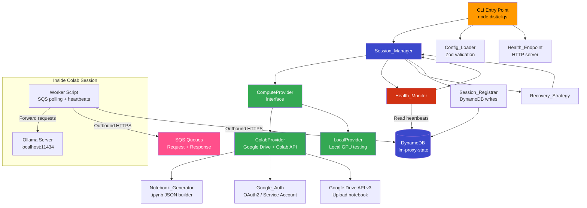
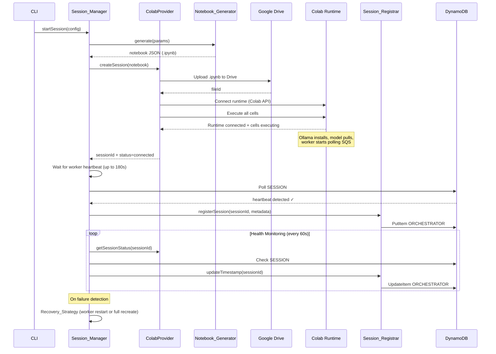
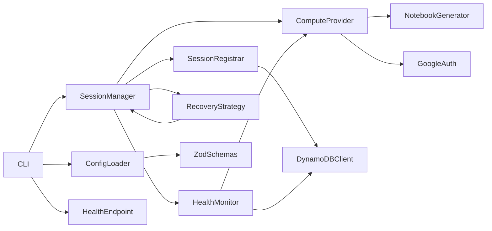

# Design Document: GPU Orchestrator

## Overview

The GPU Orchestrator is a standalone TypeScript CLI application (`packages/gpu-orchestrator/`) that automates the full lifecycle of remote GPU compute sessions for Ollama-based LLM inference. It manages session creation on Google Colab (or other providers), Ollama installation and model pulling, worker script execution, session registration in the existing `llm-proxy-state` DynamoDB table, and continuous health monitoring with auto-recovery.

**No tunnel required.** The existing `packages/llm-proxy/` architecture uses a pull-based SQS pattern: the Colab worker makes outbound HTTPS calls to AWS (polling SQS for requests, sending responses back, writing DynamoDB heartbeats). Google Colab allows outbound connections, so no inbound tunnel (Cloudflare, ngrok, etc.) is needed. The orchestrator simply sets up the compute session, installs Ollama, starts the worker, and monitors health via the worker's DynamoDB heartbeats.

### Key Design Decisions

1. **Provider-agnostic architecture**: A `ComputeProvider` interface abstracts the compute backend. `ColabProvider` (primary) and `LocalProvider` (testing) are the initial implementations. Adding Kaggle or RunPod is a new class, not a rewrite.

2. **Google Drive API + Colab internal API for session management**: Google Colab free tier has no official public API for runtime management. The design uses the Google Drive API v3 (`@googleapis/drive`) to upload generated `.ipynb` notebooks, and the Colab internal API (undocumented REST endpoints at `colab.research.google.com/api`) with Selenium fallback for runtime connection and execution. This is inherently fragile — the design accounts for this with aggressive retry logic and clear error categorization.

3. **SQS pull-based communication (no tunnel)**: The Colab worker communicates with AWS entirely via outbound HTTPS — polling SQS for inference requests, posting responses back to SQS, and writing heartbeats to DynamoDB. This eliminates the need for any inbound tunnel (Cloudflare, ngrok, etc.), reducing complexity and removing a fragile dependency. The orchestrator verifies connectivity by monitoring the worker's DynamoDB heartbeats.

4. **Notebook generation over template files**: Rather than shipping a static `.ipynb` template, the `NotebookGenerator` builds the notebook JSON programmatically from parameters (model name, AWS creds, queue URLs). This ensures the notebook always matches the current configuration and avoids template drift.

5. **Long-lived CLI process**: The orchestrator runs as a persistent process (`node dist/cli.js start`), not a Lambda or cron job. It maintains a monitoring loop that checks session health and worker heartbeat freshness at configurable intervals.

6. **DynamoDB integration via existing table**: The orchestrator writes `ORCHESTRATOR#{sessionId}` records and reads `SESSION#LATEST` heartbeats from the existing `llm-proxy-state` table. No new DynamoDB tables are created — the orchestrator extends the existing single-table design.

7. **Zero `@cig/*` dependencies**: Mirrors the decoupling pattern from `packages/llm-proxy/`. The orchestrator is fully standalone with its own `package.json`, `tsconfig.json`, and `vitest.config.ts`.

### Decoupling Guarantees

| Aspect | LLM Proxy (existing) | GPU Orchestrator (new) |
|--------|---------------------|----------------------|
| **Package** | `packages/llm-proxy/` | `packages/gpu-orchestrator/` |
| **Package name** | `@llm-proxy/app` | `@gpu-orchestrator/app` |
| **Runtime** | Lambda (Hono) | CLI process (Node.js) |
| **AWS resources** | SQS queues, DynamoDB table, Lambda, API Gateway | Reads/writes existing DynamoDB table only |
| **Google APIs** | None | Google Drive API, Colab API |
| **Dependencies** | `@aws-sdk/*`, `hono`, `zod` | `@aws-sdk/*`, `googleapis`, `zod` |
| **`@cig/*` imports** | Zero | Zero |
| **Deployment** | `sst deploy` | `node dist/cli.js start` |

## Architecture

### High-Level System Diagram



### Session Lifecycle Sequence



### Component Dependency Graph



## Components and Interfaces

### 1. ComputeProvider Interface

The core abstraction that all compute backends implement.

```typescript
// src/providers/types.ts

interface SessionInfo {
  sessionId: string;
  status: 'creating' | 'connected' | 'running' | 'disconnected' | 'error' | 'terminated';
  provider: string;
  startedAt: string;       // ISO 8601
  metadata: Record<string, string>;  // Provider-specific metadata (e.g., Drive fileId)
}

interface SessionCreateOptions {
  notebook: NotebookDocument;   // Generated .ipynb JSON
  models: string[];             // Ollama models to pull
  awsConfig: AWSCredentialRef;  // AWS credential reference (not raw keys)
}

interface ComputeProvider {
  readonly providerName: string;

  createSession(options: SessionCreateOptions): Promise<SessionInfo>;
  destroySession(sessionId: string): Promise<void>;
  getSessionStatus(sessionId: string): Promise<SessionInfo>;
  executeCommand(sessionId: string, command: string): Promise<CommandResult>;
  getSessionLogs(sessionId: string, lines?: number): Promise<string>;
}

interface CommandResult {
  exitCode: number;
  stdout: string;
  stderr: string;
}
```

### 2. ColabProvider

Implements `ComputeProvider` for Google Colab free tier.

```typescript
// src/providers/colab-provider.ts

class ColabProvider implements ComputeProvider {
  readonly providerName = 'colab';

  constructor(
    private auth: GoogleAuth,
    private driveClient: DriveClient,
  ) {}

  async createSession(options: SessionCreateOptions): Promise<SessionInfo> {
    // 1. Serialize notebook to JSON
    // 2. Upload to Google Drive via Drive API v3
    // 3. Connect Colab runtime via Colab API (with Selenium fallback)
    // 4. Execute notebook cells (Ollama install, model pull, worker start)
    // 5. Return session info with Drive fileId in metadata
  }

  async destroySession(sessionId: string): Promise<void> {
    // 1. Disconnect Colab runtime
    // 2. Delete notebook from Google Drive
  }

  async getSessionStatus(sessionId: string): Promise<SessionInfo> {
    // Query Colab API for runtime status
  }

  async executeCommand(sessionId: string, command: string): Promise<CommandResult> {
    // Execute via Colab's code execution API
  }

  async getSessionLogs(sessionId: string, lines?: number): Promise<string> {
    // Retrieve cell outputs from Colab API
  }
}
```

### 3. LocalProvider

Implements `ComputeProvider` for local GPU testing — no cloud credentials needed.

```typescript
// src/providers/local-provider.ts

class LocalProvider implements ComputeProvider {
  readonly providerName = 'local';

  async createSession(options: SessionCreateOptions): Promise<SessionInfo> {
    // 1. Verify Ollama is installed locally
    // 2. Start Ollama server if not running
    // 3. Pull requested models
    // 4. Start worker script as child process
    // 5. Return session info
  }

  async destroySession(sessionId: string): Promise<void> {
    // Stop worker process and local Ollama process
  }

  async getSessionStatus(sessionId: string): Promise<SessionInfo> {
    // Check if local worker process is running
  }

  async executeCommand(sessionId: string, command: string): Promise<CommandResult> {
    // Execute command locally via child_process
  }

  async getSessionLogs(sessionId: string, lines?: number): Promise<string> {
    // Read from local log file
  }
}
```

### 4. NotebookGenerator

Builds valid Jupyter `.ipynb` JSON programmatically.

```typescript
// src/notebook/generator.ts

interface NotebookParams {
  modelName: string;
  awsRegion: string;
  requestQueueUrl: string;
  responseQueueUrl: string;
  dynamoTableName: string;
  workerScriptContent: string;  // Embedded worker.py content
}

interface NotebookDocument {
  nbformat: 4;
  nbformat_minor: 5;
  metadata: {
    kernelspec: { display_name: string; language: string; name: string };
    language_info: { name: string; version: string };
  };
  cells: NotebookCell[];
}

interface NotebookCell {
  cell_type: 'code' | 'markdown';
  metadata: Record<string, unknown>;
  source: string[];
  outputs?: unknown[];
  execution_count?: number | null;
}

function generateNotebook(params: NotebookParams): NotebookDocument {
  // Builds cells:
  // 1. System deps + pip install (boto3, requests)
  // 2. Ollama install (curl -fsSL https://ollama.com/install.sh | sh)
  // 3. Ollama start + model pull + verify
  // 4. AWS credential config from Colab secrets
  // 5. Worker script write + execution (polls SQS, forwards to Ollama)
}

function parseNotebook(json: string): NotebookDocument {
  // Parse and validate .ipynb JSON structure
}
```

### 5. SessionRegistrar

Writes and manages orchestrator session records in the existing `llm-proxy-state` DynamoDB table.

```typescript
// src/state/session-registrar.ts

interface OrchestratorRecord {
  sessionId: string;
  provider: string;
  models: string[];
  createdAt: string;
  lastVerifiedAt: string;
  ttl: number;
}

class SessionRegistrar {
  constructor(private dynamoClient: DynamoDBDocumentClient, private tableName: string) {}

  async registerSession(record: OrchestratorRecord): Promise<void> {
    // PutItem PK=ORCHESTRATOR#{sessionId}, SK=META
  }

  async updateTimestamp(sessionId: string): Promise<void> {
    // Update lastVerifiedAt and extend TTL
  }

  async removeSession(sessionId: string): Promise<void> {
    // DeleteItem ORCHESTRATOR#{sessionId}
  }

  async getWorkerHeartbeat(): Promise<{ lastHeartbeatAt: string; status: string } | null> {
    // GetItem SESSION#LATEST, SK=META — read heartbeat written by worker
  }
}
```

### 6. HealthMonitor

Checks two health dimensions at each interval: compute session status and worker heartbeat freshness.

```typescript
// src/health/monitor.ts

interface HealthCheckResult {
  timestamp: string;
  sessionId: string;
  checks: {
    session: { healthy: boolean; latencyMs: number; status: string };
    workerHeartbeat: { healthy: boolean; latencyMs: number; lastHeartbeatAt?: string; ageSeconds?: number };
  };
  overall: boolean;
}

class HealthMonitor {
  constructor(
    private provider: ComputeProvider,
    private registrar: SessionRegistrar,
    private intervalMs: number,
    private heartbeatThresholdSeconds: number,  // Default: 180
  ) {}

  async checkAll(sessionId: string): Promise<HealthCheckResult>;
  start(sessionId: string, onUnhealthy: (result: HealthCheckResult) => void): void;
  stop(): void;
}
```

### 7. RecoveryStrategy

Implements exponential backoff recovery with component-level granularity.

```typescript
// src/health/recovery.ts

interface RecoveryConfig {
  initialBackoffMs: number;    // Default: 30_000
  maxBackoffMs: number;        // Default: 900_000 (15 min)
  maxConsecutiveFailures: number; // Default: 5
  dormantRetryMs: number;      // Default: 1_800_000 (30 min)
}

type RecoveryAction =
  | { type: 'restart_worker' }
  | { type: 'recreate_session' }
  | { type: 'enter_dormant' };

class RecoveryStrategy {
  determineAction(healthResult: HealthCheckResult, consecutiveFailures: number): RecoveryAction;
  calculateBackoff(attempt: number): number;
}
```

### 8. ConfigLoader

Loads and validates configuration from `GPU_ORCH_` environment variables.

```typescript
// src/config/loader.ts

const ConfigSchema = z.object({
  provider: z.enum(['colab', 'local']).default('colab'),
  modelNames: z.string().transform(s => s.split(',')).pipe(z.array(z.string().min(1)).min(1)),
  googleCredentialsPath: z.string().optional(),
  googleOAuthClientId: z.string().optional(),
  googleOAuthClientSecret: z.string().optional(),
  awsRegion: z.string().default('us-east-2'),
  requestQueueUrl: z.string().url(),
  responseQueueUrl: z.string().url(),
  dynamoTableName: z.string().default('llm-proxy-state'),
  healthCheckIntervalMs: z.coerce.number().int().positive().default(60_000),
  healthEndpointPort: z.coerce.number().int().positive().default(8787),
  heartbeatThresholdSeconds: z.coerce.number().int().positive().default(180),
  logLevel: z.enum(['debug', 'info', 'warn', 'error']).default('info'),
});

type OrchestratorConfig = z.infer<typeof ConfigSchema>;

function loadConfig(): OrchestratorConfig {
  // Read GPU_ORCH_* env vars, strip prefix, validate with Zod
}

function redactConfig(config: OrchestratorConfig): Record<string, string> {
  // Return config with sensitive values replaced by '***'
}
```

### 9. GoogleAuth

Handles Google OAuth 2.0 and Service Account authentication.

```typescript
// src/auth/google-auth.ts

class GoogleAuth {
  constructor(private config: { credentialsPath?: string; clientId?: string; clientSecret?: string }) {}

  async getAccessToken(): Promise<string> {
    // Service account: sign JWT, exchange for access token
    // OAuth: use refresh token flow
  }

  async refreshIfExpired(): Promise<string> {
    // Check token expiry, refresh if needed
  }

  getDriveClient(): drive_v3.Drive {
    // Return authenticated Google Drive API client
  }
}
```

### Module Map

| Module | Path | Responsibility |
|--------|------|---------------|
| CLI entry | `src/cli.ts` | Argument parsing, `start`/`stop`/`status`/`--dry-run` commands |
| Config | `src/config/loader.ts` | `GPU_ORCH_*` env loading, Zod validation, redaction |
| Config schemas | `src/config/schemas.ts` | Zod schemas for all config types |
| Provider interface | `src/providers/types.ts` | `ComputeProvider`, `SessionInfo`, `CommandResult` |
| Provider factory | `src/providers/factory.ts` | Instantiate provider from config |
| Colab provider | `src/providers/colab-provider.ts` | Google Colab lifecycle via Drive + Colab API |
| Local provider | `src/providers/local-provider.ts` | Local GPU testing |
| Notebook generator | `src/notebook/generator.ts` | `.ipynb` JSON builder |
| Notebook types | `src/notebook/types.ts` | `NotebookDocument`, `NotebookCell` types |
| Google auth | `src/auth/google-auth.ts` | OAuth2 / Service Account token management |
| Session registrar | `src/state/session-registrar.ts` | DynamoDB ORCHESTRATOR record management + heartbeat reads |
| Session manager | `src/session/manager.ts` | Orchestrates create → setup → monitor → teardown |
| Health monitor | `src/health/monitor.ts` | Two-dimension health checks (session + heartbeat) |
| Recovery strategy | `src/health/recovery.ts` | Exponential backoff, component-level recovery |
| Health endpoint | `src/health/endpoint.ts` | Local HTTP server for health status JSON |
| Logger | `src/lib/logger.ts` | Structured JSON logging |
| Errors | `src/lib/errors.ts` | Error categories and typed error classes |

## Data Models

### DynamoDB Records (extending `llm-proxy-state` table)

The orchestrator adds `ORCHESTRATOR` records to the existing single-table design. Existing `SESSION` records written by the Colab worker are unchanged — the orchestrator reads them for heartbeat monitoring.

**New record: Orchestrator Session**

| Attribute | Type | Description |
|-----------|------|-------------|
| `PK` | String | `ORCHESTRATOR#{sessionId}` |
| `SK` | String | `META` |
| `sessionId` | String | Session identifier |
| `provider` | String | `colab` or `local` |
| `models` | List\<String\> | Available Ollama models |
| `createdAt` | String | ISO 8601 timestamp |
| `lastVerifiedAt` | String | ISO 8601 timestamp |
| `ttl` | Number | Unix epoch seconds (24h from last update) |

**Existing record read by orchestrator: SESSION#LATEST**

The orchestrator reads the `SESSION#LATEST` record to check worker heartbeat freshness. This record is written by the Colab worker (`packages/llm-proxy/colab/worker.py`):

| Attribute | Type | Description |
|-----------|------|-------------|
| `PK` | String | `SESSION#LATEST` |
| `SK` | String | `META` |
| `sessionId` | String | Worker's session ID |
| `status` | String | `active` or `terminated` |
| `lastHeartbeatAt` | String | ISO 8601 timestamp (updated every 60s by worker) |
| `ollamaModels` | List\<String\> | Models available in the worker |
| `ttl` | Number | Unix epoch seconds |

**Access Patterns:**

| Operation | Key Condition | Used By |
|-----------|--------------|---------|
| Register orchestrator session | PK=`ORCHESTRATOR#{id}`, SK=`META` (PutItem) | SessionRegistrar |
| Update orchestrator timestamp | PK=`ORCHESTRATOR#{id}`, SK=`META` (UpdateItem) | SessionRegistrar |
| Remove orchestrator session | PK=`ORCHESTRATOR#{id}`, SK=`META` (DeleteItem) | SessionRegistrar |
| Read worker heartbeat | PK=`SESSION#LATEST`, SK=`META` (GetItem) | HealthMonitor |

### Notebook Document Structure (.ipynb)

The generated notebook follows the [nbformat v4.5 specification](https://nbformat.readthedocs.io/en/latest/format_description.html):

```json
{
  "nbformat": 4,
  "nbformat_minor": 5,
  "metadata": {
    "kernelspec": {
      "display_name": "Python 3",
      "language": "python",
      "name": "python3"
    },
    "language_info": {
      "name": "python",
      "version": "3.10"
    }
  },
  "cells": [
    { "cell_type": "code", "source": ["# Cell 1: Install system deps + pip packages (boto3, requests)"] },
    { "cell_type": "code", "source": ["# Cell 2: Install Ollama"] },
    { "cell_type": "code", "source": ["# Cell 3: Start Ollama + pull model + verify"] },
    { "cell_type": "code", "source": ["# Cell 4: Configure AWS credentials from Colab secrets"] },
    { "cell_type": "code", "source": ["# Cell 5: Write + run worker script (SQS polling + heartbeats)"] }
  ]
}
```

Each cell has a fixed purpose. The `NotebookGenerator` produces exactly 5 code cells for a standard configuration.

### Configuration Schema

```typescript
// Environment variables → config mapping
GPU_ORCH_PROVIDER              → provider: 'colab' | 'local'
GPU_ORCH_MODEL_NAMES           → modelNames: string[]  (comma-separated)
GPU_ORCH_GOOGLE_CREDS_PATH     → googleCredentialsPath: string
GPU_ORCH_GOOGLE_CLIENT_ID      → googleOAuthClientId: string
GPU_ORCH_GOOGLE_CLIENT_SECRET  → googleOAuthClientSecret: string
GPU_ORCH_AWS_REGION            → awsRegion: string
GPU_ORCH_REQUEST_QUEUE_URL     → requestQueueUrl: string
GPU_ORCH_RESPONSE_QUEUE_URL    → responseQueueUrl: string
GPU_ORCH_DYNAMO_TABLE          → dynamoTableName: string
GPU_ORCH_HEALTH_INTERVAL       → healthCheckIntervalMs: number
GPU_ORCH_HEALTH_PORT           → healthEndpointPort: number
GPU_ORCH_HEARTBEAT_THRESHOLD   → heartbeatThresholdSeconds: number
GPU_ORCH_LOG_LEVEL             → logLevel: 'debug' | 'info' | 'warn' | 'error'
```

### Error Categories

```typescript
type ErrorCategory =
  | 'auth_error'        // Google OAuth / Service Account failures
  | 'provider_error'    // Compute provider failures (Colab API, Drive API)
  | 'ollama_error'      // Ollama install, start, model pull failures
  | 'state_store_error' // DynamoDB read/write failures
  | 'config_error';     // Configuration validation failures
```

### Package Structure

```
packages/gpu-orchestrator/
├── package.json              # @gpu-orchestrator/app
├── tsconfig.json             # Standalone, targets ES2022, Node16 resolution
├── vitest.config.ts          # Test configuration
├── README.md                 # Installation, config, usage, architecture
├── src/
│   ├── cli.ts                # CLI entry point (bin)
│   ├── config/
│   │   ├── loader.ts         # GPU_ORCH_* env loading + Zod validation
│   │   └── schemas.ts        # Zod schemas
│   ├── providers/
│   │   ├── types.ts          # ComputeProvider interface
│   │   ├── factory.ts        # Provider instantiation
│   │   ├── colab-provider.ts # Google Colab implementation
│   │   └── local-provider.ts # Local GPU implementation
│   ├── notebook/
│   │   ├── generator.ts      # .ipynb JSON builder
│   │   └── types.ts          # NotebookDocument, NotebookCell
│   ├── auth/
│   │   └── google-auth.ts    # OAuth2 / Service Account
│   ├── state/
│   │   └── session-registrar.ts  # DynamoDB orchestrator records + heartbeat reads
│   ├── session/
│   │   └── manager.ts        # Session lifecycle orchestration
│   ├── health/
│   │   ├── monitor.ts        # Two-dimension health checks (session + heartbeat)
│   │   ├── recovery.ts       # Exponential backoff recovery
│   │   └── endpoint.ts       # Local HTTP health endpoint
│   └── lib/
│       ├── logger.ts         # Structured JSON logging
│       └── errors.ts         # Typed error classes
└── src/__tests__/
    ├── notebook.property.test.ts     # Notebook generation properties
    ├── config.property.test.ts       # Config validation properties
    ├── session-registrar.property.test.ts  # Session registration properties
    ├── recovery.property.test.ts     # Recovery strategy properties
    ├── health.property.test.ts       # Health check properties
    ├── colab-provider.test.ts        # Unit tests
    ├── local-provider.test.ts        # Unit tests
    ├── session-manager.test.ts       # Integration tests
    └── google-auth.test.ts           # Unit tests
```


## Correctness Properties

*A property is a characteristic or behavior that should hold true across all valid executions of a system — essentially, a formal statement about what the system should do. Properties serve as the bridge between human-readable specifications and machine-verifiable correctness guarantees.*

### Property 1: Notebook Generation Round-Trip

*For any* valid `NotebookParams` (arbitrary model name, queue URLs, and table name), generating a notebook via `generateNotebook()` and then parsing the resulting JSON with `JSON.parse()` SHALL produce a structurally valid Jupyter notebook with `nbformat` equal to 4, a non-empty `cells` array, and exactly 5 code cells.

**Validates: Requirements 3.1, 3.6, 12.6**

### Property 2: Notebook Parameterized Content Embedding

*For any* valid `NotebookParams`, the generated notebook SHALL contain: (a) a cell whose source includes the string `ollama pull` followed by the specified model name, (b) a cell whose source includes the specified request queue URL and response queue URL, and (c) a cell whose source includes the Ollama install script URL.

**Validates: Requirements 3.3, 3.4, 3.5**

### Property 3: Configuration Round-Trip

*For any* valid `OrchestratorConfig` object, serializing it to JSON via `JSON.stringify()` and then parsing it back via the Zod `ConfigSchema.parse()` SHALL produce a configuration object equivalent to the original.

**Validates: Requirements 1.7, 9.1, 12.5**

### Property 4: Configuration Validation Error Completeness

*For any* configuration object with N distinct validation errors (missing required fields, invalid types, out-of-range values), the Zod validation SHALL report all N errors in the error output, not just the first one encountered.

**Validates: Requirements 9.2**

### Property 5: Configuration Redaction

*For any* valid `OrchestratorConfig` object, the `redactConfig()` function SHALL return an object where: (a) fields named `googleCredentialsPath`, `googleOAuthClientId`, and `googleOAuthClientSecret` have their values replaced with `'***'`, and (b) all other fields retain their original string representation.

**Validates: Requirements 9.6**

### Property 6: Orchestrator Record Completeness and TTL

*For any* valid session data (arbitrary session ID, provider name, model list, and timestamp), the `SessionRegistrar.buildRecord()` function SHALL produce a DynamoDB item containing all required fields (`PK`, `SK`, `sessionId`, `provider`, `models`, `createdAt`, `lastVerifiedAt`, `ttl`), and the `ttl` value SHALL equal the floor of the creation timestamp in epoch seconds plus exactly 86400.

**Validates: Requirements 6.1, 6.5**

### Property 7: Recovery Action Determination

*For any* `HealthCheckResult` and consecutive failure count: (a) if only the workerHeartbeat dimension is unhealthy and the session is healthy and failures < 5, the recovery action SHALL be `restart_worker`; (b) if the session dimension is unhealthy and failures < 5, the recovery action SHALL be `recreate_session`; (c) if consecutive failures ≥ 5 regardless of which dimensions are unhealthy, the recovery action SHALL be `enter_dormant`.

**Validates: Requirements 8.2, 8.3, 8.5**

### Property 8: Exponential Backoff Calculation

*For any* non-negative integer attempt number, the `calculateBackoff(attempt)` function SHALL return `min(30000 × 2^attempt, 900000)` milliseconds.

**Validates: Requirements 8.4**

### Property 9: Health Check Two-Dimension Reporting

*For any* combination of session status (healthy/unhealthy) and worker heartbeat freshness (healthy/unhealthy), the `HealthMonitor.checkAll()` result SHALL contain both dimension results with boolean `healthy` fields and non-negative `latencyMs` values, and the `overall` field SHALL be `true` if and only if both dimensions are healthy.

**Validates: Requirements 8.1**

### Property 10: Session Rotation Decision

*For any* session start time and current time, the session rotation check SHALL return `true` if and only if the difference between current time and start time exceeds 11 hours (39600000 milliseconds).

**Validates: Requirements 2.7**

### Property 11: Structured Log Entry Completeness

*For any* log parameters (arbitrary level, component name, session ID, message, and optional error details), the structured logger SHALL produce a JSON string that, when parsed, contains all required fields: `timestamp` (valid ISO 8601), `level`, `component`, `sessionId`, and `message`.

**Validates: Requirements 10.1**

### Property 12: Heartbeat Freshness Classification

*For any* pair of timestamps (heartbeat timestamp, current timestamp) and a threshold in seconds, the heartbeat check function SHALL return `true` (healthy) if and only if the difference between current time and heartbeat time is less than or equal to the threshold, and `false` (unhealthy) otherwise.

**Validates: Requirements 5.4, 5.5**

## Error Handling

### Error Categories and Recovery

| Error Category | Source Components | Recoverable? | Recovery Action |
|---------------|-------------------|--------------|-----------------|
| `config_error` | ConfigLoader, Zod validation | No | Exit with descriptive error list |
| `auth_error` | GoogleAuth (OAuth, Service Account) | Retry 3× | Retry token refresh; exit after 3 failures |
| `provider_error` | ColabProvider, LocalProvider | Yes | Component or full session recovery |
| `ollama_error` | Ollama install, start, model pull | Yes | Retry command (up to 2×), then full recovery |
| `state_store_error` | SessionRegistrar, DynamoDB | Yes | Retry write (up to 3× with backoff), continue on failure |

### Retry Strategy by Component

| Component | Max Retries | Backoff Strategy | On Exhaustion |
|-----------|-------------|-----------------|---------------|
| Google Auth | 3 | Exponential (1s, 2s, 4s) | Exit with error code |
| Colab Runtime Connect | 1 (120s timeout) | N/A | Return error |
| Ollama Start | 2 | Fixed (5s) | Report error, trigger recovery |
| Ollama Model Pull | 2 | Exponential (10s, 20s) | Report error, continue with other models |
| Worker Heartbeat Wait | 1 (180s timeout) | N/A | Trigger recovery |
| DynamoDB Write | 3 | Exponential (500ms, 1s, 2s) | Log error, continue operation |
| Session Recovery | 5 | Exponential (30s → 15min cap) | Enter dormant state (retry every 30min) |

### Graceful Shutdown Sequence

When the orchestrator receives SIGTERM or SIGINT:

1. Stop the health monitoring loop
2. Stop the health HTTP endpoint
3. Mark sessions as terminated in DynamoDB (update `ORCHESTRATOR#{sessionId}`)
4. Remove orchestrator records from DynamoDB
5. Destroy active compute sessions (disconnect Colab runtime, delete Drive notebook)
6. Flush logs
7. Exit with code 0

### Global Error Boundary

An unhandled exception triggers:

1. Log the exception as `critical` with full stack trace
2. Attempt graceful shutdown (steps 1–6 above, with 10s timeout)
3. Exit with code 1

## Testing Strategy

### Testing Approach

This feature uses a dual testing approach:

1. **Property-based tests** (`fast-check`): Verify universal correctness properties across randomized inputs. Each property test runs a minimum of 100 iterations and references its design document property.
2. **Unit tests** (`vitest`): Verify specific examples, edge cases, and integration points with mocked Google APIs and AWS SDK clients.
3. **Integration tests**: Verify end-to-end session lifecycle with mocked external services.

### Property-Based Testing Configuration

- **Library**: `fast-check` (devDependency in `packages/gpu-orchestrator/package.json`)
- **Framework**: `vitest` (configured in `packages/gpu-orchestrator/vitest.config.ts`)
- **Minimum iterations**: 100 per property (`fc.configureGlobal({ numRuns: 100 })`)
- **Tag format**: `Feature: gpu-orchestrator, Property {N}: {description}`

### Test Plan

| Test Type | What It Covers | Properties/Criteria |
|-----------|---------------|-------------------|
| Property test | Notebook round-trip validity | Property 1 (Req 3.1, 3.6, 12.6) |
| Property test | Notebook parameterized content | Property 2 (Req 3.3, 3.4, 3.5) |
| Property test | Config round-trip | Property 3 (Req 1.7, 9.1, 12.5) |
| Property test | Config validation error completeness | Property 4 (Req 9.2) |
| Property test | Config redaction | Property 5 (Req 9.6) |
| Property test | Orchestrator record completeness + TTL | Property 6 (Req 6.1, 6.5) |
| Property test | Recovery action determination | Property 7 (Req 8.2, 8.3, 8.5) |
| Property test | Exponential backoff calculation | Property 8 (Req 8.4) |
| Property test | Health check two-dimension reporting | Property 9 (Req 8.1) |
| Property test | Session rotation decision | Property 10 (Req 2.7) |
| Property test | Structured log completeness | Property 11 (Req 10.1) |
| Property test | Heartbeat freshness classification | Property 12 (Req 5.4, 5.5) |
| Unit test | Provider factory returns correct class | Req 1.3 |
| Unit test | Colab session timeout returns error with status | Req 2.3 |
| Unit test | Session status change triggers recovery | Req 2.6 |
| Unit test | Ollama start retry count (max 2) | Req 4.3 |
| Unit test | Model pull retry with exponential backoff | Req 4.5 |
| Unit test | Model pull progress logging | Req 4.6 |
| Unit test | Worker heartbeat wait timeout (180s) | Req 5.3 |
| Unit test | DynamoDB write retry (max 3) | Req 6.6 |
| Unit test | Auth failure after 3 retries exits | Req 7.5 |
| Unit test | Dry-run mode validates without side effects | Req 9.4 |
| Unit test | Health check log entry structure | Req 8.6 |
| Integration test | Colab session create → connect → execute | Req 2.1, 2.2 |
| Integration test | Colab session stop → disconnect → delete | Req 2.4 |
| Integration test | Session status polling interval ≤ 60s | Req 2.5 |
| Integration test | Worker heartbeat detection within 180s | Req 5.2 |
| Integration test | Orchestrator record registration in DynamoDB | Req 6.1, 6.2 |
| Integration test | Orchestrator record removal on termination | Req 6.4 |
| Integration test | Orchestrator record timestamp update interval | Req 6.3 |
| Integration test | Service account token scopes | Req 7.1, 7.3 |
| Integration test | OAuth refresh token flow | Req 7.2, 7.4 |
| Integration test | Credentials file validation | Req 7.6 |
| Integration test | Health HTTP endpoint returns JSON | Req 8.7 |
| Integration test | AWS credential chain usage | Req 9.5 |
| Integration test | Recoverable error → continue operation | Req 10.2 |
| Integration test | Unrecoverable error → cleanup + exit | Req 10.3 |
| Integration test | SIGTERM/SIGINT graceful shutdown | Req 10.5, 10.6 |
| Smoke test | Zero @cig/* dependencies in package.json | Req 11.1 |
| Smoke test | TypeScript strict mode + ESM | Req 11.2 |
| Smoke test | package.json name and scripts | Req 11.3 |
| Smoke test | vitest.config.ts exists | Req 11.4 |
| Smoke test | tsconfig.json targets ES2022 | Req 11.5 |
| Smoke test | CLI bin entry in package.json | Req 11.6 |
| Smoke test | README.md with required sections | Req 11.7 |

### Test File Structure

```
packages/gpu-orchestrator/
  src/__tests__/
    notebook.property.test.ts           # Properties 1, 2
    config.property.test.ts             # Properties 3, 4, 5
    session-registrar.property.test.ts  # Property 6
    recovery.property.test.ts           # Properties 7, 8
    health.property.test.ts             # Properties 9, 12
    session.property.test.ts            # Property 10
    logger.property.test.ts             # Property 11
    colab-provider.test.ts              # Unit + integration tests
    local-provider.test.ts              # Unit tests
    session-manager.test.ts             # Integration tests
    google-auth.test.ts                 # Unit + integration tests
    health-endpoint.test.ts             # Integration tests
    cli.test.ts                         # CLI command tests
```
