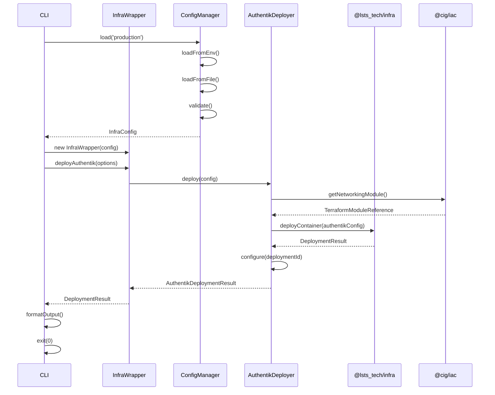

# Design Document: Infrastructure Deployment Wrapper

## Overview

The Infrastructure Deployment Wrapper (@cig/infra) is a TypeScript package that wraps the @lsts_tech/infra npm package to provide CIG-specific infrastructure deployment capabilities. This package serves as the bridge between the CIG monorepo and AWS infrastructure provisioning, handling authentication infrastructure (Authentik provider) and deployment pipelines for applications like the web dashboard.

The wrapper provides a simplified, opinionated interface for deploying CIG infrastructure while leveraging existing Terraform modules from @cig/iac. It abstracts the complexity of @lsts_tech/infra while adding CIG-specific configuration, error handling, and integration patterns.

Key capabilities:
- Wrapping @lsts_tech/infra deployment methods with CIG-specific context
- Deploying Authentik authentication provider to AWS
- Deploying the Next.js dashboard with integrated authentication
- Integrating with existing @cig/iac Terraform modules for networking and compute
- Providing CLI interface for deployment operations
- Managing environment-specific configuration

## Architecture

### High-Level Architecture

```mermaid
graph TB
    CLI[CLI Interface] --> Wrapper[Infra Wrapper Layer]
    Wrapper --> LSTS[@lsts_tech/infra]
    Wrapper --> Config[Configuration Manager]
    Wrapper --> IAC[@cig/iac Terraform Modules]
    
    LSTS --> AWS[AWS Infrastructure]
    IAC --> AWS
    
    Config --> EnvVars[Environment Variables]
    Config --> ConfigFiles[Configuration Files]
    
    Wrapper --> Authentik[Authentik Deployment]
    Wrapper --> Dashboard[Dashboard Deployment]
    
    Authentik --> AWS
    Dashboard --> AWS
    Dashboard --> Authentik
```

### Layer Responsibilities

1. **CLI Interface Layer**: Command-line interface for deployment operations
   - Parses command-line arguments
   - Invokes wrapper functions
   - Handles output formatting and exit codes

2. **Wrapper Layer**: Core abstraction over @lsts_tech/infra
   - Wraps LSTS infra methods with CIG-specific logic
   - Adds contextual error handling
   - Manages deployment orchestration
   - Coordinates between LSTS infra and IAC modules

3. **Configuration Manager**: Handles configuration loading and validation
   - Loads from environment variables
   - Loads from configuration files
   - Validates required parameters
   - Provides environment-specific overrides

4. **LSTS Infra Integration**: Direct integration with @lsts_tech/infra
   - Delegates AWS infrastructure provisioning
   - Handles LSTS-specific configuration
   - Manages LSTS error propagation

5. **IAC Module Integration**: Integration with existing Terraform modules
   - References @cig/iac networking modules
   - References @cig/iac compute modules
   - Passes configuration to Terraform modules

## Components and Interfaces

### Core Components

#### 1. InfraWrapper

Main wrapper class that orchestrates infrastructure deployment.

```typescript
interface DeploymentResult {
  success: boolean;
  resourceId?: string;
  url?: string;
  connectionDetails?: Record<string, string>;
  error?: string;
}

interface DeploymentOptions {
  environment: string;
  region: string;
  config?: Record<string, any>;
}

class InfraWrapper {
  constructor(config: ConfigManager);
  
  // Deploy Authentik authentication provider
  deployAuthentik(options: DeploymentOptions): Promise<DeploymentResult>;
  
  // Deploy dashboard application
  deployDashboard(options: DeploymentOptions): Promise<DeploymentResult>;
  
  // List deployed infrastructure
  listDeployments(environment: string): Promise<DeploymentInfo[]>;
  
  // Internal: wrap LSTS infra calls with error handling
  private wrapLSTSCall<T>(fn: () => Promise<T>): Promise<T>;
}
```

#### 2. ConfigManager

Manages configuration loading, validation, and environment-specific overrides.

```typescript
interface InfraConfig {
  aws: {
    region: string;
    accountId?: string;
  };
  authentik: {
    domain: string;
    adminEmail: string;
  };
  dashboard: {
    domain?: string;
    buildPath: string;
  };
  iac: {
    modulesPath: string;
    networkingModule: string;
    computeModule: string;
  };
}

interface ValidationResult {
  valid: boolean;
  errors: string[];
}

class ConfigManager {
  // Load configuration from multiple sources
  load(environment: string): InfraConfig;
  
  // Validate configuration completeness
  validate(config: Partial<InfraConfig>): ValidationResult;
  
  // Get environment-specific overrides
  getEnvironmentOverrides(environment: string): Partial<InfraConfig>;
  
  // Load from environment variables
  private loadFromEnv(): Partial<InfraConfig>;
  
  // Load from configuration file
  private loadFromFile(path: string): Partial<InfraConfig>;
}
```

#### 3. AuthentikDeployer

Handles Authentik provider deployment specifics.

```typescript
interface AuthentikConfig {
  domain: string;
  adminEmail: string;
  region: string;
  vpcId?: string;
  subnetId?: string;
}

interface AuthentikDeploymentResult extends DeploymentResult {
  connectionDetails?: {
    url: string;
    adminUrl: string;
    clientId?: string;
  };
}

class AuthentikDeployer {
  constructor(wrapper: InfraWrapper, config: ConfigManager);
  
  // Deploy Authentik to AWS
  deploy(config: AuthentikConfig): Promise<AuthentikDeploymentResult>;
  
  // Configure Authentik post-deployment
  configure(deploymentId: string): Promise<void>;
  
  // Get connection details for integration
  getConnectionDetails(deploymentId: string): Promise<Record<string, string>>;
}
```

#### 4. DashboardDeployer

Handles dashboard deployment and integration with Authentik.

```typescript
interface DashboardConfig {
  buildPath: string;
  domain?: string;
  region: string;
  authentikUrl: string;
  authentikClientId: string;
}

interface DashboardDeploymentResult extends DeploymentResult {
  url: string;
}

class DashboardDeployer {
  constructor(wrapper: InfraWrapper, config: ConfigManager);
  
  // Deploy dashboard to AWS
  deploy(config: DashboardConfig): Promise<DashboardDeploymentResult>;
  
  // Integrate with Authentik for authentication
  integrateAuthentik(deploymentId: string, authentikConfig: Record<string, string>): Promise<void>;
}
```

#### 5. IACIntegration

Manages integration with @cig/iac Terraform modules.

```typescript
interface TerraformModuleReference {
  modulePath: string;
  variables: Record<string, any>;
}

class IACIntegration {
  constructor(iacModulesPath: string);
  
  // Get networking module reference
  getNetworkingModule(config: Record<string, any>): TerraformModuleReference;
  
  // Get compute module reference
  getComputeModule(config: Record<string, any>): TerraformModuleReference;
  
  // Validate module exists and is compatible
  validateModule(modulePath: string): Promise<boolean>;
}
```

#### 6. CLI

Command-line interface for deployment operations.

```typescript
class CLI {
  // Main entry point
  static main(args: string[]): Promise<number>;
  
  // Deploy Authentik command
  private static deployAuthentik(options: CLIOptions): Promise<number>;
  
  // Deploy dashboard command
  private static deployDashboard(options: CLIOptions): Promise<number>;
  
  // List deployments command
  private static listDeployments(options: CLIOptions): Promise<number>;
}
```

### Component Interactions



## Data Models

### Configuration Schema

```typescript
// Main configuration structure
interface InfraConfig {
  aws: AWSConfig;
  authentik: AuthentikConfig;
  dashboard: DashboardConfig;
  iac: IACConfig;
  logging: LoggingConfig;
}

interface AWSConfig {
  region: string;              // AWS region (e.g., 'us-east-1')
  accountId?: string;          // AWS account ID (optional, can be detected)
  profile?: string;            // AWS CLI profile name
}

interface AuthentikConfig {
  domain: string;              // Domain for Authentik (e.g., 'auth.cig.example.com')
  adminEmail: string;          // Admin email for initial setup
  vpcId?: string;              // VPC ID (optional, will use IAC module default)
  subnetId?: string;           // Subnet ID (optional, will use IAC module default)
}

interface DashboardConfig {
  domain?: string;             // Custom domain (optional)
  buildPath: string;           // Path to built dashboard files
  authentikIntegration: boolean; // Enable Authentik integration
}

interface IACConfig {
  modulesPath: string;         // Path to @cig/iac modules
  networkingModule: string;    // Networking module name
  computeModule: string;       // Compute module name
}

interface LoggingConfig {
  level: 'debug' | 'info' | 'warn' | 'error';
  timestamps: boolean;
}
```

### Deployment State

```typescript
// Represents the state of a deployment
interface DeploymentInfo {
  id: string;                  // Unique deployment identifier
  type: 'authentik' | 'dashboard'; // Deployment type
  environment: string;         // Environment name
  region: string;              // AWS region
  status: DeploymentStatus;    // Current status
  createdAt: Date;             // Creation timestamp
  updatedAt: Date;             // Last update timestamp
  resources: ResourceInfo[];   // Associated AWS resources
  metadata: Record<string, any>; // Additional metadata
}

enum DeploymentStatus {
  PENDING = 'pending',
  IN_PROGRESS = 'in_progress',
  COMPLETED = 'completed',
  FAILED = 'failed',
  ROLLED_BACK = 'rolled_back'
}

interface ResourceInfo {
  type: string;                // Resource type (e.g., 'ec2', 's3', 'cloudfront')
  id: string;                  // AWS resource ID
  arn?: string;                // AWS ARN
  url?: string;                // Public URL if applicable
}
```

### Error Types

```typescript
// Base error class for infra operations
class InfraError extends Error {
  constructor(
    message: string,
    public code: string,
    public context?: Record<string, any>
  ) {
    super(message);
    this.name = 'InfraError';
  }
}

// Configuration validation error
class ConfigValidationError extends InfraError {
  constructor(
    message: string,
    public missingFields: string[]
  ) {
    super(message, 'CONFIG_VALIDATION_ERROR', { missingFields });
    this.name = 'ConfigValidationError';
  }
}

// LSTS infra error wrapper
class LSTSInfraError extends InfraError {
  constructor(
    message: string,
    public originalError: Error
  ) {
    super(message, 'LSTS_INFRA_ERROR', { originalError: originalError.message });
    this.name = 'LSTSInfraError';
  }
}

// Deployment error
class DeploymentError extends InfraError {
  constructor(
    message: string,
    public deploymentType: string,
    public phase: string
  ) {
    super(message, 'DEPLOYMENT_ERROR', { deploymentType, phase });
    this.name = 'DeploymentError';
  }
}
```


## Correctness Properties

A property is a characteristic or behavior that should hold true across all valid executions of a system—essentially, a formal statement about what the system should do. Properties serve as the bridge between human-readable specifications and machine-verifiable correctness guarantees.

### Property Reflection

After analyzing all acceptance criteria, I identified the following redundancies:
- Properties 6.1 and 6.2 (loading from env vars and files) can be combined into a single property about configuration loading from any valid source
- Properties 10.1, 10.2, and 10.3 (logging at different stages) can be combined into a comprehensive logging property
- Properties 3.3 and 4.4 (returning connection details/URLs) follow the same pattern and can be generalized
- Properties 7.4 and 7.5 (CLI exit codes) can be combined into a single property about exit code correctness

### Property 1: Error Context Enrichment

*For any* error thrown by @lsts_tech/infra, when caught by the wrapper, the re-thrown error should include the original error message plus additional contextual information about the operation being performed.

**Validates: Requirements 2.5**

### Property 2: Successful Deployment Returns Resource Information

*For any* successful deployment operation (Authentik or Dashboard), the result should include resource identifiers and connection details (URLs, endpoints, or credentials as applicable).

**Validates: Requirements 3.3, 4.4**

### Property 3: Failed Deployment Returns Descriptive Error

*For any* failed deployment operation, the error message should describe what failed, at which phase, and include actionable information for troubleshooting.

**Validates: Requirements 3.4**

### Property 4: Environment-Specific Configuration Application

*For any* environment name and deployment operation, the configuration applied should correctly merge base configuration with environment-specific overrides, with overrides taking precedence.

**Validates: Requirements 4.3, 6.5**

### Property 5: Multi-Environment Isolation

*For any* two different environment names, deploying the same component to both environments should produce isolated deployments with no shared state or resource conflicts.

**Validates: Requirements 4.5**

### Property 6: Configuration Parameter Propagation

*For any* configuration parameters provided to the wrapper, those parameters should be correctly passed through to the underlying IAC Terraform modules without loss or corruption.

**Validates: Requirements 5.3**

### Property 7: Configuration Loading from Any Valid Source

*For any* valid configuration source (environment variables, configuration file, or programmatic input), the ConfigManager should successfully load and merge the configuration into a complete InfraConfig object.

**Validates: Requirements 6.1, 6.2**

### Property 8: Configuration Validation Before Deployment

*For any* deployment operation, configuration validation should execute before any infrastructure provisioning begins, and invalid configuration should prevent deployment from starting.

**Validates: Requirements 6.3**

### Property 9: Missing Configuration Error Specificity

*For any* incomplete configuration missing required parameters, the validation error should list exactly which parameters are missing and provide no false positives or false negatives.

**Validates: Requirements 6.4**

### Property 10: CLI Exit Code Correctness

*For any* CLI command execution, the exit code should be 0 if and only if the operation completed successfully, and non-zero with an error message printed to stderr for any failure.

**Validates: Requirements 7.4, 7.5**

### Property 11: Deployment Logging Completeness

*For any* deployment operation, the logs should include: (1) operation start with name and environment, (2) progress indicators during execution, and (3) completion status with either success details or error with stack trace.

**Validates: Requirements 10.1, 10.2, 10.3**

### Property 12: Log Level Filtering

*For any* configured log level, log messages should be filtered such that only messages at or above the configured level are output, and all messages at lower levels are suppressed.

**Validates: Requirements 10.4**

### Property 13: Log Timestamp Presence

*For any* log message output by the system, the message should include a timestamp in ISO 8601 format at the beginning of the message.

**Validates: Requirements 10.5**

### Property 14: Configuration Source Round-Trip

*For any* valid InfraConfig object, serializing it to a configuration file and then loading it back should produce an equivalent configuration object.

**Pattern: Round-trip property for configuration serialization**

## Error Handling

### Error Handling Strategy

The wrapper implements a layered error handling approach:

1. **LSTS Infra Error Wrapping**: All calls to @lsts_tech/infra are wrapped in try-catch blocks that convert LSTS errors into LSTSInfraError instances with added context
2. **Configuration Validation**: Configuration errors are caught early and converted to ConfigValidationError with specific field information
3. **Deployment Phase Tracking**: Deployment errors include the phase (planning, provisioning, configuring) where the error occurred
4. **Error Propagation**: Errors propagate up the call stack with increasing context at each layer

### Error Categories

```typescript
// Error code categories
enum ErrorCode {
  // Configuration errors (1xxx)
  CONFIG_VALIDATION_ERROR = 'E1001',
  CONFIG_MISSING_REQUIRED = 'E1002',
  CONFIG_INVALID_FORMAT = 'E1003',
  
  // LSTS infra errors (2xxx)
  LSTS_INFRA_ERROR = 'E2001',
  LSTS_CONNECTION_ERROR = 'E2002',
  LSTS_AUTH_ERROR = 'E2003',
  
  // Deployment errors (3xxx)
  DEPLOYMENT_ERROR = 'E3001',
  DEPLOYMENT_TIMEOUT = 'E3002',
  DEPLOYMENT_ROLLBACK_FAILED = 'E3003',
  
  // IAC integration errors (4xxx)
  IAC_MODULE_NOT_FOUND = 'E4001',
  IAC_MODULE_INVALID = 'E4002',
  IAC_PARAMETER_ERROR = 'E4003',
  
  // CLI errors (5xxx)
  CLI_INVALID_COMMAND = 'E5001',
  CLI_INVALID_ARGS = 'E5002',
}
```

### Error Recovery

- **Automatic Retry**: Transient network errors are retried up to 3 times with exponential backoff
- **Rollback on Failure**: Partial deployments are automatically rolled back to prevent orphaned resources
- **State Preservation**: Deployment state is persisted to allow manual recovery or inspection
- **Detailed Logging**: All errors are logged with full context and stack traces for debugging

### Error Response Format

All errors returned from the wrapper follow a consistent structure:

```typescript
interface ErrorResponse {
  success: false;
  error: {
    code: string;           // Error code from ErrorCode enum
    message: string;        // Human-readable error message
    details?: any;          // Additional error details
    context?: {             // Contextual information
      operation: string;
      environment?: string;
      phase?: string;
    };
    timestamp: string;      // ISO 8601 timestamp
    stackTrace?: string;    // Stack trace (in debug mode)
  };
}
```

## Testing Strategy

### Dual Testing Approach

The testing strategy employs both unit tests and property-based tests to ensure comprehensive coverage:

- **Unit Tests**: Verify specific examples, edge cases, integration points, and error conditions
- **Property Tests**: Verify universal properties across all inputs through randomization

### Unit Testing Focus

Unit tests should focus on:
- Specific deployment scenarios (e.g., deploying Authentik with minimal config)
- Integration between wrapper and LSTS infra (mocked)
- Integration between wrapper and IAC modules (mocked)
- Edge cases like empty configuration, missing files, network timeouts
- Error conditions and error message formatting
- CLI argument parsing and command routing
- Configuration file format validation

Example unit tests:
```typescript
describe('AuthentikDeployer', () => {
  it('should deploy Authentik with minimal configuration', async () => {
    // Test specific example
  });
  
  it('should handle missing VPC ID by using IAC module default', async () => {
    // Test edge case
  });
  
  it('should throw ConfigValidationError when domain is missing', async () => {
    // Test error condition
  });
});
```

### Property-Based Testing Configuration

Property tests will use **fast-check** (TypeScript/JavaScript property-based testing library) with the following configuration:
- Minimum 100 iterations per property test
- Each test tagged with reference to design document property
- Tag format: `Feature: infra-deployment-wrapper, Property {number}: {property_text}`

Example property tests:
```typescript
import fc from 'fast-check';

describe('Property 1: Error Context Enrichment', () => {
  it('should enrich all LSTS errors with context', () => {
    // Feature: infra-deployment-wrapper, Property 1: Error Context Enrichment
    fc.assert(
      fc.property(
        fc.string(), // operation name
        fc.string(), // error message
        (operation, errorMsg) => {
          const lstsError = new Error(errorMsg);
          const enrichedError = wrapLSTSError(lstsError, operation);
          
          // Verify original message is preserved
          expect(enrichedError.message).toContain(errorMsg);
          // Verify context is added
          expect(enrichedError.context).toHaveProperty('operation', operation);
        }
      ),
      { numRuns: 100 }
    );
  });
});

describe('Property 9: Missing Configuration Error Specificity', () => {
  it('should list exactly missing parameters', () => {
    // Feature: infra-deployment-wrapper, Property 9: Missing Configuration Error Specificity
    fc.assert(
      fc.property(
        fc.record({
          aws: fc.option(fc.record({ region: fc.string() })),
          authentik: fc.option(fc.record({ domain: fc.string(), adminEmail: fc.string() })),
          dashboard: fc.option(fc.record({ buildPath: fc.string() })),
        }),
        (partialConfig) => {
          const result = configManager.validate(partialConfig);
          
          if (!result.valid) {
            // Verify each missing field is reported
            const missingFields = findMissingFields(partialConfig);
            expect(result.errors).toHaveLength(missingFields.length);
            missingFields.forEach(field => {
              expect(result.errors.some(e => e.includes(field))).toBe(true);
            });
          }
        }
      ),
      { numRuns: 100 }
    );
  });
});
```

### Test Coverage Goals

- Unit test coverage: >80% of lines
- Property test coverage: All 14 correctness properties implemented
- Integration test coverage: All major deployment paths (Authentik, Dashboard)
- CLI test coverage: All commands and error paths

### Testing Infrastructure

- **Mocking Strategy**: Mock @lsts_tech/infra and AWS SDK calls to avoid actual infrastructure provisioning during tests
- **Test Fixtures**: Provide sample configuration files and environment variable sets
- **Test Helpers**: Utility functions for generating valid/invalid configurations
- **CI Integration**: All tests run on every commit via GitHub Actions

