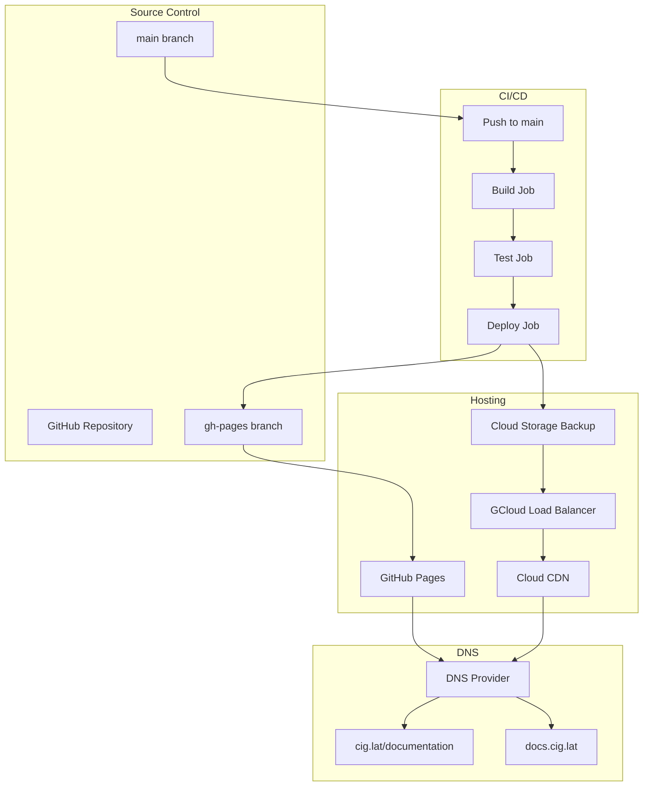

# Design Document: Landing Docs System

## Overview

The Landing Docs System is a comprehensive documentation platform built on Docusaurus v3 that serves as the central knowledge hub for the CIG (Compute Intelligence Graph) project. The system integrates seamlessly with the existing monorepo architecture, provides multi-language support through the @cig-technology/i18n package, enables interactive Mermaid diagrams, and deploys to dual endpoints (cig.lat/documentation and docs.cig.lat) using GitHub Pages with optional GCloud proxy for enhanced performance and reliability.

### Design Goals

1. **Developer Experience**: Provide a fast, intuitive local development environment with hot module reloading
2. **Content Management**: Enable easy content creation and maintenance through markdown/MDX files
3. **Internationalization**: Support multiple languages with consistent translation workflows
4. **Performance**: Achieve sub-second page loads through static generation and CDN caching
5. **Reliability**: Ensure 99.9% uptime through GitHub Pages with GCloud failover
6. **Accessibility**: Meet WCAG 2.1 AA standards for inclusive documentation access
7. **Maintainability**: Integrate with monorepo tooling for consistent build and deployment

### Key Technical Decisions

**Docusaurus v3 Selection**: Chosen for its React-based architecture, excellent plugin ecosystem, built-in i18n support, and strong community. Docusaurus provides out-of-the-box features like versioning, search, and MDX support that align with requirements.

**Static Site Generation**: All documentation is pre-rendered at build time, eliminating server-side dependencies and enabling deployment to GitHub Pages. This approach provides optimal performance and security.

**Dual Deployment Strategy**: Primary deployment to GitHub Pages provides free, reliable hosting with automatic SSL. Optional GCloud proxy adds CDN caching, custom domain routing, and DDoS protection for production traffic.

**Monorepo Integration**: The docs app lives at `apps/docs` and integrates with TurboRepo for coordinated builds, shared dependencies, and consistent tooling across the CIG ecosystem.

## Architecture

### System Architecture

```mermaid
graph TB
    subgraph "Content Layer"
        MD[Markdown Files]
        MDX[MDX Files]
        I18N[Translation Catalogs]
        ASSETS[Images/Assets]
    end
    
    subgraph "Build Layer"
        DOCUSAURUS[Docusaurus v3]
        WEBPACK[Webpack Bundler]
        I18N_ENGINE[@cig-technology/i18n]
        MERMAID[Mermaid Plugin]
        PARSER[Markdown Parser]
    end
    
    subgraph "Deployment Layer"
        GH_ACTIONS[GitHub Actions]
        GH_PAGES[GitHub Pages]
        GCLOUD[GCloud Proxy]
    end
    
    subgraph "Delivery Layer"
        DNS1[cig.lat/documentation]
        DNS2[docs.cig.lat]
        CDN[Cloud CDN]
    end
    
    MD --> PARSER
    MDX --> PARSER
    I18N --> I18N_ENGINE
    ASSETS --> WEBPACK
    
    PARSER --> DOCUSAURUS
    I18N_ENGINE --> DOCUSAURUS
    MERMAID --> DOCUSAURUS
    
    DOCUSAURUS --> WEBPACK
    WEBPACK --> GH_ACTIONS
    
    GH_ACTIONS --> GH_PAGES
    GH_ACTIONS --> GCLOUD
    
    GH_PAGES --> DNS1
    GCLOUD --> DNS2
    GCLOUD --> CDN
    CDN --> DNS2
```

### Component Architecture

```mermaid
graph LR
    subgraph "Apps Layer"
        DOCS[apps/docs]
    end
    
    subgraph "Packages Layer"
        I18N[@cig-technology/i18n]
        UI[@cig/ui]
        CONFIG[@cig/config]
    end
    
    subgraph "External Dependencies"
        DOCUSAURUS_CORE[@docusaurus/core]
        DOCUSAURUS_THEME[@docusaurus/theme-classic]
        DOCUSAURUS_MERMAID[@docusaurus/theme-mermaid]
        DOCUSAURUS_SEARCH[@docusaurus/plugin-search]
    end
    
    DOCS --> I18N
    DOCS --> UI
    DOCS --> CONFIG
    DOCS --> DOCUSAURUS_CORE
    DOCS --> DOCUSAURUS_THEME
    DOCS --> DOCUSAURUS_MERMAID
    DOCS --> DOCUSAURUS_SEARCH
```

### Deployment Architecture



## Components and Interfaces

### 1. Docusaurus Configuration Module

**Location**: `apps/docs/docusaurus.config.js`

**Responsibilities**:
- Configure Docusaurus core settings (site metadata, URLs, themes)
- Register plugins (Mermaid, search, analytics)
- Define navigation structure and sidebar configuration
- Configure i18n settings and supported languages
- Set up build optimization and performance settings

**Key Configuration**:
```javascript
module.exports = {
  title: 'CIG Documentation',
  tagline: 'Compute Intelligence Graph',
  url: 'https://docs.cig.lat',
  baseUrl: '/',
  organizationName: 'edwardcalderon',
  projectName: 'ComputeIntelligenceGraph',
  
  i18n: {
    defaultLocale: 'en',
    locales: ['en', 'es', 'pt', 'fr', 'de', 'zh', 'ja'],
  },
  
  presets: [
    ['classic', {
      docs: {
        sidebarPath: require.resolve('./sidebars.js'),
        editUrl: 'https://github.com/edwardcalderon/ComputeIntelligenceGraph/edit/main/apps/docs/',
      },
      theme: {
        customCss: require.resolve('./src/css/custom.css'),
      },
    }],
  ],
  
  plugins: [
    '@docusaurus/theme-mermaid',
    '@docusaurus/plugin-search-local',
  ],
  
  markdown: {
    mermaid: true,
  },
  
  themes: ['@docusaurus/theme-mermaid'],
};
```

### 2. i18n Integration Module

**Location**: `apps/docs/src/i18n/`

**Responsibilities**:
- Integrate @cig-technology/i18n package for translation management
- Provide language detection and switching functionality
- Manage translation catalogs for UI strings
- Handle locale-specific formatting (dates, numbers)
- Coordinate with Docusaurus i18n for content translations

**Interface**:
```typescript
// apps/docs/src/i18n/index.ts
import { createI18n } from '@cig-technology/i18n';

export interface I18nConfig {
  defaultLocale: string;
  locales: string[];
  catalogs: Record<string, TranslationCatalog>;
}

export interface TranslationCatalog {
  [key: string]: string | MessageFormat;
}

export const i18n = createI18n({
  defaultLocale: 'en',
  locales: ['en', 'es', 'pt', 'fr', 'de', 'zh', 'ja'],
  catalogs: {
    en: require('./locales/en/messages.json'),
    es: require('./locales/es/messages.json'),
    // ... other locales
  },
});

export function useTranslation() {
  return i18n.useTranslation();
}

export function LanguageSwitcher() {
  // Component for switching languages
}
```

### 3. Mermaid Diagram Renderer

**Location**: `apps/docs/src/components/Mermaid/`

**Responsibilities**:
- Render Mermaid diagrams from markdown code blocks
- Support all Mermaid diagram types
- Provide theme switching (light/dark mode)
- Enable diagram export (SVG/PNG)
- Handle rendering errors gracefully

**Interface**:
```typescript
// apps/docs/src/components/Mermaid/MermaidDiagram.tsx
export interface MermaidDiagramProps {
  chart: string;
  theme?: 'light' | 'dark';
  config?: MermaidConfig;
}

export interface MermaidConfig {
  fontSize?: number;
  padding?: number;
  curve?: 'basis' | 'linear' | 'step';
}

export function MermaidDiagram({ chart, theme, config }: MermaidDiagramProps) {
  // Render Mermaid diagram
}

export function useMermaidTheme() {
  // Hook for theme detection
}
```

### 4. Content Management System

**Location**: `apps/docs/docs/`

**Responsibilities**:
- Organize documentation content by language and section
- Maintain consistent directory structure across languages
- Provide frontmatter schema for metadata
- Support versioning for different CIG releases
- Enable draft content for unpublished pages

**Directory Structure**:
```
apps/docs/
├── docs/
│   ├── en/
│   │   ├── getting-started/
│   │   ├── architecture/
│   │   ├── api-reference/
│   │   ├── user-guide/
│   │   ├── developer-guide/
│   │   ├── troubleshooting/
│   │   ├── changelog/
│   │   └── faq/
│   ├── es/
│   │   └── [same structure]
│   ├── pt/
│   │   └── [same structure]
│   └── [other languages]
├── i18n/
│   ├── en/
│   │   └── docusaurus-theme-classic/
│   ├── es/
│   └── [other languages]
├── static/
│   ├── img/
│   └── assets/
├── src/
│   ├── components/
│   ├── css/
│   └── pages/
├── docusaurus.config.js
├── sidebars.js
└── package.json
```

**Frontmatter Schema**:
```yaml
---
id: unique-page-id
title: Page Title
description: Page description for SEO
sidebar_label: Sidebar Label
sidebar_position: 1
tags: [tag1, tag2]
draft: false
last_update:
  date: 2024-01-01
  author: Author Name
---
```

### 5. Search Module

**Location**: `apps/docs/src/theme/SearchBar/`

**Responsibilities**:
- Provide full-text search across all documentation
- Index content during build time
- Support language-specific search
- Filter results by section and version
- Highlight search terms in results

**Interface**:
```typescript
// apps/docs/src/theme/SearchBar/index.tsx
export interface SearchResult {
  id: string;
  title: string;
  content: string;
  url: string;
  section: string;
  language: string;
  version: string;
}

export interface SearchOptions {
  language?: string;
  section?: string;
  version?: string;
  limit?: number;
}

export function SearchBar() {
  // Search component
}

export function useSearch(query: string, options?: SearchOptions): SearchResult[] {
  // Search hook
}
```

### 6. Build and Deployment Pipeline

**Location**: `.github/workflows/docs-deploy.yml`

**Responsibilities**:
- Trigger on push to main branch
- Run linting and validation checks
- Build documentation for all languages
- Run tests (link checking, accessibility)
- Deploy to GitHub Pages
- Optionally sync to GCloud Storage
- Invalidate CDN cache

**Workflow Steps**:
1. Checkout code
2. Setup Node.js and pnpm
3. Install dependencies
4. Run linting (ESLint, Prettier)
5. Validate markdown files
6. Check links (internal and external)
7. Build documentation
8. Run accessibility tests
9. Deploy to gh-pages branch
10. Sync to GCloud Storage (optional)
11. Invalidate CDN cache
12. Send deployment notification

### 7. Analytics Module

**Location**: `apps/docs/src/components/Analytics/`

**Responsibilities**:
- Track page views and user interactions
- Collect search queries and results
- Monitor language usage patterns
- Track documentation section popularity
- Respect user privacy and GDPR compliance

**Interface**:
```typescript
// apps/docs/src/components/Analytics/index.tsx
export interface AnalyticsEvent {
  category: string;
  action: string;
  label?: string;
  value?: number;
}

export function trackPageView(url: string, language: string) {
  // Track page view
}

export function trackEvent(event: AnalyticsEvent) {
  // Track custom event
}

export function trackSearch(query: string, resultsCount: number) {
  // Track search query
}
```

## Data Models

### Documentation Page Model

```typescript
interface DocumentationPage {
  id: string;
  slug: string;
  title: string;
  description: string;
  content: string;
  language: string;
  version: string;
  section: string;
  tags: string[];
  author: string;
  lastUpdate: Date;
  draft: boolean;
  frontmatter: PageFrontmatter;
  toc: TableOfContents;
}

interface PageFrontmatter {
  id: string;
  title: string;
  description: string;
  sidebar_label?: string;
  sidebar_position?: number;
  tags?: string[];
  draft?: boolean;
  last_update?: {
    date: string;
    author: string;
  };
}

interface TableOfContents {
  items: TOCItem[];
}

interface TOCItem {
  id: string;
  value: string;
  level: number;
  children?: TOCItem[];
}
```

### Translation Catalog Model

```typescript
interface TranslationCatalog {
  locale: string;
  messages: Record<string, TranslationMessage>;
  metadata: CatalogMetadata;
}

interface TranslationMessage {
  id: string;
  message: string;
  description?: string;
  context?: string;
}

interface CatalogMetadata {
  language: string;
  version: string;
  lastUpdate: Date;
  completeness: number; // 0-100%
  contributors: string[];
}
```

### Mermaid Diagram Model

```typescript
interface MermaidDiagram {
  id: string;
  type: MermaidDiagramType;
  source: string;
  config: MermaidConfig;
  theme: 'light' | 'dark';
}

type MermaidDiagramType = 
  | 'flowchart'
  | 'sequence'
  | 'class'
  | 'state'
  | 'er'
  | 'gantt'
  | 'pie'
  | 'git';

interface MermaidConfig {
  fontSize?: number;
  padding?: number;
  curve?: 'basis' | 'linear' | 'step';
  theme?: {
    primaryColor?: string;
    primaryTextColor?: string;
    primaryBorderColor?: string;
    lineColor?: string;
    secondaryColor?: string;
    tertiaryColor?: string;
  };
}
```

### Search Index Model

```typescript
interface SearchIndex {
  version: string;
  language: string;
  documents: SearchDocument[];
  metadata: IndexMetadata;
}

interface SearchDocument {
  id: string;
  title: string;
  content: string;
  url: string;
  section: string;
  tags: string[];
  version: string;
  language: string;
  tokens: string[];
}

interface IndexMetadata {
  buildDate: Date;
  documentCount: number;
  tokenCount: number;
}
```

### Deployment Configuration Model

```typescript
interface DeploymentConfig {
  environment: 'development' | 'staging' | 'production';
  githubPages: GitHubPagesConfig;
  gcloud?: GCloudConfig;
  dns: DNSConfig;
}

interface GitHubPagesConfig {
  enabled: boolean;
  branch: string;
  cname?: string;
}

interface GCloudConfig {
  enabled: boolean;
  projectId: string;
  bucket: string;
  loadBalancer: {
    name: string;
    ipAddress: string;
  };
  cdn: {
    enabled: boolean;
    cachePolicy: string;
  };
}

interface DNSConfig {
  primaryDomain: string;
  secondaryDomain: string;
  records: DNSRecord[];
}

interface DNSRecord {
  type: 'A' | 'CNAME' | 'TXT';
  name: string;
  value: string;
  ttl: number;
}
```

## Correctness Properties

*A property is a characteristic or behavior that should hold true across all valid executions of a system—essentially, a formal statement about what the system should do. Properties serve as the bridge between human-readable specifications and machine-verifiable correctness guarantees.*


### Property Reflection

After analyzing all acceptance criteria, I identified the following redundancies:

1. **Link Validation Redundancy**: Requirements 15.2 and 24.2 both test link validation. These can be combined into a single comprehensive property.

2. **Language Selection Redundancy**: Requirements 3.3 and 11.5 both test selection behavior (language and version). While they test different dimensions, the pattern is similar and can be generalized.

3. **Build Output Redundancy**: Requirements 1.3, 8.4, and 15.9 all test build output in different contexts. These can be consolidated into properties about build completeness.

After reflection, the following properties provide unique validation value:

### Property 1: Markdown Format Support

*For any* valid markdown (.md) or MDX (.mdx) file, the parser should successfully parse the file and extract its content and frontmatter.

**Validates: Requirements 1.6**

### Property 2: Mermaid Diagram Rendering

*For any* valid Mermaid diagram code block in markdown, the renderer should produce an interactive SVG diagram element in the output HTML.

**Validates: Requirements 2.2**

### Property 3: Mermaid Error Handling

*For any* invalid Mermaid diagram syntax, the renderer should display an error message instead of crashing or showing blank content.

**Validates: Requirements 2.8**

### Property 4: Language Selection Consistency

*For any* supported language selection, all UI strings and navigation elements should display in the selected language.

**Validates: Requirements 3.3**

### Property 5: Language Preference Persistence

*For any* language selection, storing the preference to localStorage then retrieving it should return the same language code (round-trip property).

**Validates: Requirements 3.7**

### Property 6: Directory Structure Consistency

*For any* file path in the English documentation directory, equivalent paths should exist in all other language directories (or be marked as missing in validation).

**Validates: Requirements 4.2**

### Property 7: Translation Fallback

*For any* documentation page request in a language where the translation is missing, the system should serve the English version of that page.

**Validates: Requirements 4.5**

### Property 8: DNS Endpoint Content Equivalence

*For any* documentation page URL, fetching the content from cig.lat/documentation and docs.cig.lat should return identical HTML content (ignoring timestamps).

**Validates: Requirements 6.3**

### Property 9: Cache Header Presence

*For any* HTTP response from the GCloud proxy, the response headers should include Cache-Control and ETag headers with valid values.

**Validates: Requirements 7.4**

### Property 10: Breadcrumb Navigation Accuracy

*For any* nested documentation page, the breadcrumb navigation should accurately reflect the page's position in the hierarchy from root to current page.

**Validates: Requirements 9.10**

### Property 11: Search Result Relevance

*For any* search query, all returned results should contain at least one occurrence of the search term in either the title or content.

**Validates: Requirements 10.2**

### Property 12: Version Selection Consistency

*For any* version selection, all documentation pages should display content from that specific version, not mixed versions.

**Validates: Requirements 11.5**

### Property 13: Code Block Copy Functionality

*For any* code block in the documentation, the copy-to-clipboard button should copy the exact code content (excluding line numbers and syntax highlighting markup).

**Validates: Requirements 14.5**

### Property 14: Link Validation Completeness

*For any* set of documentation pages, all internal links should resolve to existing pages, and all external links should return HTTP 200 or 3xx status codes.

**Validates: Requirements 15.2, 24.2**

### Property 15: Incremental Build Efficiency

*For any* single page update, the build process should only regenerate that page and its dependent pages, not the entire documentation set.

**Validates: Requirements 17.5**

### Property 16: Performance Benchmark

*For any* documentation page, the Lighthouse performance score should be 90 or higher when measured under standard conditions.

**Validates: Requirements 19.6**

### Property 17: HTTPS Enforcement

*For any* HTTP request to the documentation endpoints, the server should either serve over HTTPS or redirect to the HTTPS version.

**Validates: Requirements 20.1**

### Property 18: Markdown Round-Trip Preservation

*For any* valid markdown document, parsing the markdown to AST then serializing back to markdown should produce semantically equivalent content (round-trip property).

**Validates: Requirements 21.5**

### Property 19: Translation Completeness Validation

*For any* language in the translation catalog, the completeness percentage should accurately reflect the ratio of translated strings to total strings.

**Validates: Requirements 22.3**

### Property 20: Markdown Error Reporting

*For any* markdown file with syntax errors, the build process should report the error with the filename and line number where the error occurred.

**Validates: Requirements 23.1**

## Error Handling

### Build-Time Error Handling

**Markdown Parsing Errors**:
- Detect syntax errors in markdown files
- Report filename, line number, and error description
- Support strict mode (fail build) and lenient mode (warn and continue)
- Provide suggestions for common errors (unclosed code blocks, invalid frontmatter)

**Link Validation Errors**:
- Check all internal links resolve to existing pages
- Check all external links return valid HTTP status codes
- Report broken links with source page and target URL
- Support link checking in CI/CD pipeline
- Cache external link checks to avoid rate limiting

**Translation Errors**:
- Detect missing translations for required languages
- Report translation completeness percentage
- Validate ICU MessageFormat syntax
- Check for placeholder mismatches between languages
- Generate translation status report

**Mermaid Diagram Errors**:
- Catch Mermaid syntax errors during rendering
- Display user-friendly error messages in place of diagram
- Log detailed error information for debugging
- Support diagram validation in CI/CD pipeline

### Runtime Error Handling

**Search Errors**:
- Handle search index loading failures gracefully
- Display error message if search is unavailable
- Fall back to browser find functionality
- Log search errors for monitoring

**Language Switching Errors**:
- Handle missing language files gracefully
- Fall back to default language (English)
- Display warning message to user
- Log language switching errors

**Asset Loading Errors**:
- Handle missing images with placeholder
- Display alt text when images fail to load
- Log asset loading errors
- Support lazy loading with error boundaries

**Analytics Errors**:
- Handle analytics script loading failures silently
- Don't block page rendering if analytics fails
- Log analytics errors for debugging
- Support analytics opt-out

### Deployment Error Handling

**Build Failures**:
- Halt deployment if build fails
- Send notification to maintainers
- Preserve previous successful deployment
- Log detailed build error information

**Deployment Failures**:
- Retry deployment up to 3 times
- Roll back to previous version if deployment fails
- Send alert to deployment team
- Log deployment errors and status

**CDN Cache Invalidation Errors**:
- Retry cache invalidation if it fails
- Log cache invalidation status
- Alert if cache invalidation repeatedly fails
- Support manual cache invalidation

## Testing Strategy

### Dual Testing Approach

The Landing Docs System employs both unit testing and property-based testing to ensure comprehensive coverage:

**Unit Tests**: Focus on specific examples, edge cases, and integration points
- Specific markdown parsing examples
- Specific Mermaid diagram types
- Language switching scenarios
- Search functionality with known queries
- Build pipeline integration points
- Error handling edge cases

**Property Tests**: Verify universal properties across all inputs
- Markdown round-trip preservation (100+ random documents)
- Link validation across all pages
- Translation completeness for all languages
- Cache header presence for all responses
- Search result relevance for random queries
- Directory structure consistency across languages

### Testing Framework Configuration

**Property-Based Testing Library**: fast-check (JavaScript/TypeScript)

**Configuration**:
- Minimum 100 iterations per property test
- Seed-based reproducibility for failed tests
- Shrinking enabled for minimal failing examples
- Timeout: 30 seconds per property test

**Test Tagging Format**:
```javascript
// Feature: landing-docs-system, Property 18: Markdown Round-Trip Preservation
test('markdown round-trip preserves content', () => {
  fc.assert(
    fc.property(fc.markdownDocument(), (doc) => {
      const ast = parseMarkdown(doc);
      const serialized = serializeMarkdown(ast);
      return semanticallyEquivalent(doc, serialized);
    }),
    { numRuns: 100 }
  );
});
```

### Unit Testing Strategy

**Markdown Parser Tests**:
- Test parsing of valid markdown files
- Test frontmatter extraction
- Test code block parsing
- Test table parsing
- Test list parsing
- Test error handling for invalid syntax

**Mermaid Renderer Tests**:
- Test rendering of each diagram type
- Test theme switching
- Test error handling for invalid syntax
- Test diagram export functionality

**i18n Integration Tests**:
- Test language detection
- Test language switching
- Test translation loading
- Test fallback behavior
- Test locale-specific formatting

**Search Tests**:
- Test search indexing
- Test search query processing
- Test result ranking
- Test filtering by language and section
- Test keyboard navigation

**Build Pipeline Tests**:
- Test build process completion
- Test link validation
- Test image optimization
- Test static file generation
- Test deployment to GitHub Pages

### Property-Based Testing Strategy

**Property 1: Markdown Format Support**
- Generate random markdown and MDX files
- Verify parser successfully extracts content and frontmatter
- Check for parsing errors

**Property 2: Mermaid Diagram Rendering**
- Generate random valid Mermaid diagrams
- Verify SVG output is produced
- Check diagram is interactive

**Property 3: Mermaid Error Handling**
- Generate random invalid Mermaid syntax
- Verify error message is displayed
- Check system doesn't crash

**Property 5: Language Preference Persistence**
- Generate random language selections
- Store to localStorage and retrieve
- Verify round-trip returns same value

**Property 6: Directory Structure Consistency**
- Generate random file paths
- Check existence across all language directories
- Verify structure consistency

**Property 8: DNS Endpoint Content Equivalence**
- Generate random page URLs
- Fetch from both endpoints
- Verify content is identical

**Property 11: Search Result Relevance**
- Generate random search queries
- Verify all results contain search terms
- Check result ranking

**Property 14: Link Validation Completeness**
- Extract all links from documentation
- Verify internal links resolve
- Check external links return valid status

**Property 18: Markdown Round-Trip Preservation**
- Generate random markdown documents
- Parse to AST and serialize back
- Verify semantic equivalence

**Property 19: Translation Completeness Validation**
- Generate random translation catalogs
- Calculate completeness percentage
- Verify accuracy of calculation

### Integration Testing

**End-to-End Tests**:
- Test complete user journeys (landing → search → page view)
- Test language switching across multiple pages
- Test version switching
- Test navigation through documentation hierarchy
- Test search and result navigation

**Deployment Tests**:
- Test GitHub Actions workflow
- Test deployment to GitHub Pages
- Test DNS resolution
- Test CDN caching
- Test SSL/TLS certificates

### Accessibility Testing

**Automated Tests**:
- Run axe-core accessibility tests on all pages
- Check WCAG 2.1 AA compliance
- Verify keyboard navigation
- Check color contrast ratios
- Validate semantic HTML

**Manual Tests**:
- Test with screen readers (NVDA, JAWS, VoiceOver)
- Test keyboard-only navigation
- Test with browser zoom (up to 200%)
- Test with high contrast mode

### Performance Testing

**Lighthouse Tests**:
- Run Lighthouse on all major pages
- Verify performance score ≥ 90
- Check accessibility score ≥ 90
- Verify best practices score ≥ 90
- Check SEO score ≥ 90

**Load Tests**:
- Test page load times under various network conditions
- Test CDN cache hit rates
- Test concurrent user access
- Monitor resource usage

### Security Testing

**Automated Security Scans**:
- Run npm audit on dependencies
- Check for known vulnerabilities
- Verify security headers
- Test Content Security Policy
- Check for XSS vulnerabilities

**Manual Security Review**:
- Review authentication and authorization
- Check for sensitive data exposure
- Verify HTTPS enforcement
- Review third-party integrations

## Implementation Approach

### Phase 1: Foundation Setup (Week 1)

1. **Initialize Docusaurus Project**
   - Create apps/docs directory
   - Install Docusaurus v3 and dependencies
   - Configure docusaurus.config.js
   - Set up basic theme and styling
   - Configure monorepo integration

2. **Configure Build Pipeline**
   - Add docs build to turbo.json
   - Create package.json scripts
   - Set up TypeScript configuration
   - Configure ESLint and Prettier
   - Test local development server

3. **Set Up Content Structure**
   - Create docs directory structure
   - Define sidebar configuration
   - Create initial documentation pages
   - Set up static assets directory
   - Configure frontmatter schema

### Phase 2: i18n Integration (Week 2)

1. **Integrate @cig-technology/i18n**
   - Install i18n package
   - Configure supported languages
   - Create translation catalogs
   - Implement language switcher component
   - Set up language detection

2. **Organize Multi-Language Content**
   - Create language-specific directories
   - Duplicate content structure for each language
   - Translate initial documentation pages
   - Configure fallback behavior
   - Test language switching

3. **Translation Workflow**
   - Create translation validation script
   - Set up translation completeness reporting
   - Document translation contribution process
   - Create translation templates

### Phase 3: Mermaid Integration (Week 2)

1. **Install Mermaid Plugin**
   - Install @docusaurus/theme-mermaid
   - Configure Mermaid in docusaurus.config.js
   - Set up light and dark themes
   - Test basic diagram rendering

2. **Enhance Mermaid Support**
   - Implement diagram export functionality
   - Add error handling for invalid diagrams
   - Configure diagram styling
   - Create diagram examples for documentation

### Phase 4: Search Implementation (Week 3)

1. **Install Search Plugin**
   - Install @docusaurus/plugin-search-local
   - Configure search indexing
   - Set up language-specific search
   - Test search functionality

2. **Enhance Search Features**
   - Implement result filtering
   - Add keyboard navigation
   - Configure result ranking
   - Test search performance

### Phase 5: GitHub Pages Deployment (Week 3)

1. **Configure GitHub Pages**
   - Set up gh-pages branch
   - Configure repository settings
   - Set up custom domain (if applicable)
   - Test manual deployment

2. **Create GitHub Actions Workflow**
   - Create .github/workflows/docs-deploy.yml
   - Configure build and test steps
   - Set up deployment to gh-pages
   - Configure caching for faster builds
   - Test automated deployment

### Phase 6: GCloud Infrastructure (Week 4)

1. **Set Up GCloud Resources**
   - Create GCloud project
   - Set up Cloud Storage bucket
   - Configure Load Balancer
   - Enable Cloud CDN
   - Configure SSL certificates

2. **Configure DNS Routing**
   - Set up DNS records for cig.lat/documentation
   - Set up DNS records for docs.cig.lat
   - Configure routing rules
   - Test DNS resolution

3. **Implement Deployment Sync**
   - Add GCloud sync to GitHub Actions
   - Configure cache invalidation
   - Test deployment to GCloud
   - Verify CDN caching

### Phase 7: Analytics and Monitoring (Week 4)

1. **Integrate Analytics**
   - Set up Google Analytics or alternative
   - Implement tracking code
   - Configure event tracking
   - Set up GDPR compliance

2. **Set Up Monitoring**
   - Configure uptime monitoring
   - Set up performance monitoring
   - Configure error logging
   - Set up alerting

### Phase 8: Testing and Quality Assurance (Week 5)

1. **Implement Unit Tests**
   - Write tests for markdown parser
   - Write tests for i18n integration
   - Write tests for search functionality
   - Write tests for build pipeline

2. **Implement Property-Based Tests**
   - Install fast-check library
   - Write property tests for markdown round-trip
   - Write property tests for link validation
   - Write property tests for translation completeness
   - Configure test runs (100+ iterations)

3. **Accessibility Testing**
   - Run automated accessibility tests
   - Perform manual screen reader testing
   - Test keyboard navigation
   - Fix accessibility issues

4. **Performance Testing**
   - Run Lighthouse tests
   - Optimize images and assets
   - Configure lazy loading
   - Test CDN performance

### Phase 9: Documentation and Launch (Week 5-6)

1. **Create Documentation Content**
   - Write Getting Started guide
   - Write Architecture documentation
   - Write API Reference
   - Write User Guide
   - Write Developer Guide
   - Write Troubleshooting guide

2. **Translation**
   - Translate core documentation to all supported languages
   - Review translations for accuracy
   - Test multi-language navigation

3. **Launch Preparation**
   - Perform final testing
   - Review security configuration
   - Set up monitoring and alerting
   - Prepare launch announcement

4. **Launch**
   - Deploy to production
   - Announce documentation availability
   - Monitor for issues
   - Gather user feedback

### Phase 10: Maintenance and Iteration (Ongoing)

1. **Content Updates**
   - Regular documentation updates
   - Add new content as features are released
   - Update translations
   - Fix broken links

2. **Performance Optimization**
   - Monitor performance metrics
   - Optimize slow pages
   - Improve search performance
   - Optimize CDN caching

3. **Community Engagement**
   - Review community contributions
   - Respond to documentation issues
   - Improve based on user feedback
   - Recognize contributors

## Technical Decisions and Rationale

### Why Docusaurus v3?

**Pros**:
- React-based, familiar to team
- Excellent plugin ecosystem
- Built-in i18n support
- Strong community and documentation
- MDX support for interactive components
- Versioning support out of the box
- Fast static site generation
- SEO-friendly

**Cons**:
- Requires Node.js build process
- Limited customization without swizzling
- React dependency adds bundle size

**Decision**: Docusaurus v3 is the best fit for our requirements. The built-in features (i18n, versioning, search) align perfectly with our needs, and the React-based architecture integrates well with our existing monorepo.

### Why GitHub Pages + GCloud?

**GitHub Pages Pros**:
- Free hosting
- Automatic SSL
- Simple deployment from gh-pages branch
- Good reliability
- No server management

**GitHub Pages Cons**:
- Limited to static sites
- No CDN control
- Limited custom domain options
- No advanced caching control

**GCloud Pros**:
- Global CDN with edge caching
- Advanced caching control
- DDoS protection
- Custom domain support
- Load balancing
- Better performance for global users

**GCloud Cons**:
- Cost (though minimal for documentation)
- More complex setup
- Requires infrastructure management

**Decision**: Use GitHub Pages as primary deployment for simplicity and cost, with optional GCloud proxy for production traffic to provide CDN caching and custom domain support. This hybrid approach provides the best of both worlds.

### Why @cig-technology/i18n?

**Pros**:
- Already part of CIG ecosystem
- Consistent with other CIG applications
- ICU MessageFormat support
- Proven in production

**Cons**:
- Additional dependency
- Requires coordination with Docusaurus i18n

**Decision**: Use @cig-technology/i18n for UI strings and Docusaurus built-in i18n for content. This provides consistency across CIG applications while leveraging Docusaurus's excellent content i18n features.

### Why fast-check for Property-Based Testing?

**Pros**:
- Mature JavaScript/TypeScript PBT library
- Excellent shrinking capabilities
- Good documentation
- Active maintenance
- Integrates with Jest

**Cons**:
- Learning curve for team
- Slower than unit tests

**Decision**: fast-check is the best PBT library for JavaScript/TypeScript. The investment in learning PBT will pay off through better test coverage and bug detection.

### Why Static Site Generation?

**Pros**:
- Optimal performance (pre-rendered HTML)
- No server-side dependencies
- Easy deployment
- Better SEO
- Lower hosting costs
- Better security (no server to attack)

**Cons**:
- Build time increases with content
- No dynamic content
- Requires rebuild for updates

**Decision**: Static site generation is perfect for documentation. The content changes infrequently, and the performance and security benefits far outweigh the rebuild requirement.

## Security Considerations

### Content Security Policy

Implement strict CSP headers to prevent XSS attacks:
```
Content-Security-Policy: 
  default-src 'self'; 
  script-src 'self' 'unsafe-inline' https://www.googletagmanager.com; 
  style-src 'self' 'unsafe-inline'; 
  img-src 'self' data: https:; 
  font-src 'self' data:; 
  connect-src 'self' https://www.google-analytics.com;
```

### HTTPS Enforcement

- All connections must use HTTPS
- Implement HSTS headers: `Strict-Transport-Security: max-age=31536000; includeSubDomains`
- Redirect HTTP to HTTPS automatically

### Dependency Security

- Run `npm audit` regularly
- Update dependencies promptly
- Use Dependabot for automated security updates
- Review dependencies before adding

### Access Control

- Limit GitHub Actions permissions to minimum required
- Use GitHub secrets for sensitive data
- Implement branch protection rules
- Require code review for documentation changes

### Privacy and GDPR Compliance

- Implement cookie consent banner
- Provide privacy policy
- Allow analytics opt-out
- Minimize data collection
- Don't track personal information

## Performance Optimization

### Build-Time Optimization

- Enable code splitting for faster initial load
- Optimize images during build (compression, responsive images)
- Minify HTML, CSS, and JavaScript
- Generate source maps for debugging
- Use incremental builds for faster development

### Runtime Optimization

- Lazy load images and content below the fold
- Preload critical resources
- Use service workers for offline access
- Implement caching strategies for static assets
- Enable HTTP/2 for multiplexing

### CDN Optimization

- Configure aggressive caching for static assets
- Set appropriate cache headers (Cache-Control, ETag)
- Enable compression (gzip, brotli)
- Use edge caching for global distribution
- Implement cache invalidation on deployment

### Monitoring and Metrics

- Track Core Web Vitals (LCP, FID, CLS)
- Monitor page load times
- Track CDN cache hit rates
- Monitor build times
- Set up performance budgets

## Deployment Strategy

### Development Environment

- Local development server at http://localhost:3000
- Hot module reloading for instant updates
- Mock analytics for testing
- Local search index
- All languages available locally

### Staging Environment

- Deploy to staging branch
- Test deployment process
- Verify all features work
- Run full test suite
- Manual QA testing

### Production Environment

- Deploy to gh-pages branch
- Sync to GCloud Storage
- Invalidate CDN cache
- Verify deployment success
- Monitor for errors

### Rollback Strategy

- Keep previous deployment available
- Implement blue-green deployment
- Test rollback process
- Document rollback procedure
- Monitor after rollback

## Maintenance and Operations

### Regular Maintenance Tasks

**Daily**:
- Monitor uptime and performance
- Check error logs
- Review analytics

**Weekly**:
- Update dependencies
- Review and merge documentation PRs
- Check broken links
- Review search queries

**Monthly**:
- Security audit
- Performance review
- Content review and updates
- Translation updates

**Quarterly**:
- Major version updates
- Infrastructure review
- User feedback analysis
- Documentation strategy review

### Incident Response

**Downtime**:
1. Check monitoring alerts
2. Verify DNS resolution
3. Check GitHub Pages status
4. Check GCloud status
5. Implement failover if needed
6. Communicate with users
7. Post-mortem after resolution

**Performance Degradation**:
1. Check CDN cache hit rates
2. Review recent deployments
3. Check for large assets
4. Optimize problematic pages
5. Invalidate CDN cache if needed

**Security Incident**:
1. Assess severity
2. Isolate affected systems
3. Apply security patches
4. Review access logs
5. Communicate with stakeholders
6. Post-mortem and prevention

## Future Enhancements

### Phase 2 Features (Post-Launch)

1. **Interactive Code Examples**
   - Embed runnable code snippets
   - Support multiple languages
   - Provide live output

2. **Video Tutorials**
   - Embed video content
   - Provide transcripts
   - Support multiple languages

3. **API Playground**
   - Interactive API testing
   - Authentication support
   - Request/response examples

4. **Community Features**
   - Comments on documentation pages
   - User ratings and feedback
   - Community-contributed examples

5. **Advanced Search**
   - AI-powered search
   - Natural language queries
   - Search suggestions

6. **Offline Support**
   - Progressive Web App (PWA)
   - Offline documentation access
   - Sync when online

7. **Documentation Analytics Dashboard**
   - Real-time usage metrics
   - Popular pages and searches
   - User journey visualization

8. **Automated Translation**
   - Machine translation for initial drafts
   - Human review workflow
   - Translation memory

## Conclusion

The Landing Docs System design provides a comprehensive, scalable, and maintainable documentation platform for the CIG project. By leveraging Docusaurus v3, integrating with the existing monorepo, and implementing dual deployment to GitHub Pages and GCloud, we achieve a balance of simplicity, performance, and reliability.

The design emphasizes:
- **Developer experience** through hot reloading and familiar tools
- **Content quality** through validation and testing
- **Global accessibility** through i18n and CDN distribution
- **Performance** through static generation and caching
- **Maintainability** through monorepo integration and automated deployment

The property-based testing strategy ensures correctness across all inputs, while unit tests cover specific scenarios and edge cases. The phased implementation approach allows for iterative development and early feedback.

With this design, the CIG documentation will be accessible, performant, and maintainable, serving as a valuable resource for users and contributors worldwide.
