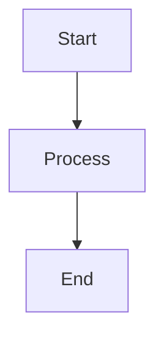

# CIG Documentation System

This is the official documentation for the Compute Intelligence Graph (CIG) project, built with Docusaurus v3.

## Quick Start

### Prerequisites

- Node.js 20.0 or higher
- pnpm 9.0 or higher

### Installation

```bash
# Install dependencies (from monorepo root)
pnpm install

# Or install just for docs
cd apps/docs
pnpm install
```

### Development

```bash
# Start development server
pnpm dev

# The site will be available at http://localhost:3000
```

### Building

```bash
# Build for production
pnpm build

# Serve the built site locally
pnpm serve
```

## Project Structure

```
apps/docs/
├── docs/
│   └── en/
│       ├── getting-started/
│       ├── architecture/
│       ├── api-reference/
│       ├── user-guide/
│       ├── developer-guide/
│       ├── troubleshooting/
│       ├── changelog/
│       └── faq/
├── src/
│   ├── components/
│   ├── css/
│   └── pages/
├── static/
│   └── img/
├── docusaurus.config.ts
├── sidebars.ts
└── package.json
```

## Features

- **Docusaurus v3**: Modern static site generator
- **Mermaid Diagrams**: Interactive diagram support
- **Syntax Highlighting**: Code blocks with multiple language support
- **Responsive Design**: Mobile-friendly layout
- **Dark Mode**: Light and dark theme support
- **Search**: Built-in full-text search
- **Versioning**: Support for multiple documentation versions
- **Accessibility**: WCAG 2.1 AA compliant

## Documentation Structure

### Getting Started
- Installation instructions
- Quick start guide
- Basic usage examples

### Architecture
- System design overview
- Component architecture
- Data models

### API Reference
- Endpoint documentation
- Request/response examples
- Authentication details

### User Guide
- Feature documentation
- Step-by-step tutorials
- Common workflows

### Developer Guide
- Contribution guidelines
- Development setup
- Coding standards

### Troubleshooting
- Common issues and solutions
- Debugging tips
- Support channels

### Resources
- Changelog
- FAQ

## Writing Documentation

### Markdown Format

Documentation pages use standard Markdown with YAML frontmatter:

```markdown
---
id: unique-page-id
title: Page Title
description: Page description for SEO
sidebar_position: 1
---

# Page Title

Content goes here...
```

### Mermaid Diagrams

Include interactive diagrams using Mermaid syntax:

````markdown

````

### Code Examples

Include code blocks with syntax highlighting:

````markdown
```typescript
function example() {
  console.log('Hello, World!');
}
```
````

## Deployment

### GitHub Pages

The documentation is automatically deployed to GitHub Pages when changes are pushed to the main branch.

**Workflow**: `.github/workflows/docs-deploy.yml`

**URL**: https://edwardcalderon.github.io/ComputeIntelligenceGraph/

### Custom Domains

To deploy to custom domains:

1. **cig.lat/documentation**: Configure DNS CNAME to GitHub Pages
2. **docs.cig.lat**: Configure GCloud Load Balancer with Cloud CDN

## Testing

```bash
# Run tests
pnpm test

# Run tests in watch mode
pnpm test:watch

# Type checking
pnpm typecheck

# Linting
pnpm lint
```

## Configuration

### Site Metadata

Edit `docusaurus.config.ts` to configure:
- Site title and tagline
- Base URL and organization
- Theme colors and fonts
- Plugins and themes

### Navigation

Edit `sidebars.ts` to configure:
- Sidebar structure
- Navigation hierarchy
- Document ordering

### Styling

Edit `src/css/custom.css` to customize:
- Color scheme
- Typography
- Layout

## Performance

The documentation site is optimized for performance:

- Static site generation (no server required)
- Code splitting and lazy loading
- Image optimization
- Caching strategies
- Lighthouse score: 90+

## Accessibility

The documentation meets WCAG 2.1 AA standards:

- Semantic HTML
- Keyboard navigation
- Screen reader support
- Color contrast compliance
- Alt text for images

## Contributing

To contribute to the documentation:

1. Fork the repository
2. Create a feature branch
3. Make your changes
4. Submit a pull request

See [Contributing Guidelines](docs/en/developer-guide/contributing.md) for details.

## License

This documentation is licensed under the MIT License.

## Support

For questions or issues:

- Check the [FAQ](docs/en/faq/index.md)
- Review [Troubleshooting](docs/en/troubleshooting/index.md)
- Open an issue on [GitHub](https://github.com/edwardcalderon/ComputeIntelligenceGraph/issues)

## Resources

- [Docusaurus Documentation](https://docusaurus.io/)
- [Markdown Guide](https://www.markdownguide.org/)
- [Mermaid Documentation](https://mermaid.js.org/)
