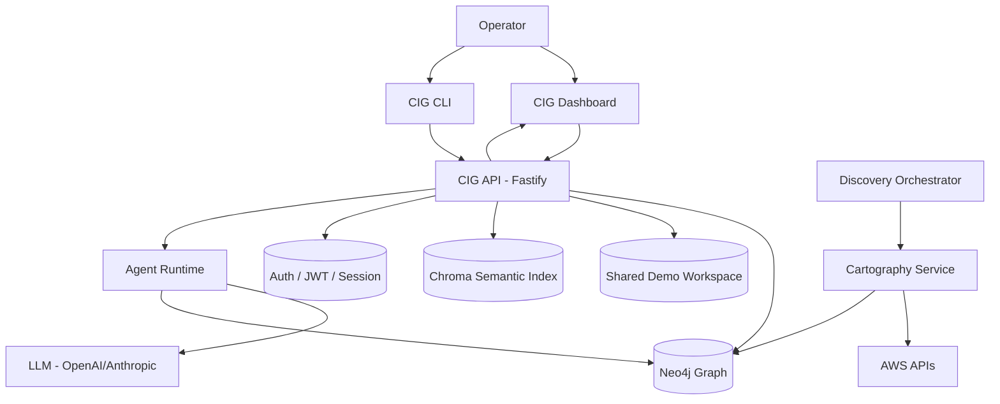

# Architecture Overview

Compute Intelligence Graph (CIG) is a self-hosted and managed infrastructure intelligence platform. It provides visibility into cloud environments through automated discovery, graph-based relationship modeling, live/demo graph exploration, and AI-assisted analysis.

## Core Philosophical Pillars

1.  **Discovery-First**: Infrastructure state comes from discovery and graph ingestion, not from UI assumptions.
2.  **Graph-Native Analysis**: Relationships are first-class citizens. CIG stores "Resource A depends on Resource B" as data, not as a sidebar label.
3.  **Human-in-the-Loop Intelligence**: Chat, templates, and agents use the graph plus semantic retrieval to answer questions with actual infra context.
4.  **Live/Demo Source Control**: The Dashboard can switch between the real graph and a seeded demo workspace without changing the UI flow.

## System Topology

The system is organized into four primary functional layers:

### 1. Ingestion & Discovery Layer
*   **Discovery Orchestrator (`@cig/discovery`)**: Manages scheduling and lifecycle of discovery jobs.
*   **Cartography Service (`services/cartography`)**: A Python-based service that pulls cloud inventory into the graph.
*   **Graph Engine (`@cig/graph`)**: A Neo4j-backed layer that defines the schema, scope filters, and traversal logic.
*   **Demo Workspace Seeder**: Seeds a shared demo graph and semantic namespace for demo mode and local development.

### 2. Domain & API Layer
*   **Canonical API (`@cig/api`)**: A Fastify-based server providing:
    *   **REST**: Resources, graph snapshots, discovery status, costs, security, actions, chat, demo, and node-management endpoints.
    *   **Graph queries**: Read-only graph query execution plus controlled graph refinement proposals.
    *   **WebSocket**: Real-time discovery and node status streaming.
    *   **Metrics**: Prometheus integration for system health.
*   **Auth Service (`@cig/auth`)**: Handles session management, JWT verification, and integration with Authentik and Supabase.

### 3. Intelligence & UX Layer
*   **CIG Dashboard (`apps/dashboard`)**: A Next.js 14+ application using the App Router. It serves as the primary visualization and management surface.
*   **AI Agents (`@cig/agents` & `@cig/chatbot`)**:
    *   Provides a RAG-based chatbot for infrastructure querying.
    *   Uses specialized agents to perform graph reasoning, semantic retrieval, and controlled refinement proposals.
*   **CLI (`@cig-technology/cli`)**: The public operator tool for local setup, demo provisioning, environment syncing, and direct API interaction.

### 4. Infrastructure & Runtime Layer
*   **IaC (`@cig/iac`)**: Terraform modules for networking, Neo4j, and shared AWS data-plane configuration.
*   **Infra (`@cig/infra`)**: SST-based delivery mechanism for ECS/Fargate containers.

## High-Level Data Flow

## Detailed Sections

- [System Design](./system-design.md)
- [Component Breakdown](./components.md)
- [Vector Store (Chroma)](./vector-store.md)
- [CLI Runtime State](./cli-current-state.md)
