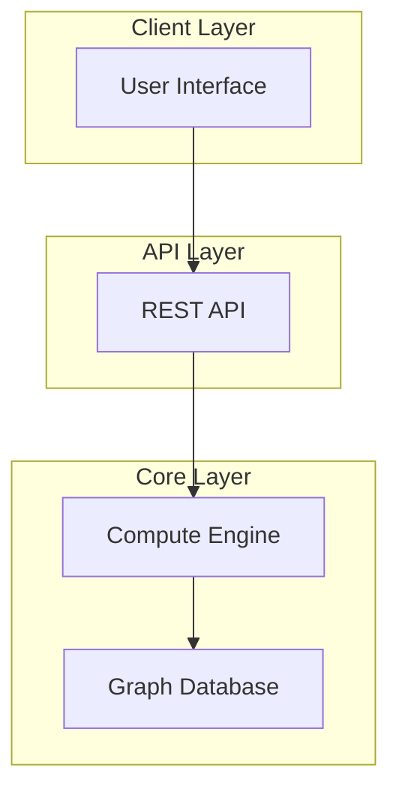

# Architecture

Learn about the CIG system architecture and design.

## System Overview

CIG is built on a modular architecture with the following components:

- **Core Engine**: The main computation engine
- **Graph Database**: Stores and manages graph data
- **API Layer**: RESTful API for external access
- **UI Components**: React-based user interface

## Architecture Diagram

## Next Steps

- [System Design](./system-design.md)
- [Components](./components.md)
