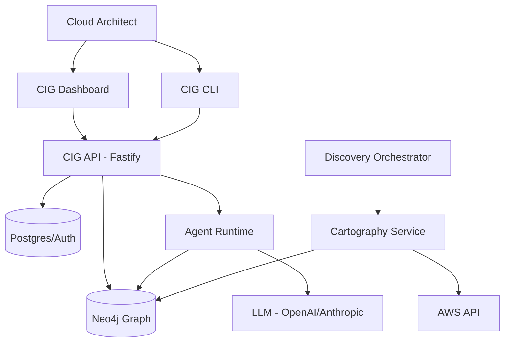

# Architecture Overview

Compute Intelligence Graph (CIG) is a sophisticated, self-hosted infrastructure intelligence platform. It is designed to provide deep visibility into complex cloud environments through automated discovery, graph-based relationship modeling, and AI-driven analysis.

## Core Philosophical Pillars

1.  **Identity-First Discovery**: Infrastructure is mapped starting from identity (IAM/Users) down to the runtime resources (ECS/S3/RDS).
2.  **Graph-Native Analysis**: Relationships are first-class citizens. We don't just store "Resource A exists"; we store "Resource A is managed by Cluster B and accessed by User C".
3.  **Human-in-the-Loop Intelligence**: Using RAG (Retrieval-Augmented Generation) and specialized agents to allow natural language querying of infrastructure state.

## System Topology

The system is organized into four primary functional layers:

### 1. Ingestion & Discovery Layer
*   **Discovery Orchestrator (`@cig/discovery`)**: Manages scheduling and lifecycle of discovery jobs.
*   **Cartography Service (`services/cartography`)**: A Python-based service utilizing `cartography` to pull data from AWS/GCP and sync it into the graph database.
*   **Graph Engine (`@cig/graph`)**: A Neo4j-backed layer that defines the schema, constraints, and traversal logic.

### 2. Domain & API Layer
*   **Canonical API (`@cig/api`)**: A Fastify-based server providing:
    *   **REST**: For standard CRUD and resource management.
    *   **GraphQL (`yoga`)**: For complex, nested resource traversal.
    *   **WebSocket**: For real-time discovery updates and terminal-like interactions.
    *   **Metrics**: Prometheus integration for system health.
*   **Auth Service (`@cig/auth`)**: Handles session management, JWT verification, and integration with Authentik/Supabase.

### 3. Intelligence & UX Layer
*   **CIG Dashboard (`apps/dashboard`)**: A Next.js 14+ application using the App Router. It serves as the primary visualization and management surface.
*   **AI Agents (`@cig/agents` & `@cig/chatbot`)**:
    *   Provides a RAG-based chatbot for infrastructure querying.
    *   Uses specialized agents to perform "reasoning" over graph paths (e.g., "Find all paths from the public internet to this RDS instance").
*   **CLI (`@cig/cli`)**: A developer-focused tool for local setup, environment syncing, and direct API interaction.

### 4. Infrastructure & Runtime Layer
*   **IaC (`@cig/iac`)**: Terraform modules for networking (VPC), databases (Neo4j, Postgres), and storage.
*   **Infra (`@cig/infra`)**: SST (Serverless Stack) based delivery mechanism for ECS/Fargate containers.

## High-Level Data Flow

## Detailed Sections

- [System Design](./system-design.md)
- [Component Breakdown](./components.md)
