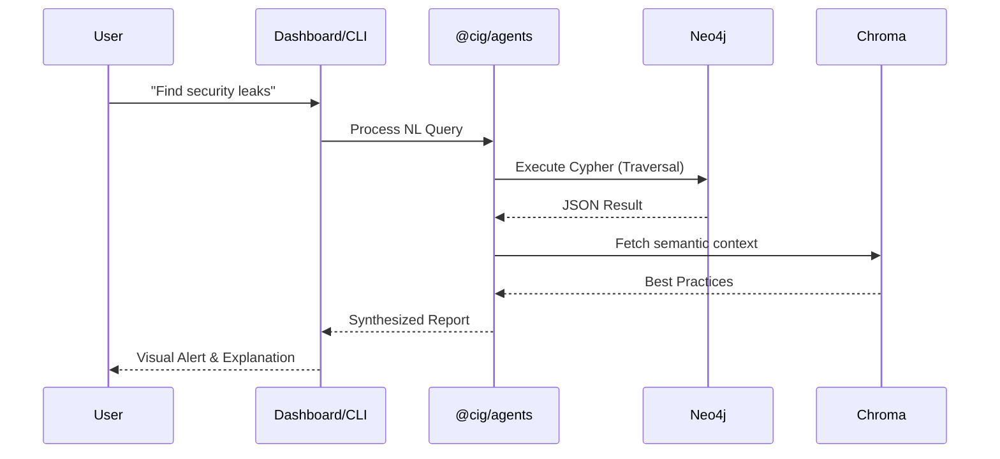

# System Design Deep Dive

This section provides a technical deep dive into the internal workings of CIG, focusing on graph representation, API design, the semantic layer, and the dashboard's live/demo graph surface.

## Graph Modeling & Schema

At the heart of CIG is a **Neo4j** graph database. CIG treats infrastructure as a set of interconnected nodes with scope metadata so the same engine can serve live, demo, managed, and self-hosted modes.

### Node Categories
*   **Identity**: `User`, `Group`, `Role`, `Policy`.
*   **Compute**: `EC2Instance`, `LambdaFunction`, `ECSCluster`, `ECSService`.
*   **Network**: `VPC`, `Subnet`, `SecurityGroup`, `LoadBalancer`, `InternetGateway`.
*   **Storage**: `S3Bucket`, `RDSInstance`, `DynamoDBTable`.

### Relationship Types
*   `HAS_PERMISSION`: Link between Identity and Resource.
*   `MEMBER_OF`: Link between User and Group/Role.
*   `CONNECTS_TO`: Network-level connection between resources.
*   `DEPLOYS_TO`: Link between Service and Cluster/VPC.
*   `CONTAINS`: Hierarchy link (e.g., VPC contains Subnet).

### Graph Synergy
By mapping these relationships, CIG can answer complex security and operational questions using **Cypher** queries:
```cypher
MATCH (u:User)-[:HAS_PERMISSION]->(r:Role)-[:HAS_PERMISSION]->(s:S3Bucket)
WHERE s.is_public = true
RETURN u.name, s.name
```

## API Layer Implementation

The API (`@cig/api`) is built using **Fastify** for its high performance and low overhead.

### Dual-Interface Strategy
1.  **Fastify REST**: Handles resource management, graph snapshots, demo provisioning, discovery status, authentication flows, and health checks.
2.  **Graph Query Endpoints**: Provide read-only graph queries plus a constrained refinement flow for approved writes.

### WebSocket Hub
A `@fastify/websocket` implementation allows for:
*   Real-time progress updates during discovery jobs.
*   Streaming responses from AI agents and node status updates.
*   Live metrics visualization.

## Agentic Intelligence Layer

CIG utilizes a Retrieval-Augmented Generation (RAG) approach to make infrastructure data accessible.

### Reasoning Workflow
1.  **Natural Language Query**: The user asks "Are there any public buckets with sensitive data?".
2.  **Intent Recognition**: The agent identifies the need for a graph traversal.
3.  **Cypher Tool Execution**: The agent generates a read query or a refinement proposal against Neo4j.
4.  **Context Augmentation**: The results are combined with semantic retrieval from Chroma and actual graph scope data.
5.  **Synthesized Answer**: The final response is delivered via the Dashboard or CLI.



## Live and Demo Graph Sources

The Dashboard and API can operate against two graph sources:

- `live` uses the real discovery-backed graph for managed or self-hosted environments.
- `demo` uses the shared seeded demo workspace and its own semantic namespace.

The selected source is carried through:

- graph snapshots
- resource search
- chat context
- semantic retrieval
- demo provisioning

This keeps the UI and AI responses anchored to the same source of truth.

## Security & Isolation

CIG is designed for self-hosting with a "Privacy First" approach:
*   **JWT session management**: All requests are authenticated via `@cig/auth`.
*   **RBAC**: Fine-grained access control at the API level.
*   **Scoped graph data**: Managed deployments scope graph and semantic data by tenant/workspace.
*   **Local Processing**: Discovery data never leaves the self-hosted environment unless explicitly configured for external LLM processing.
