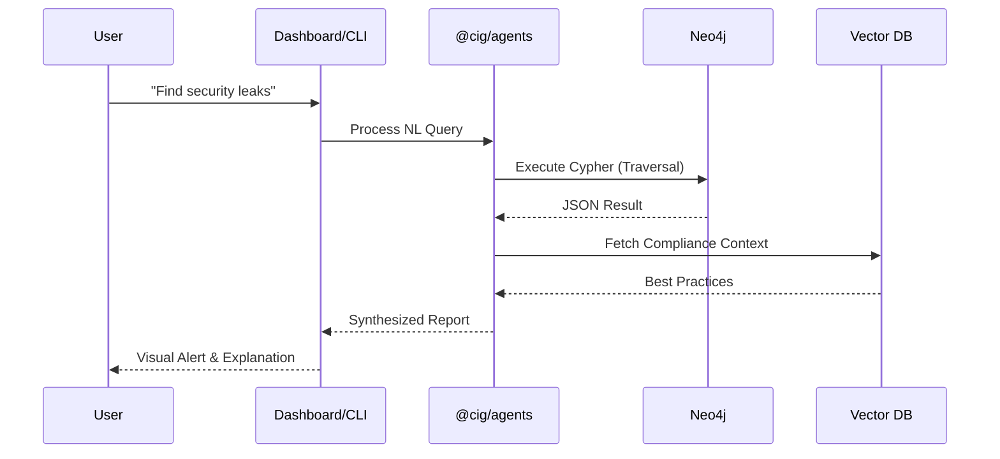

# System Design Deep Dive

This section provides a technical deep dive into the internal workings of CIG, focusing on graph representation, API design, and the agentic layer.

## Graph Modeling & Schema

At the heart of CIG is a **Neo4j** graph database. Unlike traditional relational models, CIG treats infrastructure as a set of interconnected nodes.

### Node Categories
*   **Identity**: `User`, `Group`, `Role`, `Policy`.
*   **Compute**: `EC2Instance`, `LambdaFunction`, `ECSCluster`, `ECSService`.
*   **Network**: `VPC`, `Subnet`, `SecurityGroup`, `LoadBalancer`, `InternetGateway`.
*   **Storage**: `S3Bucket`, `RDSInstance`, `DynamoDBTable`.

### Relationship Types
*   `HAS_PERMISSION`: Link between Identity and Resource.
*   `MEMBER_OF`: Link between User and Group/Role.
*   `CONNECTS_TO`: Network-level connection between resources.
*   `DEPLOYS_TO`: Link between Service and Cluster/VPC.
*   `CONTAINS`: Hierarchy link (e.g., VPC contains Subnet).

### Graph Synergy
By mapping these relationships, CIG can answer complex security and operational questions using **Cypher** queries:
```cypher
MATCH (u:User)-[:HAS_PERMISSION]->(r:Role)-[:HAS_PERMISSION]->(s:S3Bucket)
WHERE s.is_public = true
RETURN u.name, s.name
```

## API Layer Implementation

The API (`@cig/api`) is built using **Fastify** for its high performance and low overhead.

### Dual-Interface Strategy
1.  **Fastify REST**: Handles standard resource management, authentication flows, and health checks.
2.  **GraphQL Yoga**: Provides a flexible query interface for the graph. It translates GraphQL queries into optimized Cypher queries for Neo4j.

### WebSocket Hub
A `@fastify/websocket` implementation allows for:
*   Real-time progress updates during discovery jobs.
*   Streaming responses from AI agents.
*   Live metrics visualization.

## Agentic Intelligence Layer

CIG utilizes a Retrieval-Augmented Generation (RAG) approach to make infrastructure data accessible.

### Reasoning Workflow
1.  **Natural Language Query**: The user asks "Are there any public buckets with sensitive data?".
2.  **Intent Recognition**: The agent identifies the need for a graph traversal.
3.  **Cypher Tool Execution**: The agent generates and executes a Cypher query against Neo4j.
4.  **Context Augmentation**: The results are combined with documentation and best practices (retrieved via Vector Search in Postgres/pgvector).
5.  **Synthesized Answer**: The final response is delivered via the Dashboard or CLI.



## Security & Isolation

CIG is designed for self-hosting with a "Privacy First" approach:
*   **JWT session management**: All requests are authenticated via `@cig/auth`.
*   **RBAC**: Fine-grained access control at the API level.
*   **Local Processing**: Discovery data never leaves the self-hosted environment unless explicitly configured for external LLM processing.
