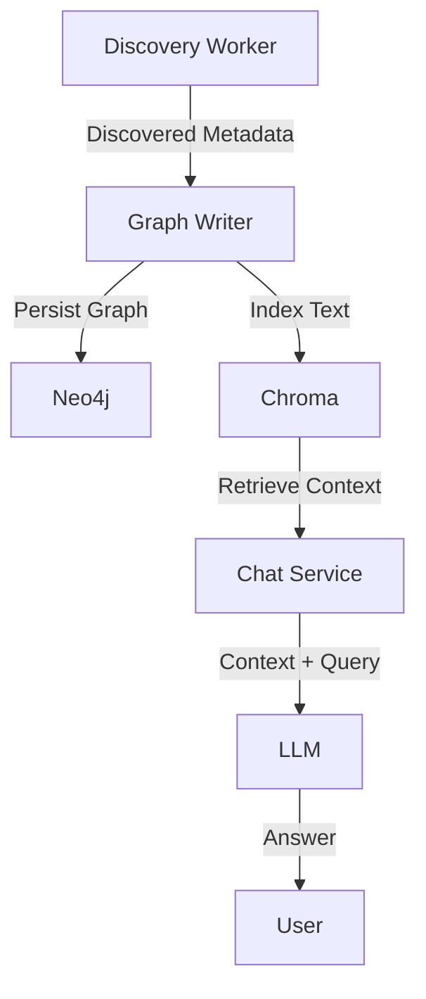

# Vector Store (Chroma)

The **Vector Store** is a specialized database within the CIG architecture that enables **semantic search** and **Retrieval-Augmented Generation (RAG)**. Neo4j handles structural relationships, while Chroma stores the semantic meaning of infrastructure data.

## Role in the System

Chroma is primarily used by the `@cig/chatbot` and `@cig/agents` packages to give AI models context about the current graph source:

- `live` uses the managed or self-hosted discovery-backed graph
- `demo` uses the shared seeded demo workspace

### Data Flow

## Key Components

### 1. Embeddings Service
CIG uses OpenAI embeddings to convert infrastructure metadata into high-dimensional vectors. This process reduces a complex resource into a compact semantic representation.

### 2. Infrastructure Indexing
The `infrastructure_resources` collection is the default index. It stores:
- **ID**: The Unique Resource ARN or Provider ID.
- **Document**: A flattened text representation of the resource (name, type, provider, tags, relationships).
- **Metadata**: Key-value pairs allowing for pre-filtering (region, account, state).

Managed deployments scope collections per tenant/workspace, so the same logical data model can be reused without mixing customer data.

### 3. RAG Pipeline
When a user queries the Chatbot, CIG performs the following:
1. **Query Embedding**: The user's question is converted into a vector.
2. **Vector Retrieval**: Chroma finds the Top-K (default 10) most similar infrastructure documents.
3. **Context Assembly**: The technical details of these resources are formatted into a prompt context.
4. **Augmented Prompting**: The LLM receives the real environment data along with the user question.

The API keeps the semantic index aligned in two ways:

- immediate indexing when graph deltas are applied
- startup and periodic backfill from the live graph snapshot

## Configuration

### Local Development
In a `self-hosted` or `local` profile, Chroma runs as a Docker container:
- **URL**: `http://localhost:8000`
- **Volume**: `chroma-data`

### Production (Managed)
In production, CIG can be configured to use **Chroma Cloud**:
| Variable | Description |
| :--- | :--- |
| `CHROMA_API_KEY` | Managed API Key |
| `CHROMA_TENANT` | Custom Tenant (Required for Cloud) |
| `CHROMA_DATABASE` | Custom Database (Required for Cloud) |
| `CHROMA_HOST` | Defaults to `api.trychroma.com` |

## Troubleshooting

### No Collections Found
If you do not see any collections in your production account, check the following:
- **Indexing Status**: Verify that discovery has completed at least one full scan.
- **Source Selection**: Confirm the Dashboard is pointing at `live` or `demo` as intended.
- **External Identity**: For Chroma Cloud, ensure `CHROMA_TENANT` and `CHROMA_DATABASE` are correctly set in the API environment.
- **Startup Backfill**: Redeploy the API so the semantic sync job can backfill the current graph into Chroma.

### Low Retrieval Quality
If the chatbot provides irrelevant context:
- Check that the graph delta and snapshot sync paths are both running.
- Verify that the embedding model matches between indexing and retrieval.
