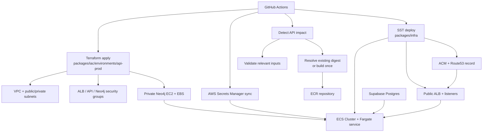

# API on AWS

Last synchronized with the API ECS/Fargate delivery foundation on `2026-03-25`.

## Scope

This document covers the first real production delivery path for `packages/api` at `https://api.cig.technology`.

- Runtime: ECS/Fargate
- Primary deploy mechanism: GitHub Actions
- Core data owner: Terraform in `packages/iac`
- Runtime owner: SST in `packages/infra`
- Relational database: Supabase Postgres
- Graph database: Neo4j on AWS

## Architecture



Release tags are workflow triggers and bookkeeping only. The detector decides whether a commit is source change, runtime change, or release noise, and the API image is promoted by digest.

## Ownership Split

- `packages/iac` owns long-lived and stateful API resources:
  - VPC
  - public/private subnets
  - NAT
  - ALB, API, and Neo4j security groups
  - Neo4j EC2 instance, EBS volume, and password secret
- `packages/infra` owns runtime delivery:
  - ECR repository
  - ECS cluster
  - task definition and service
  - CloudWatch log group
  - ALB listeners
  - ACM certificate and Route53 record
  - optional native pipeline scaffolding
- GitHub Actions is the authoritative production delivery entrypoint.

## AWS Resources Created

### Terraform core-data stack

- `packages/iac/environments/api-prod`
- resources created from:
  - `packages/iac/modules/networking`
  - `packages/iac/modules/neo4j`

Outputs consumed by runtime deploy:

- `vpc_id`
- `public_subnet_ids`
- `private_subnet_ids`
- `alb_security_group_id`
- `api_service_security_group_id`
- `neo4j_security_group_id`
- `neo4j_bolt_uri`
- `neo4j_password_secret_arn`

### SST runtime stack

- `packages/infra/sst.config.ts`
- `packages/infra/infra.config.ts`

Resources created:

- ECR repository for the API image
- ECS cluster and single Fargate service
- CloudWatch log group
- public ALB
- HTTPS listener and HTTP redirect
- ACM certificate for `api.cig.technology`
- Route53 alias record
- IAM execution/task roles

## Runtime Contract

### Non-secret runtime env

- `NODE_ENV=production`
- `HOST=0.0.0.0`
- `PORT`
- `CORS_ORIGINS`
- `NEO4J_URI`
- `NEO4J_USER=neo4j`
- `NEO4J_DATABASE=neo4j`
- `SMTP_HOST`
- `SMTP_PORT`
- `SMTP_SECURE`
- `SMTP_FROM_EMAIL`
- `SMTP_USER`
- `SMTP_AUTH_ENABLED`
- `SMTP_OTP_SUBJECT`

`SMTP_USER` mirrors `SMTP_FROM_EMAIL` in production. The repository uses a placeholder example address, not the production mailbox, and the application still falls back to `SMTP_FROM_EMAIL` if `SMTP_USER` is omitted.

### Secrets injected through AWS Secrets Manager

- `DATABASE_URL` (populated from the direct Supabase URL or `SUPABASE_DIRECT_URL_POOLER` when present)
- `JWT_SECRET`
- `NEO4J_PASSWORD`
- `AUTHENTIK_ISSUER_URL`
- `AUTHENTIK_JWKS_URI`
- `AUTHENTIK_TOKEN_ENDPOINT`
- `OIDC_CLIENT_ID`
- `OIDC_CLIENT_SECRET`
- `SUPABASE_URL`
- `SUPABASE_SERVICE_ROLE_KEY`
- `SMTP_PASSWORD`

The GitHub Actions deploy workflow resolves the Authentik values from the live tenant in `us-east-1` and its `authentik/auth.cig.technology/oidc-client` secret, then syncs those along with the GitHub-managed Supabase/JWT and SMTP password secrets into deterministic AWS Secrets Manager names under `/cig/prod/api/*` before the ECS deploy.

## GitHub Actions Pipelines

### Primary production deploy

- Workflow: `.github/workflows/deploy-api.yml`
- Jobs:
  - `detect-api-impact`
  - `validate`
  - `build-image`
  - `migrate-db`
  - `apply-core-data`
  - `deploy-api`
  - `smoke-test`

Notes:

- `detect-api-impact` hashes the real API build inputs and skips release-noise-only tags.
- `validate` runs only when the detector finds source or runtime changes. It still uses SST in `bootstrap` mode so it can diff the stack without requiring full runtime outputs.
- `build-image` resolves an existing `api-src-<hash>` digest or builds and pushes that immutable image once. Manual dispatch is promotion-only and never rebuilds from the tag itself.
- `migrate-db` runs `pnpm --filter @cig/api migrate:up` directly against Supabase Postgres when the API source changed.
- `apply-core-data` applies the API core-data Terraform stack when deploy wiring changed.
- `deploy-api` reads Terraform outputs, syncs AWS Secrets Manager entries, then runs the full SST deploy with the resolved digest URI.

## Deployment Workflow Review

This workflow is the current production control plane for the API. It typically lands around 12 minutes because the jobs are intentionally sequential and each stage does real work rather than a no-op deploy.

### Current Cost Centers

- `detect-api-impact`
  - hashes the actual API build inputs
  - ignores version-only package manifest churn
  - treats release-metadata-only tags as no-op deploys
- `validate`
  - installs workspace dependencies
  - lints/tests `@cig/api` only when API source changed
  - lints/tests/builds `@cig/infra` only when runtime wiring changed
  - runs Terraform fmt/validate
  - performs an SST bootstrap diff check
- `build-image`
  - resolves an existing digest by `api-src-<hash>` or a provided `image_tag`
  - ensures the ECR repository exists only when a new image must be pushed
  - builds and pushes the API image with Buildx only on API source changes
- `migrate-db`
  - pulls the resolved image digest
  - runs the API migration entrypoint against Supabase Postgres
- `apply-core-data`
  - runs Terraform init/apply for networking and Neo4j
- `deploy-api`
  - installs workspace dependencies again
  - reads Terraform outputs
  - syncs runtime values into AWS Secrets Manager
  - runs SST deploy for ECS/Fargate
- `smoke-test`
  - validates health, authenticated REST, GraphQL, and WebSocket behavior

### Current Baseline

- Docker Buildx registry cache, plus the `type=gha` fallback, is already enabled for the API image.
- The workflow already uses `actions/cache` for the pnpm store in each Node job.
- Terraform plugin caching is already enabled for the Terraform jobs.
- Runtime values and secret ARNs are already handed off through temporary files rather than `GITHUB_ENV`.
- The workflow already uses GitHub OIDC to assume AWS roles instead of long-lived static AWS keys.
- Release metadata such as root version bumps and `release-metadata.json` does not influence deployment decisions.

### Likely Improvements

- Reduce Docker cache invalidation caused by workspace manifest and package version churn.
- Avoid repeating `pnpm install` across validate, build, and deploy jobs where that work can be shared safely.
- Push more deploy orchestration into `packages/infra` helpers so the workflow stays mostly orchestration and not shell logic.
- Keep secrets, ARNs, and runtime metadata out of job metadata and logs.
- Preserve the current OIDC and Secrets Manager model; do not reintroduce long-lived AWS access keys or plaintext handoffs.

### Optional native pipeline bootstrap

- Workflow: `.github/workflows/bootstrap-api-pipelines.yml`
- Purpose: bootstrap AWS-native pipeline resources on a fresh SST stage
- Default behavior: disabled during normal deploys

Normal deploys must keep:

```bash
INFRA_CREATE_PIPELINES=false
```

## Migration Flow

1. GitHub Actions installs workspace dependencies.
2. `migrate-db` sets `DATABASE_URL` to the production Supabase Postgres connection string, preferring the pooler URL when `SUPABASE_DIRECT_URL_POOLER` is configured.
3. `pnpm --filter @cig/api migrate:up` builds the API package and runs SQL migrations from `packages/api/src/db/migrations`.
4. Applied files are recorded in `schema_migrations`.
5. Re-running the migration step is idempotent unless an already-applied file changes checksum.

## Rollback Flow

### Runtime rollback

1. Re-run `.github/workflows/deploy-api.yml` with a previous published tag, preferably an `api-src-<hash>` or `sha-<commit>` tag.
2. Keep Terraform unchanged unless the issue is infrastructure-specific.
3. Re-run smoke tests against the rolled-back image.

### Core-data rollback

1. Review Terraform plan against `packages/iac/environments/api-prod`.
2. Apply a targeted revert only when the stateful resource change is intentional and understood.
3. Avoid destructive Neo4j changes unless a backup or migration path exists.

### Secret rollback

1. Update the corresponding GitHub secret.
2. Re-run the deploy workflow so the AWS Secrets Manager value is replaced and the ECS task receives the new version.

## Operational Constraints

- The first production cut intentionally runs `desiredCount=1`.
- Autoscaling is deferred until WebSocket fan-out and the heartbeat worker are moved out of the API process.
- Lambda is intentionally not used for this runtime because the API is a long-running Fastify service with WebSocket support and an in-process background job.

## Follow-Up

`packages/sdk` remains an optional higher-level follow-up area. The current foundation keeps authoritative business rules in `packages/api`, while `packages/sdk` can later expand from typed transport helpers into richer CIG workflow clients without becoming the server-side source of truth.
