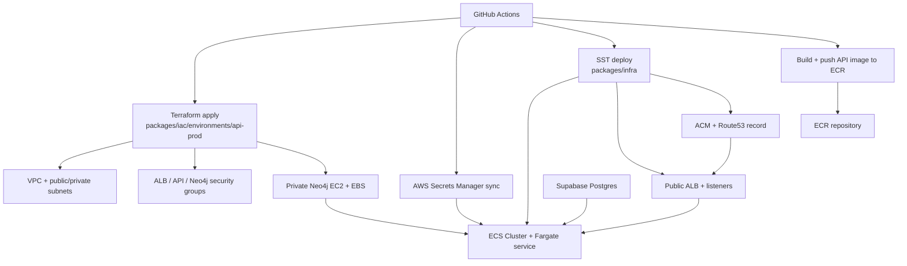

# API on AWS

Last synchronized with the API ECS/Fargate delivery foundation on `2026-03-23`.

## Scope

This document covers the first real production delivery path for `packages/api` at `https://api.cig.technology`.

- Runtime: ECS/Fargate
- Primary deploy mechanism: GitHub Actions
- Core data owner: Terraform in `packages/iac`
- Runtime owner: SST in `packages/infra`
- Relational database: Supabase Postgres
- Graph database: Neo4j on AWS

## Architecture



## Ownership Split

- `packages/iac` owns long-lived and stateful API resources:
  - VPC
  - public/private subnets
  - NAT
  - ALB, API, and Neo4j security groups
  - Neo4j EC2 instance, EBS volume, and password secret
- `packages/infra` owns runtime delivery:
  - ECR repository
  - ECS cluster
  - task definition and service
  - CloudWatch log group
  - ALB listeners
  - ACM certificate and Route53 record
  - optional native pipeline scaffolding
- GitHub Actions is the authoritative production delivery entrypoint.

## AWS Resources Created

### Terraform core-data stack

- `packages/iac/environments/api-prod`
- resources created from:
  - `packages/iac/modules/networking`
  - `packages/iac/modules/neo4j`

Outputs consumed by runtime deploy:

- `vpc_id`
- `public_subnet_ids`
- `private_subnet_ids`
- `alb_security_group_id`
- `api_service_security_group_id`
- `neo4j_security_group_id`
- `neo4j_bolt_uri`
- `neo4j_password_secret_arn`

### SST runtime stack

- `packages/infra/sst.config.ts`
- `packages/infra/infra.config.ts`

Resources created:

- ECR repository for the API image
- ECS cluster and single Fargate service
- CloudWatch log group
- public ALB
- HTTPS listener and HTTP redirect
- ACM certificate for `api.cig.technology`
- Route53 alias record
- IAM execution/task roles

## Runtime Contract

### Non-secret runtime env

- `NODE_ENV=production`
- `HOST=0.0.0.0`
- `PORT`
- `CORS_ORIGINS`
- `NEO4J_URI`
- `NEO4J_USER=neo4j`
- `NEO4J_DATABASE=neo4j`

### Secrets injected through AWS Secrets Manager

- `DATABASE_URL`
- `JWT_SECRET`
- `NEO4J_PASSWORD`
- `AUTHENTIK_ISSUER_URL`
- `AUTHENTIK_JWKS_URI`
- `AUTHENTIK_TOKEN_ENDPOINT`
- `OIDC_CLIENT_ID`
- `OIDC_CLIENT_SECRET`
- `SUPABASE_URL`
- `SUPABASE_SERVICE_ROLE_KEY`

The GitHub Actions deploy workflow syncs the GitHub secrets into deterministic AWS Secrets Manager names under `/cig/prod/api/*` before the ECS deploy.

## GitHub Actions Pipelines

### Primary production deploy

- Workflow: `.github/workflows/deploy-api.yml`
- Jobs:
  - `validate`
  - `build-image`
  - `migrate-db`
  - `apply-core-data`
  - `deploy-api`
  - `smoke-test`

Notes:

- `validate` runs SST in `bootstrap` mode so it can diff the stack without requiring full runtime outputs.
- `build-image` bootstraps the ECR repository first, then pushes the API image.
- `migrate-db` runs `pnpm --filter @cig/api migrate:up` directly against Supabase Postgres.
- `deploy-api` reads Terraform outputs, syncs AWS Secrets Manager entries, then runs the full SST deploy.

### Optional native pipeline bootstrap

- Workflow: `.github/workflows/bootstrap-api-pipelines.yml`
- Purpose: explicitly create/update AWS-native pipeline resources
- Default behavior: disabled during normal deploys

Normal deploys must keep:

```bash
INFRA_CREATE_PIPELINES=false
```

## Migration Flow

1. GitHub Actions installs workspace dependencies.
2. `migrate-db` sets `DATABASE_URL` to the production Supabase Postgres connection string.
3. `pnpm --filter @cig/api migrate:up` builds the API package and runs SQL migrations from `packages/api/src/db/migrations`.
4. Applied files are recorded in `schema_migrations`.
5. Re-running the migration step is idempotent unless an already-applied file changes checksum.

## Rollback Flow

### Runtime rollback

1. Re-run `.github/workflows/deploy-api.yml` with a previous `image_tag`.
2. Keep Terraform unchanged unless the issue is infrastructure-specific.
3. Re-run smoke tests against the rolled-back image.

### Core-data rollback

1. Review Terraform plan against `packages/iac/environments/api-prod`.
2. Apply a targeted revert only when the stateful resource change is intentional and understood.
3. Avoid destructive Neo4j changes unless a backup or migration path exists.

### Secret rollback

1. Update the corresponding GitHub secret.
2. Re-run the deploy workflow so the AWS Secrets Manager value is replaced and the ECS task receives the new version.

## Operational Constraints

- The first production cut intentionally runs `desiredCount=1`.
- Autoscaling is deferred until WebSocket fan-out and the heartbeat worker are moved out of the API process.
- Lambda is intentionally not used for this runtime because the API is a long-running Fastify service with WebSocket support and an in-process background job.

## Follow-Up

`packages/sdk` remains an optional higher-level follow-up area. The current foundation keeps authoritative business rules in `packages/api`, while `packages/sdk` can later expand from typed transport helpers into richer CIG workflow clients without becoming the server-side source of truth.
